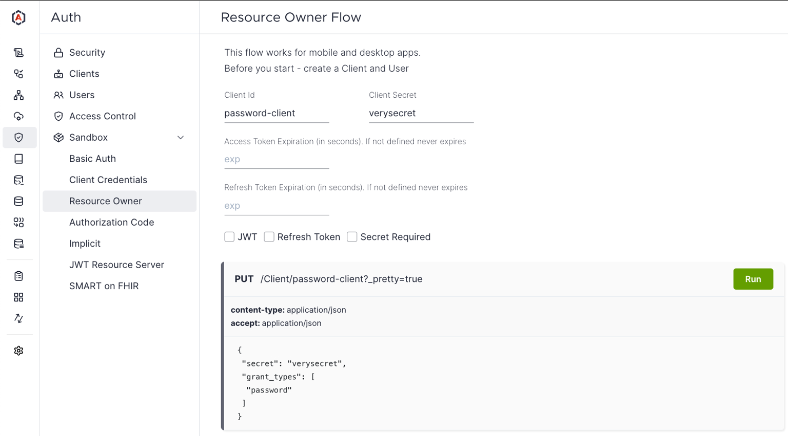

# OAuth 2.0

[Aidbox](https://www.health-samurai.io/aidbox) uses the OAuth 2.0 authorization framework to provide secure access to the FHIR API and support each authorization flow described in the [OAuth 2.0 Authorization Framework RFC](https://tools.ietf.org/html/rfc6749).

The OAuth 2.0 authorization framework enables a third-party application to obtain limited access to an HTTP service, either on behalf of a resource owner by orchestrating an approval interaction between the resource owner and the HTTP service, or by allowing the third-party application to obtain access on its behalf.

More details can be found in the [OAuth 2.0 Authorization Framework RFC](https://tools.ietf.org/html/rfc6749).

## Client Credentials Grant

This flow is for trusted apps that need to access their resources on a server, not a user’s. The app uses its ID and secret (like a username and password for the app) to ask the authorization server for an access token. Once it gets the token, the app can use it to access the resources. It’s like the app saying, _“It’s me, let me in!”_ No user is involved here — just the app proving who it is.

Use this flow with **Backend/Server applications** that are capable of securely storing secrets.


[client-credentials-grant.md](../../tutorials/security-access-control-tutorials/client-credentials-grant.md)


## Authorization Code Grant

The Authorization Code grant is used by **server-side applications** that are capable of securely storing secrets or by **native** applications. This is a two-step process. First, the user is redirected to the authorization server, logs in, and grants access to the app. The server gives the app a special code. Then, the app trades this code (plus its own ID and secret) for an access token. It’s safer because the token stays hidden from the user’s browser. Think of it as the user saying, _“I trust this app—give it a code,”_ and the app swaps it for the key.

Since this is a redirection-based flow, the client must be capable of interacting with the resource owner's user-agent (typically a web browser) and capable of receiving incoming requests (via redirection) from the authorization server.


[authorization-code-grant.md](../../tutorials/security-access-control-tutorials/authorization-code-grant.md)


## Resource Owner Credentials Grant

In this flow, a user gives their username and password directly to the app. The app then sends these to the authorization server to get an access token. With the token, the app can access the user’s resources. It’s simple but risky since the app handles the user’s credentials. Imagine the user saying, _“Here’s my login; go get the token for me.”_

This flow suits **Native applications** (e.g., mobile or desktop apps) where users trust the application enough to provide their username and password directly. It can also be used in **Regular web applications** in some cases, though this is less common due to security concerns. It’s a straightforward option when the application can securely handle user credentials.


[resource-owner-grant.md](../../tutorials/security-access-control-tutorials/resource-owner-grant.md)


## Implicit Grant

**Important:** This flow is deprecated in [OAuth 2.1](https://datatracker.ietf.org/doc/html/draft-ietf-oauth-v2-1-12#name-removal-of-the-oauth-20-imp) and should not be used. It's only kept for backward compatibility.

This flow is for apps that can’t keep secrets, like mobile or single-page apps. The user logs into the authorization server and approves the app. The server sends the access token directly back through the redirect URL (often in the web address). It’s less secure since the token is visible to the browser, but it works for these apps. It’s like the user saying, _“Give the app the key right now!”_

This flow is designed for **Single Page Applications (SPAs)**, which run in the browser and cannot securely store secrets. It’s also applicable to some **Native applications** for simplicity. In this flow, the access token is returned directly via a redirect URL, making it suitable for apps without server-side logic, though it’s considered less secure.


[implicit-grant.md](../../tutorials/security-access-control-tutorials/implicit-grant.md)


## Token exchange

OAuth Token Exchange (RFC 8693) is a mechanism that allows clients to exchange one token for another — potentially with a different type, scope, or audience. This is especially useful in complex distributed systems where tokens need to be adapted for different services or trust boundaries.

**Example:**

A SMART on FHIR app receives an access token from the EHR system, which it uses to interact with the EHR APIs. However, to communicate with your backend server (e.g., Aidbox), a different token is needed.

Instead of requiring the user to log in again, you can configure token exchange in Aidbox to accept the EHR-issued token and exchange it for an Aidbox-issued token — seamlessly enabling secure backend access.


[token-exchange.md](../../tutorials/security-access-control-tutorials/token-exchange.md)


## Auth Sandbox

<figure><figcaption></figcaption></figure>

Aidbox provides a sandbox environment for testing OAuth 2.0 flows. You can use the sandbox to test each flow through the Aidbox Sandbox UI (_Auth -> Sandbox -> Basic Auth_).
