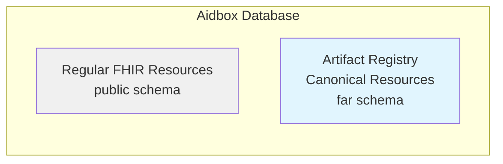
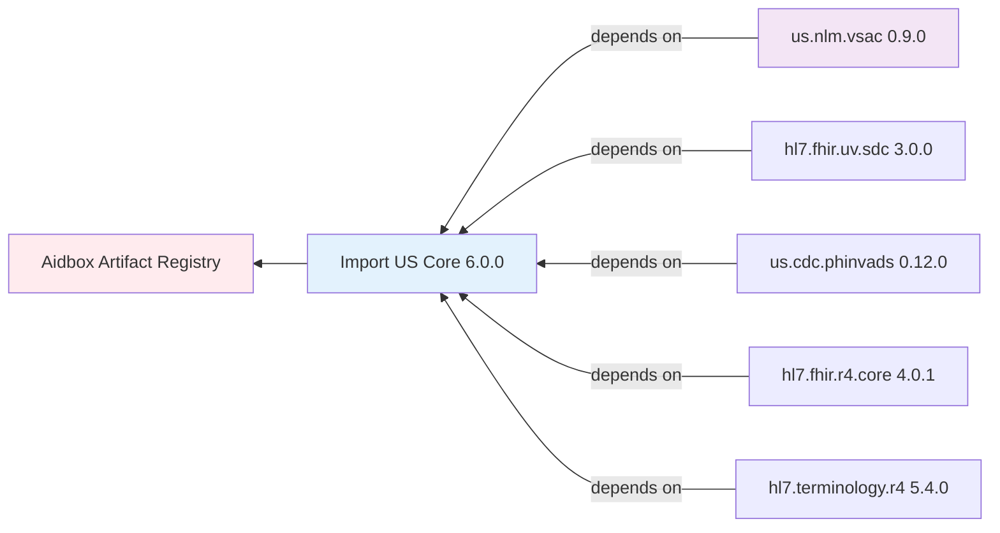
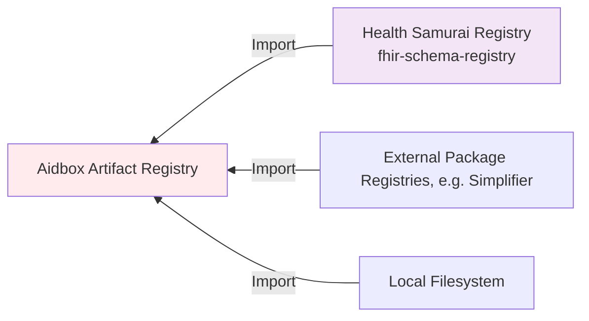

# Artifact Registry Overview

FHIR Artifact Registry (FAR) is Aidbox's centralized system for storing, managing, and resolving FHIR canonical resources and packages. It serves as the foundation for FHIR validation, profiling, and terminology operations by providing a unified repository for **CodeSystems**, **ValueSets**, **StructureDefinitions**, and **SearchParameters**. This overview explains how the registry works, its integration with external FHIR package sources, and the versioning strategies used to ensure consistent canonical resource resolution across your FHIR implementation.

## What is Artifact Registry

The Artifact Registry is a specialized repository within Aidbox that manages [FHIR canonical resources](https://build.fhir.org/canonicalresource.html) - resources that define the structure, constraints, and terminology used in FHIR implementations. These canonical resources include CodeSystems for defining terminologies, ValueSets for grouping codes, StructureDefinitions for profiling resources, and SearchParameters for custom search capabilities. The registry acts as the authoritative source for these definitions, ensuring consistent [validation](../modules/profiling-and-validation/) and data exchange across your FHIR ecosystem.

Canonical resources are stored in a dedicated database schema called `far` (FHIR Artifact Registry) within your Aidbox instance. The registry automatically initializes during Aidbox startup using the `BOX_BOOTSTRAP_FHIR_PACKAGES` configuration, which typically includes core FHIR packages like `hl7.fhir.r4.core#4.0.1`.

## Access Methods

The Artifact Registry provides several ways to interact with canonical resources, designed to accommodate different use cases and user preferences. You can access registry contents programmatically through standard FHIR REST APIs or manage packages visually through Aidbox's web interface.

### REST APIs

Canonical resources are accessible through standard FHIR REST endpoints following the [FHIR HTTP API specification](https://www.hl7.org/fhir/http.html). You can create, query, retrieve, and search canonical resources using familiar FHIR operations:

* `/fhir/CodeSystem` - Access code system definitions
* `/fhir/ValueSet` - Retrieve value set definitions
* `/fhir/StructureDefinition` - Manage [profiles](https://build.fhir.org/profiling.html) (including custom resources) and extensions
* `/fhir/SearchParameter` - Manage custom search parameters

### Web Interface

Aidbox provides a web-based interface for package management operations. Through this UI, you can import FHIR packages from external registries, view installed packages and their contents, and delete packages when no longer needed.

<figure><figcaption></figcaption></figure>

### Registry Scope and Limitations

The current implementation of the Artifact Registry focuses on four core types of canonical resources: CodeSystem, ValueSet, StructureDefinition, and SearchParameter. These resource types cover the most common use cases for FHIR validation and profiling. Other FHIR canonical resource types like ConceptMap, NamingSystem, or ImplementationGuide are not currently stored in the registry but may be added in future releases based on user requirements.

See also:


[upload-fhir-implementation-guide](../tutorials/validation-tutorials/upload-fhir-implementation-guide/)



[define-extensions](define-extensions/)



[custom-resources](custom-resources/)


## Package Management

[FHIR packages](https://build.fhir.org/packages.html) are collections of canonical resources bundled together with their dependencies, following a standardized format for distribution and versioning. In the context of the Artifact Registry, packages serve as the primary mechanism for importing and organizing canonical resources. Each package includes metadata about its contents, dependencies on other packages, and version information following semantic versioning principles.

The registry automatically loads all package dependencies when you import a package.

### Integration with Package Registries

The Artifact Registry integrates with the Health Samurai FHIR package registry, which synchronizes with the [official FHIR packages repository](https://packages2.fhir.org/). This integration allows you to import packages from a curated collection stored in the public `fhir-schema-registry` bucket.

The feature of loading packages from url allows you to import packages from any FHIR package registry, e.g. Simplifier.

See also:


[public-url-to-ig-package.md](../tutorials/validation-tutorials/upload-fhir-implementation-guide/aidbox-ui/public-url-to-ig-package.md)


## Versioning Strategy

When canonical resources reference other canonical resources, they can include specific version information in the canonical URL using the pipe syntax (e.g., `http://example.com/StructureDefinition/Patient|1.0.0`). If a canonical reference includes a specific version, the registry respects that exact version. However, when no version is specified in the reference, the registry uses a "latest version" resolution strategy, automatically selecting the most recent version of the referenced canonical resource available in the system.

See also:


[local-terminlogy.md](../tutorials/terminology-tutorials/local-terminlogy.md)

