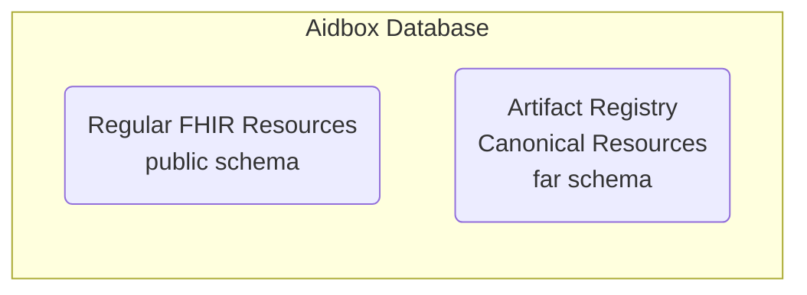
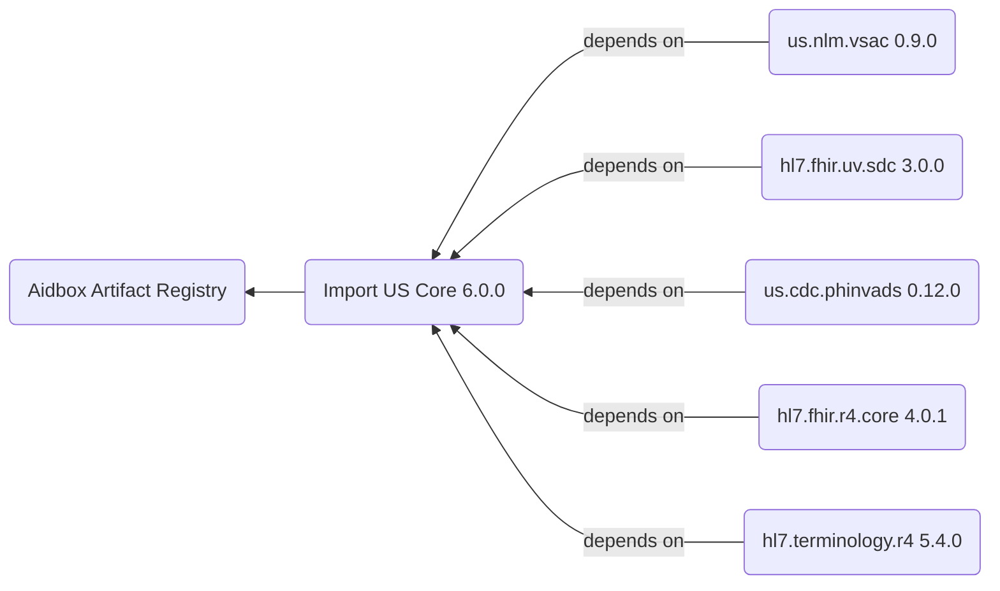
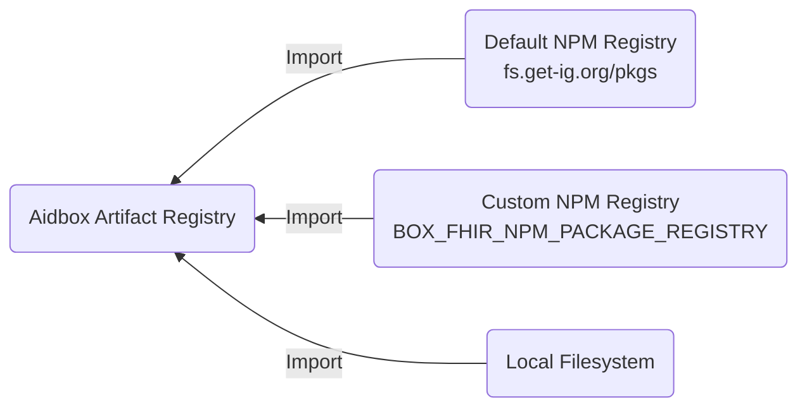

# Artifact Registry overview

FHIR Artifact Registry (FAR) is Aidbox's centralized system for storing, managing, and resolving FHIR canonical resources and packages. It serves as the foundation for FHIR validation, profiling, and terminology operations by providing a unified repository for **CodeSystems**, **ValueSets**, **ConceptMaps**, **StructureDefinitions**, and **SearchParameters**. This overview explains how the registry works, its integration with external FHIR package sources, and the versioning strategies used to ensure consistent canonical resource resolution across your FHIR implementation.

## What's the Artifact Registry

The Artifact Registry is a specialized repository within Aidbox that manages [FHIR canonical resources](https://build.fhir.org/canonicalresource.html)—resources that define the structure, constraints, and terminology used in FHIR implementations.

* [**CodeSystems**](../terminology-module/fhir-terminology/codesystem.md) for defining terminologies,
* [**ValueSets**](../terminology-module/fhir-terminology/valueset.md) for grouping codes,
* [**ConceptMaps**](../terminology-module/fhir-terminology/conceptmap.md) for mapping between terminologies,
* [**StructureDefinitions**](structuredefinition.md) for profiling resources,
* [**SearchParameters**](../api/rest-api/fhir-search/searchparameter.md) for custom search capabilities.

The registry acts as the authoritative source for these definitions, ensuring consistent [validation](../modules/profiling-and-validation/) and data exchange across your FHIR ecosystem.

Aidbox stores canonical resources in a dedicated database schema called `far` (FHIR Artifact Registry). The registry automatically initializes during Aidbox startup using the `BOX_BOOTSTRAP_FHIR_PACKAGES` configuration, which typically includes core FHIR packages like `hl7.fhir.r4.core#4.0.1` and all specified Implementation Guides.

## Access Methods to the Artifact Registry

The Artifact Registry provides 2 ways to interact with canonical resources. You can access registry contents programmatically through standard FHIR REST APIs or manage packages visually through Aidbox's web interface.

### Access via REST APIs

Canonical resources are accessible through standard FHIR REST endpoints following the [FHIR HTTP API specification](https://www.hl7.org/fhir/http.html). You can create, query, retrieve, and search canonical resources using familiar FHIR operations:

* `/fhir/CodeSystem` - Access code system definitions
* `/fhir/ValueSet` - Retrieve value set definitions
* `/fhir/ConceptMap` - Manage concept mapping definitions
* `/fhir/StructureDefinition` - Manage [profiles](https://build.fhir.org/profiling.html) (including custom resources) and extensions
* `/fhir/SearchParameter` - Manage custom search parameters

### Access via Web Interface

Aidbox provides a web-based interface for package management operations. Through this UI, you can import FHIR packages from external registries, view installed packages and their contents, and delete packages when no longer needed.

<figure><figcaption></figcaption></figure>

### Registry Scope and Limitations

The current implementation of the Artifact Registry focuses on five core types of canonical resources: CodeSystem, ValueSet, ConceptMap, StructureDefinition, and SearchParameter. These resource types cover the most common use cases for FHIR validation, profiling, and terminology operations. Aidbox doesn't currently store other FHIR canonical resource types like NamingSystem or ImplementationGuide in the registry but may add in future releases based on user requirements.

See also:


[upload-fhir-implementation-guide](../tutorials/artifact-registry-tutorials/upload-fhir-implementation-guide/)



[define-extensions](../tutorials/artifact-registry-tutorials/define-extensions/)



[custom-resources](../tutorials/artifact-registry-tutorials/custom-resources/)


## Package Management

[FHIR packages](https://build.fhir.org/packages.html) are collections of canonical resources bundled together with their dependencies, following a standardized format for distribution and versioning. In the context of the Artifact Registry, packages serve as the primary mechanism for importing and organizing canonical resources. Each package includes metadata about its contents, dependencies on other packages, and version information following semantic versioning principles.

The registry automatically loads all package dependencies when you import a package.

### Integration with Package Registries

The Artifact Registry uses an NPM-compatible registry for package management. By default, Aidbox connects to `https://fs.get-ig.org/pkgs`, which synchronizes with the [official FHIR packages repository](https://packages2.fhir.org/).

You can configure a custom registry using the [FHIR NPM Package registry](../reference/all-settings.md#fhir-npm-package-registry) setting. This allows you to:

* Use alternative public registries (e.g., Simplifier)
* Set up a local registry using [Verdaccio](https://verdaccio.org/) or another NPM proxy/mirroring solution
* Host private packages in your own infrastructure

See also:


[public-url-to-ig-package.md](../tutorials/artifact-registry-tutorials/upload-fhir-implementation-guide/aidbox-ui/public-url-to-ig-package.md)



[how-to-load-fhir-ig-with-init-bundle.md](../tutorials/artifact-registry-tutorials/upload-fhir-implementation-guide/how-to-load-fhir-ig-with-init-bundle.md)



[how-to-create-fhir-npm-package.md](../tutorials/artifact-registry-tutorials/how-to-create-fhir-npm-package.md)


### Pinning and Tree-Shaking

When you install FHIR Implementation Guide packages from a registry or direct URL, Aidbox downloads, validates, and installs the specified packages along with their dependencies. During this process, Aidbox performs **pinning** and **tree-shaking** on canonicals:

- **Pinning**: References inside canonicals are pinned to exact dependency versions as described in the [FHIR IG Guidance on pinning](https://build.fhir.org/ig/FHIR/ig-guidance/pinning.html).
- **Tree-shaking**: Only referenced canonical dependencies are installed from dependent packages, reducing redundancy.

The goal is to achieve a system state where every canonical `<url>|<version>` pair is unique and present only once.

#### Package Installation Flow

1. Obtain all canonicals from the target packages.
2. For each canonical, pin its outgoing canonical references using the selection [algorithm](#candidate-selection-algorithm).

#### Outgoing Reference Collection

References are collected using known paths for these resource types:

* **StructureDefinition** (excluding `snapshot`)
* **CodeSystem**
* **ValueSet**
* **SearchParameter**
* **CapabilityStatement**

For each canonical, Aidbox collects its outgoing canonical references. For each outgoing reference, a candidate list is constructed from all dependencies of the package (including transitive ones).

#### Candidate Selection Algorithm

When pinning canonical references, multiple versions or packages may provide the same canonical URL. The algorithm selects the best candidate using a multi-stage comparison chain.

**Filtering**: Candidates are filtered out if they match exclusion patterns (expansions, examples, search, elements, corexml, core) or are CodeSystem resources whose `content` is not `"complete"`.

**Comparison Chain**: A chained comparator is applied in this prioritized order:

| Priority | Criterion | Description |
|----------|-----------|-------------|
| 1 | **Status** | `active` > `draft` > `retired` > `unknown` |
| 2 | **Terminology Wins Core** | Terminology packages (e.g., `hl7.terminology`) override core packages |
| 3 | **Version** | Compared using detected algorithm: semver, integer, date, or alpha |
| 4 | **lastUpdated** | Final tiebreaker using `meta.lastUpdated` |

**Version Algorithm Detection**: Aidbox first checks for `versionAlgorithmString` or `versionAlgorithmCoding`. If not defined, it infers the algorithm by inspecting the version string format (integer, semver, date, or alpha fallback).

#### Recursive Pinning

Once a reference is pinned:

* It is added to the final canonical set.
* The same process is repeated recursively for its outgoing references.
* Each `<url>|<version>` pair is processed only once due to caching.

This recursive collection results in a **tree-shaken** package: the system contains the full content of the target package, plus only the referenced canonicals (and their recursive dependencies) from dependency packages.

## Versioning Strategy

Canonical resources can reference each other using versioned URLs (e.g., `http://example.com/StructureDefinition/Patient|1.0.0`). If you specify a version, the registry uses it exactly. Otherwise, it automatically picks the latest version.

See also:


[local-terminology.md](../tutorials/terminology-tutorials/local-terminology.md)

