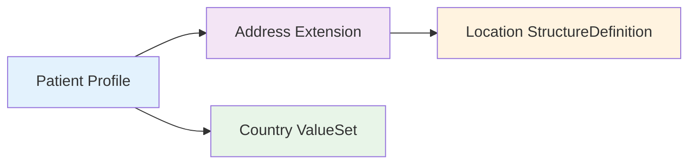

# StructureDefinition

Modern healthcare systems require flexibility to adapt FHIR resources to specific organizational needs while maintaining interoperability. Without proper structure definitions, implementations end up with incompatible data models, failed validations, and integration headaches. **StructureDefinition** resources solve this problem by providing a standardized way to define profiles, extensions, and custom resource structures within the FHIR ecosystem.

[StructureDefinition](https://www.hl7.org/fhir/structuredefinition.html) is a fundamental [FHIR canonical resource](https://build.fhir.org/canonicalresource.html) that describes the structure and constraints of FHIR resources, data types, and extensions. It serves as a blueprint that defines what elements are allowed, which are required, and how they should be constrained for specific use cases.

## What You Can Define with StructureDefinition

StructureDefinition enables customization patterns that address different implementation needs: resource profiles for adding constraints, extensions for adding new data elements, and in Aidbox, custom resources for entirely new resource types. While profiles and extensions are standard FHIR features, defining custom resources is not FHIR compliant and is an Aidbox-specific extension.

### Resource Profiles

Profiles allow you to constrain existing FHIR resources to meet specific implementation requirements. Think of a profile as a specialized version of a base resource with additional rules about which elements are required, forbidden, or constrained to specific values.

For example, a US Core Patient profile might require specific elements like race and ethnicity that aren't mandatory in the base Patient resource:

```json
{
  "resourceType": "StructureDefinition",
  "url": "http://hl7.org/fhir/us/core/StructureDefinition/us-core-patient",
  "name": "USCorePatientProfile",
  "title": "US Core Patient Profile",
  "status": "active",
  "kind": "resource",
  "abstract": false,
  "type": "Patient",
  "baseDefinition": "http://hl7.org/fhir/StructureDefinition/Patient",
  "derivation": "constraint"
}
```

This approach ensures that Patient resources in your system consistently include required fields for regulatory compliance or business needs.

### Extensions

Extensions add new data elements to existing FHIR resources without breaking compatibility. When base resources don't include fields you need, extensions provide a standardized mechanism to augment the structure.

A birth place extension might add location information to a Patient resource:

```json
{
  "resourceType": "StructureDefinition",
  "url": "http://hl7.org/fhir/StructureDefinition/patient-birthPlace",
  "name": "PatientBirthPlace",
  "title": "Patient Birth Place",
  "status": "active",
  "kind": "complex-type",
  "abstract": false,
  "context": [
    {
      "type": "element",
      "expression": "Patient"
    }
  ],
  "type": "Extension"
}
```

Extensions maintain interoperability because systems that don't understand specific extensions can safely ignore them while preserving the core resource data.

### Custom Resources

Aidbox supports custom resources as an extension to standard FHIR capabilities. While FHIR provides the standard mechanism for defining resource types through StructureDefinition, Aidbox leverages this same approach to enable you to define entirely new resource types for use cases not covered by standard FHIR resources.

This Aidbox-specific feature uses the standard FHIR way of defining resource types, ensuring compatibility with FHIR tooling while extending functionality. Custom resources should be used sparingly since they reduce interoperability, but they're valuable for organization-specific workflows or emerging healthcare domains.

A custom TelemedicineSession resource might capture video consultation data:

```json
{
  "resourceType": "StructureDefinition",
  "url": "http://example.org/fhir/StructureDefinition/TelemedicineSession",
  "name": "TelemedicineSession",
  "title": "Telemedicine Session",
  "status": "active",
  "kind": "resource",
  "abstract": false,
  "type": "TelemedicineSession",
  "baseDefinition": "http://hl7.org/fhir/StructureDefinition/DomainResource",
  "derivation": "specialization"
}
```

Custom resources give you complete control over the data structure but require careful consideration of long-term maintenance and interoperability implications.

See also:
- [FHIR Profiling and Validation](../modules/profiling-and-validation/)
- [Artifact Registry Overview](./artifact-registry-overview.md)


## Implementation in Aidbox

Aidbox stores StructureDefinition resources in the Artifact Registry, providing automatic validation and resolution capabilities. When you import FHIR packages or create custom structure definitions, they become available for validation operations and resource profiling.

### Automatic Validation

Once a StructureDefinition is loaded into the Artifact Registry, Aidbox can automatically validate resources against the defined profiles. The validation engine checks cardinality constraints, data type requirements, and value restrictions defined in your structure definitions.

### Profile Resolution

Aidbox resolves profile references using the canonical URLs defined in StructureDefinition resources. When a resource declares conformance to a profile using the `meta.profile` element, the validation system automatically applies the corresponding constraints.

### Package Dependencies

Structure definitions often reference other canonical resources like ValueSets for terminology bindings or other StructureDefinitions for element types. The Artifact Registry automatically resolves these dependencies when importing packages, ensuring all required resources are available.



This dependency resolution ensures that complex profiles with multiple references work correctly in validation scenarios.

See also:
- [Validation Tutorials](../tutorials/validation-tutorials/)
- [Custom Resource Tutorial](../tutorials/artifact-registry-tutorials/custom-resources/)
- [Extension Definition Tutorial](../tutorials/artifact-registry-tutorials/define-extensions/)