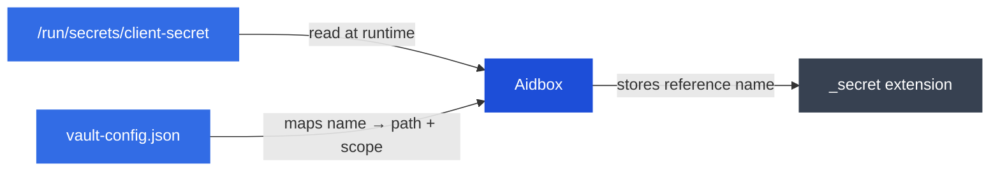

# External secrets

Aidbox can reference secrets stored as files on the filesystem instead of keeping them in the database. A JSON vault config file maps named secrets to file paths and controls which resources can access each secret. The actual values are never persisted or returned through the API.

## How it works



1. A secret value is placed as a file on the filesystem (via Kubernetes Secrets, Docker volumes, or any other mechanism)
2. A vault config JSON file maps named secrets to file paths and declares which resources may access them
3. A resource field uses the FHIR `data-absent-reason` / `secret-reference` extension pattern to reference a named secret
4. At runtime, Aidbox looks up the secret name in the vault config, verifies the requesting resource is in scope, and reads the file
5. Reading the resource back returns the extension with the secret name, never the secret value

## Configuration

| Environment variable | Description | Default |
| --- | --- | --- |
| `AIDBOX_VAULT_CONFIG` | Path to the vault config JSON file that maps named secrets to file paths and resource scopes. | empty (feature disabled) |


This setting requires a restart to take effect. The config file itself is re-read automatically when modified — no restart needed for config changes.


### Vault config file format


```json
{
  "secret": {
    "client-secret": {
      "path": "/run/secrets/client-secret",
      "scope": ["Client/my-client"]
    },
    "kafka-jaas": {
      "path": "/run/secrets/kafka-jaas",
      "scope": ["AidboxTopicDestination/kafka-dest-1"]
    },
    "jwt-key": {
      "path": "/run/secrets/jwt-key",
      "scope": ["TokenIntrospector"]
    }
  }
}
```


Each entry under `"secret"` maps a secret name to:

| Field | Description |
| --- | --- |
| `path` | Absolute path to the file containing the secret value |
| `scope` | Array of resource references that are allowed to access this secret. Entries can be `"ResourceType/id"` (specific instance) or `"ResourceType"` (any instance of that type) |

### Example

```bash
AIDBOX_VAULT_CONFIG=/etc/aidbox/vault-config.json
```

## Supported resources

The following fields support secret references via the extension pattern:

| Resource | Field | Description |
| --- | --- | --- |
| **Client** | `secret` | Client secret for authentication |
| **IdentityProvider** | `client.secret` | Client secret for symmetric authentication |
| **IdentityProvider** | `client.private-key` | Private key for asymmetric authentication |
| **IdentityProvider** | `client.certificate` | Certificate for asymmetric authentication |
| **TokenIntrospector** | `jwt.secret` | Shared secret key for JWT verification |
| **TokenIntrospector** | `jwt.keys.k` | Symmetric key for validation |
| **TokenIntrospector** | `introspection_endpoint.authorization` | Authorization header value |
| **AidboxTopicDestination** | `parameter.saslJaasConfig` | SASL JAAS configuration for Kafka authentication |
| **AidboxTopicDestination** | `parameter.sslKeystoreKey` | SSL keystore private key for Kafka connection |

## Usage

### Create a secret file

Place a file containing the secret value:

```bash
echo -n 'my-secret-value' > /run/secrets/client-secret
```

### Add it to the vault config


```json
{
  "secret": {
    "client-secret": {
      "path": "/run/secrets/client-secret",
      "scope": ["Client/my-client"]
    }
  }
}
```


### Reference it in a resource

The resource uses FHIR primitive extensions on the field. The `_secret` element carries two extensions: `data-absent-reason` with value `masked` (indicating the field is intentionally absent) and `secret-reference` with the secret name from the vault config.


```json
{
  "resourceType": "Client",
  "id": "my-client",
  "_secret": {
    "extension": [
      {
        "url": "http://hl7.org/fhir/StructureDefinition/data-absent-reason",
        "valueCode": "masked"
      },
      {
        "url": "http://health-samurai.io/fhir/secret-reference",
        "valueString": "client-secret"
      }
    ]
  },
  "grant_types": ["client_credentials", "basic"]
}
```


Reading the Client back returns the extension, not the resolved value:


```json
{
  "resourceType": "Client",
  "id": "my-client",
  "_secret": {
    "extension": [
      {
        "url": "http://hl7.org/fhir/StructureDefinition/data-absent-reason",
        "valueCode": "masked"
      },
      {
        "url": "http://health-samurai.io/fhir/secret-reference",
        "valueString": "client-secret"
      }
    ]
  },
  "grant_types": ["client_credentials", "basic"]
}
```


## Scope enforcement

Aidbox verifies that the resource requesting a secret is listed in the secret's `scope` array. Scope entries support two formats:

* **`"ResourceType/id"`** — matches a specific resource instance only
* **`"ResourceType"`** — matches any resource of that type

If the requesting resource is not in scope, Aidbox returns an error.

## Secret rotation

Aidbox caches file contents with a short TTL and validates against file modification time. Updated files take effect automatically — no restart required.

This works with any mechanism that updates files in place — Kubernetes Secrets, CSI drivers, configuration management tools, or manual updates.

## Security

Scope enforcement ensures each secret can only be accessed by the resources declared in its `scope` array.

## Delivering secrets to the filesystem

The external secrets feature is agnostic to how files are placed on the filesystem. Common approaches:

| Method | Description |
| --- | --- |
| [Kubernetes Secrets](https://kubernetes.io/docs/concepts/configuration/secret/) | Mounted as volumes in pods |
| [Secrets Store CSI Driver](../deployment-and-maintenance/deploy-aidbox/run-aidbox-in-kubernetes/external-secret-stores/) | Mounts secrets from external vaults (HashiCorp Vault, Azure Key Vault) with automatic rotation |
| [Docker Secrets](https://docs.docker.com/engine/swarm/secrets/) | Available at `/run/secrets/` in swarm mode |
| Docker volumes | Bind-mount a host directory containing secret files |
