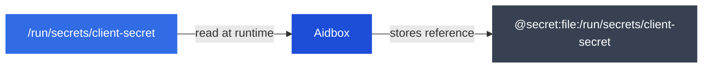

# External secrets

Aidbox can reference secrets stored as files on the filesystem instead of keeping them in the database. Fields that support this use the `@secret:file:` prefix — the actual value is never persisted or returned through the API.

## How it works



1. A secret value is placed as a file on the filesystem (via Kubernetes Secrets, Docker volumes, or any other mechanism)
2. A resource field is set to `@secret:file:/path/to/file` — this reference string is what gets stored in the database
3. At runtime, Aidbox reads the file and uses its content as the actual value
4. Reading the resource back returns the reference string, never the secret

## Configuration

| Environment variable | Description | Default |
| --- | --- | --- |
| `AIDBOX_SECRET_FILES_ENABLED` | Enables `@secret:file:` resolution. When disabled, values with this prefix are rejected on save. | `false` |
| `AIDBOX_SECRET_FILES_DIRS` | Comma-separated list of directories from which secret files can be loaded. File references outside these directories are rejected. | empty (no restriction) |


Both settings require a restart to take effect.


### Example

```bash
AIDBOX_SECRET_FILES_ENABLED=true
AIDBOX_SECRET_FILES_DIRS=/run/secrets,/mnt/secrets
```

## The `secret-backed` extension

Aidbox uses the `secret-backed` extension to mark which fields can accept `@secret:file:` references. This is a FHIR extension defined at:

```
http://health-samurai.io/fhir/core/StructureDefinition/secret-backed
```

When this extension is present on an element definition with `valueBoolean: true`, the field accepts both literal values and `@secret:file:/path` references. The reference is stored as-is in the database, and the actual secret is resolved at runtime by reading the file.

### Example: using the extension in a StructureDefinition

To mark a field as secret-backed, add the extension to the element definition:

```json
{
  "id": "Client.secret",
  "path": "Client.secret",
  "short": "Hashed client secret for authentication.",
  "min": 0,
  "max": "1",
  "extension": [
    {
      "url": "http://health-samurai.io/fhir/core/StructureDefinition/secret-backed",
      "valueBoolean": true
    }
  ]
}
```

This tells Aidbox that the `Client.secret` field accepts `@secret:file:` references in addition to literal values.

## Supported resources

The following fields have the `secret-backed` extension and support `@secret:file:` references:

| Resource | Field | Description |
| --- | --- | --- |
| **Client** | `secret` | Client secret for authentication |
| **IdentityProvider** | `client.secret` | Client secret for symmetric authentication |
| **IdentityProvider** | `client.private-key` | Private key for asymmetric authentication |
| **TokenIntrospector** | `jwt.secret` | Shared secret key for JWT verification |
| **TokenIntrospector** | `jwt.keys.k` | Symmetric key for validation |
| **TokenIntrospector** | `introspection_endpoint.authorization` | Authorization header value |
| **AidboxTopicDestination** | `parameter.saslJaasConfig` | SASL JAAS configuration for Kafka authentication |
| **AidboxTopicDestination** | `parameter.sslKeystoreKey` | SSL keystore private key for Kafka connection |

## Usage

### Create a secret file

Place a file containing the secret value:

```bash
echo -n 'my-secret-value' > /run/secrets/client-secret
```

### Reference it in a resource


```json
{
  "resourceType": "Client",
  "secret": "@secret:file:/run/secrets/client-secret",
  "grant_types": ["client_credentials", "basic"]
}
```


Reading the Client back returns the reference, not the value:


```json
{
  "resourceType": "Client",
  "id": "my-client",
  "secret": "@secret:file:/run/secrets/client-secret",
  "grant_types": ["client_credentials", "basic"]
}
```


## Secret rotation

Aidbox reads the file on every access, so updated files take effect immediately — no restart required.

This works with any mechanism that updates files in place — Kubernetes Secrets, CSI drivers, configuration management tools, or manual updates.

## Security

Path validation enforces the following rules:

* **Feature must be enabled** — `AIDBOX_SECRET_FILES_ENABLED=true` is required; otherwise references are rejected on save
* **Absolute paths only** — relative paths are rejected
* **No directory traversal** — paths containing `..` are rejected
* **Directory allowlist** — when `AIDBOX_SECRET_FILES_DIRS` is set, only files within those directories are allowed

## Delivering secrets to the filesystem

The `@secret:file:` feature is agnostic to how files are placed on the filesystem. Common approaches:

| Method | Description |
| --- | --- |
| [Kubernetes Secrets](https://kubernetes.io/docs/concepts/configuration/secret/) | Mounted as volumes in pods |
| [Secrets Store CSI Driver](../deployment-and-maintenance/deploy-aidbox/run-aidbox-in-kubernetes/external-secret-stores/) | Mounts secrets from external vaults (HashiCorp Vault, Azure Key Vault) with automatic rotation |
| [Docker Secrets](https://docs.docker.com/engine/swarm/secrets/) | Available at `/run/secrets/` in swarm mode |
| Docker volumes | Bind-mount a host directory containing secret files |
