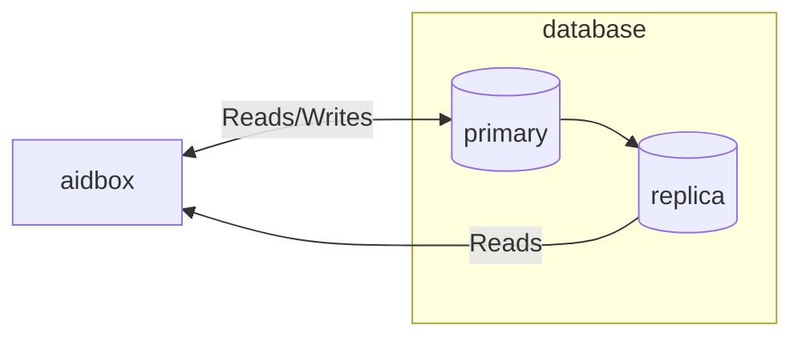

# Database overview

This article explains how Aidbox stores and manages healthcare data using PostgreSQL as its database engine. You'll learn about:

* **FHIR resource storage** - How Aidbox uses PostgreSQL's JSONB columns for efficient hierarchical data storage
* **CRUD operations** - Creating, reading, updating, and deleting resources with automatic history tracking
* **Data querying** - Three approaches: [FHIR search](https://www.hl7.org/fhir/search.html), direct SQL, and [SQL on FHIR](https://build.fhir.org/ig/FHIR/sql-on-fhir-v2/)
* **PostgreSQL requirements** - Supported versions and deployment options

Whether you're implementing clinical workflows, building analytics dashboards, or optimizing database performance, this guide provides the technical foundation you need to work effectively with Aidbox's database layer.

## How does Aidbox store data?

Storing FHIR resources in traditional relational databases requires complex schemas with dozens of tables and joins. The deeply nested, polymorphic nature of FHIR data makes this approach difficult to maintain and query efficiently.

Aidbox takes a different approach by leveraging PostgreSQL's JSONB columns to store FHIR resources in their native hierarchical format. This design provides both the flexibility of document storage and the reliability of a relational database.

### The PostgreSQL + JSONB Approach

Aidbox uses PostgreSQL as its database. 
Instead of spreading your Patient resource across many columns, or even many tables with complex joins, 
it stores the entire resource in a single JSONB column.

[JSONB](https://www.postgresql.org/docs/current/datatype-json.html) is PostgreSQL's binary JSON storage format. The binary representation enables efficient indexing, querying, and storage optimization. This provides the flexibility of document storage with the full power of PostgreSQL's relational features.

```sql
-- A Patient resource lives in one row, one column
SELECT resource FROM patient WHERE id = 'patient-123';

-- Returns something like:
{
  "name": [{"given": ["John"], "family": "Doe"}],
  "gender": "male",
  "birthDate": "1980-01-15",
  "address": [{
    "line": ["123 Main St"],
    "city": "Boston",
    "state": "MA"
  }]
}
```

### Two tables for every resource

For each FHIR resource type, Aidbox creates exactly two tables:

1. **Main table** (for example, `patient`) - stores the current version of each resource
2. **History table** (for example, `patient_history`) - stores every version ever created

This dual-table approach means you always have fast access to current data while maintaining a complete audit trail. No complex versioning schemes, no separate audit databases - just two tables per resource type.

### The anatomy of a resource row

Let's peek inside the `patient` table to see what's actually stored:

```sql
SELECT * FROM patient LIMIT 1;
```

| Column       | Type        | Description                  | Example                             |
| ------------ | ----------- | ---------------------------- | ----------------------------------- |
| **id**       | text        | Resource ID                  | `e7c3b-4d66-74c6`                   |
| **txid**     | bigint      | Version ID (global sequence) | `178246`                            |
| **ts**       | timestamptz | Last updated timestamp       | `2025-01-09T10:30:00Z`              |
| **cts**      | timestamptz | Created timestamp            | `2025-01-09T10:00:00Z`              |
| **status**   | text        | Resource status              | `created`, `updated`, `deleted`     |
| **resource** | jsonb       | The actual FHIR resource     | `{"name": [...], "gender": "male"}` |

Notice what's _not_ in the JSONB? The `id`, `resourceType`, `meta.lastUpdated`, and `meta.versionId` live as separate columns. This normalized approach gives you the best of both worlds:

* Fast queries on common fields (WHERE id = ?)
* Full FHIR resource in one place
* No data duplication

### Why this design wins

**Schema flexibility without chaos.** Need to add a new extension to all your Patient resources? Just update the JSONB - no ALTER TABLE nightmares. Your database schema stays stable while your data model evolves.

**One source of truth.** Unlike some systems that maintain separate search tables or denormalized views, Aidbox queries directly against the JSONB data. What you store is what you search.

**PostgreSQL superpowers at your fingertips.** Want to run a complex analytical query mixing FHIR searches with custom SQL? Need ACID transactions across multiple resources? Want to use PostGIS for geographic queries? It's all there because it's just PostgreSQL.

### Direct SQL access

Since it's just PostgreSQL, you can query your data directly when needed:

```sql
-- Find all male patients born after 1990
SELECT id, resource->>'birthDate' as birth_date
FROM patient
WHERE resource->>'gender' = 'male'
  AND (resource->>'birthDate')::date > '1990-01-01';

-- Extract nested data with PostgreSQL's JSON operators
SELECT 
  id,
  resource->'name'->0->>'family' as last_name,
  resource->'address'->0->>'city' as city
FROM patient
WHERE resource->'address'->0->>'state' = 'MA';
```

The beauty is that these aren't special Aidbox queries - they're standard PostgreSQL JSON operations that any PostgreSQL client (psql, pgAdmin, DBeaver, etc.) can run.

See also:


[Database Schema](database-schema.md)



[PostgreSQL Requirements](postgresql-requirements.md)


## How data inserted, updated and deleted?

Managing healthcare data requires careful tracking of every change. The [FHIR HTTP API](https://www.hl7.org/fhir/http.html) defines standard operations for creating, reading, updating, and deleting resources, along with versioning and history management. Aidbox implements these operations efficiently while maintaining complete resource history for clinical and regulatory compliance.

This section covers how Aidbox performs CRUD (Create, Read, Update, Delete) operations, manages resource history, handles bulk operations, and enables advanced transactional processing. Beyond the standard FHIR API, Aidbox provides direct SQL access for advanced queries and bulk operations - see the [Query section](overview.md#how-to-query-data) for details.

### CRUD operations with built-in history

Every modification in Aidbox creates an history record following FHIR versioning principles. When you update a Patient resource, the previous version moves to the history table while the main table gets the new version. This happens atomically within a single [PostgreSQL transaction](https://www.postgresql.org/docs/current/tutorial-transactions.html).

We simplify examples shown in this section for clarity.

#### Resource lifecycle

Each resource in Aidbox has a lifecycle tracked through the `status` column:

* `created` - Initial resource creation
* `updated` - Resource has been modified
* `deleted` - Resource has been soft-deleted (only appears in history)

See also:


[Database Schema](database-schema.md)


#### Creating resources

Creating a resource requires four essential columns:

```sql
INSERT INTO patient (id, txid, status, resource) 
VALUES (
  gen_random_uuid(),              -- Auto-generated ID
  nextval('transaction_id_seq'),  -- Global version sequence
  'created',                      -- Initial status
  '{"gender": "male", "birthDate": "1990-01-15"}'::jsonb
);
```

The Aidbox supports both auto-generated UUIDs via `gen_random_uuid()` and client-provided IDs for migrations or deterministic scenarios.

The `txid` (transaction ID) uses a global sequence that provides cross-resource transaction ordering, reliable change tracking across the entire database, and serves as the foundation for change feeds and synchronization.

#### Reading resources

Basic read operations query the main resource table:

```sql
-- Get a specific patient
SELECT * FROM patient WHERE id = 'patient-123';

-- Reconstruct full FHIR format
SELECT jsonb_build_object(
  'id', id,
  'resourceType', resource_type,
  'meta', jsonb_build_object(
    'versionId', txid::text,
    'lastUpdated', ts
  )
) || resource as fhir_resource
FROM patient
WHERE id = 'patient-123';
```

For versioned reads, you need to check both current and history tables:

```sql
-- Read specific version
SELECT * FROM (
  SELECT * FROM patient WHERE id = 'patient-123'
  UNION ALL
  SELECT * FROM patient_history WHERE id = 'patient-123'
) t
WHERE txid = 456789
LIMIT 1;
```

#### Updating resources

Updates in Aidbox follow a two-step process:

1. Archive the current version to history table
2. Update the main table with new data

```sql
-- Step 1: Copy current to history (Aidbox does this automatically)
INSERT INTO patient_history 
SELECT * FROM patient WHERE id = 'patient-123';

-- Step 2: Update main table
UPDATE patient
SET resource = '{"gender": "female", "birthDate": "1990-01-15"}'::jsonb,
    status = 'updated',
    ts = CURRENT_TIMESTAMP,
    txid = nextval('transaction_id_seq')
WHERE id = 'patient-123';
```

#### Deleting resources

Deletion is a soft operation that preserves data for history purposes:

```sql
-- Step 1: Archive current version
INSERT INTO patient_history 
SELECT * FROM patient WHERE id = 'patient-123';

-- Step 2: Create deletion marker in history
INSERT INTO patient_history (id, txid, ts, status, resource)
SELECT id, 
       nextval('transaction_id_seq'),
       CURRENT_TIMESTAMP,
       'deleted',
       resource
FROM patient WHERE id = 'patient-123';

-- Step 3: Remove from main table
DELETE FROM patient WHERE id = 'patient-123';
```

After deletion:

* The resource no longer appears in the main table
* Two records exist in history: the last version and a deletion marker
* The resource can still be retrieved for history purposes

### History management

Every resource type has a corresponding `_history` table with identical structure. This design enables:

#### Complete version history

```sql
-- Get full history of a resource
SELECT id, txid, ts, status, resource->>'gender' as gender
FROM (
  SELECT * FROM patient WHERE id = 'patient-123'
  UNION ALL
  SELECT * FROM patient_history WHERE id = 'patient-123'
) t
ORDER BY txid DESC;
```

#### Point-in-time queries

```sql
-- What did the resource look like on January 1st?
SELECT * FROM patient_history 
WHERE id = 'patient-123' 
  AND ts <= '2024-01-01'::timestamptz
ORDER BY txid DESC
LIMIT 1;
```

#### Change detection

```sql
-- Find all changes in the last hour
SELECT id, txid, ts, status
FROM patient_history
WHERE ts > CURRENT_TIMESTAMP - INTERVAL '1 hour'
ORDER BY txid DESC;
```

### Transactions and batch operations

Aidbox uses PostgreSQL's [ACID transactions](https://en.wikipedia.org/wiki/ACID) to ensure data consistency across multiple operations. The system uses [SERIALIZABLE isolation level](https://www.postgresql.org/docs/current/transaction-iso.html) by default, which prevents all serialization anomalies but may cause transaction rejection under high concurrency.

You can adjust the isolation level using the `x-max-isolation-level` header in API requests. Lower isolation levels reduce transaction rejection but may allow serialization anomalies. See [batch-transaction documentation](../api/batch-transaction.md) for details.

#### FHIR transaction bundles

FHIR [transaction bundles](https://www.hl7.org/fhir/http.html#transaction) allow multiple operations to be submitted as a single atomic unit. Aidbox processes these bundles by:

1. Executing all operations within a single PostgreSQL transaction
2. Resolving internal references between resources before processing
3. Rolling back all changes if any operation fails
4. Returning a transaction-response bundle with results

```json
{
  "resourceType": "Bundle",
  "type": "transaction",
  "entry": [
    {
      "fullUrl": "urn:uuid:patient-temp",
      "request": {"method": "POST", "url": "Patient"},
      "resource": {"resourceType": "Patient", "name": [{"family": "Smith"}]}
    },
    {
      "request": {"method": "POST", "url": "Observation"},
      "resource": {
        "resourceType": "Observation",
        "subject": {"reference": "urn:uuid:patient-temp"}
      }
    }
  ]
}
```

The temporary reference `urn:uuid:patient-temp` gets resolved to the actual Patient ID during processing, allowing you to create related resources in a single transaction.

See also: 


[Batch Transaction](../api/batch-transaction.md)



#### Conditional operations

[Conditional operations](https://www.hl7.org/fhir/http.html#cond) in FHIR allow creating, updating, or deleting resources based on search criteria rather than specific IDs. These operations enable stateless clients to manage resources without needing to track exact resource identifiers.

Aidbox supports conditional operations with some differences from the FHIR specification:

* Uses query parameters instead of `If-None-Exist` headers for consistency
* Conditional create returns existing resource if match found
* Conditional operations use the same search parameters as regular queries

```sql
-- Example: Conditional update using SQL with CTEs
WITH check_update AS (
  SELECT id FROM patient 
  WHERE resource->'identifier' @> '[{"system": "ssn", "value": "123-45-6789"}]'
)
UPDATE patient p
SET resource = jsonb_set(resource, '{active}', 'false'),
    txid = nextval('transaction_id_seq'),
    ts = CURRENT_TIMESTAMP
FROM check_update c
WHERE p.id = c.id;
```

See [conditional create documentation](../api/rest-api/crud/create.md) for complete API details.

### Bulk operations

#### Aidbox Bulk API

Aidbox provides several bulk operation APIs for efficient data processing:

* [`$import` and `$load`](../api/bulk-api/import-and-fhir-import.md) - Asynchronous bulk import from external sources
* [`$export` and `$dump`](../api/bulk-api/export.md) - Memory-efficient streaming export
* [`$dump-sql`](../api/bulk-api/dump.md) - Export SQL query results
* [Transaction bundles](../api/batch-transaction.md) - Multiple operations in single HTTP request
* [Batch upsert](../api/batch-transaction.md) - Lightweight collection upserting

#### SQL Bulk operations

SQL bulk operations are the underlying implementation of Aidbox's bulk APIs. When you use `$import` or `$load`, Aidbox translates these into optimized PostgreSQL operations. For direct database access, you can use these same SQL capabilities.

**Bulk Inserts with COPY**

For high-performance data import, use PostgreSQL's [COPY command](https://www.postgresql.org/docs/current/sql-copy.html):

```sql
-- Prepare CSV data
COPY patient (id, txid, status, resource) FROM STDIN WITH (FORMAT csv);
patient-1,100001,created,"{""name"":[{""family"":""Johnson""}]}"
patient-2,100002,created,"{""name"":[{""family"":""Williams""}]}"
\.

-- Or from file
COPY patient (id, txid, status, resource) 
FROM '/data/patients.csv' WITH (FORMAT csv, HEADER true);
```

**Bulk Updates**

```sql
-- Update all patients in a city
UPDATE patient
SET resource = jsonb_set(resource, '{address,0,city}', '"New York"'),
    txid = nextval('transaction_id_seq'),
    ts = CURRENT_TIMESTAMP
WHERE resource->'address'->0->>'city' = 'NY';
```

**Bulk Deletes**

```sql
-- Archive and delete inactive patients
WITH to_delete AS (
  SELECT id FROM patient 
  WHERE resource->>'active' = 'false'
)
-- First archive to history
INSERT INTO patient_history
SELECT p.* FROM patient p
JOIN to_delete d ON p.id = d.id;

-- Then delete
DELETE FROM patient
WHERE id IN (SELECT id FROM to_delete);
```

See also: 


[Bulk API](../api/bulk-api/)


## How to query data?

Healthcare data analysis requires flexible querying capabilities that can handle both clinical workflows and analytical use cases. Aidbox provides three primary approaches for data access: FHIR search for clinical operations, direct SQL for complex queries, and [SQL on FHIR](https://build.fhir.org/ig/FHIR/sql-on-fhir-v2/) for analytics workflows.

This section explains how each approach works, when to use them, and how they leverage PostgreSQL's JSONB capabilities to provide efficient data access across millions of healthcare records.

### FHIR Search Implementation

Aidbox implements [FHIR search](https://www.hl7.org/fhir/search.html) by translating search parameters into optimized PostgreSQL queries against JSONB data. Each search parameter type uses different [PostgreSQL JSONB functions](https://www.postgresql.org/docs/current/functions-json.html) and operators.

#### Reference Search

[Reference searches](https://www.hl7.org/fhir/search.html#reference) locate resources that reference other resources:

```http
GET /fhir/Observation?subject=Patient/123
```

Translates to SQL using JSONB path queries:

```sql
SELECT * FROM observation 
WHERE jsonb_path_query_first(resource, '$.subject.reference') = 'Patient/123';
```

#### Token Search

[Token searches](https://www.hl7.org/fhir/search.html#token) use exact matching for coded values like identifiers:

```http
GET /fhir/Patient?identifier=ssn|123-45-6789
```

Uses PostgreSQL's [JSONB containment operator](https://www.postgresql.org/docs/current/datatype-json.html#JSON-CONTAINMENT):

```sql
SELECT * FROM patient
WHERE resource @> '{"identifier": [{"system": "ssn", "value": "123-45-6789"}]}';
```

#### String Search

[String searches](https://www.hl7.org/fhir/search.html#string) handle text matching with normalization and case-insensitive matching:

```http
GET /fhir/Patient?name=Smith
```

Extracts text values using JSONPath and applies text search functions:

```sql
SELECT * FROM patient
WHERE jsonb_path_query_array(
    resource,
    '($.name[*]).** ? (@.type() == "string")'
)::text ILIKE '%Smith%';
```

See also: 


[FHIR Search](../api/rest-api/fhir-search/)


### Direct SQL Access

PostgreSQL provides powerful capabilities for querying JSONB data directly. Aidbox exposes these through multiple interfaces while maintaining data consistency.

#### SQL Endpoint

The [`$sql` endpoint](../api/rest-api/other/sql-endpoints.md) allows direct SQL execution via REST API:

```yaml
POST /$sql?_format=yaml

SELECT 
  id,
  resource->>'gender' as gender,
  resource->'name'->0->>'family' as last_name
FROM patient
WHERE resource->'active' = 'true'
LIMIT 10
```

For parameterized queries use JDBC-style arrays:

```yaml
POST /$sql

["SELECT count(*) FROM patient WHERE resource->>'gender' = ?", "female"]
```

#### JSONB query patterns

PostgreSQL provides rich operators for JSONB queries:

```sql
-- Existence check
SELECT * FROM patient WHERE resource ? 'birthDate';

-- Path-based extraction  
SELECT id, resource#>>'{name,0,given,0}' as first_name FROM patient;

-- Array containment
SELECT * FROM patient 
WHERE resource->'identifier' @> '[{"system": "http://example.com/ids"}]';

-- Text search across nested fields
SELECT * FROM patient
WHERE resource::text ILIKE '%Boston%';
```

Aidbox provides additional SQL functions for working with FHIR resources.

See also:


[Aidbox SQL functions](../reference/aidbox-sql-functions.md)



[SQL endpoints](../api/rest-api/other/sql-endpoints.md)


### SQL on FHIR

[SQL on FHIR](https://build.fhir.org/ig/FHIR/sql-on-fhir-v2/) is a FHIR specification that defines how to 
transform nested FHIR resources into flat, tabular views optimized for analytics. 
Aidbox implements this specification using ViewDefinition resources that create PostgreSQL views.

#### ViewDefinition basics

ViewDefinitions describe how to flatten FHIR resources using [FHIRPath expressions](https://www.hl7.org/fhir/fhirpath.html):

```json
{
  "resourceType": "ViewDefinition", 
  "name": "patient_demographics",
  "resource": "Patient",
  "status": "active",
  "select": [
    {
      "column": [
        {
          "name": "id",
          "path": "getResourceKey()"
        },
        {
          "name": "gender", 
          "path": "gender"
        },
        {
          "name": "birth_date",
          "path": "birthDate"
        }
      ]
    },
    {
      "forEach": "name.where(use = 'official').first()",
      "column": [
        {
          "name": "family_name",
          "path": "family"
        },
        {
          "name": "given_names", 
          "path": "given.join(' ')"
        }
      ]
    }
  ]
}
```

This creates a view in the `sof` schema that can be queried with standard SQL:

```sql
SELECT family_name, gender, birth_date 
FROM sof.patient_demographics
WHERE gender = 'female' 
  AND birth_date > '1990-01-01';
```

#### Multi-resource analytics

SQL on FHIR enables complex joins across resource types:

```sql
-- COVID-19 patient cohort analysis
SELECT 
  p.family_name,
  p.birth_date,
  c.onset_date,
  c.code_display
FROM sof.patient_demographics p
JOIN sof.condition_summary c ON c.patient_id = p.id
WHERE c.code = '840539006'  -- COVID-19 SNOMED code
  AND c.onset_date > '2021-01-01'
ORDER BY c.onset_date DESC;
```

#### Business intelligence integration

SQL on FHIR views integrate directly with BI tools:

```sql
-- Dashboard metrics for healthcare operations
SELECT 
  DATE_TRUNC('month', enc.start_date) as month,
  loc.name as location,
  COUNT(*) as encounter_count,
  COUNT(DISTINCT enc.patient_id) as unique_patients
FROM sof.encounter_summary enc
JOIN sof.location_view loc ON enc.location_id = loc.id
WHERE enc.start_date >= '2023-01-01'
GROUP BY month, loc.name
ORDER BY month, encounter_count DESC;
```

See also: 


[SQL on FHIR](../modules/sql-on-fhir/)



### PostgreSQL with read-only replica

Aidbox supports delegating read-only queries to a PostgreSQL read-only replica. This feature addresses several critical challenges in high-load FHIR server deployments:

* Resource Isolation: Prevents poorly performing read queries from affecting the primary database's performance
* Load Distribution: Distributes database load across multiple database servers
* Improved Read Performance: Enhances performance for query-heavy workloads
* System Resilience: Ensures write operations remain responsive even under heavy read load

By using a read-only replica, you can isolate resource-intensive read operations from write operations, preventing situations where a poorly performing search query might consume all database resources and impact overall system availability.



Refer to our sample to learn more:



## Which PostgreSQL can be used with Aidbox?

Aidbox requires [PostgreSQL](https://www.postgresql.org/) version 12 or higher to leverage advanced JSONB features including JSON path support.

Aidbox actively supports the three most recent PostgreSQL versions (currently 17, 16, and 15) and is compatible with all deployment options including cloud-managed services like AWS RDS, Google Cloud SQL, and Azure Database, as well as self-hosted and on-premises installations.

Aidbox automatically handles database initialization, schema migrations, and provides optional [AidboxDB](aidboxdb-image/) - a PostgreSQL distribution with Aidbox-specific extensions.

See also: 


[Requirements](postgresql-requirements.md)

