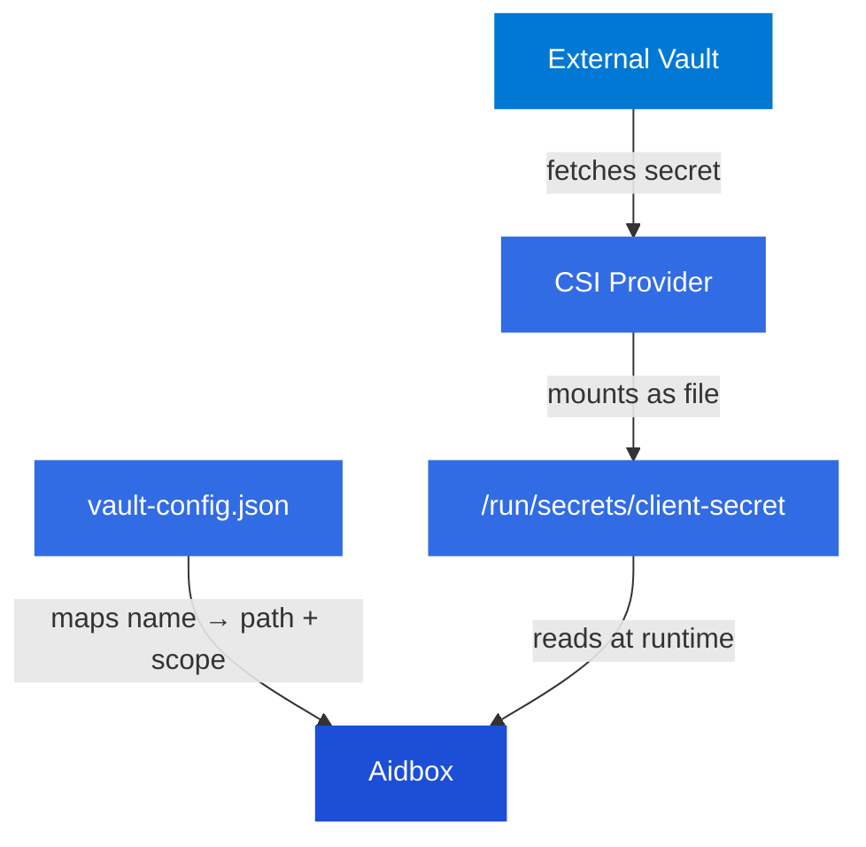

# External secret stores

The [Secrets Store CSI Driver](https://secrets-store-csi-driver.sigs.k8s.io/) mounts secrets from external vaults as files inside Kubernetes pods. Combined with Aidbox [external secrets](../../../../configuration/secret-files.md) and a vault config file, this allows sensitive values to live exclusively in the vault — they are never stored in the Aidbox database.

## How it works

<div align="center">



</div>

1. Secrets are stored in the external vault
2. The vault-specific CSI Provider retrieves them using configured credentials
3. The CSI Driver mounts them as read-only files inside the pod
4. A vault config JSON file maps named secrets to file paths and resource scopes
5. Aidbox resolves secret references by looking up the name in the vault config and reading the file

When a secret is updated in the vault, the CSI Driver refreshes the mounted file. Aidbox detects the change on the next access — no pod restart required.

## Install the Secrets Store CSI Driver

This step is the same regardless of which vault provider you use.

```bash
helm repo add secrets-store-csi-driver \
  https://kubernetes-sigs.github.io/secrets-store-csi-driver/charts

helm install csi secrets-store-csi-driver/secrets-store-csi-driver \
  --namespace kube-system \
  --set syncSecret.enabled=true \
  --set enableSecretRotation=true \
  --set rotationPollInterval=30s
```


`enableSecretRotation` and `rotationPollInterval` control how often the driver checks for updated secrets. Set the interval based on your rotation requirements.


## Vault providers

* [HashiCorp Vault](hashicorp-vault.md)
* [Azure Key Vault](azure-key-vault.md)
