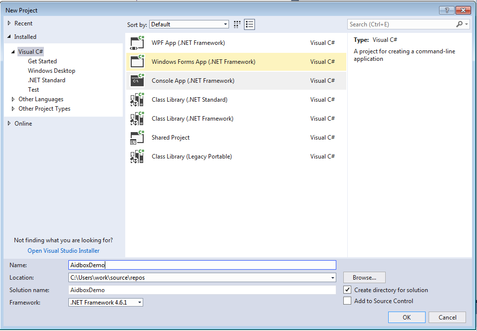
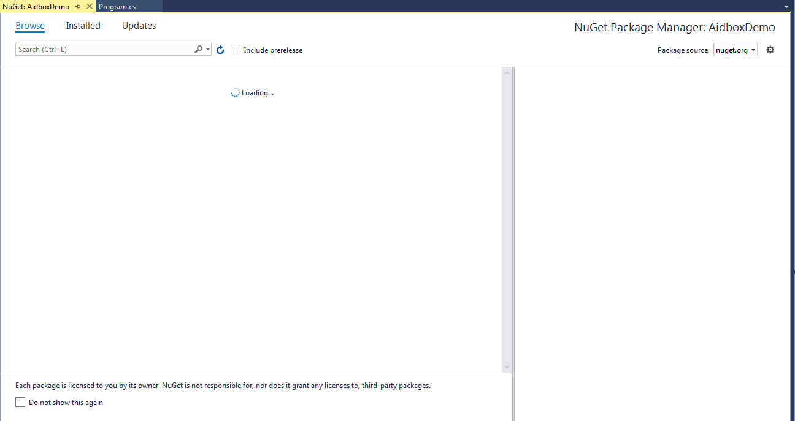
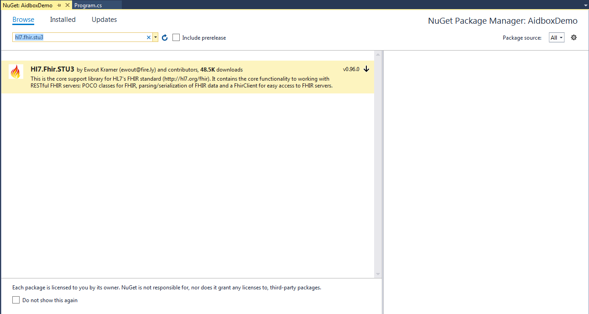
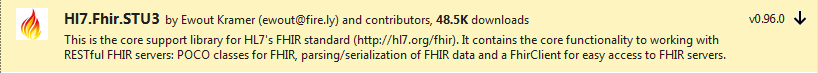
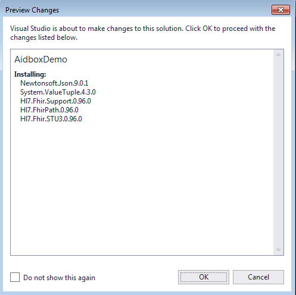
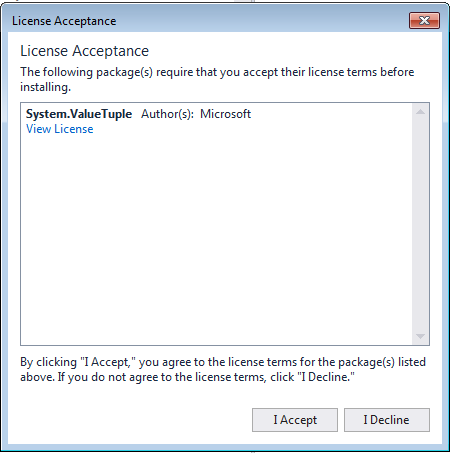
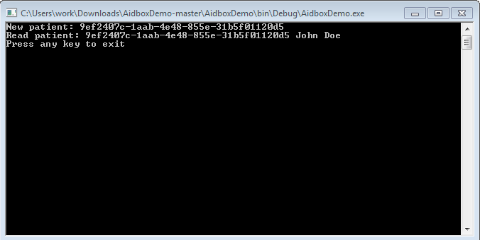

# Working with Aidbox from .NET


This it outdated tutorial (2018).&#x20;


### Prepare the project

1. Start VisualStudio.
2. Create the project appropriate type (for example, “Console App”):

3\. Open “Project”->”Manage NuGet Packages…”:

4\. Enter in search “hl7.fhir.stu3”:

5\. Click install:

6\. Click “Ok”:

7\. Click “I Accept”.

8\. Your project is ready for working with aidbox.

### Sample project

In this [project](https://github.com/Aidbox/AidboxDemo) we create a patient in the box in aidbox via [.NET API for HL7 FHIR](https://github.com/ewoutkramer/fhir-net-api). Next we read a newly created patient from the demo box. It's important to remember that currently [Aidbox](https://www.health-samurai.io/aidbox) doesn't support XML format and we need explicitly set it to JSON.

If you build and run application, you can see something like this:\

