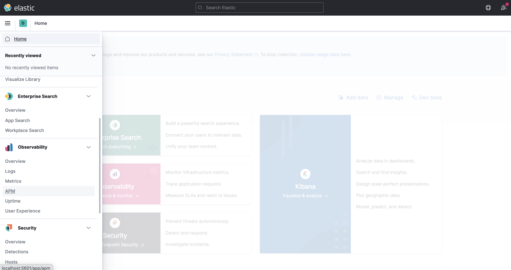

# APM Aidbox


Please pay attention! APM via Kibana is deprecated starting from [February 2022](../../../../overview/release-notes.md#february-2022-2202-lts) release


First step to get started with APM is to read official [tutorial](https://www.elastic.co/guide/en/apm/server/current/getting-started-apm-server.html):

To setup Aidbox monitoring please read this [article](../../../../modules/observability/logging-and-audit/how-to-guides/elastic-logs-and-monitoring-integration.md#elastic-apm-monitoring).

After you've successfully installed APM URL, you can see APM in main Kibana menu and in services submenu you can see Aidbox. Refer to below screenshots:

## Enable APM for 2202 and later versions

Starting with version 2206 and later, Aidbox does not contain an APM agent inside the container. You can include it in your own container's Aidbox build.


```docker
FROM healthsamurai/aidboxone:<VERSION>
COPY --from=docker.elastic.co/observability/apm-agent-java:latest /usr/agent/elastic-apm-agent.jar /app/elastic-apm-agent.jar
```


After that, you can run Aidbox with APM as previously with `JAVA_OPTS` env variable

```bash
JAVA_OPTS='-javaagent:/app/elastic-apm-agent.jar 
           -Delastic.apm.service_name=aidbox 
           -Delastic.apm.server_url=http://localhost:8200 
           -Delastic.apm.secret_token=<token>'

```




.png>)
