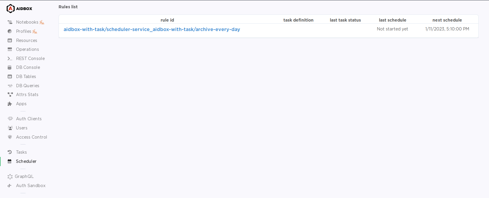

# Automatically Archive AuditEvent Resources in GCP Storage Guide


Since the 2405 release, using Aidbox in FHIR schema validation engine is recommended, which is incompatible with zen or Entity/Attribute options.

[Setup Aidbox with FHIR Schema validation engine](broken-reference)


Follow step-by-step guide to configure scheduled archive operation:

1. Create [GCPServiceAccount](../../../../storage/gcp-cloud-storage.md#create-gcpserviceaccount) resource.
2.  Define your scheduler rule with create-archive task as `:task-request` parameter. Check [Scheduler service](https://github.com/Aidbox/documentation/blob/master/tutorials/tutorials/broken-reference/README.md) and [create-archive](../../../../api/other/archive-restore-api/create-archive.md) documentation for more information.\
    This rule means that Scheduler API will archive all AuditEvent resources that are older than 30 days every day at 2 am into GCP Cloud Storage.

    ```clojure
    archive-every-day
     {:zen/tags #{awf.scheduler/rule}
      :schedule "0 2 * * *"
      :task-request {:definition aidbox.archive/create-archive
                     :params {:targetResourceType    "AuditEvent"
                              :history               false
                              :criteriaPaths         ["recorded"]
                              :retentionPeriod       {:value  30
                                                      :unit   "day"}
                              :storageBackend        "gcp"
                              :serviceAccount        {:id "my-account"
                                                      :resourceType "GcpServiceAccount"}
                              :bucket                "aidbox-archive"
                              :pruneArchivedData     false}}}
    ```
3.  Define your scheduler service if it is not already defined in your configuration. Include created rule in scheduler-service `:rules` property.

    ```clojure
    scheduler-service
     {:zen/tags #{aidbox/service}
      :engine   awf.scheduler/task-scheduler-service-engine
      :rules    #{archive-every-day}}
    ```
4.  Include scheduler service in your Aidbox service configuration if they are not already included in your configuration.

    ```clojure
    box
     {:zen/tags #{aidbox/system}
      :services {:scheduler-service scheduler-service}}
    ```
5. Restart Aidbox.
6.  Check if new scheduler rules created in Scheduler UI:

    <figure><figcaption></figcaption></figure>

Full configuration for this guide:

```clojure
{ns     aidbox-with-task
 import #{aidbox aidbox.archive awf.scheduler}

 archive-every-day
 {:zen/tags #{awf.scheduler/rule}
  :schedule "0 2 * * *"
  :task-request
 {:definition aidbox.archive/create-archive
                 :params {:targetResourceType    "AuditEvent"
                          :history               false
                          :criteriaPaths         ["recorded"]
                          :retentionPeriod       {:value  30
                                                  :unit   "day"}
                          :storageBackend        "gcp"
                          :serviceAccount        {:id "my-account"
                                                  :resourceType "GcpServiceAccount"}
                          :bucket                "aidbox-archive"
                          :pruneArchivedData     false}}}

 scheduler-service
 {:zen/tags #{aidbox/service}
  :engine   awf.scheduler/task-scheduler-service-engine
  :rules    #{archive-every-day}}

 box
 {:zen/tags #{aidbox/system}
  :services {:scheduler-service scheduler-service}}
}
```
