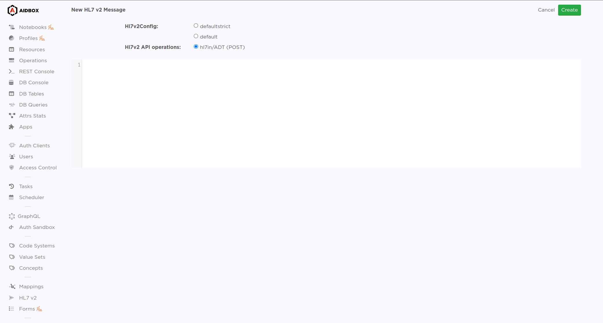

# HL7 v2 pipeline with Patient mapping


Since the 2405 release, using Aidbox in FHIR schema validation engine is recommended, which is incompatible with zen or Entity/Attribute options.

[Setup Aidbox with FHIR Schema validation engine](broken-reference)


In this tutorial we will create an [HL7 v2 pipeline](../../../../modules/integration-toolkit/hl7-v2-integration/hl7-v2-integration-with-aidbox-project.md) to parse, map and persist Patient resources to your Aidbox database.

This tutorial is also available with a [sample aidbox configuration project](https://github.com/Aidbox/aidbox-project-samples/tree/main/aidbox-project-samples/hl7v2-in).

## Mapping definition

Define your mapping tagged by `lisp/mapping`.

The `:mapping` value is confirmed as `lisp/expr`, so you may use [Lisp expressions](broken-reference) to define which intermediate format properties should be included in the Bundle resource.

```clojure
{ns my-mappings
 import #{hl7v2.api
          lisp}

 patient-fhir-mapping
 {:zen/tags #{lisp/mapping}
  :mapping  {:resourceType "Bundle"
             :type "transaction"
             :id (get-in [:parsed :message :proc_id :id])
             :entry [{:request {:url "/fhir/Patient"
                                :method "POST"}

                      :resource {:resourceType "Patient"

                                 :extension
                                 [(when (get-in [:parsed :patient_group :patient :race])
                                    {:url "http://hl7.org/fhir/us/core/StructureDefinition/us-core-race"
                                     :extension (for [i (get-in [:parsed :patient_group :patient :race])]
                                                  {:url "text"
                                                   :valueCoding (select-keys i [:display :system :code])})})]

                                 :identifier   (for [i (get-in [:parsed :patient_group :patient :identifier])]
                                                 (select-keys i [:value :system :type]))

                                 :name         (for [i (get-in [:parsed :patient_group :patient :name])]
                                                 (select-keys i [:family :given :middle :suffix :prefix]))

                                 :birthDate    (get-in [:parsed :patient_group :patient :birthDate])

                                 :gender       (get {"M" "male"
                                                     "F" "female"
                                                     "A" "other"
                                                     "O" "other"
                                                     "U" "unknown"}
                                                    (get-in [:parsed :patient_group :patient :gender]))

                                 :address      (for [i (get-in [:parsed :patient_group :patient :address])]
                                                 (select-keys i [:line :city :state :postalCode :country]))

                                 :telecom      (for [i (get-in [:parsed :patient_group :patient :telecom])]
                                                 (select-keys i [:value :use :system]))

                                 :martialStatus (when (get-in [:parsed :patient_group :patient :martialStatus])
                                                  {:coding (select-keys (get-in [:parsed :patient_group :patient :martialStatus])
                                                                        [:code :display :system])})}}
                     ]}
  }
 }
```


Mapping with several functions on empty intermediate fields may cause exceptions. To avoid such cases, use `when` Lisp function or refrain from using such mappings if not necessary.


## Api definition

Create a namespace with [your API definition](broken-reference) with operation tagged by `aidbox.rest/op`. You should use `hl7v2.api/in-op` as `:engine` for every pipeline operation.

Aidbox provides a predefined parser configuration, so you may use `hl7v2.config/default-config` for most types of messages.\
`:mapping` property should use mapping defined in previous step.

```clojure
{ns my-hl7-api
 import #{aidbox.rest
          hl7v2.config
          hl7v2.api}

 adt-in
 {:zen/tags #{aidbox.rest/op}
  :engine           hl7v2.api/in-op
  :mapping          my-mappings/patient-fhir-mapping
  :parser-config    hl7v2.config/default-config
  }

 api
 {:zen/tags #{aidbox.rest/api}
  "hl7in" {"ADT" {:POST adt-in}}
  }
}
```

## Aidbox definition

Add your API in :apis set of Aidbox server definition.

To properly validate the resulting resource, import the appropriate [fhir profiles](../../zen-related/profiling-with-zen-lang/README.md).

```clojure
{ns box
 import #{zenbox
          aidbox
          my-hl7-api
          hl7-fhir-r4-core
          hl7-fhir-us-core}

 server
 {:zen/tags #{aidbox/service}
  :engine   aidbox/http
  :apis     #{my-hl7-api/api}}

 box
 {:zen/tags #{aidbox/system}
  :services {:http server}}
}
```

## Running instance

If your configuration was loaded correctly - you should see a new option when creating the HL7 v2 message.

<figure><figcaption></figcaption></figure>
