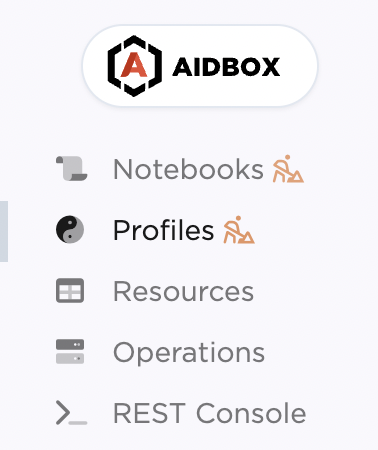
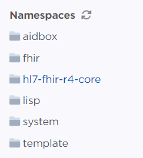

# Enable IGs


Since the 2405 release, using Aidbox in FHIR schema validation engine is recommended, which is incompatible with zen or Entity/Attribute options.

[Setup Aidbox with FHIR Schema validation engine](broken-reference/)


Aidbox configuration project allows you to easily enable [FHIR IGs](https://www.hl7.org/fhir/implementationguide.html) which extend basic FHIR functionality with a variety of features including additional profiles and terminologies. Currently, Aidbox can only work with a subset of IG specification but we plan to extend it in the future.

Currently supported list of features:

* **BaseProfiles** — enable base FHIR resources validation
* **Extensions** — enable [First-Class Extensions](broken-reference/) with validation
* **Profiles** — enable validation via `meta.profile`
* **Searches** (_partial support_) — enable search
* **CodeSystems & ValueSets** (_partial support_) — enable lookup and binding validation

## Available IGs

View the gallery of available FHIR IGs in our GitHub repository:



## How to enable IG

You can enable FHIR IGs you want to use by specifying dependencies in the `zen-package.edn`.

You need to go through the following steps:

1. Specify zen FHIR IGs in your `zen-package.edn`
2. Import the zen FHIR IGs entrypoints
3. Commit changes to your Aidbox configuration project
4. Restart Aidbox and verify that IGs are enabled

All of them are covered in greater detail below.


Zen FHIR packages require `AIDBOX_CORRECT_AIDBOX_FORMAT=true` environment variable.


### Specify zen FHIR IGs in your zen-package.edn

Here's an example for enabling US Core IG and DaVinci PDEX Plan Net:


```clojure
{:deps {hl7-fhir-us-core  "https://github.com/zen-fhir/hl7-fhir-us-core.git"
        hl7-fhir-us-davinci-pdex-plan-net "https://github.com/zen-fhir/hl7-fhir-us-davinci-pdex-plan-net.git"}}
```


Or another example for enabling FHIR r4 core IG:


```clojure
{:deps {hl7-fhir-r4-core "https://github.com/zen-fhir/hl7-fhir-r4-core.git"}}
```



To the left of each zen FHIR IG URL you give a name. In the examples above the names are `r4-core`, `us-core` and `plan-net`. These names are arbitrary and currently are used only to annotate a URL.


### Import the zen FHIR IGs entrypoints

To enable zen FHIR IGs you provided you need to import them inside of your [entrypoint](https://github.com/Aidbox/documentation/blob/master/aidbox-configuration/aidbox-zen-lang-project/broken-reference/README.md).

Using the example from [the getting started page](broken-reference/) the updated entrypoint file will look like this for both of the examples above:

<table><thead><tr><th>r4 core</th><th>us-core and plan-net</th></tr></thead><tbody><tr><td><pre class="language-clojure"><code class="lang-clojure">{ns system
</code></pre></td><td></td></tr><tr><td></td><td></td></tr><tr><td></td><td></td></tr><tr><td></td><td></td></tr><tr><td>import #{aidbox hl7-fhir-r4-core}</td><td></td></tr></tbody></table>

box\
{:zen/tags #{aidbox/system\}}}\
|

```
{import
#{aidbox
hl7-fhir-us-core
hl7-fhir-us-davinci-pdex-plan-net}
box
{:zen/tags #{aidbox/system}}}
```

|

### Commit changes to your Aidbox configuration project

Don't forget to do `git commit` after you made changes to your Aidbox configuration project. To commit you can execute the following command inside your Aidbox configuration project directory:

```bash
git add zen-package.edn && git commit -m "Add IG dependencies"
```

### Restart Aidbox

After you change `zen-package.edn` you need to restart Aidbox for your changes to be applied.

### Verify that IGs are enabled

After Aidbox restarted with a new configuration you can use profiles, terminology, and other IG features.


By default, Aidbox does not load terminologies into the database to save disk space. This still allows you to use them for validation but terminology server functionality won’t be available. If you do wish to load the terminologies, you need to set `BOX_FEATURES_FTR_PULL_ENABLE=true` environment variable.


To see currently loaded profiles you can go to the `profiles` UI page:

 

If you want to verify that validation with IGs work, you can create FHIR resource using FHIR REST API which will validate the provided resource against the specified Profile.

For example, if you want to check that US Core IG works, you can send the following requests and check that response statuses are as expected.


```
POST /Patient
content-type: text/yaml
accept: text/yaml

meta:
  profile:
    - "http://hl7.org/fhir/us/core/StructureDefinition/us-core-patient"
birthsex: "F"
gender: "female"
name:
  - {use: "anonymous"}
identifier:
  - {system: "some-system", value: "unique-value"}
```


This request checks that valid values for `birthsex` field are allowed.


```
POST /Patient
content-type: text/yaml
accept: text/yaml

meta:
  profile:
    - "http://hl7.org/fhir/us/core/StructureDefinition/us-core-patient"
birthsex: "SOMETHING-UNKNOWN"
gender: "female"
name:
  - {use: "anonymous"}
identifier:
  - {system: "some-system", value: "unique-value"}
```


This request checks that invalid values for `birthsex` field are not allowed.

### Development and production tips

If you want some tips regarding development and production usage, visit the links below:

* [Development tips](broken-reference/)
* [Production tips](broken-reference/)
