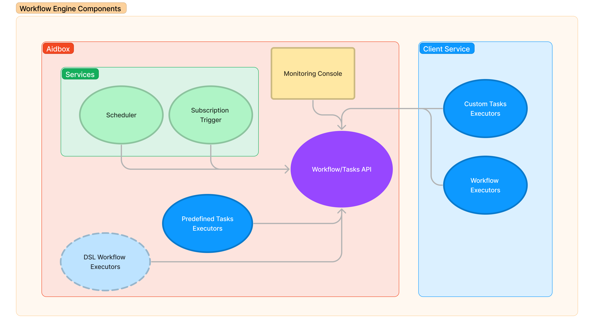

# Workflow Engine


Workflow engine is configured by zen. We do not support it and do not recommend to use it anymore. Please, use any other workflow engine e.g. [Temporal](https://temporal.io/).

Since the 2405 release, using Aidbox in FHIR schema validation engine is recommended, which is incompatible with zen or Entity/Attribute options.

[Setup Aidbox with FHIR Schema validation engine](broken-reference)


## Workflow Engine Components Overview

The Aidbox workflow engine is a core module of the Aidbox FHIR backend that allows you to define and execute custom business logic based on the data state and events in Aidbox.

Having a workflow engine tightly integrated with a FHIR server offers numerous benefits for healthcare organizations seeking to optimize their processes and improve patient care. Here are some key advantages:

1. Seamless data access and manipulation: With direct access to FHIR resources and operations, workflows can easily read, create, update, and delete healthcare data without the need for complex data integration or mapping.
2. Real-time event processing: The event-driven architecture allows the workflow engine to respond immediately to changes in FHIR data, enabling rapid adaptation and reaction to various healthcare scenarios.
3. Simplified maintenance: Reduces operational complexity and resource requirements by consolidating workflow management and FHIR data processing within a single server.

Workflow Engine allows implementing both simple scenarios using [predefined tasks](task/README.md#predefined-tasks) and services with Aidbox Configuration or building applications of any complexity using provided API.

## Basic Concepts 

<figure><figcaption>
Workflow Engine Components
</figcaption></figure>

### Task and Workflow

[task](task/README.md) and [workflow](workflow/README.md) are two basic concepts of Workflow Engine. Both are managed through Aidbox API.

Tasks are the simplest building block responsible for performing business actions. Aidbox provides a number of tasks out of the box. Additional tasks can be implemented outside of Aidbox in any programming language using an [SDK](broken-reference) or API directly.

For more complex application when a simple granular task is not enough, it is necessary to build a workflow. Workflow is a series of tasks that must be completed in a specific order and within a defined time frame to achieve a specific outcome.

### Task Executor

Task Executor is responsible for executing the logic behind a task. For [predefined tasks](broken-reference), they are run within Aidbox, and custom task executors could be [implemented](task/README.md#task-implementation-1) in any programming language using an [SDK](broken-reference) or API directly.

### Workflow Executor

Workflow Executor is responsible for making decisions about the next steps in a workflow based on predefined rules, conditions, or logic. Workflow logic could be implemented using [Workflow Engine SDK](broken-reference)

### [Services](services.md)

Workflow Engine Services are responsible for starting tasks or workflow.

**Subscription Trigger Service** - allows starting task or workflow, when a certain event happens in aidbox.

_For example:_ whenever an Observation resource with a value of blood pressure above some threshold is created in Aidbox - Subscription Trigger will start a Task that creates Appointment resource with reference for Observation in the \`reason\` field.

**Scheduler Service** - allows starting regular scheduled tasks or workflow.

### [Monitoring Console](monitoring.md)

To monitor the current state of tasks, workflow, and services Workflow Engine provides UI inside the Aidbox console. It's also possible to use API to implement your own user interface.

### Tutorials

* [resource-generation-with-map-to-fhir-bundle-task-and-subscription-triggers.md](../../other/other-deprecated-tutorials/resource-generation-with-map-to-fhir-bundle-task-and-subscription-triggers.md) - How to create an encounter when a specific observation is created.


[task](task/README.md)



[workflow](workflow/README.md)



[services.md](services.md)



[monitoring.md](monitoring.md)

