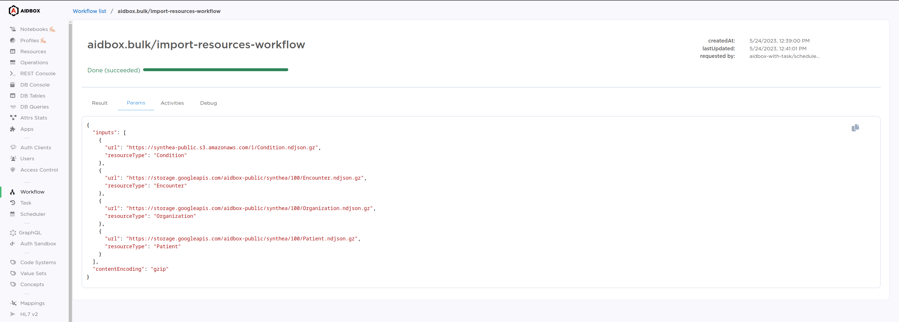
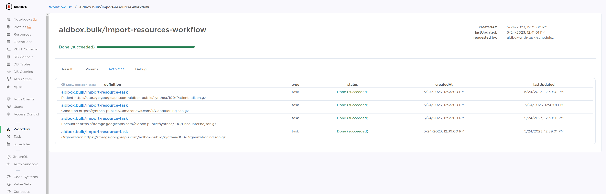
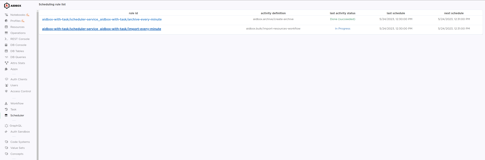
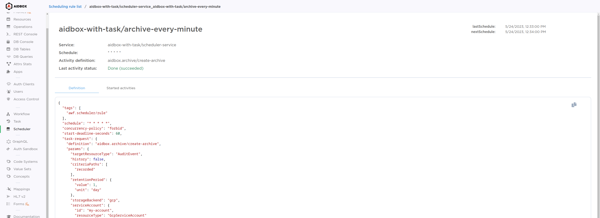

# Monitoring


Workflow engine is configured by zen. We do not support it and do not recommend to use it anymore. Please, use any other workflow engine e.g. [Temporal](https://temporal.io/).

Since the 2405 release, using Aidbox in FHIR schema validation engine is recommended, which is incompatible with zen or Entity/Attribute options.

[Setup Aidbox with FHIR Schema validation engine](broken-reference)


Inside the Aidbox Console a number of panels are provided to monitor the state of Workflows, Tasks, and Services:

## Task UI

Task UI list displays the list of tasks in the system.

<figure><figcaption>
Task list
</figcaption></figure>

Task detailed view allows you to check the results, params, log of task instance transitions through statuses, and cancel tasks manually.

<figure><figcaption>
Task detailed view
</figcaption></figure>

## Workflow UI

The workflow list displays all started workflows in the system.

<figure><figcaption>
Workflow list
</figcaption></figure>

The workflow details view allows you to check the results and parameters of the selected workflow instance and all activities launched by it.

<figure><figcaption>
Workflow result
</figcaption></figure>

<figure><figcaption>
Workflow params
</figcaption></figure>

From the Activity tab, you can review all tasks and workflows launched by the selected workflow. You can also click the activity definition to go to the [Task](monitoring.md#task-ui) or [Workflow](monitoring.md#workflow-ui) UI.

<figure><figcaption>
Started activities
</figcaption></figure>

## Scheduler UI

Scheduler rule list displays the list of all rules defined in Aidbox Project.

<figure><figcaption>
Scheduler rule list
</figcaption></figure>

The detailed rule view displays the definition of the selected rule and other information about its execution.

<figure><figcaption>
Scheduler definition
</figcaption></figure>

From the Activity tab, you can review all tasks and workflows launched by the rule. You can also click the activity definition to go to the [Task](monitoring.md#task-ui) or [Workflow](monitoring.md#workflow-ui) UI.

<figure><figcaption>
Scheduler activities
</figcaption></figure>

