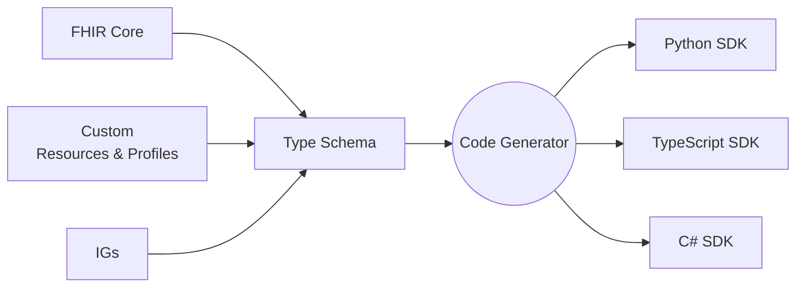

# Developer experience overview

Aidbox delivers an exceptional developer experience built around four core principles:

* **Language-specific SDKs** - Generated SDKs for your favorite programming language
* **Flexible customization** - Easy extension beyond core FHIR with custom resources, profiles, and operations
* **Comprehensive examples** - Extensive documentation and practical examples to accelerate development
* **Integrated debugging tools** - Intuitive UI with built-in development and testing capabilities

Aidbox is built on standard FHIR, so you can use any external FHIR tooling, SDKs, or libraries you prefer. However, Aidbox's native tools provide superior developer experience with better type safety, debugging capabilities, and seamless integration. 


## Language and project-specific SDKs

### Why do we need SDKs?

SDKs eliminate the complexity of working with FHIR by providing:

- **Pre-built operations** - Ready-to-use CRUD, search, and custom operations
- **Type-safe resources** - Native language representations of FHIR resources  
- **Automatic validation** - Built-in validation against FHIR specifications
- **IDE support** - Autocomplete, intellisense, and error detection
- **Best practices** - Proven patterns for FHIR integration

### Use FHIR SDKs for regular experience

Aidbox maintains full FHIR R4/R5/R6 compliance, allowing you to use any standard FHIR client library. This approach works well for teams familiar with existing FHIR tooling or working with standard FHIR resources without customization.

**HAPI FHIR (Java):**
```java
FhirContext ctx = FhirContext.forR4();
IGenericClient client = ctx.newRestfulGenericClient("https://your-aidbox.io/fhir");

// Optional: Add authentication
BearerTokenAuthInterceptor authInterceptor = 
    new BearerTokenAuthInterceptor("your-access-token");
client.registerInterceptor(authInterceptor);

// Create a patient
Patient patient = new Patient();
patient.addName().setFamily("Doe").addGiven("John");
MethodOutcome outcome = client.create().resource(patient).execute();
```

**FHIRLY C# SDK:**
```csharp
var settings = new FhirClientSettings
{
    PreferredFormat = ResourceFormat.Json,
    PreferredReturn = Prefer.ReturnRepresentation
};

var client = new FhirClient("https://your-aidbox.io/fhir", settings);

// Optional: Add authentication
client.OnBeforeRequest += (sender, e) =>
{
    e.RawRequest.Headers.Add("Authorization", "Bearer your-access-token");
};

// Create a patient
var patient = new Patient
{
    Name = { new HumanName { Family = "Doe", Given = new[] { "John" } } }
};
var result = await client.CreateAsync(patient);
```

### Use Aidbox SDKs for custom experience

Universal FHIR SDKs struggle with several critical limitations:

- **Profile complexity** - Combining multiple Implementation Guides (IGs) with unique structural and validation requirements. For example, trying to use both US Core and IPS (International Patient Summary) profiles in the same project often leads to conflicting field requirements where US Core mandates certain extensions while IPS requires different ones for the same resource type.

- **Custom resources** - Real-world projects often need custom resources and operations not covered by standard FHIR. Healthcare organizations frequently need resources like `User` for application-specific authentication or `AccessPolicy` for fine-grained permission control that extend beyond standard FHIR capabilities.

- **Technology conflicts** - Adding large frameworks can create conflicts with existing project stacks. HAPI FHIR brings extensive dependencies that can clash with Spring Boot versions - for example, HAPI FHIR 7.4+ requires Jackson 2.14+ while many Spring Boot 2.x projects use Jackson 2.13, leading to serialization errors like `NoSuchFieldError: ALLOW_LEADING_PLUS_SIGN_FOR_NUMBERS`. Similarly, HAPI FHIR's migration to Hibernate 6 conflicts with Spring Boot applications still using Hibernate 5.

- **Over-complexity** - Including all FHIR features makes SDKs too complex for most real projects. A typical patient management application only uses 5-10% of FHIR resources, yet universal SDKs include all 150+ resource types, choice types, and complex validation rules, resulting in bloated applications and confused developers.

Aidbox solves these challenges by generating project-specific SDKs tailored to your exact requirements. Instead of universal libraries that include everything, Aidbox generates lightweight SDKs containing only the resources, profiles, and operations your project actually uses, eliminating dependency conflicts and reducing complexity.

**Type schema approach**: Aidbox uses a JSON-based Type Schema specification that flattens complex FHIR structures into simplified, code-generation-friendly formats. This methodology enriches type information with metadata needed for SDK generation while automatically handling FHIR's challenging features like Choice Types, Extensions, and ValueSets. The result is clean, idiomatic code in your target language that feels natural to work with.



See also:
- [Type Schema for FHIR SDKs](https://www.health-samurai.io/articles/type-schema-a-pragmatic-approach-to-build-fhir-sdk)
- [Python SDK implementation](https://www.health-samurai.io/articles/type-schema-python-sdk-for-fhir)

## App development framework

Aidbox supports custom application development through its App framework, which allows developers to extend the platform with business-specific functionality.

**App capabilities:**
- **Custom resources** - Define domain-specific data models
- **Custom endpoints** - Implement business logic operations  
- **Event subscriptions** - React to resource changes and system events
- **Workflow integration** - Connect with external systems and services

Apps are standalone services that register with Aidbox, which acts as an API gateway proxying calls to your application endpoints. This architecture enables microservice patterns while maintaining centralized healthcare data management.

See also:
- [App Development Guide](aidbox-sdk/apps.md)

## Aidbox examples

Aidbox provides comprehensive examples that serve as starting points for common healthcare integration patterns and development scenarios. These practical examples demonstrate real-world implementations and help accelerate your development process by providing tested, working code you can adapt for your specific needs.

The [Aidbox Examples repository](https://github.com/Aidbox/examples) contains implementations covering:

**FHIR implementation guides:**
- **International Patient Summary (IPS)** - Complete IPS implementation with Chile-specific $summary operation
- **FHIR SDC (Structured Data Capture)** - Form-based data collection using FHIR standards
- **Clinical Quality Language (CQL)** - Integration with Java-based CQL engines for clinical decision support

**Forms and user interface:**
- **Aidbox Forms Builder** - Interactive form creation with Flutter web and Angular.js implementations
- **Forms Renderer** - Multi-framework form rendering (Angular.js, React.js) with standard and controlled modes
- **SMART App Launch** - Healthcare app authorization patterns with Aidbox and Keycloak integration

**Integration patterns:**
- **AWS S3 Integration** - Cloud storage connectivity for healthcare data
- **Kafka Topic-Based Subscriptions** - Real-time data streaming and event processing
- **OpenTelemetry** - Observability and monitoring implementation
- **Custom Resource Notifications** - Event-driven architecture examples

**Access control:**
- **Organization-Based Access Control (OrgBAC)** - Multi-tenant healthcare applications with practitioner-specific access
- **Agentic FHIR IG Development** - AI-assisted Implementation Guide creation workflows


## Development tools and debugging

Aidbox provides comprehensive development and debugging tools through the [Aidbox UI](../overview/aidbox-ui/), including:

- **REST Console** - Interactive API testing and debugging
- **Database Console** - Direct database query interface  
- **Access Policy Testing** - IAM feature testing and validation
- **Resource Browser** - Visual resource exploration and editing

These built-in tools accelerate development cycles by providing immediate feedback and debugging capabilities without requiring external tools.

**Advanced features:**
- Comprehensive logging and monitoring capabilities
- Bundle request support for transactions and batches
- Extensible logging systems for application monitoring

See also:
- [Debugging Access Control](../tutorials/security-access-control-tutorials/debug-access-control.md)

