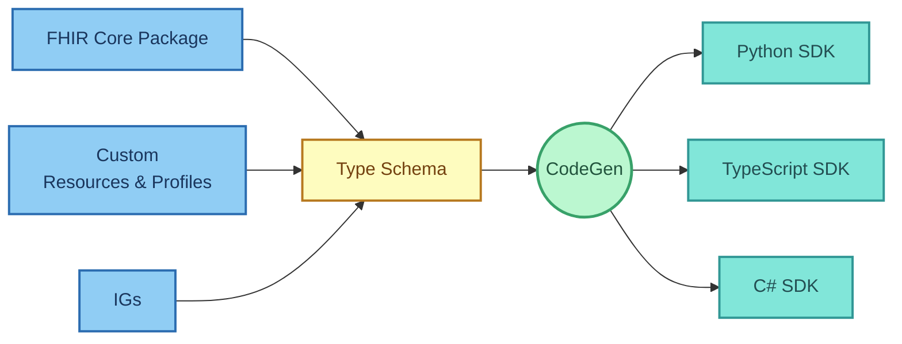
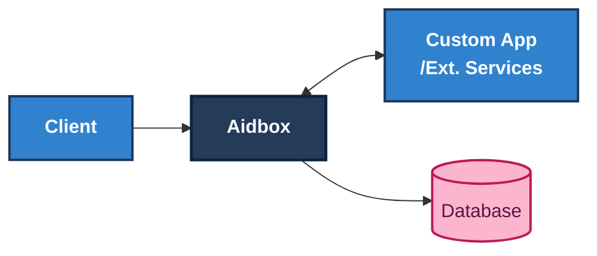
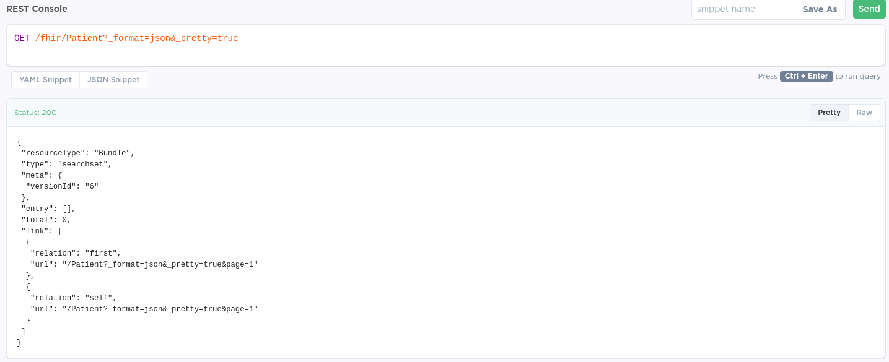

# Developer experience overview

Aidbox delivers a powerful developer experience built around four core principles:

* [**Language-specific SDKs**](developer-experience-overview.md#language-and-project-specific-sdks) - Generated SDKs for your favorite programming language
* [**Flexible customization**](developer-experience-overview.md#use-aidbox-sdks-for-custom-experience) - Easy extension beyond core FHIR with custom resources, profiles, and operations
* [**Comprehensive examples**](developer-experience-overview.md#aidbox-examples) - Extensive documentation and practical examples to accelerate development
* [**Integrated debugging tools**](developer-experience-overview.md#development-tools-and-debugging) - Intuitive UI with built-in development and testing capabilities

Aidbox is built on standard FHIR, so you can use any external FHIR tooling, SDKs, or libraries you prefer. However, Aidbox's native tools provide superior developer experience with better type safety, debugging capabilities, and seamless integration.

## Language and project-specific SDKs

### Why do we need SDKs?

SDKs eliminate the complexity of working with FHIR by providing:

* **Pre-built operations** - Ready-to-use CRUD, search, and custom operations
* **Type-safe resources** - Native language representations of FHIR resources
* **Automatic validation** - Built-in validation against FHIR specifications
* **IDE support** - Autocomplete, intellisense, and error detection
* **Best practices** - Proven approaches for common FHIR integration scenarios (data representation, server interaction, etc.)

### Use generic FHIR SDKs

Aidbox maintains compliance with different FHIR versions, allowing you to use standard FHIR client libraries.

[**HAPI FHIR**](https://hapifhir.io/) **(Java):**

```java
FhirContext ctx = FhirContext.forR4();
IGenericClient client = ctx.newRestfulGenericClient("https://your-aidbox.io/fhir");

// Optional: Add authentication
BasicAuthInterceptor authInterceptor = 
  new BasicAuthInterceptor("your-client-id", "your-secret");
client.registerInterceptor(authInterceptor);

// Create a patient
Patient patient = new Patient();
patient.addName().setFamily("Doe").addGiven("John");
MethodOutcome outcome = client.create().resource(patient).execute();
```

[**FHIR.NET API**](https://github.com/FirelyTeam/firely-net-sdk) **(C#):**

```csharp
var settings = new FhirClientSettings
{
    PreferredFormat = ResourceFormat.Json,
    UseAsync = true,
    VerifyFhirVersion = true
};

var client = new FhirClient("https://your-aidbox.io/fhir", settings);

// Optional: Add Basic Ayth
client.RequestHeaders.Add("Authorization", "Basic <Base64-encoded client:secret>");

// Create a patient
var patient = new Patient
{
    Name = { new HumanName { Family = "Doe", Given = new[] { "John" } } }
};
var result = await client.CreateAsync(patient);
```

See also:

* [Using HAPI Client with Aidbox](https://github.com/Aidbox/examples/tree/main/aidbox-hapi-client)
* [Using Firely Client with Aidbox](https://github.com/Aidbox/examples/tree/main/aidbox-firely-dotnet-client)


### Use Aidbox SDKs for customized experience

Generic FHIR SDKs often struggle with several critical limitations:

* **Profile complexity** - Combining multiple Implementation Guides (IGs) with unique structural and validation requirements. For example, trying to use both [US Core](http://hl7.org/fhir/us/core/) and [IPS](http://hl7.org/fhir/uv/ips/) (International Patient Summary) profiles in the same project often leads to conflicting field requirements where US Core mandates certain extensions while IPS requires different ones for the same resource type.
* **Custom resources** - Real-world projects often need custom resources and operations not covered by standard FHIR. Healthcare organizations frequently need resources like `User` for application-specific authentication or custom entities for workflow management that extend beyond standard FHIR capabilities.
* **Technology conflicts** - Adding large frameworks can create conflicts with existing project stacks. For example, HAPI FHIR has dependencies that may conflict with Spring Boot 2.x or 3.x projects, causing integration challenges and requiring additional configuration.
* **Over-complexity** - Including all FHIR features makes SDKs too complex for most real projects. A typical patient management application only uses 5-10% of FHIR resources, yet universal SDKs include all 150+ resource types, choice types, and complex validation rules, resulting in bloated applications and confused developers.

Aidbox solves these problems with a different approach: creating SDKs specifically for your project. Instead of using bulky generic libraries, Aidbox builds lightweight SDKs with only what you need - just the resources, profiles, and operations your project will actually use. This removes dependency conflicts and simplifies your code. Since configuration happens when the code is generated (not when it runs), developers work with clean, simple code without the complex layers found in typical FHIR SDKs. The result is a more natural development experience (see examples in [Type Schema: Python SDK for FHIR](https://www.health-samurai.io/articles/type-schema-python-sdk-for-fhir)).

**Type schema approach**: At the core of Aidbox's SDK generation is its JSON-based Type Schema. This method converts complex FHIR structures into simpler formats that work well for code generation, adding the type information needed to create SDKs. The Type Schema handles FHIR's trickiest features - like Choice Types, Extensions, and ValueSets - creating clean code in your preferred programming language that developers can easily understand and use.



See also:

* [Type Schema for FHIR SDKs](https://www.health-samurai.io/articles/type-schema-a-pragmatic-approach-to-build-fhir-sdk)
* [Python SDK implementation](https://www.health-samurai.io/articles/type-schema-python-sdk-for-fhir)
* [FHIR Type Schema GitHub Repository](https://github.com/fhir-clj/type-schema)
* [FHIR Schema CodeGen GitHub Repository](https://github.com/fhir-schema/fhir-schema-codegen)
  * TypeScript SDK Example: [GitHub](https://github.com/fhir-schema/fhir-schema-codegen/tree/main/example/typescript)
  * Python SDK Example: [GitHub](https://github.com/fhir-schema/fhir-schema-codegen/tree/main/example/python)
  * C# SDK Example: [GitHub](https://github.com/fhir-schema/fhir-schema-codegen/tree/main/example/csharp)

## App framework for custom operations

Aidbox supports custom application development through its App framework, which allows developers to extend the platform with business-specific functionality by combining custom resources and endpoints to implement complete business logic operations.



Apps are standalone services that register with Aidbox, which acts as an API gateway proxying calls to your application endpoints. This architecture enables microservice patterns while maintaining centralized healthcare data management.

See also:

* [App Development Guide](apps.md)

## Aidbox examples

Aidbox provides real-world examples to accelerate your development with tested, working code for common healthcare integration patterns.

The [Aidbox Examples repository](https://github.com/Aidbox/examples) contains implementations covering:

* **FHIR implementation guides**: International Patient Summary (IPS) for standardized patient data exchange across borders, FHIR SDC (Structured Data Capture) for implementing dynamic questionnaires and forms
* **Forms and user interface**: Aidbox Forms Builder for creating custom healthcare forms, Forms Renderer for displaying and capturing structured data, SMART App Launch for secure third-party application integration
* **Integration patterns**: AWS S3 Integration for secure storage of clinical documents, Kafka Topic-Based Subscriptions for real-time event processing, OpenTelemetry for comprehensive system monitoring, Custom Resource Notifications for event-driven architectures
* **Access control**: Organization-Based Access Control (OrgBAC) for implementing complex healthcare access policies, Agentic FHIR IG Development for automating implementation guide creation and maintenance

## Aidbox UI and development tools

Aidbox provides comprehensive development and debugging tools through the [Aidbox UI](../overview/aidbox-ui/), including:

* **REST Console** - Interactive API testing and debugging
* **Database Console** - Direct database query interface
* **Access Policy Testing** - IAM feature testing and validation
* **Resource Browser** - Visual resource exploration and editing

These built-in tools accelerate development cycles by providing immediate feedback and debugging capabilities without requiring external tools.

**Key capabilities:**

* Built-in request history and logging
* SQL query interface for database exploration
* Visual resource browser and editor
* REST API console for direct API testing



See also:

* [Debugging Access Control](../tutorials/security-access-control-tutorials/debug-access-control.md)
