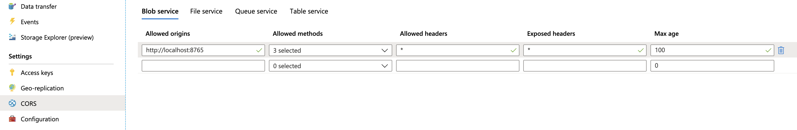

# Azure Blob Storage

Azure Blob Storage is used to store arbitrary unstructured data like images, files, backups, etc. You can read more on Blob Storage [here](https://docs.microsoft.com/en-gb/azure/storage/blobs/storage-blobs-introduction).&#x20;

Aidbox offers integration with Blob Storage to simplify the upload and retrieval of data, called a [**Shared Access Signature**](https://learn.microsoft.com/en-us/rest/api/storageservices/delegate-access-with-shared-access-signature) **(SAS)**. Aidbox can generate two types of SAS:

* [account SAS](https://learn.microsoft.com/en-us/rest/api/storageservices/create-account-sas)
* [user delegation SAS](https://learn.microsoft.com/en-us/rest/api/storageservices/create-user-delegation-sas) (since 2508)

The main differences between them are that the account SAS requires the account key, whereas the user delegation SAS requires the client and client secrets from the Azure Application. We recommend using a user delegation SAS.

## Set up

### User delegation SAS (since 2508)

1. Get **tenantId**, **clientId,** and **clientSecret** from the Microsoft Azure Portal using the [Register an application in Microsoft Entra ID guide](https://learn.microsoft.com/en-us/entra/identity-platform/quickstart-register-app).&#x20;
2. Create the [AzureAccount resource](../reference/system-resources-reference/cloud-module-resources.md#azureaccount) with `userDelegation` sasType:

```
POST /AzureAccount
content-type: application/json
accept: application/json

{
    "id": "aidbox",
    "tenantId": "<tenantId>",
    "clientId": "<clientId>",
    "clientSecret": "<clientSecret>",
    "sasType": "userDelegation"
}
```

3. Create a storage account using [Microsoft Create an Azure storage account guide](https://learn.microsoft.com/en-us/azure/storage/common/storage-account-create?tabs=azure-portal)
4. Create a container using [this](https://learn.microsoft.com/en-us/azure/storage/blobs/storage-quickstart-blobs-portal) guide.
5. Create AzureContainer

```
POST /AzureContainer
content-type: application/json
accept: application/json

{
  "resourceType": "AzureContainer",
  "id": "my-container",
  "account": {
    "id": "aidbox",
    "resourceType": "AzureAccount"
  },
  "storage": "<storageAccount>",
  "container": "<container>"
}
```

6. To generate user delegation SAS, the application needs **Storage Blob Delegator** role. Follow [this guide](https://learn.microsoft.com/en-us/azure/role-based-access-control/role-assignments-portal) to add it.&#x20;
7. To get access to the data by signed URL, the application needs **Storage Blob Data Reader** (read-only) or **Storage Blob Data Contributor** (read, write, delete).

### Account SAS

1. We have to create AzureAccount resource with **id** = account name and **key** = secret key of your account. Your account name and keys can be found under "Access keys" section in Azure Storage account settings.



**Parameters**

* `id` _(required)_: Azure storage Account name
* `key` _(required)_: Azure storage Account key

**Example**

```yaml
POST /AzureAccount

id: aidbox
key: long-base64-encoded-string
```




2. Register AzureContainer

Go to Azure console and create a container, for example, "avatars". Now we can create an **AzureContainer** resource:



**Parameters**

* `id` _(optional)_: id to reference this container in Aidbox requests
* `account` _(required)_: reference to `AzureAccount` resource
* `storage` _(required)_: Azure storage account name
* `container` _(required)_: Azure container name

**Example**

```yaml
POST /AzureContainer

id: avatars
account: {id: aidbox, resourceType: AzureAccount}
storage: aidbox
container: avatars
```




## Get Shared Access Signature (SAS) to upload file

When the configuration is complete, you can request a temporary URL to upload blobs. By default, such URL expires in 30 minutes. You can provide a blob name or just the extension (name will be generated).



**Body parameters**

* `blob` _(required)_: file name
* `timeout` _(optional, default: 30)_: timeout in minutes

**Example**

```yaml
POST /azure/storage/avatars

blob: pt-1.png
```




**Body**

* `url`: signed url to upload file

**Example**

```yaml
url:  https://aidbox.blob.core.windows.net/avatars/pt-1.png?sr=signature
```




Configure CORS in Azure if you want to send data from the browser:



Now you can upload file from your UI using signed URL provided by Aidbox:




```
curl -X PUT "<signed-url>"
-H "x-ms-blob-type: BlockBlob"
-H "Content-Type: text/plain"
--data-binary $'This is test content.'

```





```javascript
//onChange input[type=file]
var file = inputEvent.file.originFileObj;
fetch("<signed-url>", { 
   method: 'PUT', 
   body: file, 
   headers: {'x-ms-blob-type': 'BlockBlob'}
 }).then(...)
```




## Get SAS to read a file

To read the uploaded file you can request a signed URL with:

```yaml
GET /azure/storage/avatar/pt-1.png

---
status: 200
url: <read-signed-url>

# or

GET /azure/storage/avatar/pt-1.png?redirect=true

---
status: 302
headers:
  Location: <read-signed-url>
```

For example, you can use a trick with a redirect to render an image:

```markup

```
