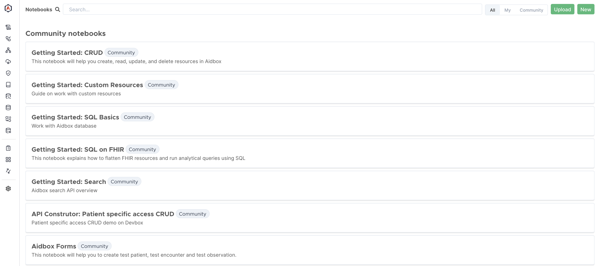

# Run Aidbox locally

## Prerequisites




Please **make sure** that both [Docker & Docker Compose](https://docs.docker.com/engine/install/) are installed.


## Steps

### 1. Create a directory

```sh
mkdir aidbox && cd aidbox
```

### 2. **Run Aidbox on Docker**

```bash
curl -JO https://aidbox.app/runme && docker compose up
```

This command downloads the Aidbox script and starts Aidbox using Docker Compose.

### 3. Access Aidbox

Open in browser [http://localhost:8080/](http://localhost:8080)

### 4. Activate your Aidbox instance

<figure><figcaption></figcaption></figure>

Click "Continue with Aidbox account" and create a free Aidbox account in [Aidbox user portal](https://aidbox.app/).


More about Aidbox licenses [here](../overview/aidbox-user-portal/licenses.md)

### 5. **Discover Aidbox features using Notebooks**

Use Getting Started Notebooks to explore basic Aidbox features

<figure><figcaption></figcaption></figure>


**Aidbox Notebooks**

Notebooks are interactive tutorials within the Aidbox UI with built-in REST, RPC, and SQL editors and the ability to execute requests and queries on the fly and see the result. You can use pre-built or create your own Notebooks. [Learn more.](../overview/aidbox-ui/aidbox-notebooks.md)


## Next Steps

* Learn more about [Aidbox Configuration](../configuration/configure-aidbox-and-multibox.md)
* Unlock additional capabilities of [Aidbox UI](../overview/aidbox-ui/)
* Dive into the built-in [Aidbox Notebooks](../overview/aidbox-ui/aidbox-notebooks.md)
