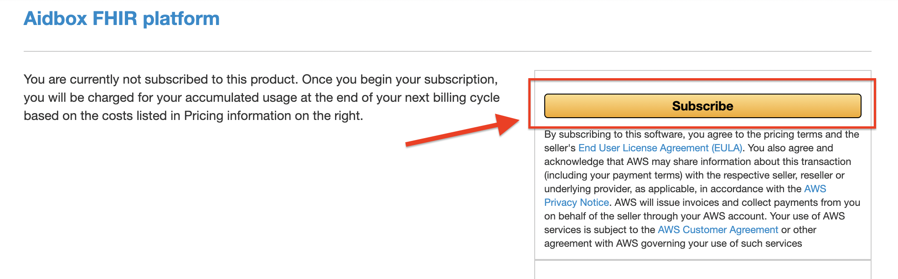
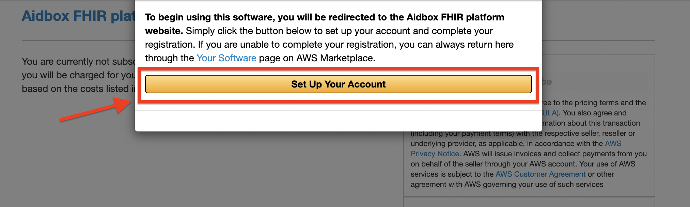
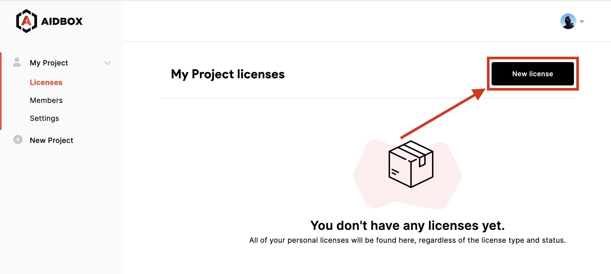
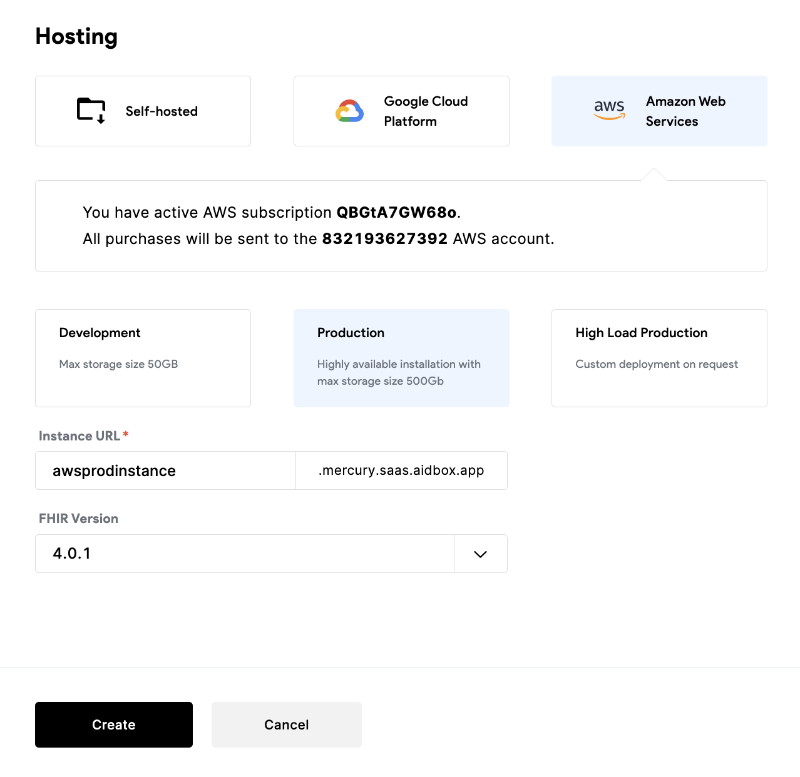
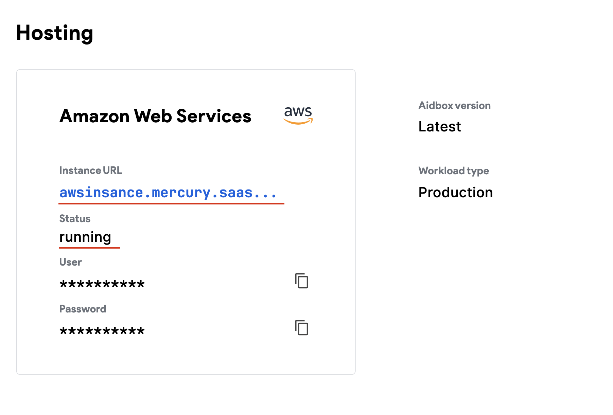

# Run Aidbox on AWS

Sign in to your AWS account

Open [Aidbox FHIR platform product page](https://aws.amazon.com/marketplace/pp/prodview-l5djlpvsd6o5g) in AWS Marketplace

Click on the **"Continue to Subscribe"** button

<figure><figcaption>
Aidbox FHIR platform product page
</figcaption></figure>

On the next screen click to the **"Subscribe"** button

<figure><figcaption>
Subscribe to the "Aidbox FHIR platform product"
</figcaption></figure>

On the last screen click on **"Set Up Your Account"** button.

<figure><figcaption>
Set Up Your Account screen
</figcaption></figure>

After that, you will be redirected to the Aidbox user portal page. Log in in to Aidbox user portal and create new license.

<figure><figcaption></figcaption></figure>

On license create page select product type and fill all required fields. On "Hosting" section you need select **AWS** options. If you successfully subscribe on AWS you will see a green message "You have an active AWS subscription...". Select the hosting zone and click create button.

<figure><figcaption></figcaption></figure>

You can check your license status on the licenses list page. Wait a couple of minutes until we install your environment and order certificates. As a result in "Hosting" section status should be changed to **Running**

<figure><figcaption></figcaption></figure>

Now you can open your instance URL and enter user/password credentials from license page

&#x20;

<figure><figcaption></figcaption></figure>
