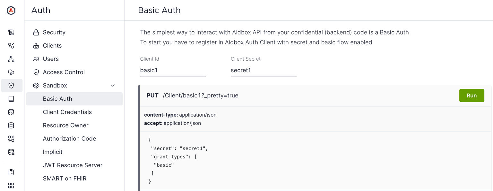

# Basic HTTP Authentication

The simplest way to interact with Aidbox API from your application is to use [the 'Basic' HTTP Authentication](https://datatracker.ietf.org/doc/html/rfc7617). It requires the client to provide credentials in the request header `Authorization: Basic <credentials>`, where `<credentials>` is the base64 encoded Client.id and Client.secret joined by a colon:

```yaml
GET /Patient
Accept: text/yaml
Authorization: Basic {base64(Client.id + ':' + Client.secret)}
```

Basic Auth does not natively provide features such as session invalidation, and the credentials stay constant unless changed. As a result, it is typically used for internal services or quick proofs of concept where heightened security and user management systems are not critical concerns.

## Basic Auth in Aidbox Sandbox

<figure><figcaption></figcaption></figure>

The easiest way to test Basic Auth is to run through the Aidbox Sandbox UI (_Auth -> Sandbox -> Basic Auth_).

**TODO Tutorial: How to configure Basic Auth**
