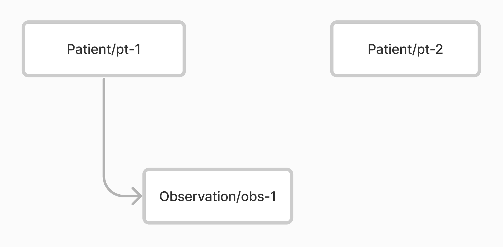

# Patient data access API

Patient level access control in Aidbox allows for the restriction of access to data based on the patient to which it belongs. This means that when users interact with the Patient FHIR API, they are only able to access the resources that belong to a certain patient only.

## Problem

Robust API for patient data access, ensuring that access is strictly limited to data associated with a designated patient. All other patient data is inaccessible through this API.

## Solution

The API for patient-related resources manages the patient's context in which the request is made and denies access to resources that belong to a different patient.

### Patient related resources

A resource type is deemed patient-related if it has a search parameter named `patient`. Custom Aidbox resource type may also be patient-related.

### Patient context in the request

There are two way to define patient context in a request:

1. Create a user session in Aidbox with a `patient` field that links to a Patient resource. Aidbox will automatically populate this field during the user login process if `User.fhirUser` is a link to a Patient resource.
2. Add `X-Patient-id` header to the request

## Enable Patient data access API

* [How to enable patient data access API](../../../../tutorials/security-access-control-tutorials/how-to-enable-patient-data-access-api.md)

### Base url for patient-related FHIR API&#x20;

```yaml
<AIDBOX_BASE_URL>/patient/fhir
```

Let's create two patients and Observations for a first patient.

<figure><figcaption><p>Two Patient resources and an Observation</p></figcaption></figure>


```yaml
PUT /
content-type: text/yaml

- id: pt-1
  resourceType: Patient
- id: pt-2
  resourceType: Patient
- id: obs-1
  resourceType: Observation
  status: registered
  code:
    coding:
    - system: http://loinc.org
      code: 15074-8
      display: Glucose [Moles/volume] in Blood
  subject:
    resourceType: Patient
    id: pt-1
```


Let's play with a new FHIR API.

#### Patients able to read their resources


```yaml
GET /patient/fhir/Observation/obs-1
X-Patient-id: pt-1
```


#### Patients unable to read their resources


```yaml
GET /patient/fhir/Observation/obs-1
X-Patient-id: pt-2
```


#### Patient can see only their resources in the search



```yaml
GET /patient/fhir/Observation
X-Patient-id: pt-1
```



```
status: 200
body:
  resourceType: Bundle
  type: searchset
  total: 1
  entry:
  - resources:
      id: obs-1
      resourceType: Observation
      status: registered
      code:
        coding:
        - system: http://loinc.org
          code: 15074-8
          display: Glucose [Moles/volume] in Blood
      subject:
        resourceType: Patient
        id: pt-1
```



#### Patients cannot see other patient's resources in the search



```yaml
GET /patient/fhir/Observation
X-Patient-id: pt-2
```





```
status: 200
body:
  resourceType: Bundle
  type: searchset
  total: 0
```


