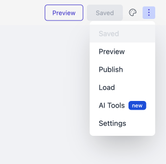
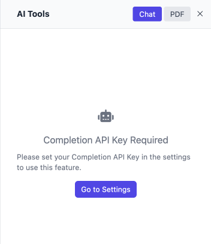
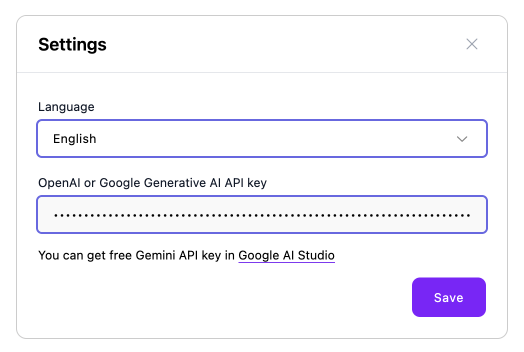
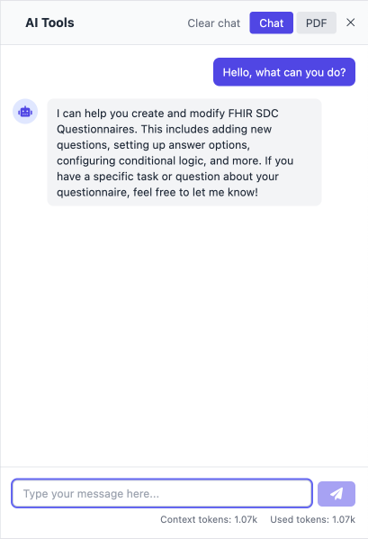
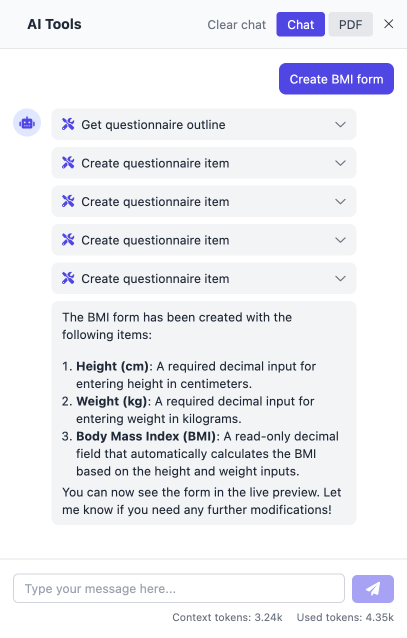

# AI Assistant in Aidbox UI Builder

The AI Assistant in the Aidbox UI Builder is a powerful tool designed to help you quickly build and manage **FHIR SDC Questionnaires** through natural language interaction. It provides seamless integration with the builder's tools and controls, significantly accelerating form creation and editing.

---

## Getting Started

### Opening the AI Assistant

To access the AI Assistant:

1. Navigate to the top-right corner of the Aidbox UI Builder.
2. Click the context menu.
3. Select **AI Tools** from the dropdown.

<figure></figure>

---

### API Key Requirement

Before using the assistant, you need to provide an API key for AI completion. If a key hasn’t been configured, you’ll see a prompt directing you to set it up.

<figure></figure>

Click **Go to Settings** to enter your key.

---

### Configuring the API Key

In the **Settings** modal:

* Choose your preferred language.
* Enter your **OpenAI** or **Google Gemini** API key.
* Click **Save**.

You can get a free Gemini API key from [Google AI Studio](https://aistudio.google.com/).

<figure></figure>

---

## Chat Interface

Once your API key is set, you'll see a traditional chat interface:

<figure></figure>

* Type your request and hit **Send** button or press **Shift+Enter** keys.
* The assistant will respond and execute actions on your behalf.
* Context and token usage are shown below the input field.
* Use **Clear chat** to reset the conversation.


Chat history is saved per saved questionnaire using browser local memory. For unsaved questionnaires, history will not persist across sessions.


---

## Capabilities

The AI Assistant can comprehensively manage FHIR SDC Questionnaires including:

* **Item structure** - Add, remove, move, and nest questionnaire items
* **Population** - Pre-fill items from patient data, observations, or static values
* **Answer options** - Configure choice options, value sets, and dynamic expressions
* **Enablement** - Set up conditional display logic based on other responses
* **Calculation** - Create calculated fields and computed values
* **Extraction** - Map form responses back to FHIR observations and resources
* **Validation** - Add constraints, required fields, and data type validation
* **Presentation** - Modify layout, styling, media content, and user interface elements
* **Metadata** - Managing questionnaire-level properties such as title, version, and tags

Below is an example where the assistant was asked to create a BMI form:

<figure></figure>

In this example, the assistant:

* Created height and weight fields
* Added a calculated BMI field
* Updated the form preview accordingly

---

## Use Case Scenarios

### 1. Quick Questionnaire Generation

**Request:**
"Create a depression screening form using PHQ-9."

**Outcome:**

* Searches LOINC for PHQ-9 codes
* Generates items with scoring
* Applies validation and layout styling

---

### 2. Dynamic Pre-population

**Request:**
"Pre-fill the patient's weight using recent observations."

**Outcome:**

* Configures rules to pull data from past observations
* Applies clinical code mapping (e.g., `29463-7` for weight)
* Ensures fallback and visibility logic are set

---

### 3. Interactive Editing

**Request:**
"Make the BMI field read-only and move it after the weight input."

**Outcome:**

* Updates the field to be non-editable
* Moves the element within the hierarchy
* Adjusts any calculations or dependencies as needed

---

## Best Practices

To get the most out of the AI Assistant, follow these recommendations:

* **Be specific and clear** - Provide detailed descriptions of what you want to achieve
* **Break down complex requests** - Split large tasks into smaller, manageable steps
* **Use examples** - Reference existing form elements or provide sample data when possible
* **Specify item types** - Mention the exact field types you need (choice, text, date, etc.)
* **Include context** - Explain the purpose of the form or questionnaire you're building
* **Review before saving** - Always check the assistant's changes before clicking Save
* **Use medical terminology** - Reference standard codes (LOINC, SNOMED) when working with clinical forms
* **Test iteratively** - Make changes gradually and test functionality as you go
* **Keep chat history manageable** - Clear chat history when conversations become too long, you want a fresh approach, the assistant seems confused, or you're switching task types.

---

## Questions & Answers

### What API providers are supported?

Currently, the AI Assistant supports:

* **OpenAI** (GPT-4o via OpenAI API) - **Recommended**
* **Google Gemini** (Gemini 2.5 Pro)

You can enter your API key in the **Settings** panel under *AI Tools*.

### Is my data sent to external servers?

Only the messages you type into the AI Assistant and necessary context (like form structure) are sent to the AI provider (OpenAI or Gemini), depending on the key you've configured. No patient-identifiable information is sent unless you explicitly include it.

### How is my data and chat history stored?

Chat history is stored in your **browser's local memory** and persists per saved questionnaire. For unsaved questionnaires, chat history will reset if cleared manually.

Questionnaire changes made by the assistant are temporary until you manually click the **"Save"** button to persist them on Aidbox. Unsaved changes remain in your browser session but are not permanently stored.

### Does the assistant affect other questionnaires?

No. The assistant only affects the current questionnaire being edited and does not make changes to other forms or saved questionnaires.

### Can I use the assistant to edit existing forms?

Yes. The assistant can edit any aspect of existing FHIR SDC Questionnaires. See the **Capabilities** section above for a complete list of supported features.

### What happens if I lose internet connection?

If you lose connection, the assistant will be **unable to communicate with the AI provider**. Once you're reconnected, you can type **"Retry"** or **"Continue"** to resume the session.

### Can I undo the assistant's changes?

Yes. You can use the **undo/redo** buttons in the builder interface to revert changes made by the assistant.

### Does it support multilingual use?

Yes. If supported by the underlying AI provider, the assistant will respond in the same language you use in your prompts. You can also select a preferred language in **AI Tools > Settings**.

### Can I export the chat conversation?

Not directly at the moment. You can manually copy the conversation or extract it using developer tools. Export options may be available in future versions.
