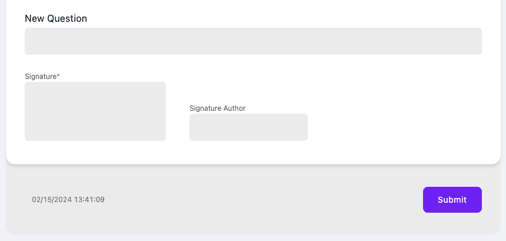

# Form Signature

To use signature feature, your questionnaire must include extension [signatureRequired](http://hl7.org/fhir/StructureDefinition/questionnaire-signatureRequired)

Our form renderer will add additional field to the bottom of the form where user can draw his signature.

<figure><figcaption></figcaption></figure>

### Enable signature in Form Builder

To enable signature for Questionnaire, just click on the according checkbox in form settings.

### Storing signature

Signatures are stored in QuestionnaireResponse under [`signature`](http://hl7.org/fhir/StructureDefinition/questionnaireresponse-signature) extensions.

### Validation notes

If signature is required on Questionnaire, our system will prevent completing that that form without it.
