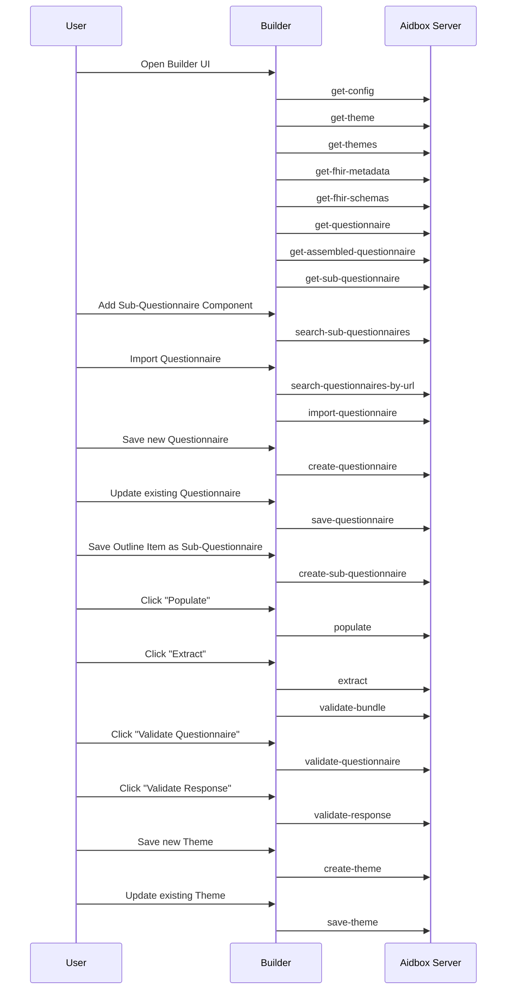
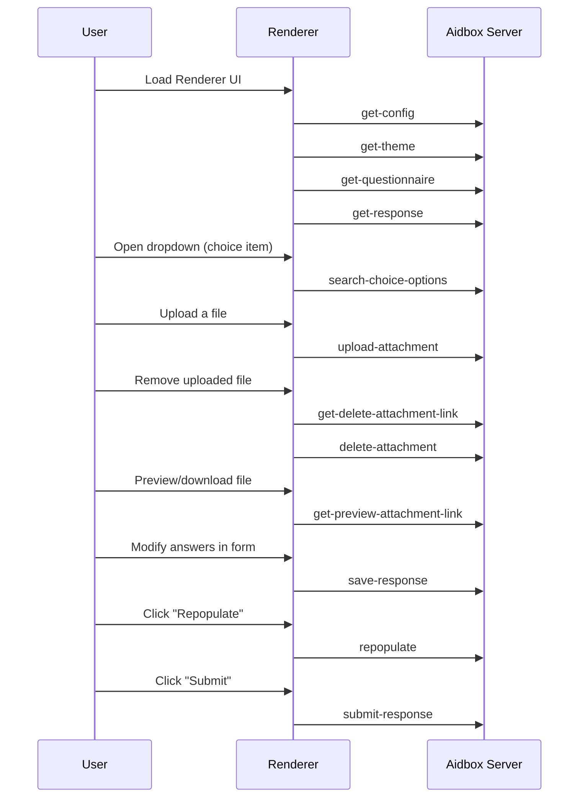

# Request Interception

## Form Builder & Renderer Request Interception

Request interception allows you to modify network requests made by **Form Builder** and **Form Renderer**. This is useful for debugging, adding authentication, redirecting requests, or handling custom logic before requests are sent.

### Enabling Request Interception

To enable request interception, set the `onFetch` property on the builder or renderer element. This property should be a function that takes two arguments: the URL and the request options. The function should return a promise that resolves to the response.



```html
<aidbox-form-builder id="aidbox-form-builder" enable-fetch-proxy />

<script>
    const builder = document.getElementById('aidbox-form-builder');
    
    builder.onFetch = async (url, init) => {
        console.log('Intercepted request', url, init);
        return fetch(url, init);
    };
</script>
```



```html
<aidbox-form-renderer id="aidbox-form-renderer" enable-fetch-proxy />

<script>
    const renderer = document.getElementById('aidbox-form-renderer');
    
    renderer.onFetch = async (url, init) => {
        console.log('Intercepted request', url, init);
        return fetch(url, init);
    };
</script>
```



The interception function must follow the same signature as the standard [fetch](https://developer.mozilla.org/en-US/docs/Web/API/Window/fetch) function, with the following exceptions:

1. The function can return null or undefined to bypass the interception and allow the builder to handle the request using the standard fetch.
2. The [init object](https://developer.mozilla.org/en-US/docs/Web/API/RequestInit) (the second argument) may include an additional tag property. This tag is a string representing the name of one of the [endpoints](request-interception.md#endpoints), allowing you to differentiate between them without relying on the URL or HTTP method, which may be subject to future changes.

### Common Use Cases

These examples demonstrate how to use request interception in various scenarios. Most of the examples are also applicable to the **Renderer** component.

#### 1. Logging Requests

To inspect outgoing requests and responses:

```html
<aidbox-form-renderer id="aidbox-form-renderer" enable-fetch-proxy />

<script>
    const renderer = document.getElementById('aidbox-form-renderer');
    
    renderer.onFetch = async (url, init) => {
        console.log('Request:', url, init);
        const response = await fetch(url, init);
        console.log('Response:', response.status, await response.text());
        return response;
    };
</script>
```

#### 2. Adding Authorization Headers

To include an authorization token in requests:

```html
<aidbox-form-builder id="aidbox-form-builder" enable-fetch-proxy />

<script>
    const builder = document.getElementById('aidbox-form-builder');
    
    builder.onFetch = async (url, init) => {
        const headers = new Headers(init.headers);
        headers.set('Authorization', `Bearer YOUR_ACCESS_TOKEN`);
        return fetch(url, { ...init, headers });
    };
</script>
```

#### 3. Redirecting Requests

To change the endpoint of requests dynamically:

```html
<aidbox-form-renderer id="aidbox-form-renderer" enable-fetch-proxy />

<script>
    const renderer = document.getElementById('aidbox-form-renderer');
    
    renderer.onFetch = async (url, init) => {
        const newUrl = url.replace('aidbox-instance.com', 'custom-endpoint.com');
        return fetch(newUrl, init);
    };
</script>
```

#### 4. Handling Custom Questionnaire Storage

To store and retrieve forms from local storage:

```html
<aidbox-form-builder form-id="local-questionnaire" id="aidbox-form-builder" enable-fetch-proxy />

<script>
    const builder = document.getElementById('aidbox-form-builder');

    builder.onFetch = async (url, init) => {
        if (init.tag === 'get-questionnaire') {
            const storedForm = localStorage.getItem('local-questionnaire') || '{"resourceType": "Questionnaire", "id": "local-questionnaire"}';
            return new Response(storedForm, { status: 200 });
        }
        if (init.tag === 'save-questionnaire') {
            localStorage.setItem('local-questionnaire', init.body);
            return new Response(init.body, { status: 200 });
        }
        return null;
    };
</script>
```

#### 5. Modifying Extracted Data

To manipulate extraction results before they are processed:

```html
<aidbox-form-builder id="aidbox-form-builder" enable-fetch-proxy />

<script>
    const builder = document.getElementById('aidbox-form-builder');
    
    builder.onFetch = async (url, init) => {
        if (init.tag === 'extract') {
            const response = await fetch(url, init);
            const bundle = await response.clone().json();
            console.log('Extracted Bundle:', bundle);
            return response;
        }
        return null;
    };
</script>
```

## Request Tags

Request tags are used to differentiate between different types of requests. They are passed as a property in the `init` object and can be used to identify the request type in the interception function.
The following tags are available:




| Tag                                                                                  | When                                                          | Description                                         |
|--------------------------------------------------------------------------------------|---------------------------------------------------------------|-----------------------------------------------------|
| [get-config](request-interception.md#get-config)                                     | During component initialization (if config is referenced)     | Loads SDCConfig for themes, localization, etc.      |
| [get-theme](request-interception.md#get-theme)                                       | During initialization if config references a theme            | Fetches the theme used by builder.                  |
| [get-themes](request-interception.md#get-themes)                                     | On initialization or after saving a theme                     | Loads available themes for theme selector.          |
| [get-fhir-metadata](request-interception.md#get-fhir-metadata)                       | During builder startup                                        | Fetches CapabilityStatement for autocomplete.       |
| [get-fhir-schemas](request-interception.md#get-fhir-schemas)                         | During builder startup                                        | Loads JSON schemas for FHIR resources.              |
| [get-questionnaire](request-interception.md#get-questionnaire)                       | When initializing the form for editing                        | Loads questionnaire by ID.                          |
| [get-assembled-questionnaire](request-interception.md#get-assembled-questionnaire)   | After loading questionnaire with sub-questionnaire references | Fetches a fully assembled version.                  |
| [get-sub-questionnaire](request-interception.md#get-sub-questionnaire)               | When opening a sub-questionnaire reference                    | Loads a sub-questionnaire by canonical URL.         |
| [search-sub-questionnaires](request-interception.md#search-sub-questionnaires)       | When searching for sub-questionnaires                         | Lists sub-questionnaires by extension/title.        |
| [search-questionnaires-by-url](request-interception.md#search-questionnaires-by-url) | Before saving a questionnaire                                 | Checks if canonical URL is already in use.          |
| [create-questionnaire](request-interception.md#create-questionnaire)                 | When saving a new questionnaire                               | Creates a new Questionnaire resource.               |
| [save-questionnaire](request-interception.md#save-questionnaire)                     | When updating an existing questionnaire                       | Saves changes to the questionnaire.                 |
| [create-sub-questionnaire](request-interception.md#create-sub-questionnaire)         | When saving an outline item as sub-questionnaire              | Creates a canonical sub-questionnaire.              |
| [import-questionnaire](request-interception.md#import-questionnaire)                 | When clicking the "Import" button                             | Imports a new questionnaire JSON.                   |
| [populate](request-interception.md#populate)                                         | When clicking "Populate" in debug panel                       | Prefills fields using subject/context.              |
| [extract](request-interception.md#extract)                                           | When clicking "Extract" in debug panel                        | Extracts resources from the questionnaire response. |
| [validate-questionnaire](request-interception.md#validate-questionnaire)             | When clicking "Validate Questionnaire" in debug panel         | Validates questionnaire resource.                   |
| [validate-response](request-interception.md#validate-response)                       | When clicking "Validate Response" in debug panel              | Validates questionnaire response resource           |
| [validate-bundle](request-interception.md#validate-bundle)                           | When clicking "Extract" in debug panel to validate bundle     | Validates extracted bundle of resources.            |
| [create-theme](request-interception.md#create-theme)                                 | When saving a new theme                                       | Creates a new QuestionnaireTheme.                   |
| [save-theme](request-interception.md#save-theme)                                     | When saving changes to an existing theme                      | Updates the theme resource.                         |





| Tag                                                                                | When                                                        | Description                                      |
|------------------------------------------------------------------------------------|-------------------------------------------------------------|--------------------------------------------------|
| [get-config](request-interception.md#get-config)                                   | During component initialization (if config is referenced)   | Loads SDCConfig for theming/localization.        |
| [get-theme](request-interception.md#get-theme)                                     | During initialization if config references a theme          | Fetches the theme used by renderer.              |
| [get-questionnaire](request-interception.md#get-questionnaire)                     | When loading the form                                       | Fetches the questionnaire by ID.                 |
| [get-response](request-interception.md#get-response)                               | When loading a saved response                               | Fetches the QuestionnaireResponse resource.      |
| [search-choice-options](request-interception.md#search-choice-options)             | When opening/searching dropdown for choice item             | Fetches options from a ValueSet or other source. |
| [get-upload-attachment-link](request-interception.md#get-upload-attachment-link)   | When a file is selected in an attachment input              | Fetches the signed url to upload the file.       |
| [upload-attachment](request-interception.md#upload-attachment)                     | When a file is uploaded to S3-like storage                  | Uploads file and returns file URL.               |
| [get-preview-attachment-link](request-interception.md#get-preview-attachment-link) | When preview/download button in attachment input is clicked | Fetches the file content for preview/download.   |
| [get-delete-attachment-link](request-interception.md#get-delete-attachment-link)   | When an attachment is cleared by the user                   | Fetches the signed url to delete the file.       |
| [delete-attachment](request-interception.md#delete-attachment)                     | When an attachment is cleared by the user                   | Deletes the file from storage.                   |
| [save-response](request-interception.md#save-response)                             | When auto-saving an in-progress response                    | Persists progress with `in-progress` status.     |
| [repopulate](request-interception.md#repopulate)                                   | When user clicks "Repopulate"                               | Refreshes form with updated subject/context.     |
| [submit-response](request-interception.md#submit-response)                         | When user clicks "Submit"                                   | Submits or amends the form.                      |





### get-preview-attachment-link

Triggered in renderer when preview or download button in the attachment input field is clicked.

**Request**

```http
GET /<file-url> HTTP/1.1
```

Where `<file-url>` is the URL of the attachment file.

**Response**

The response is the file content, which can be displayed in the browser or downloaded. The response headers should include `Content-Type` to handle the file correctly.


### get-delete-attachment-link

Triggered in renderer when the attachment input field is cleared to obtain the URL for deleting the attachment.

**Request**

```http
DELETE /$sdc-file/<filepath> HTTP/1.1
```

Where `<filepath>` is the path of the attachment being deleted.

**Response**

```json
{
  "url": "<delete-url>"
}
```

Where `<delete-url>` is the signed URL that can be used to delete the attachment file.

### delete-attachment

Triggered in renderer when the attachment input field is cleared.

**Request**

```http
DELETE /<delete-url> HTTP/1.1
```

Where `<delete-url>` is the url obtained from the [get-delete-attachment-link](request-interception.md#get-delete-attachment-link) request.

**Response**

Response shape is specific to the storage type and is not processed by the frontend.

### extract

Triggered when the "Extract" button in the builder debug panel is clicked.

**Request**

```http
POST /fhir/QuestionnaireResponse/$extract HTTP/1.1
Content-Type: application/json

{
    "resourceType": "Parameters",
    "parameter": [{
        "name": "questionnaireResponse",
        "resource": <questionnaire-response>
    }, {
        "name": "questionnaire",
        "resource": <questionnaire>
    }]
}
```

Where `<questionnaire-response>` is the questionnaire response being extracted and `<questionnaire>` is the questionnaire it is based on.

**Response**

```json
<bundle>
```

Where `<bundle>` is the [bundle](https://www.hl7.org/fhir/bundle.html) of resources extracted from the questionnaire response.

### get-assembled-questionnaire

Triggered after retrieving the current questionnaire to obtain its fully assembled version, if it includes sub-questionnaires.

**Request**

```http
GET /sdc/Questionnaire?url=<questionnaire-url>&version=<questionnaire-version>-assembled HTTP/1.1
```

Where `<questionnaire-url>` represents the canonical URL, and `<questionnaire-version>` specifies the version of the assembled questionnaire being requested.

**Response**

```json
<bundle>
```

Where `<bundle>` is the [bundle](https://www.hl7.org/fhir/bundle.html) containing zero or one [questionnaire](https://www.hl7.org/fhir/questionnaire.html) resource.

### get-config

Triggered during the initialization of the builder or renderer to fetch configuration details.

**Request**

```http
POST /$sdc-config HTTP/1.1
Content-Type: application/json

{
    "resourceType": "Parameters",
    "parameter": [{
        "name": "id",
        "valueString": "<config-id>"
    }]
}
```

Where `<config-id>` refers to the ID of the SDCConfig resource included in the JWT token payload of the current authentication session. This parameter is omitted if no configuration is specified.

**Response**

```json
<config>
```

Where `<config>` is the [SDCConfig](configuration.md) resource containing the configuration details.

### get-questionnaire

Triggered during the initialization of the builder or renderer to fetch the current questionnaire.

**Request**

```http
GET /sdc/Questionnaire/<questionnaire-id> HTTP/1.1
```

Where `<questionnaire-id>` is the ID of the questionnaire being requested.

**Response**

```json
<questionnaire>
```

Where `<questionnaire>` is the [questionnaire](https://www.hl7.org/fhir/questionnaire.html) being requested.

### get-response

Triggered during the initialization of the renderer to fetch the current user response.

**Request**

```http
GET /sdc/QuestionnaireResponse/<questionnaire-response-id> HTTP/1.1
```

Where `<questionnaire-response-id>` is the ID of the questionnaire response being requested.

**Response**

```json
<questionnaire-response>
```

Where `<questionnaire-response>` is the [questionnaire response](https://www.hl7.org/fhir/questionnaireresponse.html) being requested.

### get-fhir-metadata

Triggered during the initialization of the builder to fetch metadata for FHIR resources, which aids in autocompletion.

**Request**

```http
GET /fhir/metadata HTTP/1.1
```

**Response**

```json
<fhir-metadata>
```

Where `<fhir-metadata>` is the [metadata](https://www.hl7.org/fhir/capabilitystatement.html) for the FHIR server.

### get-fhir-schemas

Triggered during the initialization of the builder to fetch schemas for FHIR resource elements, aiding in autocompletion.

**Request**

```http
GET /static/fhir_schemas.json HTTP/1.1
```

**Response**

```json
<fhir-schemas>
```

Where `<fhir-schemas>` is the JSON object containing the [schemas](https://fhir-schema.github.io/fhir-schema/) for the FHIR resource elements.

### get-theme

Triggered during the initialization of the web component if a theme is referenced in the configuration.

**Request**

```http
GET /QuestionnaireTheme/<theme-id> HTTP/1.1
```

Where `<theme-id>` is the ID of the theme being requested.

**Response**

```json
<theme>
```

Where `<theme>` is the [theme](configuration.md#theme) being requested.

### get-themes

Triggered during the initialization of the builder web component and after saving a theme to list available themes in the theme selector.

**Request**

```http
GET /QuestionnaireTheme?_sort=.theme-name HTTP/1.1
```

**Response**

```json
<bundle>
```

Where `<bundle>` is the [bundle](https://www.hl7.org/fhir/bundle.html) of [themes](configuration.md#theme).

### import-questionnaire

Triggered when the "Import" button is clicked in the questionnaire importer.

**Request**

```http
POST /sdc/Questionnaire HTTP/1.1
Content-Type: application/json

<questionnaire>
```

Where `<questionnaire>` is the questionnaire being imported.

**Response**

```json
<questionnaire>
```

Where `<questionnaire>` is the [questionnaire](https://www.hl7.org/fhir/questionnaire.html) that was imported.

### populate

Triggered when the "Populate" button is clicked in the builder debug panel.

**Request**

```http
POST /fhir/Questionnaire/$populate HTTP/1.1
Content-Type: application/json

{
    "resourceType": "Parameters",
    "parameter": [{
        "name": "questionnaire",
        "resource": <questionnaire>
    }, {
        "name": "subject",
        "valueReference": <patient-id>
    }, {
        "name": "local",
        "valueBoolean": true
    }, {
        "name": "context",
        "part": [{
            "name": "name",
            "valueString": "encounter"
        }, {
            "name": "content",
            "valueReference": <encounter-id>
        }, {
            "name": "name",
            "valueString": "author"
        }, {
            "name": "content",
            "valueReference": <patient-id>
        }]
    }]
}
```

Where `<questionnaire>` is the questionnaire being populated, `<patient-id>` is the ID of the patient, and `<encounter-id>` is the ID of the encounter selected in the builder debug panel.

**Response**

```json
<parameters>
```

Where `<parameters>` is a [parameters](https://www.hl7.org/fhir/parameters.html) resource containing the populated questionnaire response under the `response` name.

### save-response

Triggered by the auto-save mechanism shortly after the user makes changes in the form.

**Request**

```http
POST /fhir/QuestionnaireResponse/$save HTTP/1.1
Content-Type: appliation/json

{
    "resourceType": "Parameters",
    "parameter": [{
        "name": "response",
        "resource": <questionnaire-response>
    }]
}
```

Where `<response>` is the response being submitted.


**Status Value**

Since auto-save is only enabled for non-completed forms, the `response` parameter always has the status `in-progress`.


**Response**

```json
<parameters>
```

Where `<parameters>` is a [parameters](https://www.hl7.org/fhir/parameters.html) that includes:

* `response`: the saved questionnaire response.
* `issues`: any validation or processing issues, if available.

### submit-response

Triggered when the user submits a response by clicking the submit button. The submit button is displayed when the questionnaire response is either in progress (`in-progress`) or when the user is amending a completed response.

**Request**

```http
POST /fhir/QuestionnaireResponse/$submit HTTP/1.1
Content-Type: appliation/json

{
    "resourceType": "Parameters",
    "parameter": [{
        "name": "response",
        "resource": <questionnaire-response>
    }]
}
```

Where `<response>` is the response being submitted.


**Status Value**

The `response` parameter contains the current status, and the Aidbox backend is responsible for transitioning it to the appropriate new state. Therefore, if you need to, for example, intercept an amending submission, you should check for the condition `response.status = 'completed'`.


**Response**

```json
<parameters>
```

Where `<parameters>` is a [parameters](https://www.hl7.org/fhir/parameters.html) that includes:

* `response`: the processed questionnaire response.
* `issues`: any validation or processing issues, if available.
* `outcome`: a list of extracted resources when the questionnaire has extraction rules.

### repopulate

Triggered when the "Repopulate" button is clicked by the user.

**Request**

```http
POST /fhir/Questionnaire/$populate HTTP/1.1
Content-Type: application/json

{
    "resourceType": "Parameters",
    "parameter": [{
        "name": "questionnaire",
        "resource": <questionnaire>
    }, {
        "name": "response",
        "resource": <questionnaire-response>
    }, {
        "name": "subject",
        "valueReference": <patient-id>
    }, {
        "name": "local",
        "valueBoolean": true
    }, {
        "name": "context",
        "part": [{
            "name": "name",
            "valueString": "encounter"
        }, {
            "name": "content",
            "valueReference": <encounter-id>
        }]
    }]
}
```

Where `<questionnaire>`, `<questionnaire-response>`, `<patient-id>`, and `<encounter-id>` are as described in the [populate](request-interception.md#populate) request.

**Response**

```json
<parameters>
```

Where `<parameters>` is a [parameters](https://www.hl7.org/fhir/parameters.html) resource containing the repopulated questionnaire response under the `response` name.

### create-questionnaire

Triggered when the "Save" button is clicked in the builder for a new questionnaire.

**Request**

```http
POST /sdc/Questionnaire HTTP/1.1
Content-Type: application/json

<questionnaire>
```

Where `<questionnaire>` is the new questionnaire being created.

**Response**

```json
<questionnaire>
```

Where `<questionnaire>` is the [questionnaire](https://www.hl7.org/fhir/questionnaire.html) that was created.

### save-questionnaire

Triggered when the "Save" button is clicked in the builder.

**Request**

```http
PUT /sdc/Questionnaire/<questionnaire-id> HTTP/1.1
Content-Type: application/json

<questionnaire>
```

Where `<questionnaire>` is the questionnaire being saved.

**Response**

```json
<questionnaire>
```

Where `<questionnaire>` is the [questionnaire](https://www.hl7.org/fhir/questionnaire.html) that was saved.

### create-sub-questionnaire

Triggered when an outline item is saved as a sub-questionnaire.

**Request**

```http
POST /sdc/Questionnaire?url=<sub-questionnaire-url>&version=1 HTTP/1.1
Content-Type: application/json

<sub-questionnaire>
```

Where `<sub-questionnaire-url>` is the canonical URL of the sub-questionnaire and `<sub-questionnaire>` is the sub-questionnaire being saved.

**Response**

```json
<sub-questionnaire>
```

Where `<sub-questionnaire>` is the [questionnaire](https://www.hl7.org/fhir/questionnaire.html) that was created.

### create-theme

Triggered when the "Save" button is clicked in the theme editor for a new theme.

**Request**

```http
POST /QuestionnaireTheme HTTP/1.1
Content-Type: application/json

<theme>
```

Where `<theme>` is the new theme being created.

**Response**

```json
<theme>
```

Where `<theme>` is the [theme](configuration.md#theme) being created.

### save-theme

Triggered when the "Save" button is clicked in the theme editor.

**Request**

```http
PUT /QuestionnaireTheme/<theme-id> HTTP/1.1
Content-Type: application/json

<theme>
```

Where `<theme>` is the theme being saved.

**Response**

```json
<theme>
```

Where `<theme>` is the [theme](configuration.md#theme) being saved.

### search-choice-options

Triggered in renderer by dynamic dropdowns (choice items with external value sets or resource lookups) when the user clicks on the dropdown to fetch the options.

**Request**

```http
GET <url> HTTP/1.1
```

Where `<url>` is the URL of the value set or resources associated with the choice item.

**Response**

Response be a plain list or [bundle](https://www.hl7.org/fhir/bundle.html) of resources (e.g. [ValueSet](https://build.fhir.org/valueset.html)) depending on the source of the options.

### search-questionnaires-by-url

Triggered before saving the current questionnaire to check for conflicts with existing questionnaires based on their URL.

**Request**

```http
GET /sdc/Questionnaire?url=<questionnaire-url> HTTP/1.1
```

Where `<questionnaire-url>` is the canonical URL of the questionnaire being checked.

**Response**

```json
<bundle>
```

Where `<bundle>` is the [bundle](https://www.hl7.org/fhir/bundle.html) of questionnaires with the same URL.

### search-sub-questionnaires

Triggered when the user searches for sub-questionnaires in the builder.

**Request**

```http
GET /sdc/Questionnaire?.extension$contains=%-child&.title$contains=<search-term> HTTP/1.1
```

Where `<search-term>` is the term being searched for.

**Response**

```json
<bundle>
```

Where `<bundle>` is the [bundle](https://www.hl7.org/fhir/bundle.html) of sub-questionnaires.

### get-sub-questionnaire

Triggered to retrieve a sub-questionnaire when it is referenced in a parent questionnaire.

**Request**

```http
GET /sdc/Questionnaire?url=<sub-questionnaire-url>&version=<sub-questionnaire-version> HTTP/1.1
```

Where `<sub-questionnaire-url>` is the canonical URL of the sub-questionnaire being requested. Parameter `version` is omitted if no version is specified in the reference.

**Response**

```json
<bundle>
```

Where `<bundle>` is the [bundle](https://www.hl7.org/fhir/bundle.html) containing zero or one [questionnaire](https://www.hl7.org/fhir/questionnaire.html) resource.

### get-upload-attachment-link

Triggered when a file is selected in the attachment input field to obtain the URL for uploading the attachment.

**Request**

```http
POST /$sdc-file/ HTTP/1.1
Content-Type: application/json

{
    "filename": "<file-name>"
}
```

Where `<file-name>` is the path and name of the file being uploaded.

**Response**

```json
{
  "url": "<upload-url>"
}
```

Where `<upload-url>` is the signed URL that can be used to upload the attachment file. This URL is typically a pre-signed URL for S3-like storage services.

### upload-attachment

Triggered when a file is selected in the attachment input field.

**Request**

```http
POST /<upload-url> HTTP/1.1 

<file-content>

```

Where `<upload-url>` is the signed URL that can be used to upload the attachment file.

**Response**

Only status code is returned, typically `200 OK` if the upload was successful. The response body is not processed by the frontend.

### validate-questionnaire

Triggered when the "Validate Questionnaire" button is clicked in the builder debug panel.

**Request**

```http
POST /Questionnaire/$validate HTTP/1.1
Content-Type: application/json

<questionnaire>
```

Where `<questionnaire>` is the questionnaire being validated.

**Response**

```json
<operation-outcome>
```

Where `<operation-outcome>` is the [operation outcome](https://www.hl7.org/fhir/operationoutcome.html) of the validation.

### validate-response

Triggered when the "Validate Questionnaire Response" button is clicked in the builder debug panel.

**Request**

```http
POST /QuestionnaireResponse/$validate HTTP/1.1
Content-Type: application/json

<questionnaire-response>
```

Where `<questionnaire-response>` is the response being validated.

**Response**

```json
<operation-outcome>
```

Where `<operation-outcome>` is the [operation outcome](https://www.hl7.org/fhir/operationoutcome.html) of the validation.


### validate-bundle

Triggered when the "Extract" button is clicked in the builder debug panel to validate the extraction results.

**Request**

```http
POST /fhir/Bundle/$validate HTTP/1.1
Content-Type: application/json

<bundle>
```

Where `<bundle>` is the bundle of resources extracted from the questionnaire response.

**Response**

```json
<operation-outcome>
```

Where `<operation-outcome>` is the [operation outcome](https://www.hl7.org/fhir/operationoutcome.html) of the validation.

## Sequence Diagram

### Builder



### Renderer


