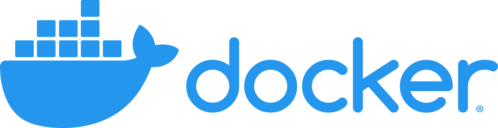

# Getting started (standalone)

## Prerequisites




Please **make sure** that both [Docker & Docker Compose](https://docs.docker.com/engine/install/) are installed.


## Steps

### 1. Create a directory

```sh
mkdir formbox && cd formbox
```

### 2. Run Formbox on Docker

```bash
curl -JO https://aidbox.app/runme/formbox && docker compose up
```

This command downloads the Formbox script and starts Formbox using Docker Compose.

### 3. Access Formbox

Open in browser [http://localhost:8080/](http://localhost:8080)

### 4. Activate your Formbox instance

Click "Continue with Aidbox account" and create a free Aidbox account in [Aidbox user portal](https://aidbox.app/).

More about Aidbox licenses [here](../../overview/aidbox-user-portal/licenses.md)

### 5. Start form designing

Press the button `Forms` in the console in browser (or by visiting [http://localhost:8080/ui/sdc](http://localhost:8080/ui/sdc))

See [Design form in Aidbox UI Builder](aidbox-ui-builder-alpha/)


## Alternative setup via Aidbox Portal

You can also start Formbox standalone from the Aidbox Portal and then sign in with the credentials generated for your instance.

### 1. Open the Aidbox Portal

Go to [Aidbox Portal](https://aidbox.app/ui/portal#/).

Sign up for a new account or log in to an existing one.

### 2. Create a Formbox license

Click **New license** and fill in the following fields:

- **Product**: `Formbox`
- **License type**: choose the type you need
- **License name**: enter a name for your license
- **Hosting**:
  - **Sandbox** — use Formbox in the cloud without Docker
  - **Self-hosted** — run Formbox locally with Docker

Click on **"Create"** button.

If you choose **Sandbox**, wait until the page finishes loading. After that, the product will be ready to use.

If you choose **Self-hosted**, the portal will show the next setup steps for local launch:

After the license is created, you will be redirected to the **Product Summary** page.

### 3. Run Formbox locally

On the **Product Summary** page, copy the command from the **Run me locally** field and run it in your terminal.

After the installation completes successfully, the output will show the local URL where Formbox is running ([http://localhost:8080/](http://localhost:8080) is used by default).

### 4. Open Formbox in the browser

Copy the local URL from the terminal output and open it in your browser.

### 5. Sign in

Enter the login and password shown on the **Product Summary** page.

After a successful sign-in, use the left sidebar to open **Aidbox Forms** and continue working in Formbox.
