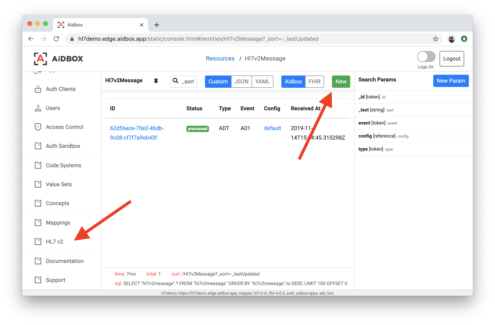
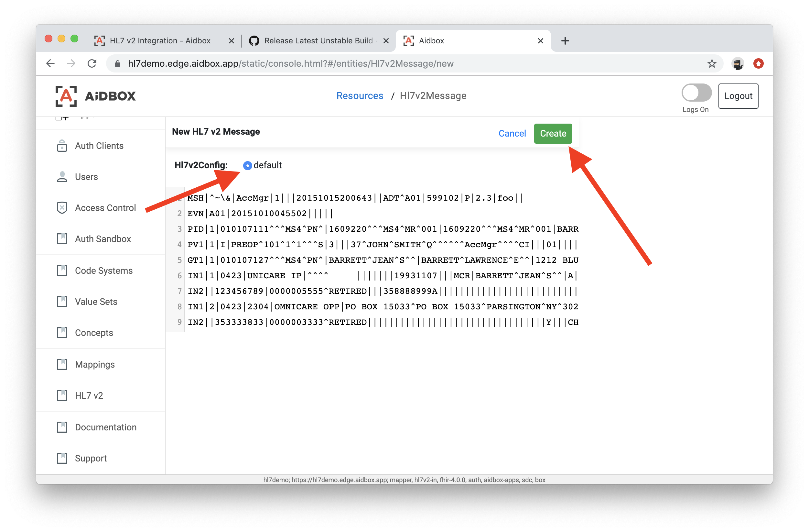
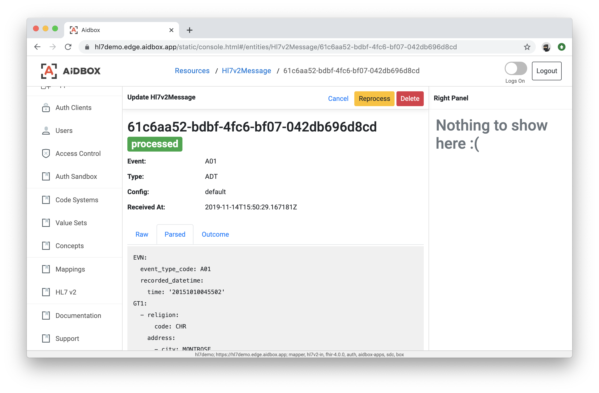

# HL7 v2 integration


Video version of this tutorial


## Introduction

HL7 v2 is still the most widely-used standard for healthcare IT systems integration.\
If you're developing software that receives information from other systems within a hospital/clinic, most likely it will be HL7 v2 messages.

To process those messages, react to them and modify data stored in your Aidbox, there is a Hl7v2-in module.\
It provides two resources: `Hl7v2Config` and `Hl7v2Message`.

* `Hl7v2Config` determines how messages will be parsed and processed.
* `Hl7v2Message` represents a single received HL7 v2 message and contains raw representation, status (processed/error), error description in case of error and other useful information.\
  Both `Hl7v2Config` and `Hl7v2Message` are managed with standard CRUD API.

The parser supports HL7 v2.x message versions (e.g. 2.1 through 2.5.1 as in the MSH segment). The `parsed` field in each message contains a structured AST with common segments such as MSH, PID, PV1, OBR, OBX, ORC, RXA (depending on message type), which your mapping can reference to produce FHIR resources.

### Mapper module

Most likely when a new HL7 v2 message is received, you want to make changes in the database — create, update or delete FHIR resources.\
The [Mapper module](../mappings.md) comes on stage. HL7v2 module parses the message and then passes message data to the Mapping resource specified in `Hl7v2Config` instance via the `mapping` reference.

Here is an example of a mapping which creates a new Patient resource with a name taken from the `PID.5` field\
each time a new message is received:

```yaml
PUT /Mapping/test
Content-Type: text/yaml

resourceType: Mapping
id: test
body:
  resourceType: Bundle
  type: transaction
  entry:
    - resource:
        resourceType: Patient
        name:
          - given: ["$ msg.PID.name.0.given"]
            family: "$ msg.PID.name.0.family.surname"
      request:
        method: POST
        url: "/fhir/Patient"
```


Please note that Mapping returns [FHIR Transaction Bundle](../../../api/batch-transaction.md), so it can produce as many CRUD operations as you need.


### Creating a Hl7v2Config Resource

To start ingesting HL7 v2 messages, you need to create `Hl7v2Config` first:

```yaml
PUT /Hl7v2Config/default
Content-Type: text/yaml

resourceType: Hl7v2Config
id: default
isStrict: false
mapping:
  resourceType: Mapping
  id: test
```

#### Strict and Non-strict Parsing

The `isStrict` attribute specifies if message parsing will be strict or not.

When `isStrict` is true, HL7 v2 parser will fail on any schema error like missing required field or segment.

If `isStrict` is false, then parser will try to produce AST of the message even when required fields are missing or segment hierarchy is broken. In this case, you have a chance to get `null` values in your mapping for fields which you don't expect to be `null`.

#### Mapping Entrypoint

Refer to a mapping which will process your messages with the `mapping` attribute.\
Please note that you aren't obligated to keep all of your mapping logic inside a single `Mapping`\
resource — you can have one as an entrypoint and then dispatch execution to other mappings with the `$include` directive.

**Sort for mixed ordered custom segments**

In cases where some repeatable custom top-level segments are in mixed order, an error will most likely occur.\
The `sortTopLevelExtensions` attribute specifies whether such segments must be ordered before parsing.\
It does not affect segments that are already included in some group.

### Submitting a Message with Aidbox UI

Access the Aidbox UI and navigate to the "HL7 v2" tab in the left menu, then click the "New" button in the top right corner.



Copy-paste a following test message to the "New Message" form:

```yaml
MSH|^~\&|AccMgr|1|||20151015200643||ADT^A01|599102|P|2.3|foo||
EVN|A01|20151010045502|||||
PID|1|010107111^^^MS4^PN^|1609220^^^MS4^MR^001|1609220^^^MS4^MR^001|BARRETT^JEAN^SANDY^^||19420923|F||C|STRAWBERRY AVE^FOUR OAKS LODGE^NEWTOWN^CA^99774^USA^^||(111)222-3333||ENG|W|CHR|111155555550^^^MS4001^AN^001|123-22-1111||||OKLAHOMA|||||||N
PV1|1|I|PREOP^101^1^1^^^S|3|||37^JOHN^SMITH^Q^^^^^^AccMgr^^^^CI|||01||||1|||37^JOHN^SMITH^Q^^^^^^AccMgr^^^^CI|2|40007716^^^AccMgr^VN|4|||||||||||||||||||1||G|||20050110045253||||||
GT1|1|010107127^^^MS4^PN^|BARRETT^JEAN^S^^|BARRETT^LAWRENCE^E^^|1212 BLUEBERRY ST^SIX PINES LODGE^OLDTOWN^CA^99112^USA^|(818)111-1111||19311120|F||A|111-22-3333||||RETIRED|^^^^00000^|||||||20120815|||||0000007496|W||||||||Y|||CHR||||||||RETIRED||||||C
IN1|1|0423|UNICARE IP|^^^^     |||||||19931107|||MCR|BARRETT^JEAN^S^^|A|19321712|1212 BLUEBERRY ST^SIX PINES LODGE^OLDTOWN^CA^99112^USA^^^|||1||||||||||||||1234567890|||||||F|^^^^00000^|N||||123456789
IN2||123456789|0000005555^RETIRED|||358888999A||||||||||||||||||||||||||||||Y|||CHR||||W|||RETIRED|||||||||||||||||(818)111-2222||||||||C
IN1|2|0423|2304|OMNICARE OPP|PO BOX 15033^PO BOX 15033^PARSINGTON^NY^30222|||087770999400099|RETIRED|||20120808|||COM|BARRETT^JEAN^S^^|A|19321210|1212 BLUEBERRY ST^SIX PINES LODGE^OLDTOWN^CA^99112^USA^^^|||2||||||||||||||899991666|||||||F|^^^^00000^|N||||010105555
IN2||353333833|0000003333^RETIRED|||||||||||||||||||||||||||||||||Y|||CHR||||W|||RETIRED|||||||||||||||||(818)333-3333||||||||C
```

Pick an Hl7v2Config instance using the radio button and click the "Create" button:



You'll see a newly created message with additional information like status, parsed structure, outcome, etc.:



### Submitting a Message with the REST API

To submit a new HL7 v2 Message, just create it with the REST API:

```yaml
POST /Hl7v2Message
Content-Type: text/yaml

resourceType: Hl7v2Message
src: |-
  MSH|^~\&|AccMgr|1|||20151015200643||ADT^A01|599102|P|2.3|foo||
  EVN|A01|20151010045502|||||
  PID|1|010107111^^^MS4^PN^|1609220^^^MS4^MR^001|1609220^^^MS4^MR^001|BARRETT^JEAN^SANDY^^||19420923|F||C|STRAWBERRY AVE^FOUR OAKS LODGE^NEWTOWN^CA^99774^USA^^||(111)222-3333||ENG|W|CHR|111155555550^^^MS4001^AN^001|123-22-1111||||OKLAHOMA|||||||N
  PV1|1|I|PREOP^101^1^1^^^S|3|||37^JOHN^SMITH^Q^^^^^^AccMgr^^^^CI|||01||||1|||37^JOHN^SMITH^Q^^^^^^AccMgr^^^^CI|2|40007716^^^AccMgr^VN|4|||||||||||||||||||1||G|||20050110045253||||||
  GT1|1|010107127^^^MS4^PN^|BARRETT^JEAN^S^^|BARRETT^LAWRENCE^E^^|1212 BLUEBERRY ST^SIX PINES LODGE^OLDTOWN^CA^99112^USA^|(818)111-1111||19311120|F||A|111-22-3333||||RETIRED|^^^^00000^|||||||20120815|||||0000007496|W||||||||Y|||CHR||||||||RETIRED||||||C
  IN1|1|0423|UNICARE IP|^^^^     |||||||19931107|||MCR|BARRETT^JEAN^S^^|A|19321712|1212 BLUEBERRY ST^SIX PINES LODGE^OLDTOWN^CA^99112^USA^^^|||1||||||||||||||1234567890|||||||F|^^^^00000^|N||||123456789
  IN2||123456789|0000005555^RETIRED|||358888999A||||||||||||||||||||||||||||||Y|||CHR||||W|||RETIRED|||||||||||||||||(818)111-2222||||||||C
  IN1|2|0423|2304|OMNICARE OPP|PO BOX 15033^PO BOX 15033^PARSINGTON^NY^30222|||087770999400099|RETIRED|||20120808|||COM|BARRETT^JEAN^S^^|A|19321210|1212 BLUEBERRY ST^SIX PINES LODGE^OLDTOWN^CA^99112^USA^^^|||2||||||||||||||899991666|||||||F|^^^^00000^|N||||010105555
  IN2||353333833|0000003333^RETIRED|||||||||||||||||||||||||||||||||Y|||CHR||||W|||RETIRED|||||||||||||||||(818)333-3333||||||||C
status: received
config:
  resourceType: Hl7v2Config
  id: default
```


Newly created messages should have `received` status, otherwise they won't be processed.


`201 Created` response indicates that message was created and processed. Response body will contain additional processing details such as:

**status** — `processed` when message was successfully parsed and mapping was applied or `error` when there was an error/exception in one of those steps;

**parsed** — structured representation of the message;

**outcome** — Transaction Bundle returned by the mapping or error information if the status is `error`.

#### Other message types (ORU, ORM, VXU)

Besides ADT (Admission/Discharge/Transfer), the parser supports common types such as **ORU^R01** (Observation Results), **ORM^O01** (Orders), and **VXU^V04** (Vaccination Update). Use the same `POST /Hl7v2Message` or `POST /fhir/Hl7v2Message` with `src` containing the raw message and `config` referencing your `Hl7v2Config`. The response includes `type` and `event` (e.g. `ORU` / `R01`) and a structured `parsed` object.

**ORU^R01 (Observation Result)** — minimal lab result example:

```yaml
POST /fhir/Hl7v2Message
Content-Type: application/json

{
  "resourceType": "Hl7v2Message",
  "src": "MSH|^~\\&|SEND|FAC|REC|REC|20230101120000||ORU^R01|1|P|2.3|||\nPID|1||123^^^MR||Doe^John^^^L||19800101|M\nOBR|1||ORD001|GLU^Glucose^LN|||20230101100000\nOBX|1|NM|GLU^Glucose^LN||5.5|mmol/L^^LN|||||F",
  "status": "received",
  "config": { "resourceType": "Hl7v2Config", "id": "default" }
}
```

The `parsed` body will contain `MSH`, `patient_result` with `PID` and `order_observation` (OBR and OBX segments).

**ORM^O01 (Order)** — minimal order example:

```yaml
src: "MSH|^~\\&|SEND|FAC|REC|REC|20230101120000||ORM^O01|1|P|2.3\nPID|1||123^^^MR||Doe^John^^^L||19800101|M\nORC|NW|ORD001\nOBR|1||ORD001|CBC^Complete Blood Count^LN"
```

**VXU^V04 (Vaccination Update)** — minimal immunization example:

```yaml
src: "MSH|^~\\&|SEND|FAC|REC|REC|20230101120000||VXU^V04|1|P|2.3.1\nPID|1||123^^^MR||Doe^John^^^L||19800101|M\nORC|RE||||||||||||||||||||||||||||||||||||||||\nRXA|0|999|20230101||50^influenza^CVX||||||||||||||||||||||||\nRXR|C28161^Intramuscular^NCIM"
```

Create a mapping in `Hl7v2Config` that matches the message structure (e.g. `msg.patient_result`, `msg.OBR`) to produce FHIR resources.

### Testing Messages Without Persistence

Use the `$execute-only` operation to test HL7 v2 message parsing and mapping without persisting any data. This is useful for:

* Validating message structure before processing
* Testing and debugging mappings
* Dry-run scenarios where you want to see the result without side effects

```yaml
POST /Hl7v2Message/$execute-only
Content-Type: text/yaml

resourceType: Hl7v2Message
src: |-
  MSH|^~\&|AccMgr|1|||20151015200643||ADT^A01|599102|P|2.3|foo||
  EVN|A01|20151010045502|||||
  PID|1|010107111^^^MS4^PN^|1609220^^^MS4^MR^001|1609220^^^MS4^MR^001|BARRETT^JEAN^SANDY^^||19420923|F||C|STRAWBERRY AVE^FOUR OAKS LODGE^NEWTOWN^CA^99774^USA^^||(111)222-3333||ENG|W|CHR|111155555550^^^MS4001^AN^001|123-22-1111||||OKLAHOMA|||||||N
status: received
config:
  resourceType: Hl7v2Config
  id: default
```

The response is **200 OK** with an `Hl7v2Message`-shaped body (no resource is stored). It includes:

* **type** and **event** — message type and trigger (e.g. `ORU`, `R01`)
* **parsed** — full parsed AST of the message
* **outcome** — mapping result (e.g. Transaction Bundle) or a string such as `"No mapping associated in config"` when the config has no mapping; `outcome.response` is not populated because no transaction is executed

No `Hl7v2Message` resource is created and no FHIR resources from the mapping are persisted. Use this for validation and dry-run testing.

A FHIR-prefixed endpoint is also available: `POST /fhir/Hl7v2Message/$execute-only`

You can try to submit a malformed message (truncated) to see what the result will be:

```yaml
POST /Hl7v2Message
Content-Type: text/yaml

resourceType: Hl7v2Message
src: |-
  MSH|^~
status: received
config:
  resourceType: Hl7v2Config
  id: default
```

The message is still created with **201**; the response body has `status: error` and `outcome` containing the parsing error (e.g. "Message is too short (MSH truncated)"). For request-level validation failures (e.g. missing `config` or invalid reference), the API returns **422** with an `OperationOutcome`.

### Searching Hl7v2Message

You can filter stored messages with standard FHIR search:

* **type** (token) — Message type from MSH (e.g. `ADT`, `ORU`, `ORM`, `VXU`)
* **event** (token) — Event/trigger code (e.g. `A01`, `R01`, `O01`, `V04`)
* **config** (reference) — Filter by `Hl7v2Config` (e.g. `config=Hl7v2Config/default`)

Examples:

```http
GET /fhir/Hl7v2Message?type=ORU
GET /fhir/Hl7v2Message?event=R01
GET /fhir/Hl7v2Message?config=Hl7v2Config/default
```

### Response codes and acknowledgments

* **201 Created** — Message resource was created. The body is the `Hl7v2Message` with `status` (`processed` or `error`), `parsed`, and `outcome`. Parsing or mapping failures still return 201; check `status: error` and the `outcome` field for details.
* **422 Unprocessable Entity** — Request validation failed (e.g. referenced `Hl7v2Config` does not exist). Response is an `OperationOutcome` with diagnostics.

The API does not return HL7v2 ACK/NACK segments; success and errors are indicated by HTTP status and the response body (`status` and `outcome` on the message resource or `OperationOutcome`).

### Capturing a MLLP Traffic

Usually HL7 messages are transmitted using the [MLLP protocol](https://www.hl7.org/implement/standards/product_brief.cfm?product_id=55). To convert a MLLP traffic to HTTP requests, there is an open-source `hl7proxy` utility provided by Health Samurai. It's [available on GitHub](https://github.com/HealthSamurai/hl7proxy) and there are [pre-compiled binaries](https://github.com/HealthSamurai/hl7proxy/releases) for major operating systems and architectures.

Follow the `hl7proxy`'s [README](https://github.com/HealthSamurai/hl7proxy) for installation and usage instructions.

Most likely you'll want to authenticate `hl7proxy` requests with basic auth using Aidbox's Client resource. Also it's a good idea to forbid everything except for POSTing new Hl7Messages. You can do both things by submitting the following Bundle. It will create a Client resource and AccessPolicy for it.

```yaml
POST /
Content-Type: text/yaml

resourceType: Bundle
type: transaction
entry:
  - resource:
      resourceType: Client
      id: hl7proxy
      grant_types: ["basic"]
      secret: <PUT SECRET STRING HERE>
    request:
      url: /Client/hl7proxy
      method: PUT
  - resource:
      resourceType: AccessPolicy
      id: allow-hl7proxy-to-create-hl7v2message
      link:
        - id: hl7proxy
          resourceType: Client
      engine: json-schema
      schema:
        type: object
        required: ["uri", "request-method"]
        properties:
          uri:
            const: "/Hl7v2Message"
          request-method:
            const: post
    request:
      url: /AccessPolicy/allow-hl7proxy-to-create-hl7v2message
      method: PUT
```

To authorize `hl7proxy` requests, one needs to pass an `Authorization` header with every request to Aidbox. You can provide a value for this header with the `-header` command-line flag:

```yaml
./hl7proxy -port 5000 -config default -url https://your-box.edge.aidbox.app/ -header "Authorization: Basic xxxxxxxxxxxxx"
```

To calculate a value for the `Authorization` header, you need to do `base64encode(clientId + ":" clientSecret)`. You can do it in bash:

```yaml
echo -n "hl7proxy:<PUT SECRET STRING HERE>" | base64
```

Replace `xxxxxxxxxx` in the command above with a string returned by this command.

### Using HAPI TestPanel to send messages with MLLP

Once `hl7proxy` is up and running, you can use [HAPI TestPanel](https://hapifhir.github.io/hapi-hl7v2/hapi-testpanel/) to send sample HL7 v2 messages. Make sure that TestPanel doesn't report any errors on message delivery. `hl7proxy` output should contain information about every received message and log line`Sent to Aidbox: 201 Created` indicates a successful delivery.

## User-defined segments (Z-segments)

You can define custom segment using `Hl7v2Config` resource.

`msh` - message structure code, or code with group. Examples: `RAS_O17`, `RAS_O17:encoding`

`segment` - custom segment name.

`quantifier` - The possible values are: `+`, `*` _and_ `?` _, which have the same semantics as in regular expressions._ The default value is `?`.

Each field:

* `name` - HL7v2 field name
* `key` - key under which parsed value is stored
* `type` - HL7v2 field type

### Example

```yaml
mapping:
  id: example
  resourceType: Mapping
isStrict: false
sortTopLevelExtension: false
extensions:
  - msh: ADT_A01
    fields:
      - key: id
        name: ID
        type: EI
      - key: startDate
        name: START_DATE
        type: TS
      - key: endDate
        name: END_DATE
        type: TS
      - key: state
        name: STATE
        type: ST
      - key: value
        name: VALUE
        type: ST
    segment: ZBE
    quantifier: "*"
id: cfg-1
resourceType: Hl7v2Config
```

## Advanced mappings

* [Mappings with Lisp](mappings-with-lisp-mapping.md)
