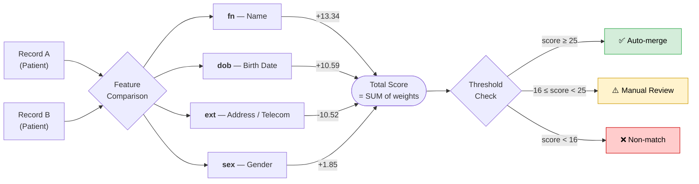
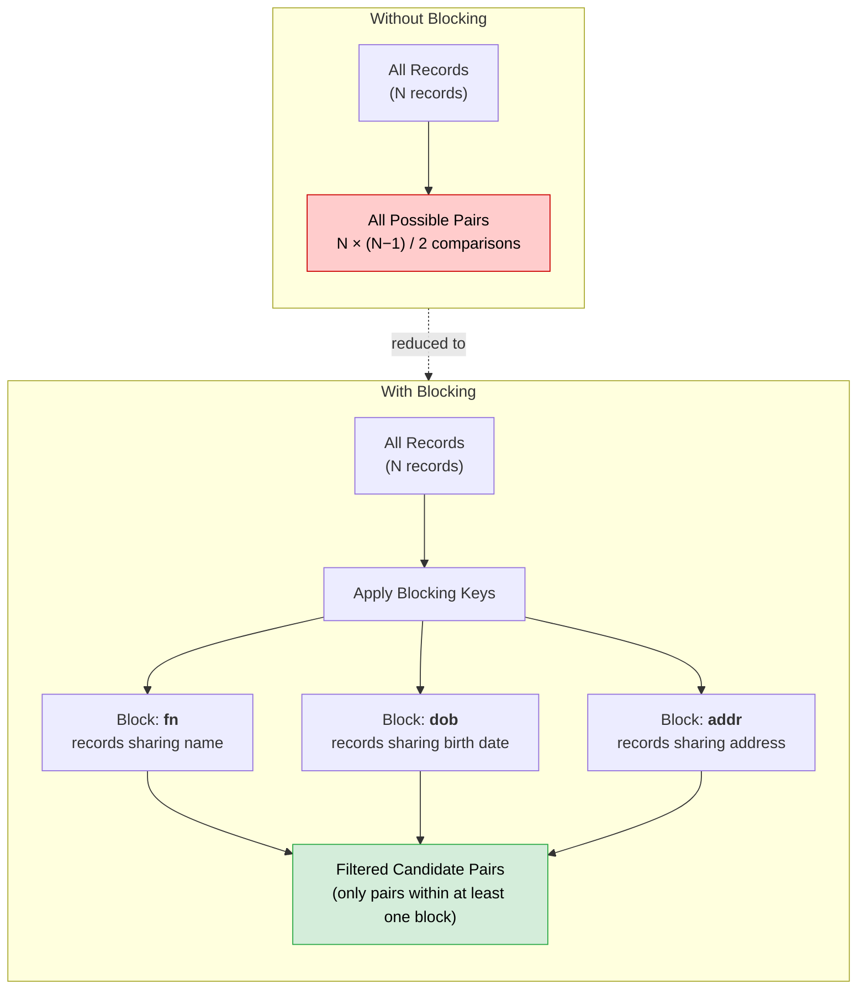
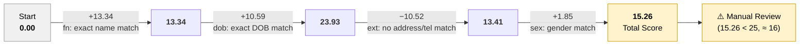
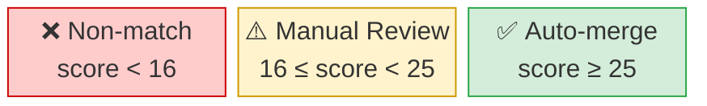

# Matching Model Explanation


This page provides the **matching model code** and explains its elements.\
For an overview of probabilistic matching concepts and match score calculation, see our article [Master Patient Index and Record Linkage](https://www.health-samurai.io/articles/master-patient-index-and-record-linkage).


This model is used for **record matching**, but the same approach can be adapted to detect duplicates for any type of resource.\
If you are interested in applying this approach to your use case, please [contact us](../../overview/contact-us.md).

Matching models are stored in the **MDM server (backend)** and managed via the `/MatchingModel` API or the `/admin` UI.

Below we use **Patient** as an example to illustrate the model structure.

## Core Idea

The model compares selected fields from records and evaluates predefined comparison rules.\
Each rule in the **features** section contains an expression `expr` and an associated weight `bf` (Bayes Factor), indicating how strongly a match or mismatch on that field affects the total score.

All weights are summed into a **total score**. If the score is above the defined threshold, the record pair is included in the match results; if it is below, it is excluded.

The diagram below illustrates the overall matching score calculation flow:



## Model Structure

**Which fields to compare** and **how to compare** them is described in the example model:

<pre class="language-json"><code class="lang-json"><strong>{
</strong>    "id": "model",
    "vars": {
        "dob": "(#.resource#>>'{birthDate}')",
        "name": "((#.#family) || ' ' || (#.#given))",
        "given": "(immutable_unaccent_upper(#.resource#>>'{name,0,given,0}'))",
        "family": "(immutable_unaccent_upper(#.resource#>>'{name,0,family}'))",
        "gender": "(#.resource#>>'{gender}')",
        "address": "(#.resource#>>'{address,0,line,0}')",
        "addressLength": "(length(#.resource#>>'{address,0,line,0}'))",
        "telecomArray": "array(select jsonb_array_elements_text(jsonb_path_query_array( #.resource, '$.telecom[*] ? (@.value != \"\").value')))"
    },
    "blocks": {
        "fn": {
            "var": "name"
        },
        "dob": {
            "var": "dob"
        },
        "addr": {
            "sql": "(l.#address % r.#address)"
        }
    },
    "features": {
        "fn": [
            {
                "bf": 0,
                "expr": " ( l.resource->'name' IS NULL OR r.resource->'name' IS NULL )"
            },
            {
                "bf": 13.336495228175629,
                "expr": "l.#name = r.#name"
            },
            {
                "bf": 13.104401641242227,
                "expr": "r.#given = l.#family AND l.#given = r.#family"
            },
            {
                "bf": 9.288385498954133,
                "expr": "levenshtein(l.#name, r.#name) &#x3C;= 2"
            },
            {
                "bf": 10.36329167966839,
                "expr": "r.#given = l.#given AND string_to_array(l.#family, ' ') &#x26;&#x26; string_to_array(r.#family, ' ')"
            },
            {
                "bf": 10.36329167966839,
                "expr": "r.#family = l.#family AND string_to_array(l.#given, ' ') &#x26;&#x26; string_to_array(r.#given, ' ')"
            },
            {
                "bf": 2.402276401131933,
                "expr": "r.#given = l.#given"
            },
            {
                "else": -12.37233293924643
            }
        ],
        "dob": [
            {
                "bf": 0,
                "expr": " ( l.#dob  IS NULL OR r.#dob IS NULL )"
            },
            {
                "bf": 10.59415069916466,
                "expr": "l.#dob = r.#dob"
            },
            {
                "bf": 3.9911610470417744,
                "expr": "levenshtein(l.#dob, r.#dob) &#x3C;= 1"
            },
            {
                "bf": 0.5164298695732575,
                "expr": "levenshtein(l.#dob, r.#dob) &#x3C;= 2"
            },
            {
                "else": -10.322063538772698
            }
        ],
        "ext": [
            {
                "bf": 9.236771286242664,
                "expr": "((l.#telecomArray &#x26;&#x26; r.#telecomArray) AND (((l.#addressLength > r.#addressLength) and (l.#address %>> r.#address)) or ((l.#addressLength &#x3C;= r.#addressLength) and (l.#address &#x3C;&#x3C;% r.#address))))"
            },
            {
                "bf": 7.465648574292063,
                "expr": "(((l.#addressLength > r.#addressLength) and (l.#address %>> r.#address)) or ((l.#addressLength &#x3C;= r.#addressLength) and (l.#address &#x3C;&#x3C;% r.#address)))"
            },
            {
                "bf": 6.465648574292063,
                "expr": "l.#telecomArray &#x26;&#x26; r.#telecomArray"
            },
            {
                "else": -10.517360697819983
            }
        ],
        "sex": [
            {
                "bf": 0,
                "expr": " ( l.#gender IS NULL OR r.#gender IS NULL )"
            },
            {
                "bf": 1.8504082299552485,
                "expr": " l.#gender = r.#gender"
            },
            {
                "else": -4.842034404727677
            }
        ]
    },
    "resource": "Patient",
    "thresholds": {
        "auto": 25,
        "manual": 16
    },
    "resourceType": "MatchingModel"
}
</code></pre>

### **Variables (`vars`)**

**Variables** defined in the model can **reference resource fields** directly or be composed from them using expressions (e.g., concatenating values, applying normalization, or calculating derived values). These variables are used in feature expressions and blocking rules.

* `dob` – birth date (if applicable)
* `name` – concatenation of family and given names
* `given` – normalized first name (accents removed, uppercase)
* `family` – normalized last name (accents removed, uppercase)
* `gender` – gender value
* `address` – normalized address line
* `telecomArray` – contact information (phone, email)

### **Comparison Blocks (`blocks`)**

Blocking rules **limit** the number of candidate record pairs by selecting only those that **share key characteristics** (e.g., similar names, matching birth dates, or addresses).\
This **reduces** the number of comparisons, which significantly **speeds up processing**, while still preserving potential matches for scoring.

* `fn`: blocks by name
* `dob`: blocks by date of birth
* `addr`: blocks by address

The diagram below shows how blocking reduces the number of comparisons:



### **Matching Features and Scoring**

Features describe **how resource fields are compared** and **how much each comparison influences** the overall **match score**.

Each feature contains:

* `expr` – a logical expression that compares values of specific fields or variables between two records.
* `bf` (Bayes factor / weight) – a numeric value representing how strongly a match or mismatch on that feature affects the total score.

When records are compared, all satisfied feature expressions **add their weights** to the total score. If a mismatch is detected, **negative weights** may be applied. The result is an aggregated score reflecting the likelihood that two records refer to the same entity.


The model uses **Levenshtein distance** to tolerate typos and small text differences. It counts how many single‑character edits (insertions, deletions, substitutions) are needed to make two strings equal.\
For example, <kbd>levenshtein('Jonathan', 'Jonatan') = 1</kbd>.


**Example: Feature Weight Impact**

The diagram below shows how individual feature weights accumulate into the total score for an example pair of records where names match exactly, dates of birth match, address/telecom do not match, and gender matches:



In this example, a strong name match (+13.34) and DOB match (+10.59) are partially offset by a missing address/telecom (−10.52), resulting in a borderline score that falls into the **Manual Review** zone.

#### **Name Matching (`fn`)**:

* Exact match: 13.34 points
* Swapped first/last names: 13.10 points
* Levenshtein distance ≤ 2: 9.29 points
* Partial matches (same first name + matching parts of last name): 10.36 points
* Same first name only: 2.40 points
* No match: -12.37 points

```json
"fn": [
    {
        "bf": 0,
        "expr": " ( l.resource->'name' IS NULL OR r.resource->'name' IS NULL )"
    },
    {
        "bf": 13.336495228175629,
        "expr": "l.#name = r.#name"
    },
    {
        "bf": 13.104401641242227,
        "expr": "r.#given = l.#family AND l.#given = r.#family"
    },
    {
        "bf": 9.288385498954133,
        "expr": "levenshtein(l.#name, r.#name) <= 2"
    },
    {
        "bf": 10.36329167966839,
        "expr": "r.#given = l.#given AND string_to_array(l.#family, ' ') && string_to_array(r.#family, ' ')"
    },
    {
        "bf": 10.36329167966839,
        "expr": "r.#family = l.#family AND string_to_array(l.#given, ' ') && string_to_array(r.#given, ' ')"
    },
    {
        "bf": 2.402276401131933,
        "expr": "r.#given = l.#given"
    },
    {
        "else": -12.37233293924643
    }
]
```

#### **Date of Birth Matching (`dob`)**:

* Exact match: 10.59 points
* Levenshtein distance ≤ 1: 3.99 points
* Levenshtein distance ≤ 2: 0.52 points
* No match: -10.32 points

```json
"dob": [
    {
        "bf": 0,
        "expr": " ( l.#dob  IS NULL OR r.#dob IS NULL )"
    },
    {
        "bf": 10.59415069916466,
        "expr": "l.#dob = r.#dob"
    },
    {
        "bf": 3.9911610470417744,
        "expr": "levenshtein(l.#dob, r.#dob) <= 1"
    },
    {
        "bf": 0.5164298695732575,
        "expr": "levenshtein(l.#dob, r.#dob) <= 2"
    },
    {
        "else": -10.322063538772698
    }
]
```

#### **Address Matching (`ext`)**:

* Exact address match: 7.47 points
* Matching contact information: 9.24 points
* No match: -10.52 points

```json
"ext": [
    {
        "bf": 9.236771286242664,
        "expr": "((l.#telecomArray && r.#telecomArray) AND (((l.#addressLength > r.#addressLength) and (l.#address %>> r.#address)) or ((l.#addressLength <= r.#addressLength) and (l.#address <<% r.#address))))"
    },
    {
        "bf": 7.465648574292063,
        "expr": "(((l.#addressLength > r.#addressLength) and (l.#address %>> r.#address)) or ((l.#addressLength <= r.#addressLength) and (l.#address <<% r.#address)))"
    },
    {
        "bf": 6.465648574292063,
        "expr": "l.#telecomArray && r.#telecomArray"
    },
    {
        "else": -10.517360697819983
    }
]
```

#### **Gender Matching (`sex`)**:

* Exact match: 1.85 points
* No match: -4.84 points

```json
"sex": [
    {
        "bf": 0,
        "expr": " ( l.#gender IS NULL OR r.#gender IS NULL )"
    },
    {
        "bf": 1.8504082299552485,
        "expr": " l.#gender = r.#gender"
    },
    {
        "else": -4.842034404727677
    }
]
```

### **Thresholds**

Thresholds define the **decision boundaries** for match results.\
After the total score is calculated based on all feature comparisons, it is compared against threshold values:

* `auto`: matching score ≥ 25 → automatic merge can be processed
* `manual`: 16 ≤ matching score < 25 → manual review required
* Below `manual` – score < 16 → non‑match

The diagram below visualizes the threshold decision boundaries as a score scale:



**Examples with the model above:**

| Scenario | fn | dob | ext | sex | Total | Decision |
|---|---|---|---|---|---|---|
| All features match | +13.34 | +10.59 | +9.24 | +1.85 | **35.02** | ✅ Auto-merge |
| Name + DOB match, rest mismatch | +13.34 | +10.59 | −10.52 | +1.85 | **15.26** | ❌ Non-match |
| Name match + DOB close + telecom match | +13.34 | +3.99 | +6.47 | +1.85 | **25.65** | ✅ Auto-merge |
| Only names similar (Levenshtein ≤ 2) | +9.29 | −10.32 | −10.52 | −4.84 | **−16.39** | ❌ Non-match |
