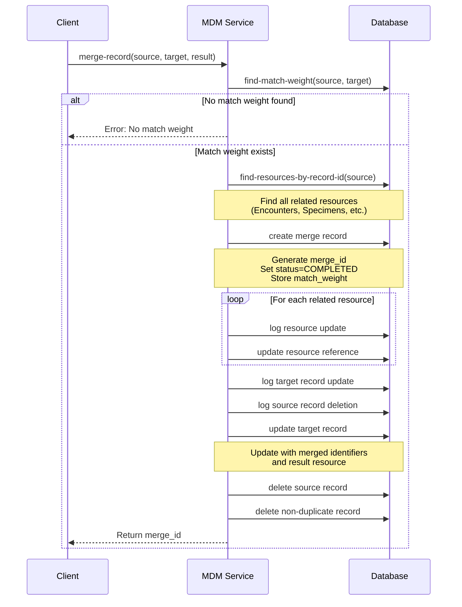
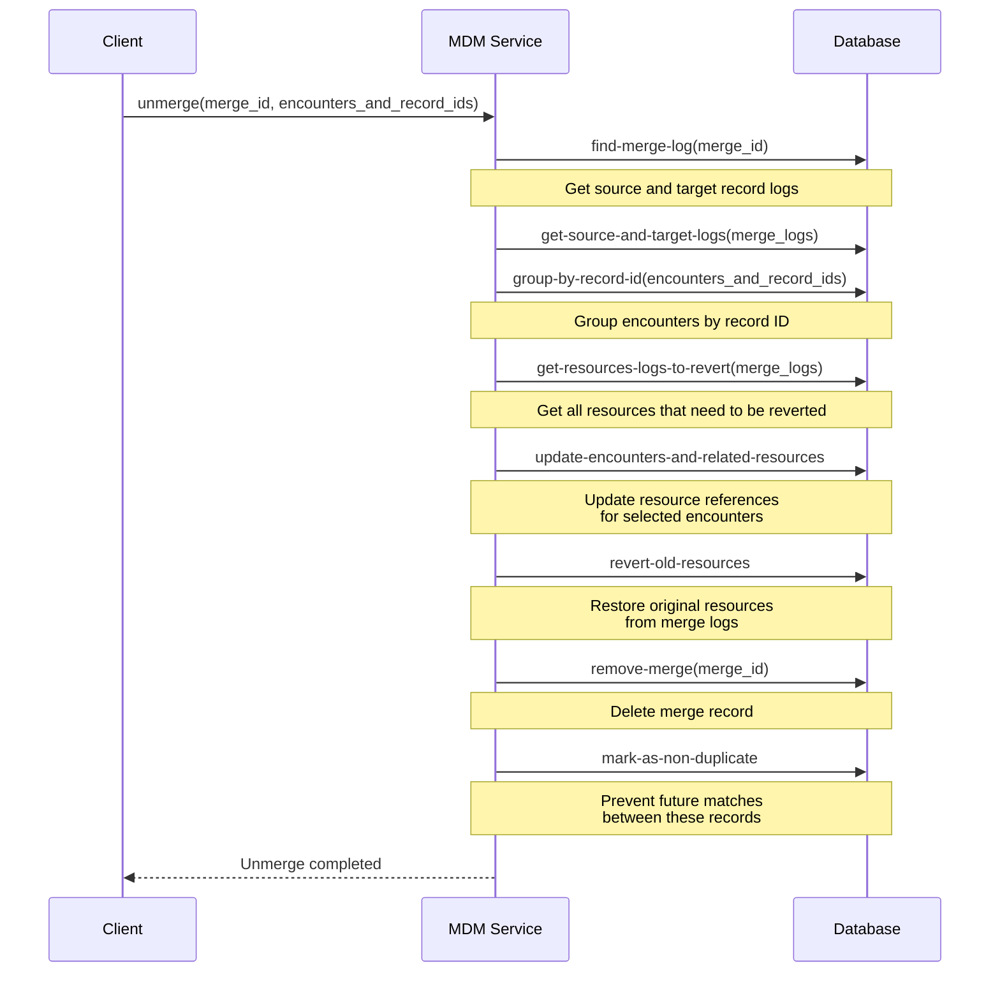

# Merging and Unmerging Records: $merge and $unmerge

## Overview

We use a **hybrid merge strategy** that combines elements of both the **golden record** and **survivor record** approaches:

* You have to select one of the existing records as the **survivor**.
* You can optionally **edit its data** using fields from the other records before completing the merge.

Currently, only **manual merging** is supported. However, the system is designed to support **automatic merging** in the future.

The **unmerge** operation allows reversing a previous merge by restoring the original source record and its relationships based on audit data, ensuring no permanent data loss if a merge was done by mistake.

This page provides key information about using `$merge` and `$unmerge`. For full API details, refer to our [Swagger documentation](https://dev.mdm.health-samurai.io/backend/static/swagger.html).


If you need **alternative merge and unmerge approaches** to adjust MDM to your specific workflows and requirements, please [contact us](../../overview/contact-us.md).


## Merge Operation

### **$merge**

The merge operation can be initiated either through the **MDM user interface** or by using the **API**.

To perform it via the API, send the `$merge` request, for example (Patient example):

```http
POST /fhir/Patient/$merge
Content-Type: application/json

{
  "targetPatient": {
    "reference": "Patient/0"
  },
  "sourcePatient": {
    "reference": "Patient/3"
  },
  "resultPatient": {
    "name": [
        {
            "given": ["Robert"],
            "family": "Alan"
        }
    ]
  }
}
```

Where:

* `targetPatient` – the resource record selected as the **survivor**. After the merge, this record remains active and contains the resulting data.
* `sourcePatient` – the resource record being merged into the survivor. After the merge, this record will be removed.
* `resultPatient` – optional. Provides updated data for the survivor (for example, if you want to correct a name, address, or any other field during the merge). If omitted, the survivor record remains unchanged, except for linked resources and identifiers that are merged automatically.

The **response** returns a `merge-id` used for audit and tracking:

```json
{
  "merge-id": "b71dc614-7a1c-44b8-a727-027cbee3466a"
}
```

### How Merging Works

When a merge request is processed, the system performs several steps to ensure data consistency and auditability:

1. Verifies the match weight exists
2. All related resources are found and updated
3. A merge record is created with status and match weight
4. All changes are logged for audit purposes
5. The target record is updated with merged data
6. The source record is deleted
7. The merge ID is returned to the client

The diagram below shows the full process flow:




## Unmerge Operation

If a merge was performed incorrectly, it can be reversed using the **unmerge** operation.

This operation **restores** the original **source record** and **re‑links all related resources** based on audit information collected during the merge.&#x20;

If any **linked resources were created after the merge**, the operation also provides a way to **manually reassign them** to the appropriate record.

### $unmerge-preview/{id}

Before performing an unmerge, you should preview what will be changed using the **Unmerge Review** endpoint. This endpoint returns a list of **encounters created after the merge**, which may need to be manually reassigned during the unmerge process.

To get the list of after-merge linked resources via API, send the `$unmerge-preview` request, for example (Patient example):

```http
POST /fhir/Patient/$unmerge_preview/1
Content-Type: application/json
```

Where `1` is the **merge ID** returned by the `$merge` operation you want to undo.

**Example response:**

```json
{
  "target-id": "patient-123",
  "source-id": "patient-456",
  "new-encounters": [
    {
      "id": "encounter-789",
      "resource": {
        "resourceType": "Encounter",
        "status": "finished",
        "class": {
          "system": "http://terminology.hl7.org/CodeSystem/v3-ActCode",
          "code": "AMB",
          "display": "ambulatory"
        }
      }
    }
  ]
}
```

Where:

* `target-id` – the ID of the **survivor** record after the merge.
* `source-id` – the ID of the **merged (source)** record that will be restored.
* `new-encounters` – list of encounters created **after the merge** that may need to be manually reassigned when performing an unmerge.

### $unmerge&#x20;

Like the merge operation, the unmerge operation can be initiated either through the **MDM user interface** or by using the **API**.

To perform the unmerge via the API, send the `$unmerge` request, for example (Patient example):

```http
POST /fhir/Patient/$unmerge
Content-Type: application/json

{
  "merge-id": "1",
  "encounters-and-patient-ids": [
    {
      "patient-id": "patient-456",
      "encounter-ids": [
        "encounter-123"
      ]
    }
  ]
}
```

Where:

* `merge-id` – the unique identifier of the merge operation to be reversed.
* `encounters-and-patient-ids` – optional mapping of **encounters created after the merge** that need to be manually reassigned:
  * `patient-id` – the record to whom encounters should be linked after the unmerge.
  * **`encounter-ids`** – list of encounters that should be re‑linked to this record.\
    This ensures that any encounters created post‑merge are correctly redirected when restoring the original records. You can get the list of post-merge encounters via **$unmerge-preview/{id}** request.

### How Unmerging Works

Processing an unmerge request follows a specific workflow designed to safely restore previously merged data:

1. The system retrieves the original merge logs
2. Source and target record information is extracted
3. Encounters are grouped by record ID
4. Resources that need to be reverted are identified
5. Resource references are updated for selected encounters and other linked resources
6. Original resources are restored from merge logs
7. The merge record is removed
8. Records are marked as non-duplicates
9. The operation is completed

The diagram below shows the full process flow:


