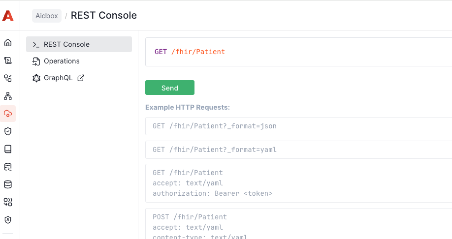

# Run MDM locally

## Prerequisites




Please **make sure** that both [Docker & Docker Compose](https://docs.docker.com/engine/install/) are installed.


## Steps

### 1. Create a directory

```sh
mkdir aidbox-mdm && cd aidbox-mdm
```

### 2. Create Docker Compose file

Create a file named `mdm-compose.yml` with the following content:

```yaml
volumes:
  postgres_data: {}
services:
  aidbox-db:
    image: docker.io/library/postgres:18
    volumes:
    - postgres_data:/var/lib/postgresql/18/docker:delegated
    environment:
      PGDATA: /data
      POSTGRES_USER: postgres
      POSTGRES_PORT: "5432"
      POSTGRES_DB: aidbox
      POSTGRES_PASSWORD: postgres
      POSTGRES_INITDB_ARGS: "--data-checksums"
    command:
    - postgres
    - -c
    - shared_preload_libraries=pg_stat_statements
    healthcheck:
      test: ["CMD-SHELL", "pg_isready -U postgres"]
      interval: 5s
      timeout: 5s
      retries: 5
      start_period: 10s

  aidbox:
    image: healthsamurai/aidboxone:latest
    pull_policy: always
    depends_on:
      aidbox-db:
        condition: service_healthy
    ports:
      - 8889:8080
    environment:
      BOX_ADMIN_PASSWORD: password
      BOX_BOOTSTRAP_FHIR_PACKAGES: hl7.fhir.r4.core#4.0.1
      BOX_COMPATIBILITY_VALIDATION_JSON__SCHEMA_REGEX: "#{:fhir-datetime}"
      BOX_DB_DATABASE: aidbox
      BOX_DB_HOST: aidbox-db
      BOX_DB_PASSWORD: postgres
      BOX_DB_PORT: "5432"
      BOX_DB_USER: postgres
      BOX_FHIR_COMPLIANT_MODE: true
      BOX_FHIR_CORRECT_AIDBOX_FORMAT: true
      BOX_FHIR_CREATEDAT_URL: https://aidbox.app/ex/createdAt
      BOX_FHIR_SCHEMA_VALIDATION: true
      BOX_FHIR_SEARCH_AUTHORIZE_INLINE_REQUESTS: true
      BOX_FHIR_SEARCH_CHAIN_SUBSELECT: true
      BOX_FHIR_SEARCH_COMPARISONS: true
      BOX_FHIR_TERMINOLOGY_SERVICE_BASE_URL: https://tx.health-samurai.io/fhir
      BOX_ROOT_CLIENT_ID: root
      BOX_ROOT_CLIENT_SECRET: H_ZuMewXLL
      BOX_SEARCH_INCLUDE_CONFORMANT: true
      BOX_SECURITY_AUDIT_LOG_ENABLED: true
      BOX_SECURITY_DEV_MODE: true
      BOX_SETTINGS_MODE: read-write
      BOX_WEB_BASE_URL: http://localhost:8888
      BOX_WEB_PORT: 8080
    healthcheck:
      test: curl -f http://localhost:8080/health || exit 1
      interval: 5s
      timeout: 5s
      retries: "90"
      start_period: 30s

  backend:
    pull_policy: always
    image: healthsamurai/mpi-backend:edge
    environment:
      - MPI_URI=http://localhost:3000
      - MPI_PG_HOST=aidbox-db
      - MPI_PG_PORT=5432
      - MPI_PG_USER=postgres
      - MPI_PG_PASSWORD=postgres
      - MPI_PG_DATABASE=aidbox
      - MPI_HTTP_PORT=3003
      - MPI_HTTP_BINDING=0.0.0.0
      - MPI_LOG_LEVEL=2
      - MPI_ENABLE_AUTHENTICATION=true
      - MPI_ENABLE_AUTHORIZATION=false
      - AIDBOX_BASE_URL=http://aidbox:8080
      - MPI_PG_TRGM_SIMILARITY_THRESHOLD=0.9
      - MPI_PG_TRGM_STRICT_WORD_SIMILARITY_THRESHOLD=0.9
      - MPI_NOTIFICATION_WORKER_ENABLE=false
      - MPI_NOTIFICATION_CONSUMER_URL=http://localhost:9876
      - MPI_NOTIFICATION_INTERVAL=1000
      - MPI_NOTIFICATION_BATCH_SIZE=10
      - MPI_NOTIFICATION_LOCK_ID=12345
      - MPI_AUDIT_WORKER_ENABLE=false
      - MPI_AUDIT_CONSUMER_URL=http://localhost:9877
      - MPI_AUDIT_INTERVAL=1000
      - MPI_AUDIT_BATCH_SIZE=10
      - MPI_AUDIT_LOCK_ID=54321
    ports:
      - "3003:3003"
    depends_on:
      aidbox-db:
        condition: service_healthy
      aidbox:
        condition: service_healthy
    restart: unless-stopped
    healthcheck:
      test: curl -f http://localhost:3003/health || exit 1
      interval: 5s
      timeout: 5s
      retries: "90"
      start_period: 30s

  frontend:
    pull_policy: always
    image: healthsamurai/mpi-frontend:edge
    environment:
      - NEXT_PUBLIC_API_BASE_URL=http://backend:3003
      - NEXTAUTH_SECRET=your-very-strong-random-secret-here
      - BASE_URL=http://localhost:3000
      - AIDBOX_BASE_URL_EXTERNAL=http://localhost:8888
      - AIDBOX_BASE_URL_INTERNAL=http://aidbox:8080
      - AIDBOX_CLIENT_ID=mpi-dev
      - AIDBOX_CLIENT_SECRET=pass
      - NEXTAUTH_URL=http://localhost:3000
      - MPI_BASIC_ROLE=SIT_EMPI_USER_DEV
      - MPI_ADMIN_ROLE=SIT_EMPI_ADMIN_DEV
      - PATIENT_PORTAL_IDENTIFIER_TYPE_CODE=LUMID.PROD
      - MPI_PG_HOST=aidbox-db
      - MPI_PG_PORT=5432
      - MPI_PG_USER=postgres
      - MPI_PG_PASSWORD=postgres
      - MPI_PG_DATABASE=aidbox
      - DEV_MODE=false
      - DEFAULT_PATIENT_MODEL=model
    ports:
      - "3000:3000"
    depends_on:
      - backend
    restart: unless-stopped
```

### 3. Start the MDM module

```bash
docker compose -f mdm-compose.yml up
```

This command starts all required services:

- **aidbox-db**: PostgreSQL database
- **aidbox**: Aidbox FHIR server
- **backend**: MPI backend service
- **frontend**: MPI frontend interface

### 4. Access Aidbox

Open in browser [http://localhost:8888/](http://localhost:8888)

### 5. Activate your Aidbox instance

<figure><figcaption></figcaption></figure>

Click "Continue with Aidbox account" and create a free Aidbox account in [Aidbox user portal](https://aidbox.app/).

More about Aidbox licenses [here](../../../overview/aidbox-user-portal/licenses.md)

### 6. Create OAuth Client for MDM Frontend

To enable authentication for the MDM frontend, create an OAuth client in Aidbox:

```yaml
PUT /fhir/Client/mpi-dev
content-type: application/json
accept: application/json

{
  "auth": {
    "authorization_code": {
      "redirect_uri": "http://localhost:3005/api/auth/callback/aidbox",
      "token_format": "jwt",
      "refresh_token": true,
      "secret_required": true,
      "access_token_expiration": 36000,
      "refresh_token_expiration": 864000
    }
  },
  "secret": "pass",
  "first_party": true,
  "grant_types": [
    "code"
  ],
  "id": "mpi-dev"
}
```

### 7. Access the MDM Frontend

Once all services are running and the OAuth client is created, access the MPI frontend at [http://localhost:3000](http://localhost:3000)

You can now log in using OAuth authentication through Aidbox.

## Service URLs

After successful startup, the following services will be available:

| Service | URL | Description |
|---------|-----|-------------|
| Aidbox UI | http://localhost:8888 | FHIR server and admin interface |
| MPI Frontend | http://localhost:3000 | Master Patient Index user interface |
| MPI Backend | http://localhost:3003 | MPI REST API |

## Next steps

* [Configure the MPI matching model](configure-mpi-module.md) to start matching patients
* Learn about [patient matching algorithms](../matching-model-explanation.md)
* Explore the [MPI API documentation](https://mdm.aidbox.io/backend/static/swagger.html) for integration
