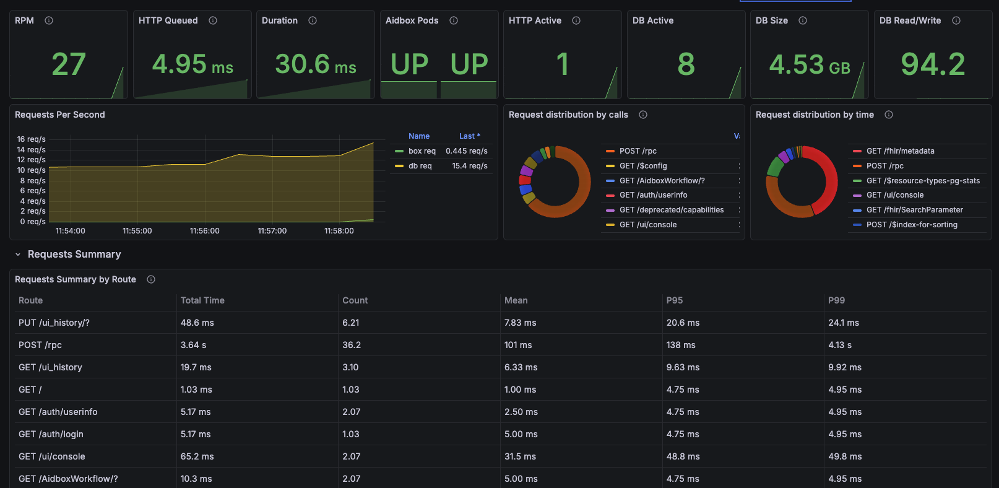

# Run Aidbox with OpenTelemetry locally

## Intro

This guide helps you to launch and explore the Aidbox observability features locally.

It introduces you to:

* The Aidbox installation process with Docker & Docker Compose,
* Logs & metrics & traces exporting to Elasticsearch & Prometheus & Zipkin using OpenTelemetry collector service.

<figure><figcaption></figcaption></figure>




Please **make sure** that both [Docker & Docker Compose](https://docs.docker.com/engine/install/) are installed.


### Prerequisites

* [Docker](https://www.docker.com/)
* Cloned repository: [Github: Aidbox/examples](https://github.com/Aidbox/examples/tree/main)
* Working directory: `OpenTelemetry`

To clone the repository and navigate to the `OpenTelemetry` directory, run:

```sh
git clone git@github.com:Aidbox/examples.git && cd examples/OpenTelemetry
```

### 1. Start Aidbox and demo components with Docker Compose

```shell
docker compose up --force-recreate
```

Wait until all components are pulled and started.

### 2. Activate Aidbox

Open Aidbox on [http://localhost:8080](http://localhost:8080) address, activate it, and login with `admin`/`password` credentials

### 3. Discover Aidbox logs with Kibana

Kibana should be available on [http://localhost:5602](http://localhost:5602) address. To see logs in Kibana we should

* make sure that logs are coming to Elasticsearch and then
* create a data view to observe over logs.

Go to [Index Management](http://localhost:5602/app/management/data/index_management/indices) page in Kibana (Menu → Stack Management → Index Management). You should see `aidbox_logs` index there.

<figure><figcaption><p>Index management page</p></figcaption></figure>

Then we should go to [Data Views](http://localhost:5602/app/management/kibana/dataViews) page (Menu → Stack Management → Data Views) and create a data view there.

<figure><figcaption><p>Data view creation</p></figcaption></figure>

Then go to [Discover](http://localhost:5602/app/discover) page (Menu → Discover) and observe your logs.

<figure><figcaption><p>Log discover page</p></figcaption></figure>

### 4. Discover Aidbox metrics with Grafana

To visualize Aidbox metrics, import the [Aidbox Metrics Dashboard](https://grafana.com/grafana/dashboards/24752-aidbox/) from Grafana Dashboards. Navigate to `Dashboards` and click `New` -> `Import`. Enter the dashboard ID `24752` and click `Load`. Then select the Prometheus data source and click `Import`.

<figure><figcaption><p>Aidbox Metrics Dashboard</p></figcaption></figure>

### 5. Discover Aidbox traces with Zipkin

Zipkin should be available on [http://localhost:9411/](http://localhost:9411/zipkin/) address. To see traces in Zipkin click the `Run query` button.

<figure><figcaption><p>Traces list in Zipkin</p></figcaption></figure>

Click the `Show` button to see all spans of a certain request.

<figure><figcaption><p>Trace view in Zipkin</p></figcaption></figure>
