# Export logs to Datadog tutorial

## Set up Datadog API Key

You need to enable Datadog Logs API and create an API Key

To create a new API key go to [Datadog](https://app.datadoghq.com/) then go to Integrations -> APIs:

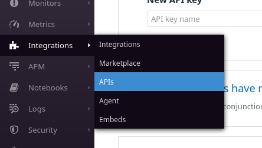

Click API Keys

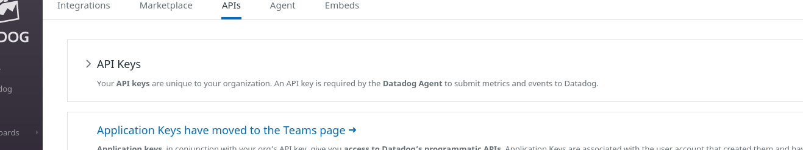

Enter the name of the new key and click Create API Key

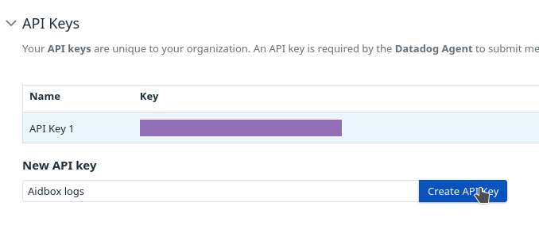

Copy the newly generated key

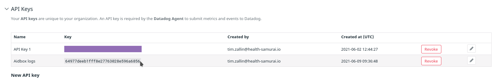

## Configure Aidbox

Set the `AIDBOX_DD_API_KEY` environment variable to the Datadog API Key.

For example, if you are using Docker Compose, add the variable to the environment section:

```yaml
aidbox:
  # ...
  environment:
    # ...
    AIDBOX_DD_API_KEY: 64977deeb1fff8e27763028e596a6856
```

## Configure Datadog

Go to Logs -> Configuration


Click edit on Preprocessing for JSON logs


Set the attributes

| Name                | Value   |
| ------------------- | ------- |
| Date attribute      | ts      |
| Service attributes  | tn      |
| Status attributes   | lvl     |
| Trace Id attributes | ctx     |
| Message attributes  | msg,err |


Now add a facet for the event.

Go to logs then click add on the left

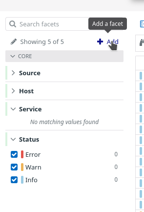

Use `@ev` path for the new facet

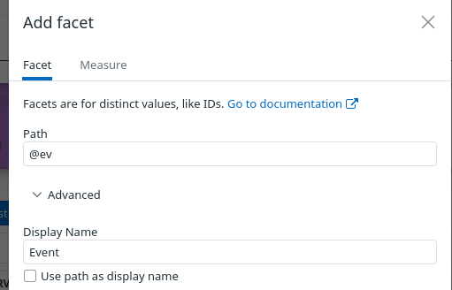

In this guide, we will add a metric for authorization failures

Go to Logs -> Generate Metrics


Click Add a new metric

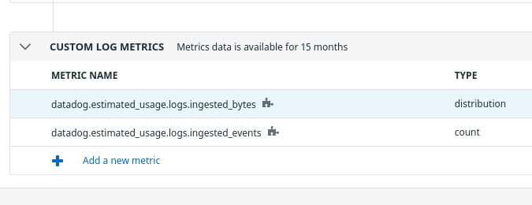

Define a query for the `auth/authorize-failed` event

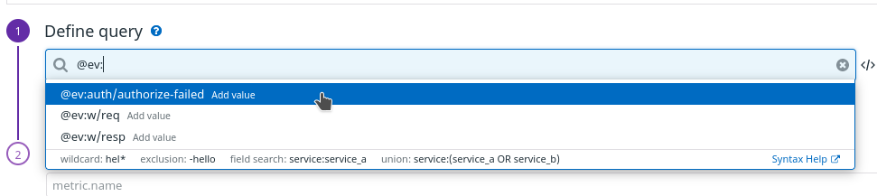

Enter the name for the new metric and click Create metric

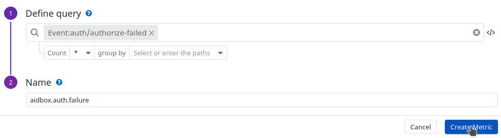

Now we can see our metric in the Metrics Explorer

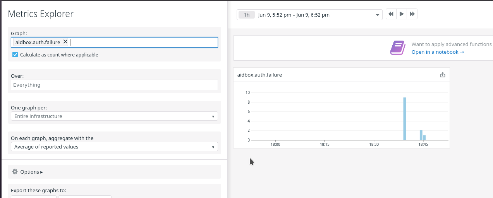

And we can define monitoring to alert if there are too many authorization failures. To do this navigate to Monitors -> New Monitor

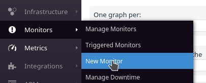

Select monitor type "metric"

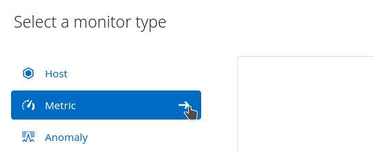

Set up monitoring options

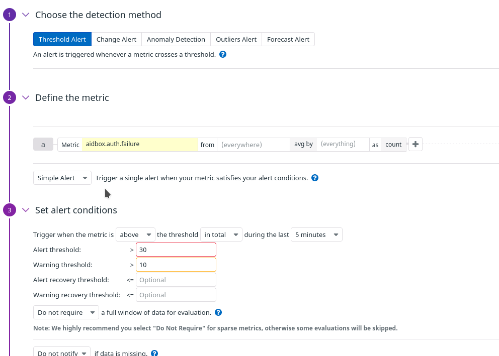

And notifications


Now we can see our monitor on the Monitor page

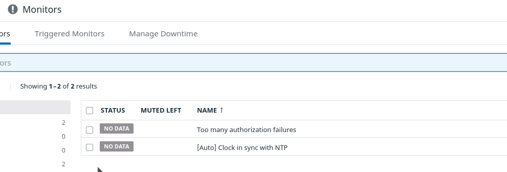

It takes some time for Datadog to set up the monitor. After a while, it will become green


And when there are too many authorization failures in a short period of time, it changes the status to warning

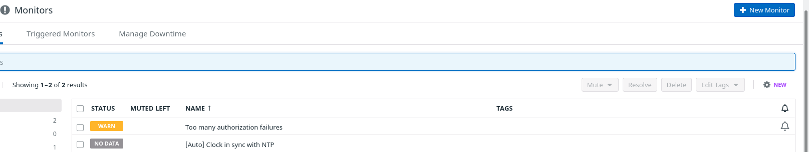

Then when it hits the threshold, the alert is created

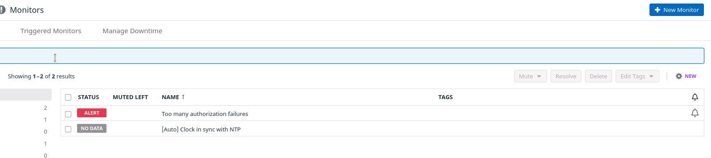

On the Monitor page, you can see statistics

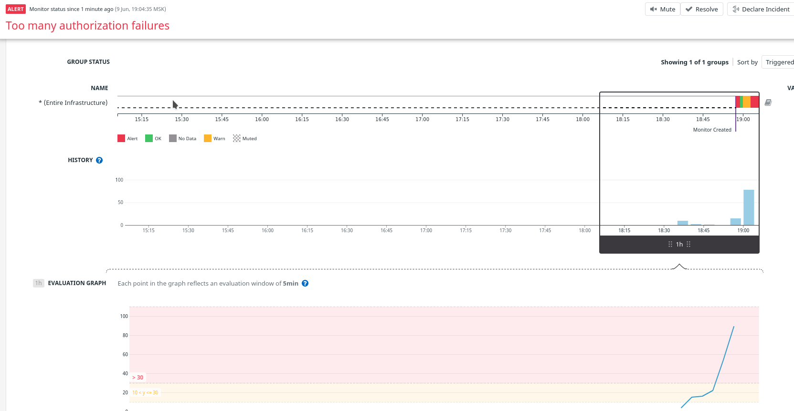


By default Aidbox sends logs as bundles of multiple records so if there's not enough data **you won't see any logs in Datadog**. For testing purposes reduce bundle size to 1 record by setting environment variable:

AIDBOX\_DD\_BATCH\_SIZE=1

