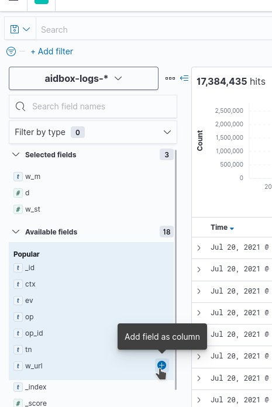

# Log analysis and visualization tutorial

## Update Docker Image


This feature is available since 2107 Aidbox version


To begin using pre-configured Kibana and Grafana please clone [this repository](https://github.com/Aidbox/devbox) and execute `make up` operation in your shell.

## **Explore logs with Kibana**

To use Kibana you need to understand Aidbox log formatting first. Go to Aidbox [log documentation](../README.md) to find logs schema available here with a brief attribute description.

```bash
git clone https://github.com/Aidbox/devbox.git
cd devbox
make up
```

## **Explore logs with Kibana**

To get a deeper understanding of Aidbox logs please go to the [log documentation](../README.md) and explore logs schema available there.


Aidbox Elastic appender sends logs as bundles of multiple records so if there's not enough data **you won't see any logs in Kibana**. For testing purposes reduce bundle size to 1 record by setting environment variable:

```yaml
AIDBOX_ES_BATCH_SIZE=1
```

Aidbox Elastic appender documentation is available [here](../how-to-guides/elastic-logs-and-monitoring-integration.md#elasticsearch-logging).


Using the listed attributes helps you to read REST logs in Elastic search filtering them type by type.

The example below will help you read REST API logs:

Please put + to toggle `Time`, `w_m`, `w_r`_,_`w_url`, `d`, `w_st`, `w_uid` fields into the document table:



Now you can browse and explore REST API logs


_Kibana's **Discover** enables you to quickly search and filter your data, get information about the structure of the fields, and visualize your data with **Lens** and **Maps**. You can customize and save your searches and place them on a dashboard._

Check [Kibana documentation](https://www.elastic.co/guide/en/kibana/current/discover.html) for additional info or [let us know](https://t.me/aidbox) if you need help.

## **Visualize logs with Grafana**

We've built a custom Grafana dashboard available by default where you can see basic metrics.

The pre-configured views are the following:

1. Requests per minute.
2. Request duration heatmap.
3. Number of requests per day.
4. Request Methods.
5. Errors.
6. Mean request http/db.
7. Response time.
8. Slow queries.
9. Users/Clients online.


You can update the default dashboard with your own custom views. For more info please refer to [Grafana documentation](https://grafana.com/tutorials/grafana-fundamentals/).

If you have any questions, requests, or want to share your best practices using Kibana and Grafana feel free to contact us via [Aidbox user chat.](https://t.me/aidbox)
