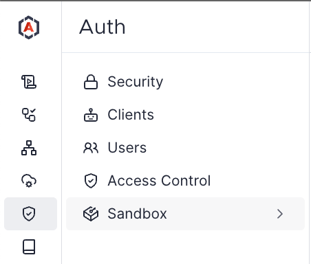
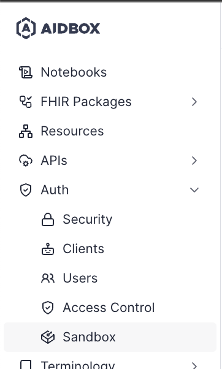

# Authentication Flows

[Aidbox](https://www.health-samurai.io/aidbox) is coming with the built-in auth module with out of the box:

* OAuth 2.0 and OpenID Connect Auth server implementation
* Sign Up/Sign In workflows with email or phone number
* Sign In using user password or external Auth Providers (like Google, Facebook, Auth0 etc)
* SCIM User and Group management module
* Access by JWT for Aidbox as a resource server

## How to choose your flow?

### API Consumer

If you have backend service or periodical job that wants to interact with Aidbox API, you can use session-less [Basic Auth](basic-auth.md), Client Credentials Grant (OAuth) or Access by JWT.

### Web Application

If you want to work with Aidbox from a web application or implement Single Sign-On using Aidbox as Identity Server, consider Authorization Code Grant or Access by JWT.

### Single Page Application

For SPA you can use Implicit Grant, Authorization Code Grant without secret or Access by JWT.

### Mobile and Desktop Application

For mobile and desktop application the simplest option is Resource Owner Credentials.

## Auth Sandbox

Aidbox comes with Auth Sandbox - a small app that helps you configure and test all features of Auth module in Aidbox. Click the Auth Sandbox link in Aidbox UI navigation menu:


This sidebar has been refactored in new Aidbox UI. To enable new UI, go to "Settings" -> "New UI"


<figure><figcaption>
Auth Sandbox new UI
</figcaption></figure> <figure><figcaption>
Auth Sandbox old UI
</figcaption></figure>

