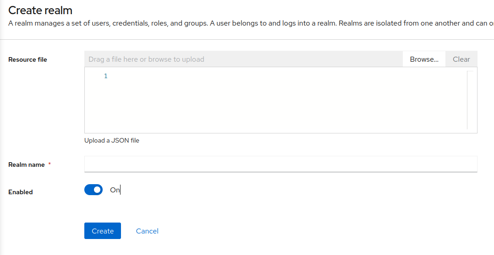
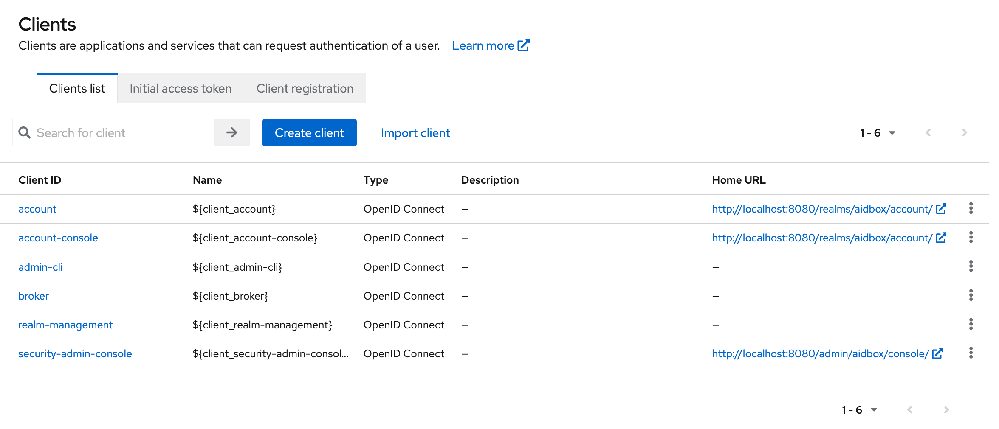

# Keycloak

## Create a realm

*   Click on the dropdown in the top-left corner where it says `Master`, then click on `Create Realm`\\

    <figure><figcaption></figcaption></figure>
*   Pul the name of your realm to the `Realm name` input

    <figure><figcaption></figcaption></figure>

## Create a client

* Click the `Clients` menu item in the left sidebar

<figure><figcaption></figcaption></figure>

*   Then click the `Create client` button\\

    <figure><figcaption></figcaption></figure>
*   Enter the client data\\

    <figure><figcaption></figcaption></figure>
*   Check the `Client authentication` checkbox\\

    <figure><figcaption></figcaption></figure>
*   Add `<aidbox-url>/auth/callback/keycloak` to `Valid redirect URIs` field.\\

    <figure><figcaption></figcaption></figure>

## Create IdentityProvider in Aidbox

* Open REST console in AidboxUI and create IdentityProvider resource

```yaml
POST /IdentityProvider

scopes:
  - profile
  - openid
system: keycloak
authorize_endpoint: <keycloak-url>/realms/<your-realm>/protocol/openid-connect/auth
token_endpoint: <keycloak-url>/realms/<your-realm>/protocol/openid-connect/token
userinfo_endpoint: <keycloak-url>/realms/<your-realm>/protocol/openid-connect/userinfo
userinfo-source: id-token | userinfo-endpoint
client:
  id: <your client id>
  secret: <your client secret>
resourceType: IdentityProvider
title: Keycloak
active: true
id: keycloak
```

You can find client secret on `Clients details` page under `Credentials` tab

<figure><figcaption></figcaption></figure>

## Login into Aidbox

Go to your Aidbox base URL, you will be redirected to the login page - you should see **"Log in with Keycloak"** button. Press this button and log in with Keycloak user into aidbox. This user will be logged into Aidbox Console, but without any permissions. Read more in [Access Control Section](../security/README.md) about permissions.
