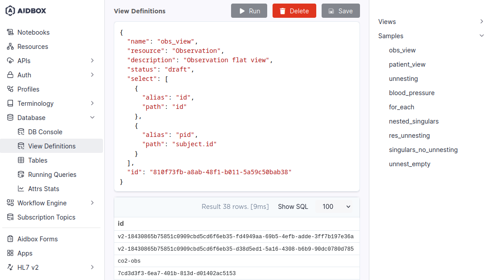

# Defining flat views with view definitions

SQL on FHIR utilizes ViewDefinition resources to describe the structure of flat views. A simple ViewDefinition may look like this:

```json
{
  "resourceType": "ViewDefinition",
  "select": [
    {
      "column": [
        {
          "path": "getResourceKey()",
          "name": "id"
        },
        {
          "path": "gender",
          "name": "gender"
        }
      ]
    },
    {
      "column": [
        {
          "path": "given.join(' ')",
          "name": "given_name",
          "description": "A single given name field with all names joined together."
        },
        {
          "path": "family",
          "name": "family_name"
        }
      ],
      "forEach": "name.where(use = 'official').first()"
    }
  ],
  "name": "patient_demographics",
  "status": "draft",
  "resource": "Patient"
}
```

The view is described with its name, resource type, status, and the declaration of the rows it contains. In this example, we define a flat view named `obs_view` for Observations, that will have 2 fields: `id`, defined as the Observation's id, and `pid`, defined as the subject Patient's id.

This example only scratches the surface. For more complex examples, see [query-data-from-flat-views.md](query-data-from-flat-views.md).

For an in-depth overview of ViewDefinition's structure consult [reference](reference.md).

## Creating flat views

### With Aidbox UI

To create a flat view of the resource, you have to define it with a special resource called ViewDefinition. You can do it with a View Definitions editor in Aidbox UI.

<figure><figcaption><p>View Definitions editor</p></figcaption></figure>

View definitions you've created can be viewed in a menu in the right part of the screen. There also are several samples to get you started. Note that samples are presented as View Definitions only and have no corresponding views in the database by default.

You can use the _Run_ button or `Ctrl+Enter` to preview your view. To save a View Definition and materialize it as a view in the database, press _Save_. _The delete_ button deletes both a View Definition and the corresponding view in the database.

Note that a ViewDefinition resource used in Aidbox may differ from [SQL on FHIR specification](https://build.fhir.org/ig/FHIR/sql-on-fhir-v2/StructureDefinition-ViewDefinition.html). To see how Aidbox's ViewDefinition is structured, consult the [reference.md](reference.md) page.

### With REST API

As ViewDefinition is a resource, it can be created via REST API. For example:



```yaml
POST /ViewDefinition/

name: patient_view
resource: Patient
description: Patient flat view
status: draft
select:
- column:
  - name: id
    path: id
  - name: bod
    path: birthDate
  - name: gender
    path: gender

```



```yaml
name: patient_view
select:
  - column:
    - path: id
      name: id
    - path: birthDate
      name: bod
    - path: gender
      name: gender
status: draft
resource: Patient
description: Patient flat view
id: >-
  30d1cf2a-6610-4887-9fc2-fbd425837d4e
resourceType: ViewDefinition
```



This step creates a ViewDefinition resource. To materialize it as a database view, table, or materialized view, use the [`$materialize` operation](operation-materialize.md). Creating a ViewDefinition via REST API does not automatically create database objects.

### With ViewDefinition Builder

Feel free to try our **ViewDefinition Builder** here: [https://sqlonfhir.aidbox.app](https://sqlonfhir.aidbox.app/).

Features:

* Visual builder: easy to create ViewDefinition in form;
* Auto-complete: FHIRPath suggestions support;
* Aidbox Portal integration: play with your data in the sandbox, interactively see the result of ViewDefinition;
* Local Aidbox integration: pass URL and headers to send requests to local Aidbox

<figure><figcaption><p>ViewDefinition Builder: VD form, resource page, flat view</p></figcaption></figure>

<figure><figcaption><p>ViewDefinition Builder: VD code, resource schema page</p></figcaption></figure>

## Additional options

By default views you define are materialized as views in `sof` schema. You can alter this behavior by adding an extension.

```yaml
extension:
  - url: https://fhir.aidbox.app/fhir/Extension/view-definition
    extension:
      - url: materialization
        valueCode: table
      - url: schema
        valueString: public
```

In the example above, the view will be materialized as a table in a schema called `public`. Available materialization options are `table`, `materialized-view` and `view`.

If you create views via Aidbox UI, you can use the shorthand parameters `_materialization` and `_schema` instead, like this:

```json
{
    "_materialization": "table",
    "_schema": "public"
}
```

Note that these shorthands are not available for REST API.
