# Aidbox Topic-Based Subscriptions


This functionality is available in Aidbox versions 2409 and later and requires [FHIR Schema](../profiling-and-validation/fhir-schema-validator/) validation engine to be [enabled](../profiling-and-validation/fhir-schema-validator/).


### Overview

This feature enables dynamic subscriptions to changes in FHIR resources, allowing users/systems to receive notifications through multiple channels, including Kafka.


**Looking for FHIR-standard Subscriptions?** If you need external systems or clients to create their own subscriptions using standard FHIR `Subscription` resources, see [FHIR Topic-Based Subscriptions](fhir-topic-based-subscriptions.md). FHIR Topic-Based Subscriptions are built on top of the mechanism described on this page. Aidbox Topic Destinations are best for server-side integrations managed by administrators.


<figure><figcaption></figcaption></figure>

For an application example, refer to [Aidbox Subscriptions & Kafka AidboxTopicDestination](https://github.com/Aidbox/examples/tree/main/aidbox-features/aidbox-subscriptions-to-kafka)

## Key Components

* **`AidboxSubscriptionTopic`** is a custom Aidbox resource modeled after the [FHIR R6 SubscriptionTopic](https://build.fhir.org/subscriptiontopic.html) resource. The resource allows defining a set of events that clients can subscribe to, such as changes in specific resources.
* **`AidboxTopicDestination`** is a custom Aidbox resource that defines where and how the notifications triggered by an `AidboxSubscriptionTopic` should be sent. This resource offers flexibility in specifying various types of destinations. And is considered as a system configuration resource.
* **`AidboxSubscriptionStatus`** is a custom Aidbox resource which describes the notifications: what messages stored in the bundle, source and destination.

## AidboxSubscriptionTopic

The `AidboxSubscriptionTopic` resource describes the data sources for subscriptions. It allows clients to subscribe to events in Aidbox and filter them using user-defined triggers, which are specified by the `trigger` element. Supported properties:

<table data-full-width="false"><thead><tr><th width="257">Property</th><th width="91">Type</th><th>Description</th></tr></thead><tbody><tr><td><code>resource</code> *</td><td>uri</td><td>Resource (reference to definition) for this trigger definition. It is binding to <a href="https://www.hl7.org/fhir/valueset-all-resource-types.html">All Resource Types</a>.</td></tr><tr><td><code>supportedInteraction</code></td><td>code</td><td>create | update | delete</td></tr><tr><td><code>fhirPathCriteria</code></td><td>string</td><td>FHIRPath based trigger rule. FHIRPath criteria are evaluated only within the context of the current resource. Supports <code>%current</code> and <code>%previous</code> variables for comparing resource states during updates.</td></tr><tr><td><code>description</code></td><td>string</td><td>Text representation of the event trigger.</td></tr></tbody></table>

\* required.

#### Create `AidboxSubscriptionTopic` resource

```json
POST /fhir/AidboxSubscriptionTopic
content-type: application/json
accept: application/json

{
  "resourceType": "AidboxSubscriptionTopic",
  "url": "http://example.org/FHIR/R5/SubscriptionTopic/QuestionnaireResponse-topic",
  "status": "active",
  "trigger": [
    {
      "resource": "QuestionnaireResponse",
      "fhirPathCriteria": "status = 'completed' or status = 'amended'"
    }
  ]
}
```

## AidboxTopicDestination

The `AidboxTopicDestination` resource is used to define channel configurations for processing subscription data.

#### Create a TopicDestination

To start processing subscription data, create a `AidboxTopicDestination` resource with a reference to the `AidboxSubscriptionTopic`. Examples of `AidboxTopicDestination` resources can be found in sub-sections.

#### Stop subscription data processing

To stop processing subscription data, delete the `AidboxTopicDestination` resource.

#### AidboxTopicDestination Profile

Ensure that the resource metadata contains the kind-specific `AidboxTopicDestination` profile.

#### **Elements**

<table data-full-width="false"><thead><tr><th width="188">Property</th><th width="128">Type</th><th>Description</th></tr></thead><tbody><tr><td><code>status</code></td><td>code</td><td><code>active</code> - the only possible value for now. Expected to be expanded.</td></tr><tr><td><code>topic</code> *</td><td>string</td><td>Url of <code>AidboxSubscriptionTopic</code> resource.</td></tr><tr><td><code>kind</code> *</td><td>code</td><td>Defines the destination for sending notifications. Supported values: <code>kafka-at-least-once</code>, <code>kafka-best-effort</code>, <code>webhook-at-least-once</code>, <code>gcp-pubsub-at-least-once</code></td></tr><tr><td><code>parameter</code> *</td><td><a href="https://www.hl7.org/fhir/parameters.html">FHIR parameters</a></td><td>Defines the destination parameters for sending notifications. Parameters are restricted by profiles for each destination.</td></tr><tr><td><code>content</code></td><td><a href="https://hl7.org/fhir/valueset-subscription-payload-content.html">Subscription payload content</a></td><td><p><code>full-resource</code> | <code>id-only</code> | <code>empty</code><br></p><p><code>full-resource</code> is the default value.</p></td></tr></tbody></table>

\* required.

## Organization-based hierarchical filtering


Organization-based hierarchical filtering is available starting from version 2509.


Both `AidboxSubscriptionTopic` and `AidboxTopicDestination` support [organization-based hierarchical access control](../../access-control/authorization/scoped-api/organization-based-hierarchical-access-control.md).

### How it works

The filtering mechanism uses organization extensions and works as consecutive filters:

1.  **Use organization extension**:

    In organizational-based access control, both events (resources) and subscription resources (`AidboxSubscriptionTopic` and `AidboxTopicDestination`) are automatically marked with [organization extensions](../../access-control/authorization/scoped-api/organization-based-hierarchical-access-control.md#try-org-bac) when created through organization-specific APIs (`/Organization/<org-id>/fhir/...`).
2. **Consecutive filtering**: The filters work in sequence - first the topic filter is applied, then the destination filter.
3. **Resources without organization extension**: If topic/destination resources are created without organization extension, they completely ignore organization information and work as before. All events will be caught by the topic if triggered (regardless of whether the event has organization extension or not).
4. **Resources with organization extension**:
   * **Events without organization extension**: Will always be skipped
   * **Events with organization extension**:
     * ✅ **Caught**: If the event organization is under or equal to the topic/destination organization in the hierarchy
     * ❌ **Skipped**: If the event organization is above or unrelated to the topic/destination organization

### Examples

#### Example 1: Organization hierarchy with event filtering

Consider an organization structure where `Organization B` is part of `Organization A`. The diagram below shows how events flow through the subscription system with hierarchical filtering:

```mermaid
graph TD

    %% Org hierarchy
    subgraph OrgHierarchy ["Organization Hierarchy"]
        OrgA("Organization A<br/>(Parent)"):::violet1
        OrgB("Organization B<br/>(Child of Org A)"):::blue1
        OrgA --> OrgB
    end

    %% Event from Org A
    subgraph FlowA ["Event from Org A Flow"]
        direction LR
        EventA("📋 Event from Org A"):::violet1
        TopicAA("AidboxSubscriptionTopic<br/>(related to Org A)"):::red1
        DestBA("AidboxTopicDestination<br/>(related to Org B)"):::red1
        ExternalDestBA("Kafka"):::green1

        EventA --> TopicAA
        TopicAA -->|✅ Forward| DestBA
        DestBA -->|❌ Filtered out| ExternalDestBA
    end

    %% Event from Org B
    subgraph FlowB ["Event from Org B Flow"]
        direction LR
        EventB("📋 Event from Org B"):::blue1
        TopicAB("AidboxSubscriptionTopic<br/>(related to Org A)"):::red1
        DestBB("AidboxTopicDestination<br/>(related to Org B)"):::red1
        ExternalDestBB("Kafka"):::green1

        EventB --> TopicAB
        TopicAB -->|✅ Forward| DestBB
        DestBB -->|✅ Forward| ExternalDestBB
    end

    %% invisible ordering links
    OrgHierarchy -.-> FlowA
    FlowA -.-> FlowB

    %% make the links invisible
    linkStyle 7,8 opacity:0;

```



**Filtering behavior:**

* ✅ **Event from Org A**: Processed by the topic (same organization) but filtered out at the aidbox topic destination level
* ✅ **Event from Org B**: Processed by the topic (child organization) and forwarded to destination at the aidbox topic destination level
* ❌ **Event from unrelated organization**: Would be filtered out at the subscription topic level

#### Example 2: Filtering at the destination level only

Consider an organization structure which two organizations `Organization A` and `Organization B`. The diagram below shows how events flow through the subscription system when filtering is applied at the destination level only:

```mermaid
graph TD

    %% Org hierarchy
    subgraph OrgHierarchy ["Organization Hierarchy"]
        OrgA("Organization A"):::violet1
        OrgB("Organization B"):::blue1
    end

    %% Event from Org A
    subgraph FlowA ["Event from Org A Flow"]
        direction LR
        EventA("📋 Event from Org A"):::violet1
        TopicAA("AidboxSubscriptionTopic"):::red1
        DestBA("AidboxTopicDestination<br/>(related to Org A)"):::red1
        ExternalDestBA("Kafka"):::green1

        EventA --> TopicAA
        TopicAA -->|✅ Forward| DestBA
        DestBA -->|✅ Forward| ExternalDestBA
    end

    %% Event from Org B
    subgraph FlowB ["Event from Org B Flow"]
        direction LR
        EventB("📋 Event from Org B"):::blue1
        TopicAB("AidboxSubscriptionTopic"):::red1
        DestBB("AidboxTopicDestination<br/>(related to Org A)"):::red1
        ExternalDestBB("Kafka"):::green1

        EventB --> TopicAB
        TopicAB -->|✅ Forward| DestBB
        DestBB -->|❌ Filtered out| ExternalDestBB

    end

    %% invisible ordering links
    OrgHierarchy -.-> FlowA
    FlowA -.-> FlowB

    %% make the links invisible
    linkStyle 6,7 opacity:0;

```



**Filtering behavior:**

* ✅ **Event from Org A**: Processed by the topic (no filtering) and forwarded to aidbox topic destination
* ✅ **Event from Org B**: Processed by the topic (no filtering) but filtered out at the aidbox topic destination level
* ❌ **Event from unrelated organization**: Would be filtered out at the aidbox topic destination level

## Currently supported channels


[webhook-aidboxtopicdestination.md](../../tutorials/subscriptions-tutorials/webhook-aidboxtopicdestination.md)



[gcp-pub-sub-aidboxtopicdestination.md](../../tutorials/subscriptions-tutorials/gcp-pub-sub-aidboxtopicdestination.md)



[kafka-aidboxtopicdestination.md](../../tutorials/subscriptions-tutorials/kafka-aidboxtopicdestination.md)



[clickhouse-aidboxtopicdestination.md](../../tutorials/subscriptions-tutorials/clickhouse-aidboxtopicdestination.md)



[aidboxtopicsubscription-nats-tutorial.md](../../tutorials/subscriptions-tutorials/aidboxtopicsubscription-nats-tutorial.md)



[rabbitmq-tutorial.md](../../tutorials/subscriptions-tutorials/rabbitmq-tutorial.md)



[activemq-tutorial.md](../../tutorials/subscriptions-tutorials/activemq-tutorial.md)



[aws-eventbridge-aidboxtopicdestination.md](../../tutorials/subscriptions-tutorials/aws-eventbridge-aidboxtopicdestination.md)


## Notification Shape

Notification is a [FHIR Bundle](https://build.fhir.org/bundle.html) resource with `history` type, containing relevant resources in its entries. The first entry is a `AidboxSubscriptionStatus` resource, which describes the payload.\
The other entries depend on `AidboxTopicDestination` `content` parameter. This parameter is the binding to the FHIR [subscription-payload-content](https://hl7.org/fhir/valueset-subscription-payload-content.html) value set: `full-resource` | `id-only` | `empty`



```json
{
  "resourceType":"Bundle",
  "type":"history",
  "timestamp":"2024-10-03T10:07:55Z",
  "entry":[
    {
      "resource":{
        "resourceType":"AidboxSubscriptionStatus",
        "status":"active",
        "type":"event-notification",
        "notificationEvent":[
          {
            "eventNumber":1,
            "focus":{
              "reference":"QuestionnaireResponse/458e771c-0ff1-4858-ac07-93b7a10c8e3b"
            }
          }
        ],
        "topic":"http://example.org/FHIR/R5/SubscriptionTopic/QuestionnaireResponse-topic",
        "topic-destination":{
          "reference":"AidboxTopicDestination/kafka-destination"
        }
      }
    },
    {
      "resource":{
        "id":"458e771c-0ff1-4858-ac07-93b7a10c8e3b",
        "item":[
          {
            "text":"Leishmania sp 14kD IgG Ser Ql IB",
            "answer":[
              {
                "valueString":"123"
              }
            ],
            "linkId":"128852"
          },
          {
            "text":"Leishmania sp 16kD IgG Ser Ql IB",
            "answer":[
              {
                "valueString":"432"
              }
            ],
            "linkId":"128851"
          }
        ],
        "meta":{
          "lastUpdated":"2024-10-03T10:07:55.843374Z",
          "versionId":"1970",
          "extension":[
            {
              "url":"ex:createdAt",
              "valueInstant":"2024-10-03T10:07:42.342731Z"
            }
          ]
        },
        "author":{
          "identifier":{
            "type":{
              "coding":[
                {
                  "code":"UID",
                  "system":"urn:system:aidbox",
                  "display":"User ID"
                }
              ]
            },
            "value":"admin",
            "system":"http://localhost:8765"
          }
        },
        "status":"completed",
        "authored":"2024-10-03T10:07:55.664Z",
        "resourceType":"QuestionnaireResponse",
        "questionnaire":"http://loinc.org/q/100109-8"
      },
      "fullUrl": "http://aidbox-server/fhir/QuestionnaireResponse/458e771c-0ff1-4858-ac07-93b7a10c8e3b",
      "request":{
        "method":"POST",
        "url":"/fhir/QuestionnaireResponse"
      }
    }
  ]
}
```



```json
{
  "resourceType":"Bundle",
  "type":"history",
  "timestamp":"2024-10-03T10:07:55Z",
  "entry":[
    {
      "resource":{
        "resourceType":"AidboxSubscriptionStatus",
        "status":"active",
        "type":"event-notification",
        "notificationEvent":[
          {
            "eventNumber":1,
            "focus":{
              "reference":"QuestionnaireResponse/458e771c-0ff1-4858-ac07-93b7a10c8e3b"
            }
          }
        ],
        "topic":"http://example.org/FHIR/R5/SubscriptionTopic/QuestionnaireResponse-topic",
        "topic-destination":{
          "reference":"AidboxTopicDestination/kafka-destination"
        }
      }
    },
    {
      "fullUrl": "http://aidbox-server/fhir/QuestionnaireResponse/458e771c-0ff1-4858-ac07-93b7a10c8e3b",
      "request":{
        "method":"POST",
        "url":"/fhir/QuestionnaireResponse"
      }
    }
  ]
}
```



```json
{
  "resourceType":"Bundle",
  "type":"history",
  "timestamp":"2024-10-03T10:07:55Z",
  "entry":[
    {
      "resource":{
        "resourceType":"AidboxSubscriptionStatus",
        "status":"active",
        "type":"event-notification",
        "notificationEvent":[
          {
            "eventNumber":1,
            "focus":{
              "reference":"QuestionnaireResponse/458e771c-0ff1-4858-ac07-93b7a10c8e3b"
            }
          }
        ],
        "topic":"http://example.org/FHIR/R5/SubscriptionTopic/QuestionnaireResponse-topic",
        "topic-destination":{
          "reference":"AidboxTopicDestination/kafka-destination"
        }
      }
    }
  ]
}
```


