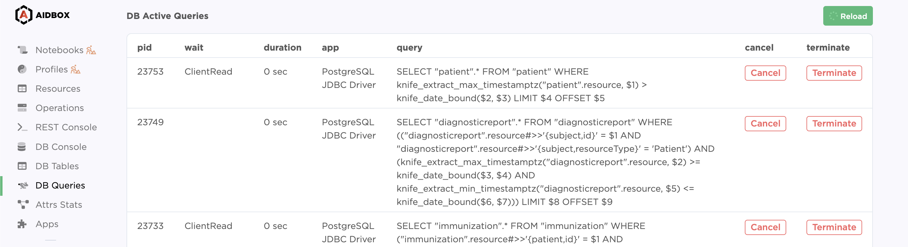

# DB Queries


Please start [a discussion](https://github.com/Aidbox/Issues/discussions) or [contact](../contact-us.md) us if you have questions, feedback, or suggestions.


DB Queries provides info on running queries and helps to detect slow queries and terminate them if you need.

