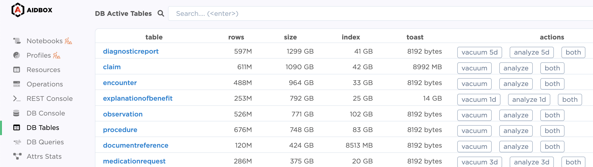
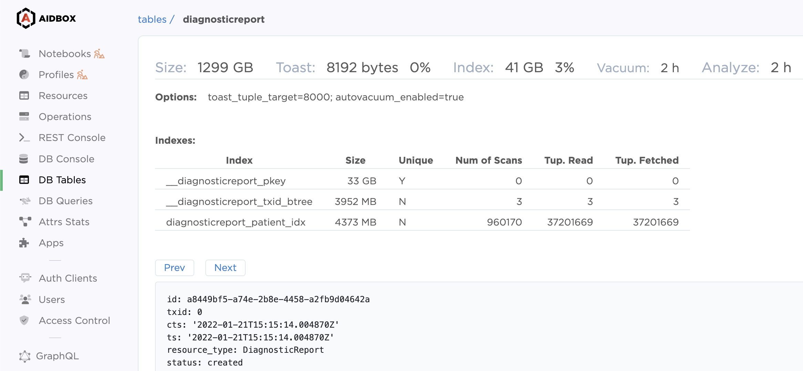

# DB Tables


Please start [a discussion](https://github.com/Aidbox/Issues/discussions) or [contact](../contact-us.md) us if you have questions, feedback, or suggestions.


DB Tables provides info on the existing tables in the database and the following table attributes:

* table name
* number of rows
* size
* index size
* toast
* last autovacuum
* last vacuum
* last autoanalyze
* last analyze

Table names are active links to extended info about the table:

* disk usage
* indexes
* resource example

