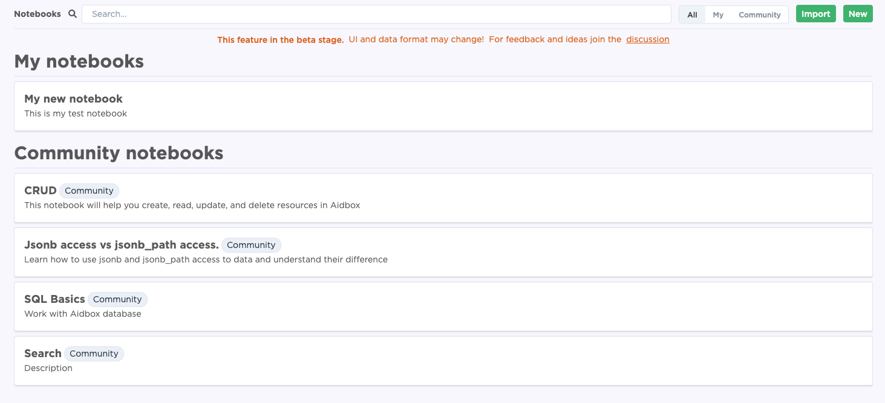

# Release Notes

## August 2025 _`edge`_

## July 2025 _`latest, 2507, LTS`_

* Aidbox FHIR server
  * Support for delegating read-only workload to the[ database read-only replica.](../database/overview.md#postgresql-with-read-only-replica)
  * Added an [AidboxTopicDestination](../modules/topic-based-subscriptions/wip-dynamic-subscriptiontopic-with-destinations/clickhouse-aidboxtopicdestination.md) to export a ViewDefinition to ClickHouse, enabling real-time analytics.
  * Implemented SQL-on-FHIR [$run](../modules/sql-on-fhir/operation-run.md) operation allowing direct querying of data through ViewDefinition resources.
  * Integrated a [new Terminology engine](../terminology/overview.md) that supports local terminology operations while delegating interactions with external code systems to an external Terminology Server.
  * Introduced `%previous` and `%current` functions for use in [AidboxSubscriptionTopic](../modules/topic-based-subscriptions/wip-dynamic-subscriptiontopic-with-destinations/#aidboxsubscriptiontopic) resources, allowing more precise tracking of changes between resource versions.
  * Aidbox UI improvements:
    * Added a Resource Versions page that allows users to view the full change history of a resource, including the ability to see differences between versions.
    * Improved global navigation for better usability.
    * Enhanced the Resource Summary page with the ability to view linked resources.
    * When editing a resource, users can now view its full structure.
    * Added the ability to reload the FHIR package
* Aidbox Forms
  * Implemented [AI assistance](../modules/aidbox-forms/aidbox-ui-builder-alpha/ai-assistant.md) in the Form Builder for creating and editing forms from text descriptions, with support for EnableWhen, calculation, and population logics.
  * Supported [item answer media](../modules/aidbox-forms/aidbox-ui-builder-alpha/form-creation/widgets.md#radio-button) for media accompaniments for specific answer options (used in radio button and checkbox list).
  * Supported [strict access control mode](../modules/aidbox-forms/access-control-in-forms.md#strict-access-control) to enforce explicit authorization for all backend resource accesses initiated by SDC proxy operations.
  * Embedded LHC and Smart form renderers in the [Aidbox public form builder](https://form-builder.aidbox.app/) to test how forms behave in different SDC renderers.
  * Added the ability to [hide the download button](../modules/aidbox-forms/aidbox-ui-builder-alpha/configuration.md) using the SDCConfig resource.
  * Supported quote, text indents in label's markdown
* Minor updates
  * `2506.1` - Fixed vulnerabilities
  * `2505.3` - Fixed vulnerabilities
  * `2410.8` - LTS support - fixed vulnerabilities
  * `2402-lts` - LTS support - fixed vulnerabilities
  * `2306-lts` - LTS support - fixed vulnerabilities

## June 2025 _`stable, 2506`_

* Aidbox FHIR server
  * Support for sending AuditEvents to the [external FHIR AuditRecord Repository](../access-control/audit-and-logging.md#external-audit-record-repository-support).
  * Updated behavior for development licenses that exceed the database size limit: the instance will now log a warning instead of shutting down.
  * Added the ability to use [FHIR Factory API](https://build.fhir.org/fhirpath.html#factory) in the FHIRPath engine.
  * Changes in the building of the `aidboxone` image: the latest LTS version of Java (21)  is used for building the application jar, and the latest version of Java (24) is used for running the application. Check the following [tutorial](../tutorials/other-tutorials/how-to-run-aidbox-using-different-java.md) to see how you can leverage this.
  * Improvements in the [AidboxSubscriptionTopics](../modules/topic-based-subscriptions/wip-dynamic-subscriptiontopic-with-destinations/) resource - removed unnecessary ValueSet bindings.
  * Supported multiple key types for the [TokenIntrospector resource](../reference/system-resources-reference/iam-module-resources.md#tokenintrospector).
  * Increased the maximum length for `base64Binary`  type to handle large files stored in the AIdbox database.
  * Multiple bug fixes and optimizations in the Resource Browser in Aidbox UI.
  * Fixed bug in generating Trace ID within integration with [OTEL collector](../modules/observability/).
  * Support for creating custom resources with logical resource profiles.
  * Added the ability to update or delete a custom StructureDefinition.
  * Improvements in license management functionality.
* Aidbox Forms
  * Supported the FHIRPath Factory API for populating a choice item with answerValueSet and other use cases. See the [How-to guide](../modules/aidbox-forms/aidbox-ui-builder-alpha/form-creation/how-to-guides/how-to-populate-forms-with-data.md#how-to-populate-items-with-factory-api) for more details.
  * Supported the [`answerExpression` feature ](../modules/aidbox-forms/aidbox-ui-builder-alpha/form-creation/widgets.md#choice)to dynamically fetch answerOptions via FHIRQuery or filter answerOptions using FHIRPath. See the [How-to guide](../modules/aidbox-forms/aidbox-ui-builder-alpha/form-creation/how-to-guides/how-to-use-answer-expression-into-forms.md) for more details.
  * Implemented the ability to add and edit [custom extensions](../modules/aidbox-forms/aidbox-ui-builder-alpha/form-creation/widgets.md#extensions) in the Form Builder.
  * Added the ability to[ download file attachments](../modules/aidbox-forms/aidbox-ui-builder-alpha/form-creation/widgets.md#attachment).
  * Added the ability to[ embed external services](../modules/aidbox-forms/aidbox-ui-builder-alpha/embedding.md#onpreviewattachment-show-attachments-with-external-editor) in the file preview.
  * Added the ability to [set the height of the web component](../modules/aidbox-forms/aidbox-ui-builder-alpha/embedding.md) dynamically.
  * Created the [How-to guide](../modules/aidbox-forms/aidbox-ui-builder-alpha/form-creation/how-to-guides/how-to-extract-data-from-forms.md#template-based-extraction) for template-based extraction.
* Minor updates
  * `2505.2` - Fixed vulnerabilities
  * `2505.1` - Minor UI improvements
  * `2504.2` - Fixed vulnerabilities
  * `2503.5` - Fixed vulnerabilities
  * `2502.7` - Fixed vulnerabilities
  * `2501.9` - Fixed vulnerabilities
  * `2412.5` - Fixed vulnerabilities
  * `2411.4` - Fixed vulnerabilities
  * `2410.7` - Fixed vulnerabilities
  * `2409.3` - Fixed vulnerabilities
  * `2408.3` - Fixed vulnerabilities
  * `2407.2` - Fixed vulnerabilities
  * `2405` - Fixed vulnerabilities

## May 2025 _`2505`_

* Aidbox FHIR server
  * Introduced [Aidbox MCP Server](../modules/other-modules/mcp.md) (early-access)
  * Supported FHIRPath `resolve()` function in [AidboxSubscriptionTopics](../modules/topic-based-subscriptions/wip-dynamic-subscriptiontopic-with-destinations/) `fhirPathCriteria` to specify triggers based on linked resources. For example, get only Encounters for specific patients in subscriptions.
  * Added an option to specify the default IdentityProvider in the Aidbox [Client resource](../reference/system-resources-reference/iam-module-resources.md#client) that will be used instead of the Aidbox login screen.
  * Introduced [AidboxTrigger](../modules/other-modules/aidbox-trigger.md) that enables automatic execution of SQL statements in response to FHIR resource operations.
  * Supported conditional references in [transaction bundles](../api/rest-api/bundle.md)
  * Optimized Aidbox startup time
  * Aidbox UI:
    * Dedicated resource page with user-friendly preview
    * Navigation breadcrumbs for faster context switching
  * Enhanced `.well-known/smart-configuration` endpoint
  * Enhanced Aidbox grant screen to show the list of scopes that are the intersection of the scopes requested by the SMART app and the scopes allowed to the Client.
  * Fixed bugs on Aidbox UI, resource validation, and incorrect handling of PUT operation in bundles.
* Aidbox Forms
  * Supported full functionality of [template-based extraction](../modules/aidbox-forms/aidbox-ui-builder-alpha/form-creation/form-settings.md#template-based-extraction) to extract QuestionnaireResponse into FHIR resources using predefined templates, with dynamic referencing between extracted resources and the template bundle extracted as a single resource.
  * Improved the [FHIRPath expression editor](../modules/aidbox-forms/aidbox-ui-builder-alpha/form-creation/fhirpath-editor.md) for calculation, enable-when, and population expressions: including basic patient demographic pre-filling (e.g., name, gender, DOB).
  * Added the ability to hide the form title when embedding as a web component.
  * Improved the Form Navigation Bar to display top-level groups when using a form with pages.
* **Minor updates**
  * `2504.1` - Forms enhancements
  * `2503.4` - Forms enhancements
  * `2410.5` - Fixed vulnerabilities
  * `2402-lts` - Fixed vulnerabilities
  * `2306-lts` - Fixed vulnerabilities

## April 2025 _`2504`_

* Aidbox FHIR server
  * Supported FHIR 6.0.0-ballot3 as a package in [Aidbox FHIR Package registry](../modules/profiling-and-validation/fhir-schema-validator/aidbox-fhir-igs-registry.md) and published a tutorial on [running Aidbox with FHIR 6.0.0-ballot3 locally and in the Aidbox sandbox](../tutorials/other-tutorials/run-aidbox-with-fhir-r6.md).
  * Migrated Aidbox system resources to the FHIR DomainResource model and [published reference documentation for system resources](../reference/system-resources-reference/).
  * Supported resolving conditional references in FHIR transaction Bundles.
  * Fixed validation of contained resources.
  * Fixed GraphQL schema generation to properly handle type definitions in the Aidbox system resources.
  * Removed DB Parameters from SQL Logs.
  * Added multiple UI fixes to FHIR packages and Resource browser sections in Aidbox UI
* Aidbox Forms
  * Supported [template-based extraction](../modules/aidbox-forms/aidbox-ui-builder-alpha/form-creation/form-settings.md#template-based-extraction) for transforming QuestionnaireResponses into FHIR resources using predefined templates (currently in preview)
  * Implemented [the FHIRPath expression editor](../modules/aidbox-forms/aidbox-ui-builder-alpha/form-creation/fhirpath-editor.md) for calculation, enable-when, and population expressions (currently in preview).
  * Supported FHIR 6.0.0
* Minor updates
  * `2503.3` - Fixed vulnerabilities and minor Forms issues
  * `2502.6` - Fixed vulnerabilities and minor Forms issues
  * `2501.8` - Fixed vulnerabilities and minor Forms issues
  * `2402-lts` - Fixed vulnerabilities

## March 2025 _`2503`_

* Aidbox FHIR server
  * Supported [FHIRPath patch](../api/rest-api/crud/patch.md#fhirpath-patch)
  * Supported [Apple](../tutorials/security-access-control-tutorials/apple.md) as an [external identity provider](../tutorials/security-access-control-tutorials/set-up-external-identity-provider.md)
  * Released `deprecated/capabilities`endpoint to detect deprectated zen and Entity/Atributes entities and updated the [migration guide](../tutorials/artifact-registry-tutorials/custom-resources/migrate-to-fhirschema/).
  * Implemented a 24-hour grace period for all Aidbox instances that cannot connect to the Aidbox portal for license verification. Also available in versions 2502, 2501, 2412, 2411, 2410, 2402, 2306, and 2302.
  * Supported [OTEL collector](../modules/observability/) configuration as an [Aidbox setting](../reference/settings/observability.md#otel). Updated [Aidbox example](https://github.com/Aidbox/examples/tree/main/OpenTelemetry) that shows how to launch and explore the Aidbox observability features (logs, traces, and metrics) locally.
  * Added new [AuditEvents](../access-control/audit-and-logging.md) for password changes and unsuccessful login attempts.
  * Added a synthetic data import progress bar on the Aidbox UI home page.
* Aidbox Forms
  * Added Wound Assessment Form and Risk Assessment Form to the public [Aidbox Form Gallery](https://form-builder.aidbox.app/), featuring coded fields, extraction, conditional logic, and calculations.
  * Optimized rendering for large forms for improved performance.
* SDK
  * Introduced [Type Schema](https://github.com/fhir-clj/type-schema), a JSON-based format that simplifies representation of FHIR entities (resources, provmitive types, etc) for simpler code generation.
  * Released [FHIR Schema Code Generator](https://github.com/fhir-schema/fhir-schema-codegen), which creates language-specific models from FHIR StructureDefinitions, allowing developers to use strongly-typed FHIR resources in TypeScript, C#, Python, and other languages.
* Minor updates
  * `2502.3` SDC minor updates
  * `2502.4` 24-hour license grace period, fix vulnerabilities
  * `2501.6` SDC minor updates
  * `2501.7` 24-hour license grace period, fix vulnerabilities
  * `2412.4` 24-hour license grace period, fix vulnerabilities
  * `2411.3` 24-hour license grace period, fix vulnerabilities
  * `2410.4` 24-hour license grace period, fix vulnerabilities
  * `2402-lts` 24-hour license grace period, fix vulnerabilities
  * `2306-lts` 24-hour license grace period, fix vulnerabilities
  * `2302-lts` 24-hour license grace period, fix vulnerabilities

## February 2025 _`2502`_

* Aidbox
  * Introduced [Settings](../configuration/settings.md)
  * Published [settings reference documentation](../reference/settings/)
* Aidbox Forms
  * PDF-Form conversion (enhancement): [Re-generation from PDF ](../modules/aidbox-forms/aidbox-ui-builder-alpha/import-questionnaire.md#common-functionality-across-all-scenarios)and insertion of a part of the form into an existing form
  * Added enabling of Print, Amend, and Save buttons in [SDCConfig](../modules/aidbox-forms/aidbox-ui-builder-alpha/configuration.md)
  * Added an [endpoint for generating a form from PDF](../reference/aidbox-forms-reference/generating-questionnaire-from-pdf-api.md)
  * Added support for systemversion in valuesets
  * Added an ability to [intercept requests](../modules/aidbox-forms/aidbox-ui-builder-alpha/embedding.md#step-4-optional-configure-requests-interception) made to the Aidbox server endpoints from Form Builder and Renderer when embedding as web-component
  * Supported [max decimal places](../modules/aidbox-forms/aidbox-ui-builder-alpha/form-creation/widgets.md#decimal)

Minor updates:

* 2501.1 — Minor bug fixes

## January 2025 _`2501`_


Aidbox is transitioning to the FHIR Schema engine. Existing zen and Entity/Attribute (EA) engines are deprecated and will be obsolete starting August 2025. July 2025 version will become LTS supporting zen and Entity/Attributes for 2 years.

[Read full announcement](https://www.health-samurai.io/news/aidbox-transitions-to-the-fhir-schema-engine)


* Aidbox
  * Enhanced UI Resource browser:
    * Added reference navigation for direct navigation between linked resources
    * Introduced resizable columns
    * Implemented pagination
    * Introduced resizable columns
    * Added column selection
  * Added support for specifying [Content Security Policy header as an environment variable](../reference/environment-variables/optional-environment-variables.md#content-security-policy). By default, Aidbox doesn't set CSP headers.
  * Supported [Bundle batch validation](../api/rest-api/bundle.md#validate-bundle) using Bundle/$validate endpoint for Aidbox instances using FHIR Schema validator
  * Changed default [stdout log level](../reference/environment-variables/optional-environment-variables.md#aidbox_stdout_json) and [stdout Google log level](../reference/environment-variables/optional-environment-variables.md#aidbox_stdout_google_json) to `warn`
* Aidbox Forms
  * Improved performance for handling large forms.
  * Added the ability to [set colors for tooltips and hover effects](../modules/aidbox-forms/aidbox-ui-builder-alpha/form-creation/form-customisation-in-theme-editor.md#how-to-create-a-new-theme) using the primary color in the Theme.
  * Enabled [linking a Questionnaire profile](../modules/aidbox-forms/aidbox-ui-builder-alpha/form-creation/form-settings.md#profiles) directly in the UI Builder.
  * Updated the [Aidbox Forms Smart Launch project](https://github.com/Aidbox/examples/tree/main/aidbox-forms-smart-launch-2) with enhancements and fixes.
  * Added [video support to the media section](../modules/aidbox-forms/aidbox-ui-builder-alpha/form-creation/widgets.md#media-section) of the item settings .
  * Supported [profiles and slices in definition-based extraction](https://build.fhir.org/ig/HL7/sdc/extraction.html#definition-based-extraction).

Minor updates:

* 2412.2 — Fixed security issues

## December 2024 _`2412`_

* Aidbox
  * Supported [SMART App Launch scopes v1 and v2](../modules/smartbox/) for Aidbox on FHIR Schema validation engine and reworked [SMART on FHIR](../modules/smartbox/) documentation
  * Added example of [SMART App Launch using Aidbox and Keycloak](https://github.com/Aidbox/examples/tree/main/smart-app-launch)
  * Supported enabling [OrgBAC (Organization-based hierarchical access control)](../access-control/authorization/scoped-api/organization-based-hierarchical-access-control.md) using an [environment variable](../tutorials/security-access-control-tutorials/how-to-enable-hierarchical-access-control.md) if an Aidox instance uses FHIR Schema validator
  * Fixed security issues and bugs
*   Aidbox Forms

    * Added the ability to store unstructured data from forms in external file storage systems.
    * Supported previewing audio, video, and PDF files in the attachment field.
    * Improved developer experience for FHIR path expressions with syntax highlighting, autocompletion, and error reporting.
    * Added an option to configure a custom redirect for the back button when embedding the Form Builder as a web component.
    * Added the ability to associate a link with a question, group, or display item to provide additional information.
    * Enabled short text for questions, groups, or items to display an alternate label when rendering on smaller devices like mobile phones.

    Minor updates:

    * 2412.1 — Fixed minor bugs

## November 2024 _`2411`_

* Aidbox
  * Introduced [Init Bundle](../configuration/init-bundle.md) as a simple and effective way of configuring Aidbox. The Init Bundle will replace Aidbox (zen) configuration projects.
  * Added [GCP Pub/Sub support](../modules/topic-based-subscriptions/wip-dynamic-subscriptiontopic-with-destinations/gcp-pub-sub-aidboxtopicdestination.md) for [Aidbox topic-based subscriptions](../modules/topic-based-subscriptions/wip-dynamic-subscriptiontopic-with-destinations/)
  * Added an option to disable terminology bindings validation when using [FHIR schema validator](../modules/profiling-and-validation/fhir-schema-validator/)
* Aidbox Forms
  * Added named expressions for calculated/enableWhen/populate expressions and a Named Expression tab in the Debug Console.
  * Enabled custom text definitions for Aidbox Form Builder and Renderer.
  * Added support for custom error and warning messages in the Form Builder and Renderer.
  * Added a setting to display sections collapsed for brief overviews.
  * Introduced a widget to select values from a defined range with a horizontal slider.
  * Added AI support for translating labels in translation mode.
  * Released a sample project for custom SMART Apps with Aidbox Forms, supporting SMART on FHIR flows, resource synchronization, and form management.
  * Implemented the basic form re-population feature.

Minor updates:

* 2411.2 — Updated dependencies
* 2410.2 — Updated dependencies
* 2410.1 — Fixed minor bugs

## October 2024 _`2410, LTS`_

* Aidbox
  * Released Aidbox UI home page
  * Implemented hashing for sensitive elements User, Client and Session records. it is strongly recommended to delete the history tables for these resources to prevent access to the original un-hashed secret values.
  * Introduced ["Authorize Inline Requests"](../api/rest-api/fhir-search/include-and-revinclude.md#authorize-inline-requests-mode) mode, ensuring that users can only retrieve resources they are authorized to view when using `_include` and `_revinclude` parameters in search requests.
  * Added [Audit Logs](../access-control/audit-and-logging.md) for SQL endpoints
  * Added configurable CORS settings, allowing users to [enable CORS](../reference/environment-variables/optional-environment-variables.md#box_web_cors_enabled) and [specify allowed origins](../reference/environment-variables/optional-environment-variables.md#box_web_cors_origins).
  * Fixed critical vulnerabilities and bugs
* Aidbox Forms
  * [Added an ability to connect Aidbox Forms with external FHIR servers for data management](../modules/aidbox-forms/aidbox-ui-builder-alpha/external-fhir-servers-as-a-data-backend.md)
  * Introduced an [Aidbox Forms SMART app sample project with React.js](https://github.com/Aidbox/examples/tree/main/aidbox-forms-smart-launch)
  * Verified compliance with accessibility standards
  * Added an ability to re-populate a form with the latest available data
  * Added validation checks for Questionnaires directly in the UI Builder console.
  * Added support for additional parameters: `source`, `author`, `basedOn`, and `partOf`—in the `$generate-link` operation

Minor updates:

* [2409.2](https://hub.docker.com/layers/healthsamurai/aidboxone/2409.2/images/sha256-fdf25fcc890a38c7bd098110e0711de0a5d6d5323ec39caf55387fc7234b83a1?context=explore) — Fixed critical security issues, fixed versioning in logs
* [2408.2](https://hub.docker.com/layers/healthsamurai/aidboxone/2408.2/images/sha256-9ffd6d2b8b9ded274a2d566f1f23a52bfeb5d50b9089eb9e460610991e0611df?context=explore) — Fixed critical security issues, fixed versioning in logs

## September 2024 _`2409`_

* Aidbox
  * Introduced new [MAJOR.MINOR versioning](versioning.md) for improved clarity
  * Added webhook support for [Aidbox topic-based subscriptions](../modules/topic-based-subscriptions/wip-dynamic-subscriptiontopic-with-destinations/)
  * Implemented[ fuzzy search for FHIR packages import](../tutorials/artifact-registry-tutorials/upload-fhir-implementation-guide/)
  * Enabled new Aidbox UI by default
  * Fixed critical vulnerabilities and bugs
* Smartbox | FHIR API for EHRs
  * Added [source attributes for evidence-based and predictive DSIs (b)(11)](../modules/smartbox/the-b11-decision-support-interventions/source-attributes.md)
  * Introduced [user feedback capability for DSIs (b)(11)](../modules/smartbox/the-b11-decision-support-interventions/feedback-sections.md)
  * Implemented “service base URLs” in compliance with (g)(10)
* Aidbox Forms
  * Implemented basic conversion of paper and fillable PDF forms to digital forms
  * [Added print & close button customization](../modules/aidbox-forms/aidbox-ui-builder-alpha/form-creation/form-customisation-in-theme-editor.md)
  * Added QuestionnareResponce and extraction outcomes validation in the UI Builder console
  * [Added form width settings](../modules/aidbox-forms/aidbox-ui-builder-alpha/form-creation/form-settings.md#appearance-settings)
  * Supported default value population in the UI Builder
  * [Multilingual form improvements: added support for languages with country codes, added ability for print & amend button translations](../modules/aidbox-forms/aidbox-ui-builder-alpha/form-creation/multilingual-forms.md)
  * Optimized performance for handling large forms
* Minor updates
  * [2408.1 ](https://hub.docker.com/layers/healthsamurai/aidboxone/2408.1/images/sha256-972680359848f744afd06417b3c7085b69f4c7ec4a852251fd2f1015c0635745?context=explore)— Fixed critical vulnerabilities and security issues
  * [2407.1](https://hub.docker.com/layers/healthsamurai/aidboxone/2407.1/images/sha256-ebc48b985b0dfb3bd4a8a2c1b3930966547475d793997c16078e9685405f7198?context=explore) — Fixed critical vulnerabilities and security issues

## August 2024 _`2408`_

* Aidbox
  * Introduced dynamic [Topic-based subscriptions](../modules/topic-based-subscriptions/wip-dynamic-subscriptiontopic-with-destinations/) and supported [Kafka (OSS and AWS)](../modules/topic-based-subscriptions/wip-dynamic-subscriptiontopic-with-destinations/kafka-aidboxtopicdestination.md) as delivery channels
  * Released a [demo of publishing a completed QuestionnaireResponse to Kafka topic](https://github.com/Aidbox/app-examples/tree/main/aidbox-subscriptions-to-kafka)
  * Added an option to connect a self-hosted Aidbox instance to the [ViewDefinition builder](https://sqlonfhir.aidbox.app/?utm_source=aidbox-docs\&utm_medium=release-notes)
  * Enhanced [SQL on FHIR spec coverage](https://fhir.github.io/sql-on-fhir-v2)
  * Supported [Audit logging](../access-control/audit-and-logging.md) using external identity providers
* [Aidbox Forms](../modules/aidbox-forms/)
  * UI builder updates (FHIR Questionnaire-based):
    * [Supported Multilingual Forms](../modules/aidbox-forms/aidbox-ui-builder-alpha/form-creation/multilingual-forms.md)
    * [Implemented Multilingual Builder Interface](../modules/aidbox-forms/aidbox-ui-builder-alpha/form-creation/multilingual-forms.md)
    * Provided delete, copy form on the Form template grid
    * [Implemented reusing forms as component](../modules/aidbox-forms/aidbox-ui-builder-alpha/form-creation/components.md)
    * [Added the SDC config resource for general settings](../modules/aidbox-forms/aidbox-ui-builder-alpha/configuration.md)
    * [Provided the ability to restrict the type of attached file](../modules/aidbox-forms/aidbox-ui-builder-alpha/form-creation/widgets.md#attachment)
    * Supported cqf-expression to provide prefilling the value in the display field
    * [Integrated the Termbox server with Aidbox Forms for using external terminologies](../modules/aidbox-forms/aidbox-ui-builder-alpha/integration-with-external-terminology-servers.md)
    * [Added an ability to embed forms as web-component](../modules/aidbox-forms/aidbox-ui-builder-alpha/embedding.md)
    * [Provided the ability to display an attached image on the form](../modules/aidbox-forms/aidbox-ui-builder-alpha/form-creation/widgets.md#attachment)
  * [C-CDA / FHIR converter](../modules/integration-toolkit/ccda-converter/)
    * Add support for [user-defined codemaps](../modules/integration-toolkit/ccda-converter/how-to-customize-conversion-rules.md)

## July 2024 _`2407`_

* Aidbox
  * Introduced support for [custom resources using FHIR StructureDefinitions](../tutorials/artifact-registry-tutorials/custom-resources/custom-resources-using-structuredefinition.md) and [custom resources using FHIR schemas](../tutorials/artifact-registry-tutorials/custom-resources/custom-resources-using-fhir-schema.md)
  * Published [JavaScript app example](https://github.com/Aidbox/app-examples/blob/main/aidbox-notify-via-custom-resources/README.md) demonstrating custom resources with a typical notification flow: requesting a notification, locking it for sending, and sending it (placeholder)
  * Supported [enabling Audit Log using an environment variable](../reference/settings/security-and-access-control.md)
* [Aidbox Forms](../modules/aidbox-forms/)
  * UI builder updates (FHIR Questionnaire-based):
    * [Implemented Offline mode for forms](../modules/aidbox-forms/aidbox-ui-builder-alpha/offline-forms.md)
    * [Supported definition-based extraction](../modules/aidbox-forms/aidbox-ui-builder-alpha/form-creation/how-to-guides/how-to-extract-data-from-forms.md#definition-based-extraction)
    * [Ability to search and use templates from Aidbox Form Gallery on UI](../modules/aidbox-forms/aidbox-form-gallery.md)
    * [Ability to embed Aidbox UI Builder as a web-component](../modules/aidbox-forms/aidbox-ui-builder-alpha/embedding.md)
    * [Implemented Template-based PDF Generation](../reference/aidbox-forms-reference/generating-questionnaire-from-pdf-api.md)
    * [Added a Speech to text widget](../modules/aidbox-forms/aidbox-ui-builder-alpha/form-creation/widgets.md#speech-to-text)
    * [Added an Annotation Pad widget](../modules/aidbox-forms/aidbox-ui-builder-alpha/form-creation/widgets.md#annotation-pad)
    * Performance optimization for large forms
    * [Added support for meta and tag additions in the Questionnaire](../modules/aidbox-forms/aidbox-ui-builder-alpha/form-creation/form-settings.md#tags)
    * [Supported multi-selection](../modules/aidbox-forms/aidbox-ui-builder-alpha/form-creation/widgets.md#common-widgets-settings)
    * [Supported initial value population](../modules/aidbox-forms/aidbox-ui-builder-alpha/form-creation/widgets.md#common-widgets-settings)
    * Implemented Audit logging
* [C-CDA / FHIR converter](../modules/integration-toolkit/ccda-converter/)
  * Introduced the ability to override existing conversion rules using the DSL
  * Supported DICOM section
  * Improved performance

## May 2024 _`2405`_

* **Aidbox development licenses** are now available to all users, empowering everyone to explore, develop, and innovate with our comprehensive FHIR-first healthcare platform.
* **Simplified Aidbox Launch**: We've developed a simplified[ way to launch Aidbox](../getting-started/run-aidbox-locally.md), making it easier than ever to get started.
* **AidboxID Login:** Users can now log in to Aidbox using AidboxID to streamline and secure access.
* [**FHIR schema validation engine (beta)**](../modules/profiling-and-validation/fhir-schema-validator/)**.** This validation engine is set to replace the existing Zen Schema and JSON Schema validation engines.
  * Supported multiple sources to load IGs to Aidbox:
    * [Aidbox FHIR IGs repository](../tutorials/artifact-registry-tutorials/upload-fhir-implementation-guide/aidbox-ui/ig-package-from-aidbox-registry.md)
    * [Public URL to an IG Package](../tutorials/artifact-registry-tutorials/upload-fhir-implementation-guide/aidbox-ui/public-url-to-ig-package.md)
    * [Local IG package](../tutorials/artifact-registry-tutorials/upload-fhir-implementation-guide/aidbox-ui/local-ig-package.md)
  * Supported multiple interfaces to load IGs to Aidbox:
    * [.env file](../tutorials/artifact-registry-tutorials/upload-fhir-implementation-guide/environment-variable.md)
    * [Aidbox UI](../tutorials/artifact-registry-tutorials/upload-fhir-implementation-guide/aidbox-ui/) (at runtime)
    * [FHIR API](../tutorials/artifact-registry-tutorials/upload-fhir-implementation-guide/aidbox-fhir-api.md) (at runtime)
    * [UploadFIG tool](../tutorials/artifact-registry-tutorials/upload-fhir-implementation-guide/uploadfig-tool.md) (at runtime)
* **New Aidbox UI (Settings -> New UI)**:
  * Enhanced navigation with a double sidebar for improved access to features and resources.
  * Resource browser
  * FHIR IG package introspection
  * Settings (read-only)
* **DevOps:**
  * Published [Helm charts](https://github.com/Aidbox/helm-charts?tab=readme-ov-file) to simplify the process of deploying and managing Aidbox in K8s
* [Aidbox Forms](../modules/aidbox-forms/)
  * UI builder updates (FHIR Questionnaire-based):
    * Ability to create custom components and reuse them in other forms
    * [Supported different versions depending on FHIR server version](../modules/aidbox-forms/aidbox-ui-builder-alpha/form-creation/form-settings.md#version)
    * Added open choice widget
    * Published guides on how to populate form with patient demographic data; how to populate form with patient weight, height; how to populate form with patient allergies; how to populate form with data from another form during the visit
    * [Implemented printing form or basic PDF generation](../modules/aidbox-forms/aidbox-ui-builder-alpha/printing-forms/)
    * Improved UI Builder user experience via preview form button, quick search for a field on the form or in the outline, etc
    * Ability to enable the outline in form preview for form navigation
    * Ability to show or hide option's scores on the form
    * Supported Multitenancy in Aidbox Forms
  * [Released the Public Aidbox Form Builder](https://form-builder.aidbox.app/)

## March 2024 _`2403`_

* SQL on FHIR engine
  * Enhanced [SQL on FHIR® (v2.0) spec](https://build.fhir.org/ig/FHIR/sql-on-fhir-v2/index.html) test coverage. The SQL on FHIR coverage report is available[ here](https://fhir.github.io/sql-on-fhir-v2).
* Validation
  * Released [FHIR schema validation engine](../modules/profiling-and-validation/fhir-schema-validator/) (alpha). This validation engine is set to replace the existing [Zen Schema](../deprecated/deprecated/zen-related/profiling-with-zen-lang/) and JSON Schema validation engines.
  * Launched [FHIR IGs Repository](../modules/profiling-and-validation/fhir-schema-validator/aidbox-fhir-igs-registry.md) (alpha). Aidbox now lets you introspect and load FHIR IGs directly from a mirrored version of **packages2.fhir.org** into your Aidbox instance, either through the UI or configuration files
* [Aidbox Forms](../modules/aidbox-forms/)
  * UI builder updates (FHIR Questionnaire-based):
    * [Added several table widgets: htable, vtable, gtable, grid](https://hl7.org/fhir/extensions/ValueSet-questionnaire-item-control.html)
    * Ability to change the widget type
    * Supported markdown renderer for tooltip and label
    * Expanded enablewhen expression templates
    * Improve adding widget process - widget can be added in any point of outline
    * Ability to create the form themes in the UI builder
    * Added redirect on the form submission
    * Ability to add multiple signatures to the form
    * Added radio button widget with layout orientation
    * Ability to place multiple widgets on one line
    * Ability to add placeholder for widget
    * Improved UI Builder dev experience via warnings and tips
* [C-CDA / FHIR converter](../modules/integration-toolkit/ccda-converter/)
  * Support of FHIR formatted Bundle
  * Enhanced references resolving mechanism for `make-doc` and `prepare-doc` endpoints
  * Mapping fixes, bug fixes

## February 2024 _`2402,LTS`_

* Security and Access Control
  * Released beta version of [Label-based Access Control](../access-control/authorization/label-based-access-control.md) to control access to data based on the classification of the data (privacy, sensitivity, etc) and the attributes of the requester.
* Data API
  * Supported FHIR-conformant [`_include` and `_revinclude` parameters](../reference/settings/fhir.md)
  * Added parameter to set the maximum number of import retries for [/v2/$import](../api/bulk-api/import-and-fhir-import.md#v2-import-on-top-of-the-workflow-engine)
* [Aidbox Forms](../modules/aidbox-forms/)
  * Questionnaire-based forms updates:
    * Ability to add help text
    * Ability to add image for a question
    * Selecting a code for an item from terminologies
    * Selecting code for answerOption from terminologies
    * Ability to create multi-page forms
    * Ability to amend form using a shared link
    * Supported attachment item
    * Ability to add regex validation
    * [Supported form versioning](../modules/aidbox-forms/aidbox-ui-builder-alpha/form-creation/form-settings.md)
* [C-CDA / FHIR converter](../modules/integration-toolkit/ccda-converter/)
  * Support built-in rule based deduplication
  * Mapping fixes, bug fixes
  * Minor UI enhancements
* Fixed [issues](https://github.com/Aidbox/Issues/issues/573) submitted by Aidbox users

## January 2024 _`2401`_

* Data API
  * Supported [ViewDefinition resource structure](https://build.fhir.org/ig/FHIR/sql-on-fhir-v2/StructureDefinition-ViewDefinition.html) according to the latest [SQL on FHIR specification](https://build.fhir.org/ig/FHIR/sql-on-fhir-v2/index.html). These changes don’t affect existing views. Please check [this guide](../modules/sql-on-fhir/migrate-to-the-spec-compliant-viewdefinition-format.md) to update ViewDefinitions
* SDK
  * Added basic FHIR Profiles support to [Python SDK](https://github.com/Aidbox/aidbox-python)
* Security and access control
  * Added Access policy matcho engine [$one-of operator](../reference/matcho-dsl-reference.md) to fetch the list of the available values from the request context
  * Supported history endpoint within [the Organisation-based access control](../access-control/authorization/scoped-api/organization-based-hierarchical-access-control.md#history)
  * Documented [GitHub as an external identity provider](https://github.com/HealthSamurai/sansara/issues/4016)
  * Published [guide on how to use self-signed SSL certificates](../deployment-and-maintenance/deploy-aidbox/run-aidbox-in-kubernetes/self-signed-ssl-certificates.md) when deploying Aidbox
  * Fixed the code\_verifier to behave according to the RFC
  * Fixed minor issue in Multibox that led to many “do nothing” messages in the logs
* [C-CDA / FHIR converter](../modules/integration-toolkit/ccda-converter/)
  * Improved the C-CDA to FHIR conversion performance by 20%
  * Administered Medications mapping to/from MedicationAdministration FHIR resource
* DevOps
  * Documented 'How to make Aidbox Docker image work with [self-signed SSL certificates](../deployment-and-maintenance/deploy-aidbox/run-aidbox-in-kubernetes/self-signed-ssl-certificates.md)'
  * Released AidboxDB 16.1. Updated [the list of the extensions](../database/aidboxdb-image/) for Postgres. Documented the migration steps from the previous PG versions
  * Removed apk-tools from our Docker images
* [Aidbox Forms](../modules/aidbox-forms/)
  * Questionnaire-based forms updates:
    * Form Builder
      * Added required constraints
      * Added hidden rules & enable-when conditions
      * Added scores for questions with coding
      * Added support for loading Questionnaire from file/text
      * Added tips for FHIRPath usage
      * Completed themes support
    * API
      * Added Configuration to disable FHIR SDC operations
      * Extended $populate operation to support Questionnaire root properties
      * Added operation to generating signed links for form filling
      * Added $populatelink FHIR SDC operation
    * Aidbox DSL-based forms updates
      * Fixed issues with concurrent save/submit UI operations
      * Fixed conversion of QuestionnaireResponse with included scores

## November 2023 _`2311`_

* Data API
  * Added asynchronous resource validation
* Integrations
  * Optimized [Activity Scheduler Service](../deprecated/deprecated/zen-related/workflow-engine/services.md#scheduler) for Workflow Engine
  * Added [Python templates for HL7 v2 ADT, ORU, ORM to FHIR](https://github.com/Aidbox/integration-pipeline/tree/main/HL7v2) transformation
* [C-CDA / FHIR converter](../modules/integration-toolkit/ccda-converter/)
  * Improved performance
  * Added narrative generation for several sections (see all sections [here](../modules/integration-toolkit/ccda-converter/sections/))
* Security and access control
  * Supported [SMART App Launch (v1, v2) for Patient Access API](../deprecated/deprecated/other/how-to-guides/smart-on-fhir/smart-on-fhir.md)
* [Aidbox Forms](../modules/aidbox-forms/)
  * Added group widget in the UI Builder
  * Added calculate expressions with FHIRPath/AidboxLisp
  * Added FHIRPath support for enable-when expressions
  * Add views for Questionnaire and QuestionnaireResponse in the UI Builder
  * Enabled saving a Form as Questionnaire
  * Integrated Questionnaire/QuestionnaireResponse in current list of Aidbox Forms
  * Added $validate-response FHIR operation
  * Added $process-response [FHIR SDC operation](http://build.fhir.org/ig/HL7/sdc/OperationDefinition-Questionnaire-process-response.html)

## October 2023 _`2310`_

* New [FHIR Schema Validator](../modules/profiling-and-validation/fhir-schema-validator/) for Aidbox (Early Alpha)
* Terminology
  * Supported [RxNorm terminology](../deprecated/deprecated/zen-related/fhir-terminology-repository/load-rxnorm-into-aidbox.md) load to Aidbox
* Data API
  * Added an environment variable to [synchronize managed index](../reference/environment-variables/optional-environment-variables.md#box_config_features_index_sync__on__start) when Aidbox starts
* Integrations
  * Added[ Workflow Engine Connector](../deprecated/deprecated/zen-related/topic-based-subscriptions/) for FHIR Topic-based subscriptions
  * Added Workflow Engine clean-up built-in task
  * Added Workflow Engine run-sql built-in task
* [C-CDA / FHIR converter](../modules/integration-toolkit/ccda-converter/)
  * Changed logic [how section templateId is being selected ](../modules/integration-toolkit/ccda-converter/producing-c-cda-documents.md#section-templates-and-loinc-codes)(resolve “entries required”/”entries optional” ambiguity)
  * Minor mapping fixes (immunizations, document header)
  * Added an option to have [more than one request ](../modules/integration-toolkit/ccda-converter/producing-c-cda-documents.md#document-definitions)per section in Document Definition
  * Added an option to use [Observations with text values](../modules/integration-toolkit/ccda-converter/producing-c-cda-documents.md#document-definitions) for section narratives
* Security and access control
  * Supported Patient API
* DevOps
  * Supported sending traces via OpenTelemetry
  * Supported Azure Block in [$export operation](../api/bulk-api/export.md#azure)
* [Aidbox Forms](../modules/aidbox-forms/)
  * Improved UI-builder:
    * Supported enableWhen expressions (exclusive for Aidbox lisp)
    * Added constraints and validation for datetime, date, time, number fields
    * Added an option to import UI-built forms to a library
    * Added preview for Questionnaire and QuestionnaireResponse in UI-builder
* Aidbox UI
  * Introduced new database console sidebar

## September 2023 _`2309`_

* New [FHIR Validator](https://fhir-validator.aidbox.app/) public demo stand
* SDK
  * Launched [Open Source Telehealth application](https://github.com/Aidbox/telemed/) with end-to-end flow with 3 user roles \[Provider, Patient, Admin]
* [Topic-Based Subscriptions module](../deprecated/deprecated/zen-related/topic-based-subscriptions/)
  * Supported the GCP Pub/Sub integration
  * Added restart on replication channel failure
  * Added ability to check topic status with Aidbox Console UI
  * Developed Aidbox monitoring stack integration
  * Supported [Subscription `end` property](../deprecated/deprecated/zen-related/topic-based-subscriptions/r4b-api-reference/subscription-api.md#create-subscription-post-fhir-subscription)
  * Added new sample configuration with the [Aidbox Project Template](https://github.com/Aidbox/aidbox-project-template/tree/topic-based-subscription-r4b)
  * Added Tutorial: Subscribe to Topic (R4B)
* [SQL on FHIR engine](../modules/sql-on-fhir/)
  * Create materialized views
* Data API
  * Delete all matching resources using [conditional delete](../api/rest-api/crud/delete.md#conditional-delete)
* Ops
  * Supported Open Telemetry exporter for logs & metrics
* Security and access control
  * Supported [Bundle batch operation in Multitenant API](../access-control/authorization/scoped-api/organization-based-hierarchical-access-control.md#bundle)
  * Added Audit Log UI on Aidbox Console
* [Aidbox Forms](../modules/aidbox-forms/)
  * Added autocomplete for literals and keywords
  * Configured Questionnaire converter to accept FHIR Bundle
  * Added new form template SDOH PRAPARE to Form Library
  * Released new UI-builder pre-alpha version

## August 2023 _`2308`_

* [SQL on FHIR engine ](../modules/sql-on-fhir/)early access
* Data API
  * Added \_filter for chained search
  * Optimized [GraphQL ](../api/graphql-api.md)for revincludes
  * Added [X-max-transaction-level](../api/rest-api/crud/update.md#isolation-levels) for CRUD
* Integrations
  * Supported FHIR R4B and R5 [Topic-based subscriptions](../deprecated/deprecated/zen-related/topic-based-subscriptions/)
* Security and access control
  * Added [Capability Statement ](../access-control/authorization/scoped-api/organization-based-hierarchical-access-control.md#metadata)endpoint for multitenant API
  * Added [bundle transaction](../access-control/authorization/scoped-api/organization-based-hierarchical-access-control.md#bundle) for multitenant API
  * Added [stdout appender](../reference/environment-variables/optional-environment-variables.md#aidbox_stdout_google_json) for logs in [Google format](https://cloud.google.com/logging/docs/reference/v2/rest/v2/LogEntry)
  * Added access policy usage in UI console on AccessPolicy page
  * Added a neat UI to rotate credentials and download certificates on IdentityProvider view page
  * Supported [BALP ](https://profiles.ihe.net/ITI/BALP/)for CRUD + Search operations. Both basic and patient profiles
  * Issue [2306-lts](versioning.md#long-term-support-releases)
* Aidbox user portal
  * Added the ability to specify a custom configuration project when creating a GCP Aidbox
* Aidbox.app UI
  * Updated the sidebar in the [Aidbox UI](aidbox-ui/)
* DevOps
  * Add metrics for Aidbox logs. Count of logs per log level
  * Implemented PG database backup verification tool, improved Grafana dashboards to show backup verification statuses
* [Aidbox Forms](../modules/aidbox-forms/)
  * Added basic Forms Accessibility (Screen Readers, Keyboard Navigation)
  * Improved mobile devices adaptation (form takes all visual space, buttons aligned in specific positions)
  * Improved UX of developer tools (inline errors, autocomplete, code folding, bracket matching)

## July 2023 _`2307`_

* Data API
  * Added multilingual search with \_search-language parameter
  * Added an option to translate concepts with [$translate-concepts](../deprecated/deprecated/forms/terminology/concept/translate-concepts.md) endpoint
  * Added \_source search parameter
* [C-CDA / FHIR converter](../modules/integration-toolkit/ccda-converter/)
  * Supported C-CDA to work as a standalone service
  * Added an option to inspect intermediate conversion tree
* Security and access control
  * Added [shared resources](../access-control/authorization/scoped-api/organization-based-hierarchical-access-control.md#shared-resource-mode) in the [Organisation-based access control](../access-control/authorization/scoped-api/organization-based-hierarchical-access-control.md)
  * Supported Azure AD asymmetric authentication
  * Added security dashboard in the Aidbox UI
  * Added a form to create an IdentityProvider resource
  * Supported SCIM v2 User API
  * Added aidbox.rest.v1/gateway operation pass auth information (user, client, session) to backend service
* Aidbox Forms
  * Supported an option to include question scores in QuestionnaireResponse in the converter.
  * Minor fixes: UI became more stable while loading

## June 2023 _`2306,LTS`_

* [Workflow Engine](../deprecated/deprecated/zen-related/workflow-engine/):
  * Added wait task
  * Added an option to cancel a workflow
  * Added an option to set up parallel execution concurrency limit for specific tasks
* Data API
  * Added Location.near search parameter
  * Added[ index synchronization](../deployment-and-maintenance/indexes/) via the Workflow and Task API
  * Added \_timeout for \_include and \_revinclude
  * Supported OperationOutcome for invalid accept format errors
  * Fixed behavior of the :exact modifier
  * Fixed jsonpath sort order
* [C-CDA / FHIR converter](../modules/integration-toolkit/ccda-converter/)
  * Supported modifying and creating new mappings using [the Aidbox Configuration Project](../deprecated/deprecated/zen-related/aidbox-zen-lang-project/aidbox-project-environment-variables/zen-configuration.md)
* Security and access control
  * Added [hierarchical organization-based access control](../access-control/authorization/scoped-api/organization-based-hierarchical-access-control.md) (multi-tenancy on organization-level resources)
  * Added [How to enable hierarchical access control](../tutorials/security-access-control-tutorials/how-to-enable-hierarchical-access-control.md) tutorial
* Ops
  * Released new [PostgreSQL Aidboxdb images 15.3, 14.8, 13.11](../database/aidboxdb-image/)
  * Added PostGis Extension
  * Enabled the [/health](../api/rest-api/other/health-check.md) endpoint metrics and logs by default
  * Added [How to disable logging](../api/rest-api/other/health-check.md#logging-health-endpoint-request) tutorial
* Aidbox Forms
  * Optimized [Forms](../modules/aidbox-forms/) for mobile devices
* SDK
  * Released [TypeScript SDK module](https://github.com/Aidbox/aidbox-sdk-js/tree/main#workflow-definition) for [Workflow Engine](../deprecated/deprecated/zen-related/workflow-engine/workflow/)
  * Added [a sample project](https://github.com/Aidbox/aidbox-sdk-js/tree/main/examples/apps/workflow) that demonstrates the following flow: remind a patient about upcoming appointment on a specific date, collect information about the patient’s condition with Aidbox Form and store information as FHIR data

## May 2023 _`2305`_

* Released [Workflow Engine](../deprecated/deprecated/zen-related/workflow-engine/)
* Validation and Terminology
  * Added [LOINC terminology](../deprecated/deprecated/zen-related/fhir-terminology-repository/load-loinc-into-aidbox.md)
  * Added support for[ multiple translations of LOINC terminology](../deprecated/deprecated/zen-related/fhir-terminology-repository/load-loinc-into-aidbox.md#terminology-translations)
  * Added support for [multiple translations of SNOMED CT terminology](../deprecated/deprecated/zen-related/fhir-terminology-repository/load-snomed-ct-into-aidbox.md#terminology-translations)
* Data API
  * Supported FHIR R5 chained search parameters
  * Added [total\_](../api/graphql-api.md#search-total) for [GraphQL](../api/graphql-api.md) queries to retrieve total number of results
  * Added support for [revinclude ](../api/graphql-api.md#revincludes-with-any-type)in GraphQL when reference from source does not specify type
* [C-CDA / FHIR converter](../modules/integration-toolkit/ccda-converter/)
  * Added new supported sections:
    * Functional Status, Health Concerns, Mental Status, Plan of Treatment, Payers, Family History, Nutrition, and Medical Equipment
* Security and access control
  * Introduced [AuditEvent viewer](../access-control/audit-and-logging.md)
* [Aidbox Forms](../modules/aidbox-forms/)
  * Added integration with Aidbox [Workflow Engine](../deprecated/deprecated/zen-related/workflow-engine/): add task to launch form
  * Added minor features:
    * support for lisp templates in finalize patch section
    * support for redirects when embedded as iframe
    * disable-back-button property to aidbox.sdc/pages widget
    * support for showing images in a row with another fields
  * Added minor fixes:
    * automatic layout generation for subforms
    * minor styling inconsistencies in UI
* [Aidbox JS SDK](../app-development/aidbox-sdk/)
  * Added a [quickstart guide ](../app-development/use-aidbox-with-react.md)demonstrating how to launch a PHR sample app on Aidbox
  * Added a [PHR sample app](https://github.com/Aidbox/aidbox-sdk-js/tree/main/personal-health-record)
  * Added [3 example apps](https://github.com/Aidbox/aidbox-sdk-js/tree/main/examples)

## April 2023 _`2304`_

* Validation and Terminology
  * Supported FHIR R5
* Aidbox Notebooks
  * Added new preview feature: now, users can download their notebooks as HTML files, which can be viewed on any web browser, uploaded to an Aidbox instance, and used as regular noteboooks
* Data API
  * Implemented chained search for parameters defined by Search resource
  * BREAKING: searchset bundle doesn’t support versionId anymore. Aidbox fills in 0 instead. This field may be removed in the near future. ETag functionality for Search API is removed. ETag functionality for GET/PUT/POST/DELETE operations is not affected.
* Integrations
  * Added new API constructor engine to define custom endpoints and convert arbitrary data into FHIR
* C-CDA / FHIR converter
  * Enhanced [/ccda/validate](../modules/integration-toolkit/ccda-converter/) endpoint to behave exactly as HealthIT.gov CDA validator
* Security and access control
  * Supported log filtering via different appenders
  * Added [Authentication with AD FS](../tutorials/security-access-control-tutorials/microsoft-ad-fs.md) tutorial
* Aidbox user portal
  * Added option to specify [FHIR R5 configuration project](https://aidbox.app/ui/portal#/signin)
* Ops
  * Added [AidboxDB automation with Crunchy Operator](../database/aidboxdb-image/ha-aidboxdb.md)
* Aidbox Forms
  * Added new field type for storing attachments
    * Supported cloud storages: AidboxDB, GCP Storage, AWS S3
  * Added support for using attachment as a source in media-viewer widget
  * Optimized layout rules performance
  * Added minor layout adaptations for small screens
  * Added font configuration support to form-themes
  * Fixed minor bugs and issues

## March 2023 _`2303`_

* Validation and Terminology
  * Supported FHIR R4B
* Data API
  * Defined custom resources using Aidbox Project
  * Added $to-format operation without getting transformation metadata
  * Fixed polymorphic reference targets for FHIR resources
  * Fixed Bundle conformance for [AidboxQuery](../api/rest-api/aidbox-search.md#aidboxquery)
  * Fixed sorting by token when using jsonknife engine
  * Added a header to \[lower transaction isolation level]
* Integrations
  * Improved [$import operation](../api/bulk-api/import-and-fhir-import.md#import-on-top-of-the-task-api-beta), that allows for more reliable and efficient processing of multiple import requests through the Task API
  * Released [the new version of HL7 v2 parser](../modules/integration-toolkit/hl7-v2-integration/hl7-v2-integration-with-aidbox-project.md#about-hl7-v2-parser) and [mapping engine](../deprecated/deprecated/other/other-deprecated-tutorials/hl7-v2-pipeline-with-patient-mapping.md)
* C-CDA to FHIR converter
  * Released [FHIR to C-CDA bidirectional converter](../modules/integration-toolkit/ccda-converter/) (beta). Supported sections:
    * Allergies, Encounters, Immunizations, Problems, Vital Signs, Results, Social History, Procedures, Medications
* Security and Access control
  * Developed [access policy dev tool](../tutorials/security-access-control-tutorials/access-policy-dev-tool.md)
  * Added tutorials and guides:
    * [Auth overview article](../tutorials/security-access-control-tutorials/overview.md)
    * How to implement the ReBAC authorization model in Aidbox within AccessPolicy
    * [Access policy best practices](../tutorials/security-access-control-tutorials/accesspolicy-best-practices.md)
* Aidbox user portal
  * Added FHIR R4B zenFHIR package to configuration options
* Aidbox Forms
  * Added an option to select valueset dynamically in the choice field
  * Added new field type for storing resource references
  * Added support for amending forms, that are shared via links
  * Showed form rules in human-friendly format:
    * Show in the UI
    * Attach to Questionnaire/QuestionnaireResponse on conversion
  * Added ability to store form properties in DB
  * Added support for static images
  * Added wizard like layout
  * Added support for form help message

## February 2023 _`2302, LTS`_

* Validation and Terminology
  * Reduced [zen FHIR IGs](../deprecated/deprecated/zen-related/aidbox-zen-lang-project/enable-igs.md) size
  * Introduced [New FTR extraction engine](../deprecated/deprecated/zen-related/fhir-terminology-repository/creating-aidbox-project-with-ftr/ftr-from-ftr-direct-dependency.md): creating new ValueSets based on existing FTRs
* Data API
  * Implemented JSONPath Sort (previously there was fallback to jsonknife)
  * Implemented #>> operation to optimize some query types (enabled via env)
  * Improved \_explain to show SQL even if the query failed with an error
  * Implemented handling of unique errors: it is now possible to enforce uniqueness on some combination of fields
  * Improved conformance of conditional queries
* MDM (Master Data Management)
  * Fixed bugs with Python integration
* C-CDA to FHIR converter
  * Introduced FHIR to CCD transformation (alpha)
* Security and Access Control
  * Supported Aidbox [on path](../reference/environment-variables/optional-environment-variables.md#aidbox_base_url)
  * Improved `__debug=policy`
* Ops
  * [Devbox images](aidbox-user-portal/licenses.md#development-license) are no longer supported. Please use [AidboxOne image](https://hub.docker.com/r/healthsamurai/aidboxone) with [development license](aidbox-user-portal/licenses.md#development-license)
  * Supported [box\_web\_\*](../reference/environment-variables/optional-environment-variables.md#box_web_max__body) configs for Multibox
  * Introduced [Aidbox status page](https://status.aidbox.app)
* Aidbox Forms
  * Added new forms templates, incl. Lifestyle, Medications, Problem List to [forms library](https://github.com/Aidbox/sdc-forms-library/)
  * Improved Forms UX
    * Supported tooltip for forms and input fields
    * Supported Markdown for labels and tooltips
  * Added Forms styling/branding: logo, button texts, colors, fonts
    * Added [3 predefined themes](https://github.com/HealthSamurai/aidbox-zen-sdc/blob/61ec12dba9d530b47afbffad4bf2227c95b65590/zrc/sdc-box.edn#L18) (monochrome/HealthSamurai/NHS)
  * Added SDCForm to Questionnaire converter
  * Added customizable redirect-button to Forms
* Google Cloud Pub/Sub integration
  * Added [Setting ](../deprecated/deprecated/other/gcp-pub-sub.md#specify-resource-types-and-boxes-for-which-to-publish-notification)to specify for what resources should trigger message publishing
  * Added [Option ](../deprecated/deprecated/other/gcp-pub-sub.md#publish-a-message-before-a-resource-is-saved-to-a-database)to optimistically publish a message before the resource is saved to DB

## January 2023 _`2301`_

* Terminology
  * Added [ICD-10 FTR](../deprecated/deprecated/zen-related/fhir-terminology-repository/load-icd-10-cm-into-aidbox.md) integration
* Data API
  * [Zen Index API](../deprecated/deprecated/zen-related/aidbox-zen-lang-project/zen-indexes.md) is now considered stable
  * Implemented automatic loading of search parameters on extensions from IG
* C-CDA to FHIR converter
  * Added configuration for [/ccda/to-fhir](../modules/integration-toolkit/ccda-converter/) endpoint
  * Added configuration for [/ccda/persist](../modules/integration-toolkit/ccda-converter/) endpoint
  * Added tenant support for [/ccda/persist](../modules/integration-toolkit/ccda-converter/) endpoint
* Security and Access Control
  * Supported passing any launch context parameters on SMART on FHIR 2.0 app launch flow with fhirContext parameter
* Ops
  * Add GraphQL request body in gq/resp log event
  * Changed container OS to Alpine and reduced total container size
  * [Changed internal container User to non-root user.](https://github.com/Aidbox/Issues/issues/539)
  * Introduced [Telemetry API ](../reference/environment-variables/optional-environment-variables.md#telemetry)for errors and usage stats.
* Aidbox Forms
  * Added new forms templates to [forms library](https://github.com/Aidbox/sdc-forms-library/)
  * Added metadata properties to forms
  * Added `redirect-on-sign` parameter

## December 2022 _`2212`_

* MDM (Master Data Management)
  * Added $match operation
  * [Python API](https://github.com/Aidbox/mdm) for Aidbox MDM module
* Archive/Restore API
  * [Task API](../deprecated/deprecated/zen-related/workflow-engine/task/) allowing to define asynchronous operation called tasks.
  * [Archive/Restore API](../api/other/archive-restore-api/) allowing to archive and restore resources to/from S3 bucket powered by Task API.
  * Scheduler API allowing to execute tasks by schedule.
* Aidbox Configuration Projects
  * Added a [FHIR 4.0.1 compliant Configuration Project](https://github.com/Aidbox/fhir-r4-configuration-project) (also available on Aidbox User Portal).
  * Added [a guide on passing Touchstone FHIR 4.0.1 basic server test suite](../deprecated/deprecated/zen-related/fhir-conformance/touchstone-fhir-4-0-1-basic-server.md#pass-with-aidbox-user-portal-sandbox) on Aidbox User Portal.
* Data API
  * Implemented jsonpath search engine
  * GraphQL: added [warmup cache on startup](../api/graphql-api.md#configure-graphql) option
* Terminology API
  * Added [SNOMED CT FTR integration](../deprecated/deprecated/zen-related/fhir-terminology-repository/load-snomed-ct-into-aidbox.md)
* Aidbox Forms
  * Simplified DSL (brief definition, less layers to describe for basic behavior)
  * Added layout autogeneration
  * Added extraction based on templates
  * Added API for generate layers
* C-CDA to FHIR converter
  * Added a guide on[ how to persist FHIR resources to a DB](../modules/integration-toolkit/ccda-converter/) after C-CDA to FHIR transformation.
  * Improved Observation data mapping.
* [Google Cloud Pub/Sub integration](../deprecated/deprecated/other/gcp-pub-sub.md)

## November 2022 _`2211`_

* Aidbox deployment and maintenance
  * Released [index suggestion API](../deployment-and-maintenance/indexes/get-suggested-indexes.md) and updated documentation on [index management](../deployment-and-maintenance/indexes/)
  * Updated documentation on highly available Aidbox
  * Updated documentation on production-ready deployment to Kubernetes
* Smartbox
  * Improved admin UI with configuration of [EHR-level logo](../modules/smartbox/how-to-guides/set-up-ehr-level-customization.md#with-smartbox-ui), [email provider](../modules/smartbox/how-to-guides/setup-email-provider.md) and bulk export.
  * Added documentation on deployment to Kubernetes
  * Added guides on passing [Inferno tests](../modules/smartbox/how-to-guides/pass-inferno-tests-with-smartbox.md) and [Inferno Visual Inspection and Attestation](../modules/smartbox/how-to-guides/pass-inferno-visual-inspection-and-attestation.md)
* Aidbox Configuration Projects
  * Improved startup time for Aidbox instances [configured with zen FHIR IGs](../deprecated/deprecated/zen-related/aidbox-zen-lang-project/enable-igs.md)
  * Improved local development workflow
  * Improved Aidbox [support](../deprecated/deprecated/zen-related/us-core-ig/us-core-ig-support-reference.md) of [US Core IG](../deprecated/deprecated/zen-related/us-core-ig/) artifacts
  * Added configuration of Aidbox features via zen-lang instead of envs
* Aidbox User Portal
  * Added support of setting multiple Aidbox Configuration Projects and zen FHIR IGs for Sandbox instances
* C-CDA to FHIR converter
  * Confirmed [USCDI v1](https://www.healthit.gov/isa/united-states-core-data-interoperability-uscdi#uscdi-v1) compliance
* Aidbox Forms
  * Added forms as a configuration project to the [Aidbox User Portal](aidbox-user-portal/)
  * Introduced the [form repository](https://github.com/Aidbox/sdc-forms-library) with the commonly used templates, such as PHQ-9, vital signs and GAD-7
  * Published tutorials on how to create and manage forms in [Aidbox Forms](../modules/aidbox-forms/)
* Supported tls for [SMTP provider](../modules/integration-toolkit/email-providers/setup-smtp-provider.md)

## October 2022 _`2210`_

* Terminology
  * Introduced [FHIR Terminology repositories ](../deprecated/deprecated/zen-related/fhir-terminology-repository/)(alpha) to store any terminology elements (code systems, value sets, concepts) in an effective way and distribute them among Aidbox instances
* C-CDA to FHIR converter
  * Supported [validation against XSD and Schematron schemas](../modules/integration-toolkit/ccda-converter/)
  * Supported Diagnostic Imaging Report sections:
    * DICOM
    * Findings
    * History
    * Indications for procedure
  * Supported conversion of different sections of C-CDA documents to ClinicalImpression resources:
    * Consultation notes
    * Discharge notes
    * Procedure history notes
    * Nursing notes
  * Supported Care Team section mapping
* Search API
  * Added [execute type in AidboxQuery](../api/rest-api/aidbox-search.md#aidboxquery)
  * Added [FHIR compliant date search](../reference/settings/fhir.md#fhir.compliant-mode)
  * Added 180-second timeout for [(rev)include queries](../api/rest-api/fhir-search/include-and-revinclude.md)
  * **Breaking change:** removed limit of 1000 in [\_count](../api/rest-api/fhir-search/searchparameter.md#count) queries
* FHIR API for EHRs
  * Supported [multitenancy](../modules/smartbox/background-information/multitenancy-approach.md)
  * Added an option set up [EHR-level customization](../modules/smartbox/how-to-guides/set-up-ehr-level-customization.md) (logos and templates)
* Aidbox forms
  * Supported rules, text type and display type conversion on FHIR Questionnaire -> SDCDocument converter
  * Supported amendments and addendums of forms
* Aidbox user portal
  * Introduced CI/CD licenses on the [Aidbox user portal](aidbox-user-portal/). You can get this license to run multiple instances of Aidbox and Multibox in parallel for 72 hours. Both development and CI/CD licenses are available for existing customers at no cost
  * Added an option to configure Aidbox instances hosted in Aidbox Cloud with FHIR IGs for data validation
* Logging and audit
  * Supported [log streaming to browser](../modules/observability/logs/)
  * Fixed incorrect calculation of request duration for resources in transaction bundles
* Updated documentation
  * [Index management](../deployment-and-maintenance/indexes/create-indexes-manually.md)
  * [US Core IG configuration](../deprecated/deprecated/zen-related/us-core-ig/)
  * [Deleting data guide](../tutorials/crud-search-tutorials/delete-data.md)
* Fixed [issues](https://github.com/Aidbox/Issues/issues?q=is%3Aissue+milestone%3A%22October+2022+-+v%3A2210%22+is%3Aclosed) submitted by Aidbox users and minor bugs

## September 2022 _`2209`_

* Released [Seed v2 service](../deprecated/deprecated/zen-related/aidbox-zen-lang-project/seed-v2.md) for [Aidbox configuration projects](../deprecated/deprecated/zen-related/aidbox-zen-lang-project/)
* Added Client.audience regex support in SMART on FHIR App launch
* Added an option to [filter Aidbox stdout logs](../modules/observability/logs/) by severity. By default Aidbox sends only `error` severity level logs to stdout.
* Added response headers to [Aidbox REST Console](aidbox-ui/rest-console.md) and Aidbox Notebooks.
* Enhanced the Aidbox configuration process with [Aidbox configuration projects](../deprecated/deprecated/zen-related/aidbox-zen-lang-project/)
* Supported [`/health` endpoint](../api/rest-api/other/health-check.md) for Multibox
* Updated documentation on how to configure Aidbox with [Aidbox configuration project](../deprecated/deprecated/zen-related/aidbox-zen-lang-project/)
* Updated documentation on how to configure highly available Aidbox.
* Added support for [PostgreSQL 15](../database/aidboxdb-image/) (beta)
* Added documentation on how to create [most common indexes](../deployment-and-maintenance/indexes/create-indexes-manually.md)
* Added `aidbox` format support for [bulk import](../api/bulk-api/aidbox-bulk-data-import.md)
* Added `enable-links` parameter for AidboxQuery
* Fixed issues submitted by Aidbox users and fixed minor bugs.

## August 2022 _`2208`_

* Aidbox FHIR API module (SMARTbox) is officially certified by ICSA Labs to comply with the [ONC’s 2015 Edition Cures Update](https://www.healthit.gov/topic/certification-ehrs/2015-edition-cures-update-test-method) requirements / 170.315(g)(10).
* Added Aidbox FHIR API module (SMARTbox) set up guide.
* Added an option to [get Aidbox hosted on AWS](../getting-started/run-aidbox-on-aws.md) directly from the Aidbox user portal. [Aidbox FHIR platform](https://aws.amazon.com/marketplace/pp/prodview-l5djlpvsd6o5g) is available on AWS marketplace.
* Released [Aidbox forms](../modules/aidbox-forms/) alpha version.
* Added RPC method to track Aidbox project terminology bundles async load status.
* Added env to automatically create a User resource on auth via TokenIntrospector. This allows to use both TokenIntrospector and IdentityProvider auth for the same User in Aidbox.
* Added log event :op/timeout for logging custom operations timeout
* Added FHIR Bundle transaction conditional CRUD with `urn:uuid` support
* Added [SNOMED CT bundle](../deprecated/deprecated/forms/terminology/terminology-api/)
* Enhanced [zen.fhir profiles](../deprecated/deprecated/zen-related/profiling-with-zen-lang/) with RequiredPattern and FixedValue constraints
* Added [seed service](../deprecated/deprecated/zen-related/aidbox-zen-lang-project/seed-import.md) errors output.
* Added [Azure Active Directory (Azure AD)](../tutorials/security-access-control-tutorials/azure-ad.md) and [Keycloak](../tutorials/security-access-control-tutorials/keycloak.md) external identity providers integration guides
* Added Mailgun and Postmark email providers integration guides

## July 2022 _`2207`_

* [Published](https://github.com/zen-lang/fhir/releases/tag/0.5.18) multiple versions of [zen FHIR IGs ](../deprecated/deprecated/zen-related/profiling-with-zen-lang/)to provide an option to use a specific version of an implementation guide.
* Improved GraphQL API performance.
* Improved validation with zen-lang performance.
* Added RPC method to get the import status when running load-from-bucket import operation.
* Added an option to start Aidbox with an invalid [Aidbox project](../deprecated/deprecated/zen-related/aidbox-zen-lang-project/) in [dev-mode](../deprecated/deprecated/zen-related/aidbox-zen-lang-project/aidbox-project-environment-variables/) to improve the debugging experience. By default, Aidbox doesn't start with invalid Aidbox projects.
* Added an option to enable ACL checks for searches in conditional operations.
* Added `BOX_FEATURES_TERMINOLOGY_IMPORT_SYNC` environment variable to enable sync [terminology bundle file load](../deprecated/deprecated/forms/terminology/terminology-api/).
* Added `plain` option to use [`$import`](../api/bulk-api/import-and-fhir-import.md) with non-gzipped files.
* Added support of entry.search.mode field when using [\_include or \_revinclude](../api/rest-api/fhir-search/include-and-revinclude.md) search parameters.
* Added `profile` property to the CapabilityStatement resource.
* Added configurable `refresh_token_expiration` parameter. If not defined refresh token doesn't expire.
* Fixed issues submitted by Aidbox users and fixed minor bugs.

## June 2022 _`2206, LTS`_

* Added an option to [load Aidbox project from a remote Git repository](../deprecated/deprecated/zen-related/aidbox-zen-lang-project/).
* Improved Aidbox startup time when loading [Aidbox project](../deprecated/deprecated/zen-related/aidbox-zen-lang-project/) from [a zip archive](../deprecated/deprecated/zen-related/aidbox-zen-lang-project/).
* Added [Aidbox projects terminology bundle](../deprecated/deprecated/forms/terminology/terminology-api/) load cache. Aidbox doesn't load a terminology bundle into its database if the bundle has no changes.
* [Aidbox project terminology](../deprecated/deprecated/forms/terminology/terminology-api/) bundle load is now async and doesn't affect Aidbox startup time.
* Added nested resources validation when using [zen profiling](../deprecated/deprecated/zen-related/profiling-with-zen-lang/).
* Added params to load-from-bucket import operation.
* Improved chained search parameters performance.
* Added ability to specify SQL migrations in [Aidbox project seed service](../deprecated/deprecated/zen-related/aidbox-zen-lang-project/).
* Enhanced API constructor ACL with conditional CRUD and patient/group level `$export`.
* Added a tutorial on how to [create a user and give full access](../tutorials/security-access-control-tutorials/creating-user-and-set-up-full-user-access.md).
* Fixed issues submitted by Aidbox users and fixed minor bugs.

## May 2022 _`2205`_

* Added RPC API access control engines: allow-rpc engine and attribute-based matcho-rpc engine.
* Added GraphQL API resource [history search](../api/graphql-api.md#queries) to retrieve a resource change history.
* Added token expiration mechanism for stored Sessions.
* Enhanced API constructor ACL with new operation engine filter table insert on create.
* **Changed** auth layer 400/401/403 **errors response body** to OperationOutcome resource.
* Added CapabilityStatement configuration options.
* Improved setting PostgreSQL schema for Aidbox tables.
* Added option to set JWT private/public keys and secret via env.
* Added [aidboxdb PostgreSQL 14.2 version](../database/aidboxdb-image/). Supported versions are 14.2 and 13.6.
* Added tutorial [how to fix broken dates](../tutorials/other-tutorials/).
* Released Infrabox preview. Infrabox is a simple and efficient tool to deploy and manage production-ready Aidbox infrastructure on k8s.

## April 2022 _`2204`_

* Added ACL (access-control list) functionality to API constructor.
* Released [`seed service`](../deprecated/deprecated/zen-related/aidbox-zen-lang-project/seed-import.md) for Aidbox project. Declare a set of resources in Aidbox project and get them loaded in one or many Aidboxes on start.
* Added option to set PostgreSQL schema.
* Added `content-type: application/json` as default if `content-type` and `accept` headers are missing.
* Added $drop-cache operation and and `multibox/drop-box-caches` RPC.
* Added [GET /$version operation](../api/rest-api/other/aidbox-version.md) to get Aidbox version.
* Enhanced `POST /` operation error handling and added [FHIR bundle resource documentation](../api/rest-api/bundle.md).
* Enhanced GraphQL with ConceptMap.group property support
* Reviewed first-class extensions with zen-lang and updated docs.
* Reviewed and updated Aidbox multitenancy docs.

## March 2022 _`2203`_

* Released a [February 2022 - v:2202 _`LTS`_](release-notes.md#february-2022-v-2202-stable). \_\_ The Aidbox team will backport security and critical bug fixes to it throughout a one-year support window.
* Added `aidbox-validation-skip` header that allows skipping resource reference validation.
* Standardized [Aidbox project](../deprecated/deprecated/zen-related/aidbox-zen-lang-project/) entrypoints.
* Added fixes to [zen FHIR packages](../deprecated/deprecated/zen-related/profiling-with-zen-lang/) and published [Structured Data Capture IG](https://build.fhir.org/ig/HL7/sdc/) as a zen FHIR package.
* Supported `:of-type` modifier for token/Identifier search.
* Enhanced matcho engine with `$every` and `$not` patterns.
* Added `patient` query parameter to the [bulk data export ](../api/bulk-api/export.md)operation.
* Updated HL7 v2 module documentation.
* Fixed [issues ](https://github.com/Aidbox/Issues/issues?q=is%3Aissue+milestone%3A%22March+2022+-+v%3A2203%22+is%3Aclosed)submitted by Aidbox users.

## February 2022 - `2202` , _`LTS`_


February 2022 - v:2202 is available as a long-term support version. End of life is April 2023.


* Released a beta version of Aidbox API constructor that allows to define REST API granularly.
* Added Access Control debug option: su header. It allows doing a request on behalf of a certain user.
* Added Grafana dashboard RPC API that allows to get Aidbox metrics dashboards and import it to your Grafana.
* Added `_count`, `_total` and `_timeout` environment variables to configure default values.
* Improved logging for RPC and GraphQL calls.
* Fixed Aidbox UI pretty view display.
* Fixed [issues](https://github.com/Aidbox/Issues/milestone/9?closed=1) submitted by Aidbox users.
* Deprecated APM and JMX in default build. Please reach out to us if you're using it.

## January 2022 - v:2201


Starting from January 2022 we're switching to a new release cycle. We added`:latest and LTS` (long-term support) versions. Check [the updated release cycle](versioning.md).


* Added FHIR R4 search parameters to [zen FHIR packages](../deprecated/deprecated/zen-related/profiling-with-zen-lang/) (alpha) as a part of our roadmap to run Aidbox on managed PostgreSQL databases.
* Released [load-from-bucket](../api/bulk-api/bulk-import-from-an-s3-bucket.md) import operation for huge imports that allows loading terabytes of data from an AWS bucket directly to the Aidbox database with maximum performance.
* Added Aidbox UI new tools: [DB Tables](aidbox-ui/db-tables.md) and [DB Queries](aidbox-ui/db-queries.md) to improve database administration and introspection.
* Added new env `box_compatibility_validation_json__schema_regex="#{:fhir-datetime}` to enable strict date time validation in JSON schema validation engine per [FHIR spec](https://www.hl7.org/fhir/datatypes.html#dateTime).
* Improved [`$export`](../api/bulk-api/export.md) error statuses.
* Added Search resource `reference` [support](../api/rest-api/aidbox-search.md#search-resource).
* Improved [Search parameter](../api/rest-api/fhir-search/searchparameter.md) expression error reporting.
* Improved [zen profiles](../deprecated/deprecated/zen-related/profiling-with-zen-lang/) support in [GraphQL API](../api/graphql-api.md).
* Released Multibox box manager API.
* Added Aidbox UI [Analyze Attributes](aidbox-ui/attrs-stats.md) tab description.

## December 2021 - v:2112

* Added slicings support to zen FHIR profiles.
* Released [Devbox performance test suite](https://github.com/Aidbox/devbox#performance-tests).
* Added new community notebooks that demonstrate Aidbox functionality including Bulk export API, Aidbox terminology, Custom resources, etc.
* Fixed bugs submitted by Aidbox users and updated the documentation.

## November 2021 - v:2111

* Implemented the [`$translate`](../deprecated/deprecated/forms/terminology/translate-on-conceptmap.md) operation. So now you can translate code from one value set to another, based on the existing value set and concept maps resources, and/or other additional knowledge available to Aidbox.
* Released FHIR bulk data export. Using [$export](../api/bulk-api/export.md) you can export patient-level, group level or system-level data to GCP, AWS storage in ndjson format.
* Extended Aidbox Access Policies to [GraphQL API](../api/graphql-api.md).
* Released [metrics server](../modules/observability/metrics/monitoring/) as an Aidbox component that implements the new metrics API for PostgreSQL, HikariCP and JVM metrics.
* Added zen FHIR packages version check. Aidbox won't start if you use an outdated zen FHIR package.
* Extended `AuthConfig` resource with `forgotPasswordUrl` attribute.
* Added Aidbox, Multibox, Devbox and Aidboxdb multi-arch Images (ARM64 and AMD64) to resolve Apple Silicon M1 processors performance issues.
* Added GraphQL access control and Aidbox Terminology community notebooks.
* Added `AIDBOX_COMPLIANCE` mode that changes Aidbox behavior to pass HL7® FHIR Conformance Tests.
* Fixed bugs submitted by Aidbox users and updated the documentation.

## October 2021 - v:2110

* Released new API for Bulk Data import. Using [Aidbox.bulk](../api/bulk-api/) you will be able to import data in both Aidbox and FHIR formats, validate uploaded resources and references asynchronously.
* Added Smart App Launch sandbox to the [Aidbox portal sample app](https://github.com/Aidbox/aidbox-react-app#aidbox-react-sample-app).
* Added [zen FHIR packages](../deprecated/deprecated/zen-related/profiling-with-zen-lang/) that can be used to configure Aidboxes and validate resources against zen FHIR profiles. You can use your custom profiles, convert FHIR profiles to zen FHIR profiles or use zen FHIR packages released by our team:
  * FHIR R4
    * `hl7-fhir-us-core` - US Core
    * `hl7-fhir-us-davinci-pdex` - Payer Data Exchange (PDex)
    * `hl7-fhir-us-davinci-pdex-plan-net` - PDEX Payer Network
    * `hl7-fhir-us-davinci-hrex` - The Da Vinci Payer Health Record exchange (HRex)
    * `hl7-fhir-us-davinci-drug-formulary` - DaVinci Payer Data Exchange US Drug Formulary
    * `hl7-fhir-us-carin-bb` - CARIN Consumer Directed Payer Data Exchange (CARIN IG for Blue Button®)
    * `hl7-fhir-us-mcode` - mCODE™ (short for Minimal Common Oncology Data Elements)
  * FHIR STU 3
    * `nictiz-fhir-nl-stu3-zib2017` - Nictiz NL, including MedMij and HL7 NL
* Added `AIDBOX_DEV_MODE` env that enables `_debug=policy` for access policy debugging. We'll add more functionality that will be available for development purposes and can be disabled on production.
* Fixed bugs submitted by Aidbox users and updated documentation.

## September 2021 - v:2109

* Added [Aidbox projects](../deprecated/deprecated/zen-related/aidbox-zen-lang-project/) that can be used to configure Aidboxes and validate data. Basically, Aidbox project is a directory with zen-lang edn files that describe Aidbox configuration.
* 5 FHIR compartments are available as default in Aidbox. More details on Compartments API.
* Added Datadog integration URL configuration. So now you can specify in configuration if you want to use one of the following domains`datadoghq.com, us3.datadoghq.com, datadoghq.eu, ddog-gov.com`.
* Added a tutorial on how to configure [HL7 FHIR Da Vinci PDex Plan Net IG](../deprecated/deprecated/zen-related/fhir-conformance/hl7-fhir-da-vinci-pdex-plan-net-ig.md) on Aidbox.
* Supported SMART Application Launch Framework Implementation Guide: Patient Portal Launch, Patient Standalone Launch, Provider EHR Launch, Provider Standalone Launch. Check the [sample](https://github.com/Aidbox/aidbox-project-samples#smart-on-fhir-aidbox-installation).
* Released Aidbox API constructor on zen (alpha version).

## August 2021 - v:2108

* Released Aidbox Notebooks. Interactive notebooks for REST, SQL, RPC and Markdown. So now you can create your own notebooks or import community notebooks.

* Released a beta version of zen profiling. Advanced profiling with zen-lang to configure Aidboxes and validate data.
* Added Asynchronous Batch Validation mode to validate data in Aidbox against new profiles
* Released [Aidbox RPC API](../api/other/rpc-api.md)
* Supported conditional patch (e.g.: `PATCH /Patient?name=foo`)
* Added an environment variable to pass the environment to Datadog (dev/staging/prod).
* Added history for $load and [$import](../api/bulk-api/import-and-fhir-import.md) so now when using bulk import you have a source of truth for the history of every resource.
* Added [empty query params remove #238](https://github.com/Aidbox/Issues/issues/238). Please **pay attention** **when** **using json-schema** **access policy** engine: Fields with empty values, such as `[], {}, "", null`, are removed before passing request into access policy processing. Make sure to add `require` check of the fields that are validated by a json schema
* Fixed some bugs submitted by Aidbox users. Check it [here](https://github.com/Aidbox/Issues/milestone/3?closed=1).

## July 2021 - v:2107

* We've released a major Aidbox UI upgrade
* Updated REST Console (check out[ the tutorial](https://bit.ly/rest_console_tutorial)):
  * Explicit request headers `content-type, accept` etc
  * Show raw response
  * Added syntax highlight
* Upgrade Aidbox Java version to 16.
* Added `user.email`, `user.name` to the User grid to improve UX. [#397](https://github.com/Aidbox/Issues/issues/397).
* Improved logging.
  * Reviewed and updated log event schema.
  * Add w\_r - templated request URL for better aggregation. For example, requests like `GET /Patient/pt-1` will become `GET /Patient/?` thus allowing aggregate all read requests for monitoring.
  * Log additional DB metrics from Aidbox.Dev.
  * Added ELK, Kibana, and Grafana to Aidbox image. So now you can start exploring and analyzing logs from scratch.
* We added a new auth mechanism for authorization Aidbox.Cloud and Aidbox.Multibox users by JWT.
* Support for [OKTA](https://www.okta.com/) as an external OAuth 2.0 provider.
* Added Intercom so you can get help directly from your Aidbox.Dev or Aidbox.Cloud.
* Added a guide on search performance optimization to our docs.

## June 2021 - v:20210610

* Added support for Bulk API export in CSV. You can use **/\[resourceType]/$dump-csv** endpoint to generate CSV file in which JSON resource structure is flattened into comma-separated format. Such an option for data export is useful for integrations with external EHR systems.
* Added support for If-Match header in DELETE operation of FHIR REST API. If-Match is most often used to prevent accidental overwrites when multiple user agents might be acting in parallel on the same resource (i.e., to prevent the "lost update" problem).
* Added support for additional mime types according to the [FHIR specification](http://hl7.org/fhir/http.html#mime-type) Accept: _application/fhir+json_, Accept: _application/json+fhir._ When one of the headers is specified for your request, the same Content-Type header is returned by Aidbox.
* Implemented integration with [Datadog](https://www.datadoghq.com/). Datadog offers cloud-based monitoring and analytics platform which integrates and automates infrastructure monitoring, application performance monitoring, and log management for real-time observability of customers. You can configure it as storage for Aidbox logs. The detailed guide on how to use Datadog monitoring capabilities in your Aidbox-based system you can find here. This is an easy way to leverage HIPAA-compliant log management SaaS platform to unify logs, metrics, and traces in a single view.
* Logs that are published on Aidbox startup are cleaned up from useless data.
* SSL connection between Aidbox and PostgreSQL is now supported. Please, read the configuration instructions for more details.
* Fixed a bug with race condition occurring during CRUD operations with If-Match header. Transaction rollback is implemented for the case when concurrent change happens to the resource.
* Fixed a bug in the user management module when a second registration for a deleted user resulted in an error.

## May 2021.04 - v:20210512

* Add support for the [Prefer](https://www.hl7.org/fhir/http.html#ops) header per FHIR spec
* Add [issue](https://github.com/Aidbox/Issues/issues/371) field for conditional update error
* Add proper [error message ](https://github.com/Aidbox/Issues/issues/59)for sign up with existing email
* Add support for [If-Match](https://github.com/Aidbox/Issues/issues/296) header for PATCH request
* Add FHIR support for $validate operation
* Fixes for [#363](https://github.com/Aidbox/Issues/issues/363), [#376](https://github.com/Aidbox/Issues/issues/376), [#58](https://github.com/Aidbox/Issues/issues/58)

## March 2021- v:20210412

* Change release name format from `DDMMYYYY` to `YYYYMMDD`
* Add zen lang validation engine
* Add `x-audit-req-body` header for logging request body
* Add `$loggy` endpoint for custom logs
* Add `$dump` endpoint optional parameters:
  * FHIR format conversion
  * gzip compression
  * `_since` parameter for filtering by `createdAt` date
* Add `$changes` API omit-resources parameter
* Add jsonknife jsonpath engine [missing functions](https://github.com/Aidbox/Issues/issues/370)
* Add SearchQuery parameterized order-by support
* Fix SearchQuery [revinclude for array references](https://github.com/Aidbox/Issues/issues/365)
* And other various bug fixes.

## February 2021 - v:20210319

* Builds of [aidboxdb](../database/aidboxdb-image/) for PostgreSQL 11.11, 12.6, 13.2 are [released](https://hub.docker.com/r/healthsamurai/aidboxdb/tags?page=1\&ordering=last_updated).
* Aidbox now supports deployment on top of Azure PostgreSQL.
* Improvements of $changes API: FHIR support, pagination, upper version limit. $changes is now available at the resource level.
* Enhancement of Transaction Bundle API that allows to populate both resource and history tables in one transaction.
* During transaction bundle processing attributes of url type that store relative references are now interpreted as Reference type. See the [FHIR spec](https://www.hl7.org/fhir/datatypes.html#attachment) on Attachment data type for details.
* Enhancement of Search resource that for token search allows fallback to default modifier implementation; (last example in the linked article)
* Fixed issue with $dump and $dump-sql not allowing CORS requests

## January 2021 - v:25012021

* [Elastic APM](https://www.elastic.co/apm) support for advanced performance monitoring
* Two Factor Authentication with TOTP implementation
* AWS S3 and GCP Cloud Storage integrations for storing content in the cloud
* Basic \_filter query parameter support
* New versioning scheme
* Fixed [#354](https://github.com/Aidbox/Issues/issues/354)
* [Elastic APM](https://www.elastic.co/apm) support for advanced performance monitoring
* Two Factor Authentication with TOTP implementation
* AWS S3 and GCP Cloud Storage integrations for storing content in the cloud
* Basic \_filter query parameter support
* New versioning scheme
* Fixed [#354](https://github.com/Aidbox/Issues/issues/354)

## 0.5.0-SNAPSHOT

### Features

* Search and sort by \_createdAt parameter
* Search by tokens with :text modifier
* Filters in Change API
* Azure API
* SQL Parameters

## 0.4.9 \[9 March 2020]

### Features

* Reactive API & Subscriptions
* New design/debug endpoint for AidboxQuery
* Audit customization hook
* New Clojure engine for AccessPolicy
* Strip empty values in CRUD

## 0.4.8 \[16 December 2019]

### Features

* Complete rewrite of the (rev)include engine
* New [Mapping module](../modules/integration-toolkit/mappings.md)
* New [Hl7v2 module](../modules/integration-toolkit/hl7-v2-integration/)
* New engine for AccessPolicy - matcho
* New [Encryption API](../api/other/encryption-api.md)
* [X-Audit header](../deprecated/deprecated/other/app-development-deprecated-tutorials/receive-logs-from-your-app/x-audit-header.md) to add custom data to Aidbox logs
* X-Debug: policy header to trace policy evaluation
* Support for \_elements for (rev)included resources

Plenty of bug fixes!

## 0.4.7 \[26 September 2019]

### Features


Now references to contained resources are represented as `localRef` attribute in [Aidbox Format](../api/rest-api/other/aidbox-and-fhir-formats.md)


* Managed SQL for FHIR search by [SearchQuery](../deprecated/deprecated/other/searchquery.md)
* A default timeout for Search Operations with \_timeout param for high-load
* Ordered search in $lookup
* microseconds precision for timestamps (Resource.meta.lastUpdated)
* Better Aidbox <=> FHIR conversion for first-class extensions
* Added JWT sub & iss and client IP address to logs
* aidbox-cli elastic search logger now creates a new index for each day
* Upgrade/Fix [PATCH](../api/rest-api/crud/patch.md) to be fully RFC conformant
* Added X-Client-Auth header
* Added **cts** column (createdAt) to resources
* Entity.history='none' for custom resources to turn-off history
* Unique validation by `isUnique=true` in Attribute
* New Test toolkit [stresty](https://github.com/Aidbox/stresty) to report bugs and test regression (see [samples](https://github.com/Aidbox/aidbox-tests/tree/master/test)).

## 0.4.6 \[2 August 2019]


It's time to upgrade your database - please stop your container and change image to **aidbox/db:11.4.0 !**


### Features

* In REST Console support for multiline URL line using `\`
* New `/<RT>/$lookup` operation for efficient lookup search in millions of records
* [AidboxQuery](../deprecated/deprecated/other/custom-search.md) extended with count-query and params types and defaults
* New `/<RT>/$load` and `/$load` [bulk operations](../api/bulk-api/load-and-fhir-load.md) were added and [$import](../api/bulk-api/import-and-fhir-import.md) was upgraded
* aidbox/db upgrade to 11.4 + fixes in json\_knife pg extension - (deep patterns, indexes)
* Highlighted logs for humans in Aidbox.Dev by default: docker logs -f \<your-box-container>
* New Aidbox.Enterprise

## 0.4.5 \[3 July 2019]

### Features

* `/auth/test-policy` operation for policy debug
* Support for ident interpolation in SQL policy - `SELECT * FROM {{!params.resource/type}}`
* SQL Migrations
* New \_explain parameter for Search API
* Beta version of bulk [import operation](../api/bulk-api/import-and-fhir-import.md)
* History & Snippets for REST & DB Console

## 0.4.4 _\[17 June 2019]_

### Features

* Support for [RFC-7662 Token Introspection](https://tools.ietf.org/html/rfc7662) with TokenIntrospector resource. JwtAuthenticator is now TokenIntrospector as well with `type=jwt`
* GraphQL Alpha - see GraphQL in Aidbox user interface

## 0.4.3 _\[20 May 2019]_

### Features

* [Sequence API](../api/other/sequence-api.md) - use PostgreSQL sequences through REST API
* Operation bound policy in App manifest
* Clear resources deleted in App manifest ([#70](https://github.com/Aidbox/Issues/issues/70))
* Bulk load terminologies
* Logs from Aidbox to ElasticSearch - tutorial

### Bug Fixes

* Sort by polymorphic elements ([#90](https://github.com/Aidbox/Issues/issues/90))
* Fix `ge` and `le` operators for date search ([#85](https://github.com/Aidbox/Issues/issues/85))
* Search \_has and param name with dash ([#95](https://github.com/Aidbox/Issues/issues/95))

## 0.4.2 _\[22 April 2019]_

### Features

* User Level Logs
* [Structured Data Capture](../tutorials/other-tutorials/sdc-with-custom-resources.md) with Custom Resources (Alpha)
* History based replication
* Search: new \_ilike search parameter
* Search: \_include=\* support
* Search: \_list parameter support
* [$dump](../api/bulk-api/dump.md) - Bulk Export Operation
* [Health-Check](../api/rest-api/other/health-check.md) endpoint by [RFC](https://inadarei.github.io/rfc-healthcheck/)

### Bug Fixes

* Auth first\_party JWT session
* html sanitise in Narrative
* Fix date validation
* Better validation error reporting

## 0.4.1 _\[8 April 2019]_

This release is mostly dedicated to stabilisation of new auth module. Check-out it's [documentation](../modules/security-and-access-control/auth/)!

### Features

* Support for `_txid` parameter and `ETAG` header for history pooling
* Support for `X-HTTP-Method-Override` header for inflexible http clients
* Support `X-Correlation-Id` and `X-Request-Id` headers

### Bug Fixes

* Reference search with `:identifier` - #47
* Support for `isOpen` for applications - #69
* Failure of search with invalid search param - #65
* FHIR transaction endpoint urls without `/` - #62
* Search: multiple `_sort` parameters - #73

## 0.4.0 _\[22 March 2019]_

### Features

* New [Auth module](../modules/security-and-access-control/auth/) (OAuth2, OpenID Connect and SCIM implementations)
* Web UI for Aidbox.Dev
* Migrate to Java 11
* Clusters in Cloud

#### Breaking Changes

* Auth module endpoint's changed `oauth => auth`
* Structure of Auth Client and User changed
* Turn-off insecure Aidbox.Dev start - now you have to provide AIDBOX\_CLIENT\_ID and AIDBOX\_CLIENT\_SECRET

### Bug fixes

* Fix search by reference with `:identifier` modifier
* Fix `Bundle.total` value when performing search inside Compartment
* [#51](https://github.com/Aidbox/Issues/issues/51) Fix CodeSystem create on `/fhir` api
* [#49](https://github.com/Aidbox/Issues/issues/49) Fix \_sort with dashes in parameter name

## 0.3.5 Hotfix

* [#51](https://github.com/Aidbox/Issues/issues/51) - Fix `CodeSystem` create on `/fhir` api

## 0.3.4

* Subscriptions `$poll` operation and `webhook` channel
* Fixed [Aidbox](https://www.health-samurai.io/aidbox) to FHIR data transformation bug when polymorphic attributes wasn't properly handled in recursive elements such as `QuestionnaireResponse.item`
* Support [`_total`](https://build.fhir.org/search.html#total) search parameter (\_totalMethod=count also works)
* Support `page` search parameter (\_page - also works)
* Added $query - SQL query into REST Endpoint
* \_query - custom search related to resourceType
* Implemented Compartments for requests like `/fhir/Patient/xxx/Observation`; Compartments are defined with CompartmentDefinition resource
* `Observation/$lastn` is accessible as a part of Patient's compartment: `/fhir/Patient/ID/Observation/$lastn`
* Implemented `:iterate` modifier for `_include` search parameter
* Refactored FHIR search engine internals to leverage PostgreSQL's GIN index
* Add `Box-Name` headers (allows to specify box, without changing the url)
* Implement full-text search with RUM indices (requires PostgreSQL 11 with the `rum` extension)
* Experimental support for FHIR 4 resources and search parameters
* Experimental XML support for endpoints starting with `/fhir/` prefix

## 0.3.3

* Introduced refresh tokens into `oauth` module;
* Implemented `/Observation/$lastn` and `/fhir/Observation/$lastn` endpoints;
* Support `__debug=policy` parameter to inspect and debug request authorization layer;
* `CapabilityStatement` metadata endpoint;
* Added `If-Match` header support for atomic updates;
* Fix metadata migration bug (fixes issues #16 and #6)
* Added `complex` engine for AccessPolicy resource

## 0.0.3

* Started to reflect all the changes in the CHANGELOG.
