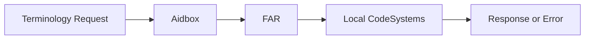
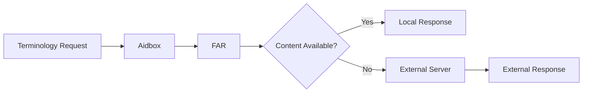
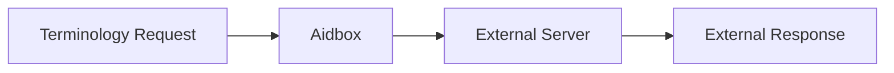

# Aidbox Terminology Module

> [!warning]
> TODO: review & add content

Aidbox's terminology implementation centers on the FHIR Artifact Registry (FAR), which serves as the primary storage for canonical resources including CodeSystems and ValueSets. This architecture provides a unified approach to managing terminology resources while supporting various operational modes.

The terminology module operates in three distinct modes to accommodate different deployment scenarios.

### Local Mode

**Local mode** uses only the CodeSystems stored within Aidbox's FAR. This mode provides complete control over terminology content but requires all necessary CodeSystems to be explicitly loaded into the system. If the system encounters a request for content not available locally, it returns an error rather than attempting external lookups.

### Hybrid Mode

**Hybrid mode** combines local storage with external terminology server capabilities. CodeSystems stored in FAR take precedence, but when content is not available locally, the system connects to an external terminology server to retrieve the required information. This approach balances performance and completeness, allowing organizations to maintain local control over critical terminology while accessing comprehensive external resources when needed.

### Remote (Legacy) Mode

In **Remote mode**, Aidbox routes all terminology requests to an external terminology server, bypassing local storage entirely. This mode is useful for organizations that prefer to rely on established external terminology services or are in the process of migrating their terminology infrastructure.

The terminology module supports all standard FHIR terminology operations. Healthcare applications can validate codes against CodeSystems or ValueSets, expand ValueSet definitions to retrieve all contained codes, and look up detailed information about specific concepts. These operations work seamlessly across both local and external content, depending on the configured mode.

Real-world usage typically involves well-established CodeSystems such as SNOMED CT for clinical terminology, LOINC for laboratory data, and various local CodeSystems developed by healthcare organizations for their specific needs. The flexible architecture allows organizations to implement terminology strategies that align with their operational requirements and compliance obligations.

See also:
- [FHIR Artifact Registry documentation](../artifact-registry/)
- [FHIR Terminology Server Specification](https://www.hl7.org/fhir/terminology-service.html)

