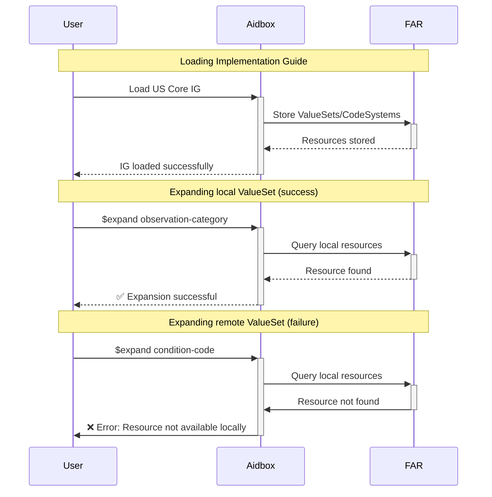
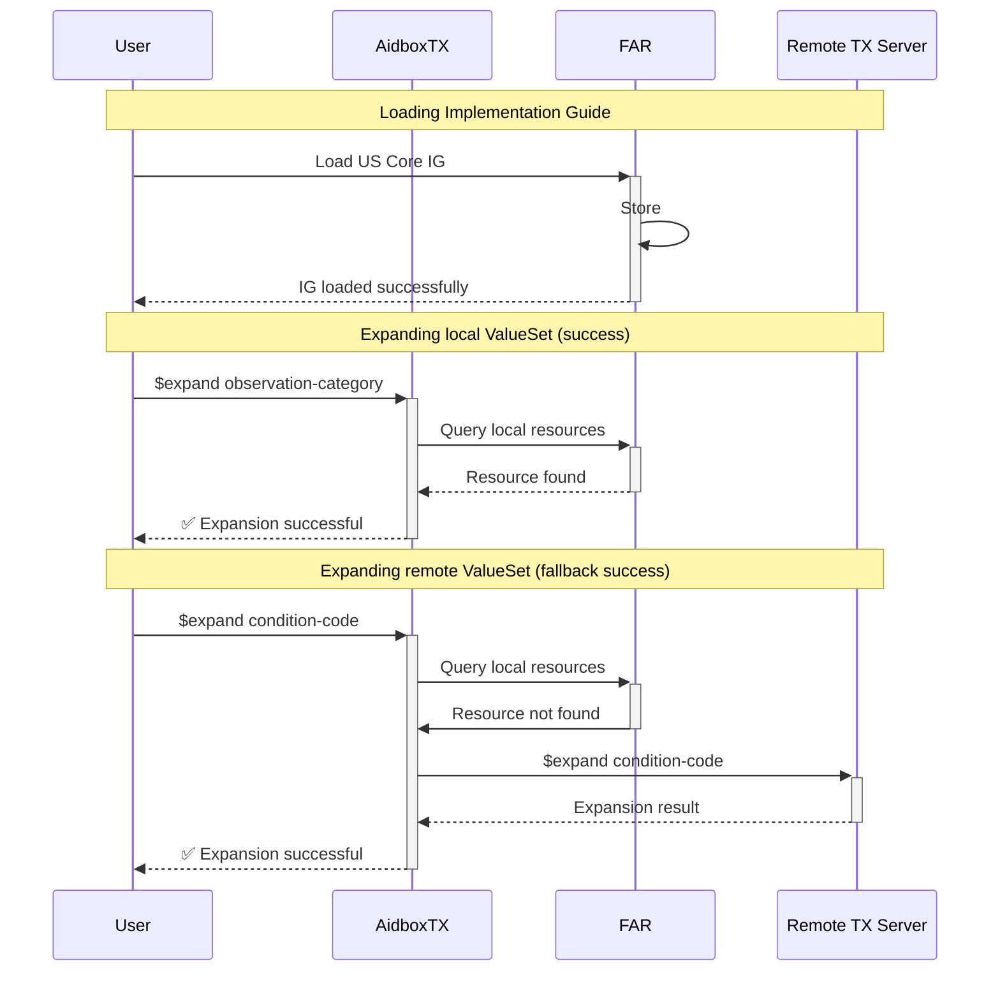
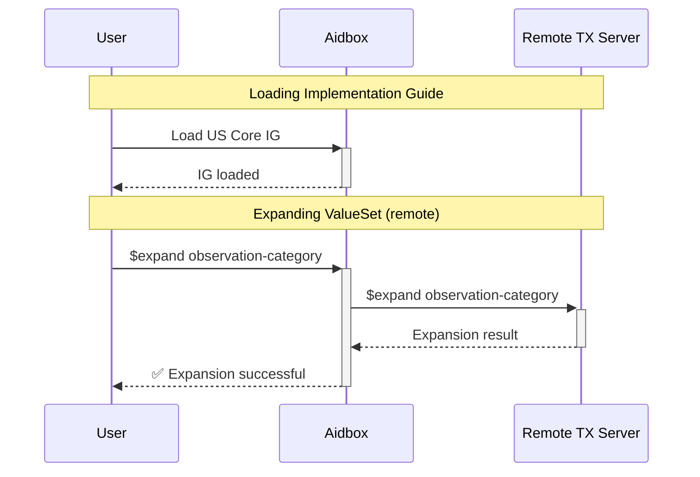

# Hybrid Mode

The terminology module operates in three distinct modes to accommodate different deployment scenarios.

We recommend **Hybrid Mode** as it strikes a balance between control and convenience. Organizations can manage their specific resources and local Implementation Guides while avoiding the operational burden of downloading and maintaining gigabytes of large terminologies like SNOMED CT or LOINC.

## Operational Modes

### Local

**Local mode** uses only the resources stored within Aidbox's FAR. This mode provides complete control over terminology content but requires all necessary CodeSystems to be explicitly loaded into the system. If the system encounters a request for content not available locally, it returns an error rather than attempting external lookups.

The example below shows expanding the [`us-core-clinical-result-observation-category`](http://hl7.org/fhir/us/core/ValueSet/us-core-clinical-result-observation-category) ValueSet (success) versus the [`us-core-condition-code`](http://hl7.org/fhir/us/core/ValueSet/us-core-condition-code) ValueSet (failure).



### Hybrid

**Hybrid mode** combines local storage with external terminology server capabilities. CodeSystems stored in FAR take precedence, but when content is not available locally, the system connects to an external terminology server to retrieve the required information. This approach balances performance and completeness, allowing organizations to maintain local control over critical terminology while accessing comprehensive external resources when needed.

The hybrid engine intelligently handles mixed ValueSets that reference both local and remote CodeSystems. For example, when processing a ValueSet with multiple `include` elements—one filtering a locally available CodeSystem and another filtering a remote CodeSystem—the engine efficiently partitions the request: it processes local includes directly from FAR while converting remote includes into optimized requests to the external terminology server. The final response consolidates both local and remote results into a single, complete result.

The example below shows the same scenario as Local Mode, but now the [`us-core-condition-code`](http://hl7.org/fhir/us/core/ValueSet/us-core-condition-code) ValueSet expansion succeeds by falling back to the remote terminology server.



### Remote (Legacy)

In **Remote mode**, Aidbox routes all terminology requests to an external terminology server, bypassing local storage entirely. This mode is useful for organizations that prefer to rely on established external terminology services or are in the process of migrating their terminology infrastructure.

The example below shows both [`us-core-clinical-result-observation-category`](http://hl7.org/fhir/us/core/ValueSet/us-core-clinical-result-observation-category) and [`us-core-condition-code`](http://hl7.org/fhir/us/core/ValueSet/us-core-condition-code) ValueSet expansions being routed directly to the remote terminology server, regardless of local availability.



## External Terminology Servers

### Termbox (Recommended)

For access to up-to-date curated terminologies in Hybrid Mode, we recommend Termbox.

**Termbox** is a cloud-based FHIR Terminology Server developed by Health Samurai. It delivers Terminology as a Service, giving developers and organizations an easy way to work with curated, up-to-date terminologies through a standardized FHIR interface.

**Configuration:**
```yaml
FHIR_TERMINOLOGY_ENGINE: hybrid
FHIR_TERMINOLOGY_ENGINE_HYBRID_EXTERNAL_TX_SERVER: https://tx.health-samurai.io/fhir
```

Termbox provides comprehensive coverage of standard terminologies including SNOMED CT, LOINC, RxNorm, and ICD-10, with regular updates and reliable availability.

### Tested External Servers

The Aidbox Hybrid Mode has been tested and verified to work with the following external terminology servers:

- **[Termbox](https://tx.health-samurai.io/fhir)** - Health Samurai's cloud-based terminology service
- **[Ontoserver](https://ontoserver.csiro.au/)** - CSIRO's FHIR terminology server  
- **[tx.fhir.org](https://tx.fhir.org)** - HL7's reference terminology server

## Examples

TODO: add examples of hybrid ops
