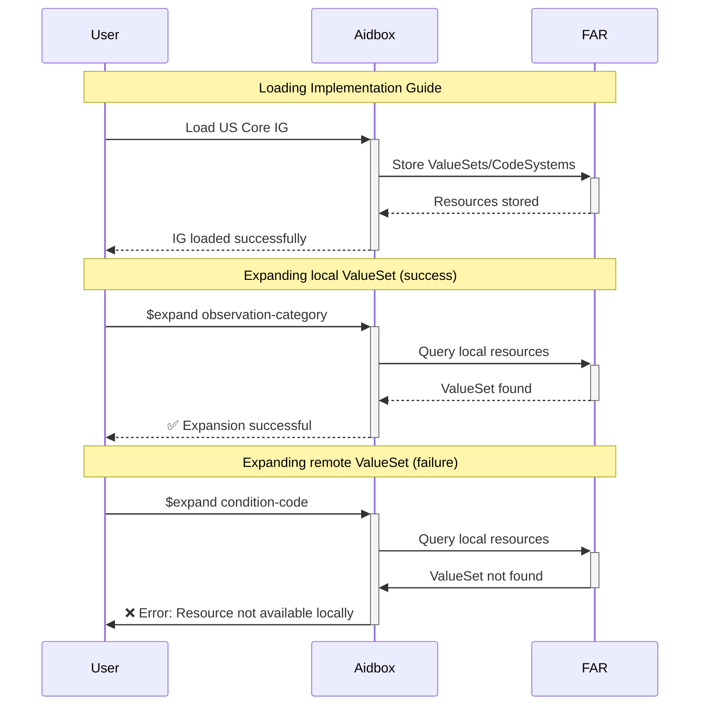
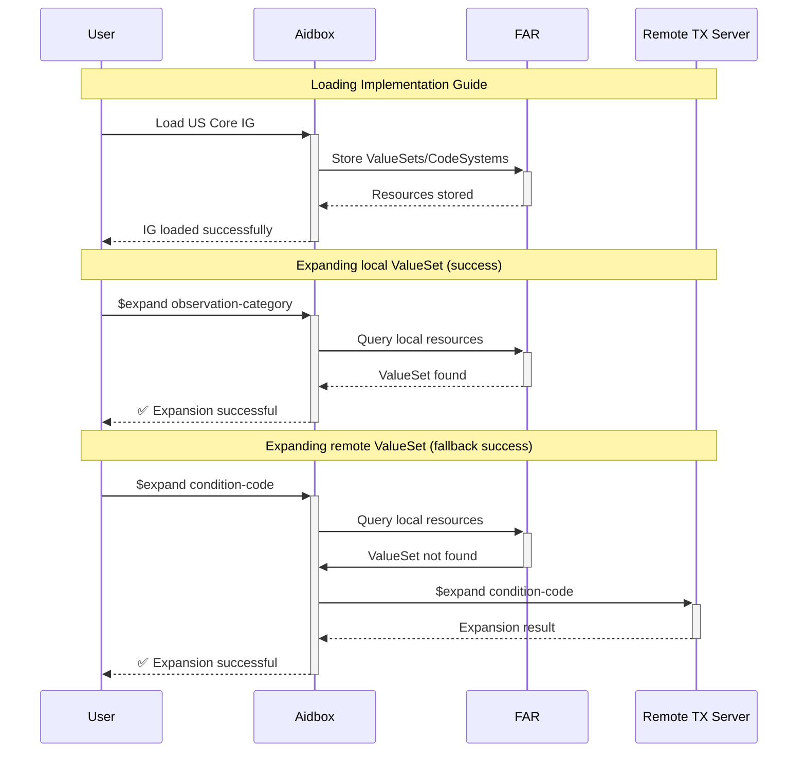
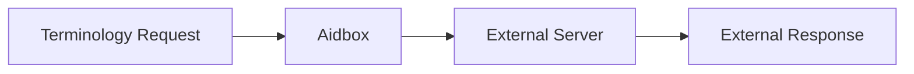

# Aidbox Terminology Module

The Aidbox Terminology Module is a fully conformant [FHIR Terminology Service](https://www.hl7.org/fhir/terminology-service.html) that seamlessly integrates with FHIR workflows including validation, UI components, and translation services. The module implements *most* standard FHIR terminology operations (see [capabilities](./capabilities.md) for details) including `$lookup`, `$validate-code`, `$expand`, `$translate`, and subsumption testing, providing comprehensive terminology capabilities through a RESTful API.

Aidbox's terminology implementation centers on the [FHIR Artifact Registry (FAR)](../../artifact-registry/artifact-registry-overview.md), which serves as the primary storage for canonical resources including CodeSystems and ValueSets. This architecture supports FHIR Implementation Guide delivery mechanisms and knowledge artifact lifecycle.

## Modes

The terminology module operates in three distinct modes to accommodate different deployment scenarios.

### Local Mode

**Local mode** uses only the resources stored within Aidbox's FAR. This mode provides complete control over terminology content but requires all necessary CodeSystems to be explicitly loaded into the system. If the system encounters a request for content not available locally, it returns an error rather than attempting external lookups.

The example below shows expanding the [`us-core-clinical-result-observation-category`](http://hl7.org/fhir/us/core/ValueSet/us-core-clinical-result-observation-category) ValueSet (success) versus the [`us-core-condition-code`](http://hl7.org/fhir/us/core/ValueSet/us-core-condition-code) ValueSet (failure).

### Hybrid Mode

**Hybrid mode** combines local storage with external terminology server capabilities. CodeSystems stored in FAR take precedence, but when content is not available locally, the system connects to an external terminology server to retrieve the required information. This approach balances performance and completeness, allowing organizations to maintain local control over critical terminology while accessing comprehensive external resources when needed.

The hybrid engine intelligently handles mixed ValueSets that reference both local and remote CodeSystems. For example, when processing a ValueSet with multiple `include` elements—one filtering a locally available CodeSystem and another filtering a remote CodeSystem—the engine efficiently partitions the request: it processes local includes directly from FAR while converting remote includes into optimized requests to the external terminology server. The final response consolidates both local and remote results into a single, complete result.

The example below shows the same scenario as Local Mode, but now the [`us-core-condition-code`](http://hl7.org/fhir/us/core/ValueSet/us-core-condition-code) ValueSet expansion succeeds by falling back to the remote terminology server.

### Remote (Legacy) Mode

In **Remote mode**, Aidbox routes all terminology requests to an external terminology server, bypassing local storage entirely. This mode is useful for organizations that prefer to rely on established external terminology services or are in the process of migrating their terminology infrastructure.

The terminology module supports all standard FHIR terminology operations. Healthcare applications can validate codes against CodeSystems or ValueSets, expand ValueSet definitions to retrieve all contained codes, and look up detailed information about specific concepts. These operations work seamlessly across both local and external content, depending on the configured mode.

Real-world usage typically involves well-established CodeSystems such as SNOMED CT for clinical terminology, LOINC for laboratory data, and various local CodeSystems developed by healthcare organizations for their specific needs. The flexible architecture allows organizations to implement terminology strategies that align with their operational requirements and compliance obligations.

See also:
- [Setup](./setup.md)
- [Hybrid Mode](./hybrid.md)
- [Capabilities](./capabilities.md)
- [FHIR Artifact Registry documentation](../../artifact-registry/artifact-registry-overview.md)
- [FHIR Terminology Server Specification](https://www.hl7.org/fhir/terminology-service.html)

