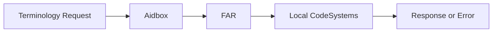
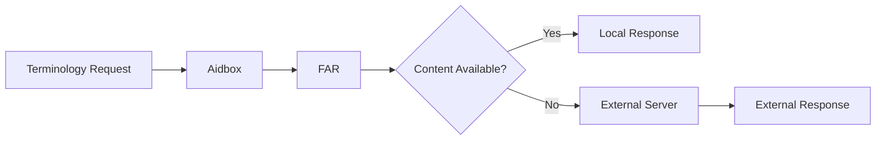
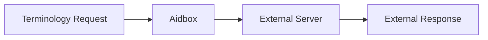

# Terminology Overview

FHIR terminology provides a standardized way to manage and use coded data in healthcare applications. The terminology infrastructure enables consistent representation of clinical concepts across different systems, ensuring interoperability and semantic clarity. Aidbox implements a comprehensive FHIR terminology server that supports both local and external terminology resources, offering flexible deployment options for various healthcare environments.

## What is FHIR Terminology?

FHIR terminology is built around several key resource types that work together to define and organize coded concepts used in healthcare data exchange.

**CodeSystem** resources define sets of codes and their meanings. These are the fundamental building blocks that establish what specific codes mean within a particular domain. For example, SNOMED CT is a comprehensive CodeSystem covering clinical terminology, while LOINC focuses on laboratory and clinical observations. Each CodeSystem contains concepts with codes, displays, and definitions that provide the semantic foundation for healthcare data.

For instance, the FHIR R4 core CodeSystem `http://hl7.org/fhir/administrative-gender` defines simple administrative gender codes:

```json
{
  "resourceType": "CodeSystem",
  "url": "http://hl7.org/fhir/administrative-gender",
  "concept": [
    {
      "code": "male",
      "display": "Male",
      "definition": "Male"
    },
    {
      "code": "female", 
      "display": "Female",
      "definition": "Female"
    },
    {
      "code": "other",
      "display": "Other",
      "definition": "Other"
    },
    {
      "code": "unknown",
      "display": "Unknown",
      "definition": "Unknown"
    }
  ]
}
```

In contrast, LOINC (Logical Observation Identifiers Names and Codes) CodeSystem `http://loinc.org` is a universal code system for identifying health measurements, observations, and documents. It provides a standard set of universal names and codes for identifying laboratory and clinical observations:

```json
{
  "resourceType": "CodeSystem",
  "url": "http://loinc.org",
  "name": "LOINC",
  "title": "Logical Observation Identifiers Names and Codes",
  "description": "LOINC is a universal code system for identifying health measurements, observations, and documents. It provides a standard set of universal names and codes for identifying laboratory and clinical observations.",
  "concept": [
    {
      "code": "789-8",
      "display": "RBC # Bld Auto",
      "definition": "Red Blood Cell count in Blood by Automated count"
    },
    {
      "code": "718-7", 
      "display": "Hemoglobin Bld-mCnc",
      "definition": "Hemoglobin [Mass/volume] in Blood"
    }
  ]
}
```

The FHIR core CodeSystem provides simple, standardized administrative concepts, while LOINC offers detailed clinical laboratory codes with specific measurement contexts and units for health observations and measurements.

**ValueSet** resources define collections of codes from one or more CodeSystems that are appropriate for use in specific contexts. While a CodeSystem might contain thousands of concepts, a ValueSet curates a subset relevant to a particular use case. For instance, a ValueSet might define all the valid codes for "Blood pressure measurement methods" by selecting specific codes from LOINC and SNOMED CT.

## FHIR Data Types for Coded Values

In FHIR, many resource elements are represented as coded values using specialized data types designed for different use cases:

**`code`** - A simple string value that is strictly bound to a predefined ValueSet. This type is typically used for fixed codes defined by the FHIR standard, such as `Encounter.status` or `Patient.gender`. The code must be one of the values specified in the bound ValueSet.

```json
{
  "resourceType": "Patient",
  "id": "example",
  "gender": "female",
  "maritalStatus": "married"
}
```

**`Coding`** - A complex data type that contains both a `system` (identifying the CodeSystem) and a `code` (the specific code value). This allows for precise identification of concepts from specific terminology systems. For example, a laboratory test might be coded using LOINC with `system: "http://loinc.org"` and `code: "789-8"`.

```json
{
  "resourceType": "Observation",
  "id": "example",
  "code": {
    "system": "http://loinc.org",
    "code": "789-8",
    "display": "RBC # Bld Auto"
  },
  "valueQuantity": {
    "value": 4.5,
    "unit": "10^12/L",
    "system": "http://unitsofmeasure.org",
    "code": "10*12/L"
  }
}
```

**`CodeableConcept`** - A complex data type that can contain multiple `Coding` elements, allowing a single concept to be represented using multiple code systems simultaneously. This is particularly useful when you need to maintain both internal proprietary codes and standard external codes. For instance, a lab test might be coded using both an internal laboratory code system and the standard LOINC code system.

```json
{
  "resourceType": "Observation",
  "id": "example",
  "code": {
    "coding": [
      {
        "system": "http://loinc.org",
        "code": "718-7",
        "display": "Hemoglobin Bld-mCnc"
      },
      {
        "system": "http://hospital.example.com/lab-codes",
        "code": "HGB",
        "display": "Hemoglobin"
      }
    ],
    "text": "Hemoglobin measurement"
  },
  "valueQuantity": {
    "value": 14.2,
    "unit": "g/dL",
    "system": "http://unitsofmeasure.org",
    "code": "g/dL"
  }
}
```

## Binding Concept

To specify what codes can be assigned to specific elements, FHIR uses the concept of **binding** - linking element definitions to ValueSets. A binding defines which ValueSet constrains the possible values for a coded element.

Bindings can have different strengths:
- **Required** - The element must have a value from the specified ValueSet
- **Extensible** - The element should have a value from the specified ValueSet, but other codes are allowed if the ValueSet doesn't contain an appropriate code
- **Preferred** - The element should have a value from the specified ValueSet if possible
- **Example** - The ValueSet provides examples of codes that might be used

For example, the `Observation.code` element is bound to a ValueSet that includes LOINC codes, ensuring that laboratory observations use standardized terminology for test identification.

#TODO: add a screenshot of FHIR Specification with binding for Observation.code

## What is a FHIR Terminology Server?

A FHIR terminology server provides standardized operations to work with terminology resources. It enables healthcare applications to make use of codes and value sets without having to become experts in the fine details of code system, value set, and concept map resources, and the underlying code systems and terminological principles.

The terminology server offers several key operations:

- **`$validate-code`** - Checks whether a given code is valid within a specific CodeSystem or ValueSet
- **`$expand`** - Takes a ValueSet definition and returns all the codes it contains  
- **`$lookup`** - Retrieves detailed information about a specific code, including its display name and definition

## How Aidbox Implements FHIR Terminology

Aidbox's terminology implementation centers on the FHIR Artifact Registry (FAR), which serves as the primary storage for canonical resources including CodeSystems and ValueSets. This architecture provides a unified approach to managing terminology resources while supporting various operational modes.

The terminology module operates in three distinct modes to accommodate different deployment scenarios.

### Local Mode

**Local mode** uses only the CodeSystems stored within Aidbox's FAR. This mode provides complete control over terminology content but requires all necessary CodeSystems to be explicitly loaded into the system. If the system encounters a request for content not available locally, it returns an error rather than attempting external lookups.



### Hybrid Mode

**Hybrid mode** combines local storage with external terminology server capabilities. CodeSystems stored in FAR take precedence, but when content is not available locally, the system connects to an external terminology server to retrieve the required information. This approach balances performance and completeness, allowing organizations to maintain local control over critical terminology while accessing comprehensive external resources when needed.



### Legacy Mode

**Legacy mode** routes all terminology requests to an external terminology server, bypassing local storage entirely. This mode is useful for organizations that prefer to rely on established external terminology services or are in the process of migrating their terminology infrastructure.



The terminology module supports all standard FHIR terminology operations. Healthcare applications can validate codes against CodeSystems or ValueSets, expand ValueSet definitions to retrieve all contained codes, and look up detailed information about specific concepts. These operations work seamlessly across both local and external content, depending on the configured mode.

Real-world usage typically involves well-established CodeSystems such as SNOMED CT for clinical terminology, LOINC for laboratory data, and various local CodeSystems developed by healthcare organizations for their specific needs. The flexible architecture allows organizations to implement terminology strategies that align with their operational requirements and compliance obligations.

See also:
- [FHIR Artifact Registry documentation](/docs/artifact-registry/)
- [FHIR Terminology Server Specification](https://www.hl7.org/fhir/terminology-service.html)