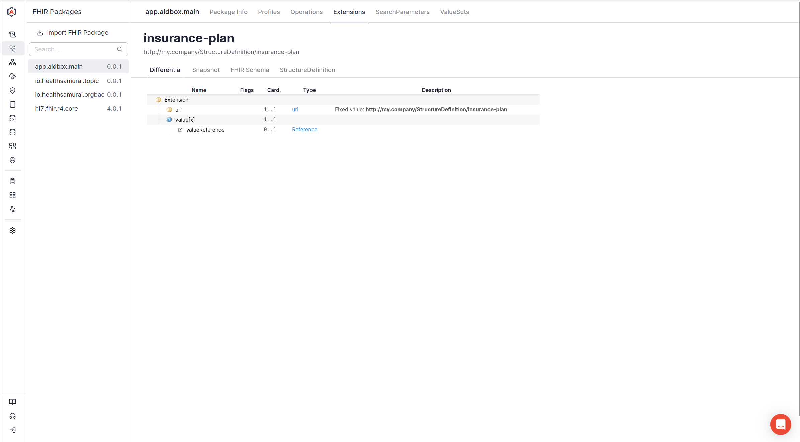

# Extensions Using StructureDefinition

Aidbox supports defining extensions using [StructureDefinition](https://build.fhir.org/structuredefinition.html) FHIR resource. This is possible when Aidbox is configured with [FHIRSchema mode](../../../modules/profiling-and-validation/fhir-schema-validator/).

See also [Extensions using FHIRSchema](extensions-using-fhirschema.md).

## Example

To create the Extension, simply `PUT` or `POST` the StructureDefinition with `Extension` type to the `/fhir/StructureDefinition` endpoint.

```json
PUT /fhir/StructureDefinition/insurance-plan

{
  "abstract": false,
  "url": "http://my.company/StructureDefinition/insurance-plan",
  "id": "insurance-plan",
  "name": "InsurancePlanReference",
  "context": [
    {
      "type": "element",
      "expression": "Coverage"
    }
  ],
  "status": "active",
  "kind": "complex-type",
  "type": "Extension",
  "baseDefinition": "http://hl7.org/fhir/StructureDefinition/Extension",
  "version": "0.0.1",
  "differential": {
    "element": [
      {
        "id": "Extension",
        "max": "1",
        "min": 0,
        "path": "Extension",
        "short": "Reference to the insurance plan"
      },
      {
        "id": "Extension.url",
        "max": "1",
        "min": 1,
        "path": "Extension.url",
        "fixedUri": "http://my.company/StructureDefinition/insurance-plan"
      },
      {
        "id": "Extension.value[x]",
        "max": "1",
        "min": 1,
        "path": "Extension.value[x]",
        "type": [
          {
            "code": "Reference",
            "targetProfile": [
              "http://hl7.org/fhir/StructureDefinition/InsurancePlan"
            ]
          }
        ]
      }
    ]
  },
  "resourceType": "StructureDefinition",
  "derivation": "constraint"
}
```

When StructureDefinition is created, you can inspect it in the "Fhir Packages" Aidbox UI page.

<figure><figcaption></figcaption></figure>

We can use the defined extension like this:

```yaml
PUT /fhir/Coverage/my-coverage

extension:
- url: http://my.company/StructureDefinition/insurance-plan
  valueReference: 
    reference: InsurancePlan/ip1
payor: 
- reference: Patient/pt1
beneficiary:
  reference: Patient/pt1
status: active
```
