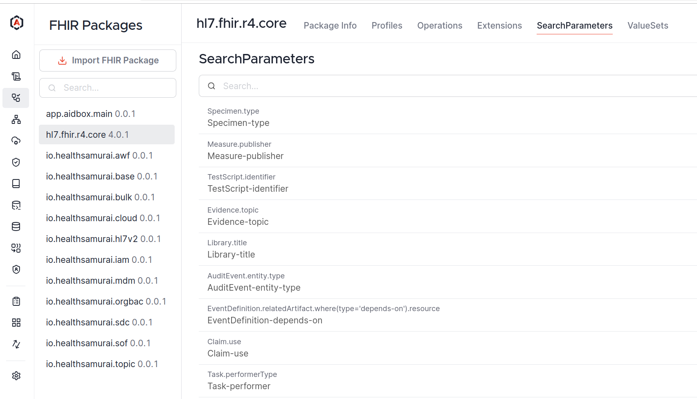
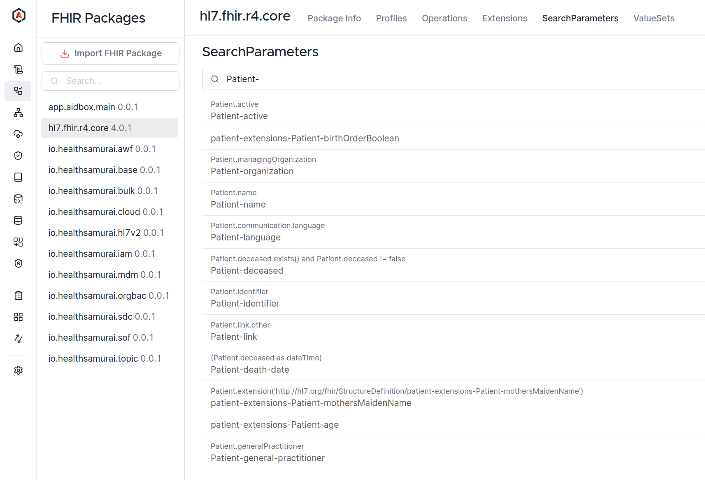
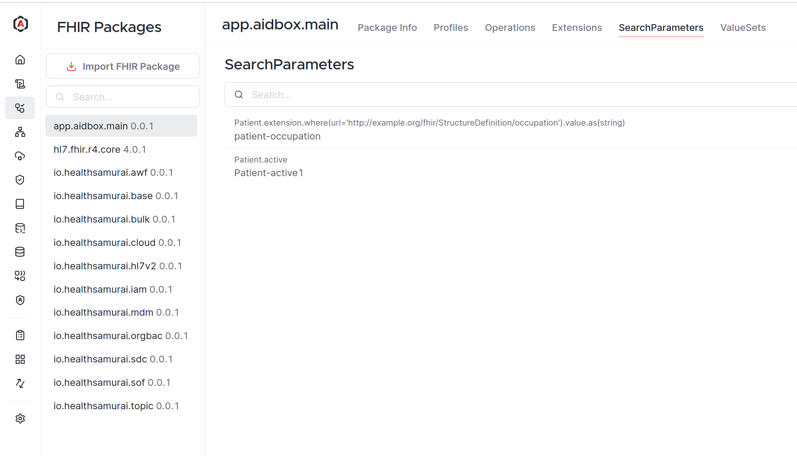

# Custom SearchParameter tutorial


To create a SearchParameter, [FHIRSchema](../../../modules/profiling-and-validation/fhir-schema-validator/README.md) must be enabled (enabled by default)


### Objectives <a href="#objectives" id="objectives"></a>

* Understand what SearchParameter is
* Learn how to create a custom SearchParameter in Aidbox

## Before you begin <a href="#before-you-begin" id="before-you-begin"></a>

* See what FHIR Search is [here](../../../api/rest-api/fhir-search/README.md), what [SearchParameter is here](../../../api/rest-api/fhir-search/searchparameter.md)
* Set up the local Aidbox instance using the getting started [guide](../../../getting-started/run-aidbox-locally.md)

## Get any SearchParameter definition

In AidboxUI, go to **FHIR Packages -> hl7.fhir.r4.core** and click on "SearchParameters" tab:

<figure><figcaption></figcaption></figure>

Getting all Patient SearchParameters from r4:

<figure><figcaption></figcaption></figure>

Clicking on `Patient-active` SearchParameter gives us an actual definition of it:

```json
{
  "url": "http://hl7.org/fhir/SearchParameter/Patient-active",
  "id": "Patient-active",
  "base": [
    "Patient"
  ],
  "expression": "Patient.active",
  "name": "active",
  "status": "draft",
  "type": "token",
  "version": "4.0.1",
  "resourceType": "SearchParameter",
  "code": "active",
  "description": "Whether the patient record is active"
}
```

The main things:

* change **url** and **id** to identify your search parameter
* the **code** is actual name that is used in the search query
* make sure **base** is correct
* to define how to search and what to search, **type** and **expression** fields are used
* **xpathUsage** and **xpath** are ignored

You can read more about these fields [here](../../../api/rest-api/fhir-search/searchparameter.md#searchparameter-fields).

## Define a custom SearchParameter

Let's define a custom search parameter that allows searching Patient resources by a specific extension with "http://example.org/fhir/StructureDefinition/occupation" URL:

```
POST /fhir/SearchParameter
Content-Type: application/json
Accept: application/json

{
  "resourceType": "SearchParameter",
  "id": "patient-occupation",
  "url": "http://example.org/fhir/SearchParameter/patient-occupation",
  "version": "1.0.0",
  "name": "occupation",
  "status": "active",
  "description": "Search patients by occupation",
  "code": "occupation",
  "base": [
    "Patient"
  ],
  "type": "string",
  "expression": "Patient.extension.where(url='http://example.org/fhir/StructureDefinition/occupation').value.as(string)"
}
```

Here, the main fields are `type` and `expression`. String type means that we search for strings in a case-insensitive, accent-insensitive way. See also [SearchParameter types](../../../api/rest-api/fhir-search/searchparameter.md#search-parameter-types).

The expression field uses [FHIRPath](https://hl7.org/fhir/fhirpath.html) and defines that we search in "extension" field, filter all the extensions by the URL, and get their value. Note that we use `.as(string)` to match [the string extension choice type](https://www.hl7.org/fhir/extensibility.html).

You can find all SearchParameters created by you in **app.aidbox.main** package:

<figure><figcaption></figcaption></figure>

## Test Search Parameter

Create a Patient resource with the required extension:

```
POST /fhir/Patient
content-type: application/json
accept: application/json

{
    "resourceType": "Patient",
    "id": "example-patient",
    "extension": [
        {
            "url": "http://example.org/fhir/StructureDefinition/occupation",
            "valueString": "Engineer"
        }
    ],
    "name": [
        {
            "family": "Doe",
            "given": [
                "John"
            ]
        }
    ],
    "gender": "male",
    "birthDate": "1980-01-01"
}
```

Search for Patient by occupation:

```
GET /fhir/Patient?occupation=Engin
```

Response:


```yaml
resourceType: Bundle
type: searchset
meta:
  versionId: '0'
total: 1
link:
  - relation: first
    url: https://example.aidbox.app/fhir/Patient?occupation=Engin&page=1
  - relation: self
    url: https://example.aidbox.app/fhir/Patient?occupation=Engin&page=1
entry:
  - resource:
      name:
        - given:
            - John
          family: Doe
      gender: male
      birthDate: '1980-01-01'
      extension:
        - url: http://example.org/fhir/StructureDefinition/occupation
          valueString: Engineer
      id: >-
        example-patient
      resourceType: Patient
      meta:
        lastUpdated: '2024-06-07T10:21:29.110510Z'
        versionId: '6'
        extension:
          - url: https://fhir.aidbox.app/fhir/StructureDefinition/created-at
            valueInstant: '2024-06-07T10:21:29.110510Z'
    search:
      mode: match
    fullUrl: https://example.aidbox.app/Patient/example-patient
    link:
      - relation: self
        url: https://example.aidbox.app/Patient/example-patient
```


## More examples

### Composite SearchParameter

```
POST /fhir/SearchParameter
content-type: application/json
accept: application/json

{
  "url": "http://mycompany.com/Questionnaire-context-type-value-ref",
  "component": [
    {
      "definition": "http://hl7.org/fhir/SearchParameter/Questionnaire-context-type",
      "expression": "code"
    },
    {
      "definition": "http://mycompany.com/Questionnaire-context-ref",
      "expression": "value.as(Reference)"
    }
  ],
  "id": "Questionnaire-context-type-value",
  "base": [
    "Questionnaire"
  ],
  "expression": "Questionnaire.useContext",
  "name": "context-type-value",
  "status": "draft",
  "multipleOr": false,
  "type": "composite",
  "version": "4.0.1",
  "xpathUsage": "normal",
  "resourceType": "SearchParameter",
  "code": "context-type-value-ref",
  "description": "A use context type and reference value assigned to the questionnaire"
}
```
