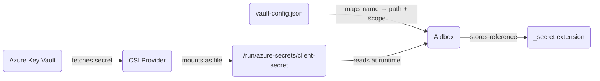

# Azure Key Vault external secrets


This functionality is available starting from version 2602.


## Overview

This tutorial walks through setting up Azure Key Vault as an external secret store for Aidbox running on AKS. By the end you will have:

* An Azure Key Vault holding a client secret
* The Secrets Store CSI Driver mounting that secret as a file inside the Aidbox pod
* A vault config mapping the file to a named secret with resource scope
* A `Client` that references the secret via a FHIR extension — the actual value is never stored in the database



## Prerequisites

* Azure subscription with permissions to create resource groups, AKS clusters, and Key Vaults
* [Azure CLI](https://learn.microsoft.com/en-us/cli/azure/install-azure-cli) (`az`) installed
* `kubectl` and `helm` installed
* Setup the local Aidbox instance using [Getting Started](../../getting-started/run-aidbox-locally.md) guide

## Step 1. Create Azure infrastructure

Create a resource group, a Key Vault, and store a client secret:


Key Vault names are globally unique. Replace `<your-keyvault-name>` with a unique name throughout this tutorial.


```bash
az group create --name aidbox-rg --location eastus

az keyvault create \
  --name <your-keyvault-name> \
  --resource-group aidbox-rg \
  --location eastus

az keyvault secret set \
  --vault-name <your-keyvault-name> \
  --name client-secret \
  --value 'super-secret-value'
```

## Step 2. Create AKS cluster

```bash
az aks create \
  --resource-group aidbox-rg \
  --name aidbox-aks \
  --node-count 1 \
  --generate-ssh-keys

az aks get-credentials \
  --resource-group aidbox-rg \
  --name aidbox-aks
```

## Step 3. Install Secrets Store CSI Driver

```bash
helm repo add secrets-store-csi-driver \
  https://kubernetes-sigs.github.io/secrets-store-csi-driver/charts

helm install csi secrets-store-csi-driver/secrets-store-csi-driver \
  --namespace kube-system \
  --set syncSecret.enabled=true \
  --set enableSecretRotation=true \
  --set rotationPollInterval=30s
```


`enableSecretRotation` and `rotationPollInterval` control how often the driver checks for updated secrets. Set the interval based on your rotation requirements.


## Step 4. Install Azure Key Vault Provider

```bash
helm repo add csi-secrets-store-provider-azure \
  https://azure.github.io/secrets-store-csi-driver-provider-azure/charts

helm install azure-kv csi-secrets-store-provider-azure/csi-secrets-store-provider-azure \
  --namespace kube-system \
  --set secrets-store-csi-driver.install=false
```

Wait for pods to be ready:

```bash
kubectl wait --for=condition=ready pod \
  -l app=csi-secrets-store-provider-azure \
  --namespace kube-system \
  --timeout=120s
```

## Step 5. Grant AKS access to Key Vault

Get the kubelet managed identity and assign the `Key Vault Secrets User` role:

```bash
IDENTITY_ID=$(az aks show \
  --resource-group aidbox-rg \
  --name aidbox-aks \
  --query "identityProfile.kubeletidentity.objectId" \
  --output tsv)

IDENTITY_CLIENT_ID=$(az aks show \
  --resource-group aidbox-rg \
  --name aidbox-aks \
  --query "identityProfile.kubeletidentity.clientId" \
  --output tsv)

KV_ID=$(az keyvault show \
  --name <your-keyvault-name> \
  --resource-group aidbox-rg \
  --query id --output tsv)

az role assignment create \
  --assignee "$IDENTITY_ID" \
  --role "Key Vault Secrets User" \
  --scope "$KV_ID"
```

Save `IDENTITY_CLIENT_ID` — you will need it in the next step.

## Step 6. Create SecretProviderClass

This tells the CSI Driver which secrets to fetch from Azure Key Vault and how to authenticate using the kubelet managed identity:


```yaml
apiVersion: secrets-store.csi.x-k8s.io/v1
kind: SecretProviderClass
metadata:
  name: aidbox-azure-secrets
spec:
  provider: azure
  parameters:
    usePodIdentity: "false"
    useVMManagedIdentity: "true"
    userAssignedIdentityID: "<IDENTITY_CLIENT_ID>"
    keyvaultName: "<your-keyvault-name>"
    tenantId: "<your-tenant-id>"
    cloudName: "AzurePublicCloud"
    objects: |
      array:
        - |
          objectName: client-secret
          objectType: secret
```


Replace the placeholders:

* `<IDENTITY_CLIENT_ID>` — kubelet identity client ID from the previous step
* `<your-keyvault-name>` — your Key Vault name
* `<your-tenant-id>` — your Azure AD tenant ID (get it with `az account show --query tenantId --output tsv`)

## Step 7. Create vault config

The vault config JSON maps named secrets to file paths and declares which resources may access them:


```yaml
apiVersion: v1
kind: ConfigMap
metadata:
  name: aidbox-vault-config
data:
  vault-config.json: |
    {
      "secret": {
        "client-secret": {
          "path": "/run/azure-secrets/client-secret",
          "scope": {"resource_type": "Client", "id": "basic"}
        }
      }
    }
```


Each entry under `"secret"` maps a secret name to:

<table><thead><tr><th width="100">Field</th><th>Description</th></tr></thead><tbody><tr><td><code>path</code></td><td>Absolute path to the file containing the secret value</td></tr><tr><td><code>scope</code></td><td>Object identifying the resource allowed to access this secret. Use <code>resource_type</code> and <code>id</code> to restrict to a specific instance (e.g. <code>{"resource_type": "Client", "id": "basic"}</code>), or <code>resource_type</code> alone to allow any instance of that type (e.g. <code>{"resource_type": "Client"}</code>)</td></tr></tbody></table>

## Step 8. Deploy Aidbox


```yaml
apiVersion: apps/v1
kind: Deployment
metadata:
  name: aidbox
spec:
  replicas: 1
  selector:
    matchLabels:
      app: aidbox
  template:
    metadata:
      labels:
        app: aidbox
    spec:
      containers:
        - name: aidbox
          image: healthsamurai/aidboxone:latest
          env:
            - name: AIDBOX_VAULT_CONFIG
              value: "/etc/aidbox/vault-config.json"
            # Add other required env vars
          volumeMounts:
            - name: azure-secrets
              mountPath: "/run/azure-secrets"
              readOnly: true
            - name: vault-config
              mountPath: "/etc/aidbox"
              readOnly: true
      volumes:
        - name: azure-secrets
          csi:
            driver: secrets-store.csi.k8s.io
            readOnly: true
            volumeAttributes:
              secretProviderClass: "aidbox-azure-secrets"
        - name: vault-config
          configMap:
            name: aidbox-vault-config
```


See [Recommended environment variables](../../configuration/recommended-envs.md) for the full list of required Aidbox settings.

## Step 9. Verify secret mount

Confirm that the CSI Driver has mounted the secret file:

```bash
kubectl exec deploy/aidbox -- ls /run/azure-secrets/
```

Expected output:

```
client-secret
```

Verify the content:

```bash
kubectl exec deploy/aidbox -- cat /run/azure-secrets/client-secret
```

## Step 10. Create Client with vault-backed secret

Create a Client that references the secret by name using the FHIR primitive extension pattern. The `_secret` element carries two extensions: `data-absent-reason` with value `masked` (indicating the field is intentionally absent) and `secret-reference` with the secret name from the vault config.


```json
{
  "resourceType": "Client",
  "id": "basic",
  "_secret": {
    "extension": [
      {
        "url": "http://hl7.org/fhir/StructureDefinition/data-absent-reason",
        "valueCode": "masked"
      },
      {
        "url": "http://health-samurai.io/fhir/secret-reference",
        "valueString": "client-secret"
      }
    ]
  },
  "grant_types": ["client_credentials", "basic"]
}
```


Reading the Client back returns the extension with the secret name, never the actual value:


```json
{
  "resourceType": "Client",
  "id": "basic",
  "_secret": {
    "extension": [
      {
        "url": "http://hl7.org/fhir/StructureDefinition/data-absent-reason",
        "valueCode": "masked"
      },
      {
        "url": "http://health-samurai.io/fhir/secret-reference",
        "valueString": "client-secret"
      }
    ]
  },
  "grant_types": ["client_credentials", "basic"]
}
```


At runtime, Aidbox resolves `client-secret` through the vault config, verifies that `Client/basic` is in scope, and reads the file content. You can verify this by authenticating as the client — the vault-backed secret value is used for authentication:

```bash
# Succeeds (returns 200 OK)
curl -u basic:super-secret-value http://<aidbox-url>/fhir/Patient

# Fails (returns 401 Unauthorized)
curl -u basic:wrong-password http://<aidbox-url>/fhir/Patient
```

## Secret rotation

Update the secret in Azure Key Vault:

```bash
az keyvault secret set \
  --vault-name <your-keyvault-name> \
  --name client-secret \
  --value 'new-secret-value'
```

The CSI Driver picks up the change based on `rotationPollInterval` (30s in this tutorial). Aidbox detects the file modification and invalidates its cache — the new value is used on the next access. No pod restart required.

## Next steps

For the full reference on the vault config format, extension pattern, scope enforcement, and the list of supported resources, see [External Secrets](../../configuration/secret-files.md).
