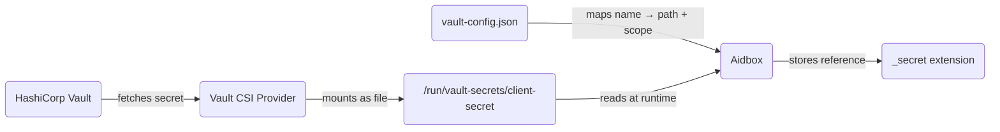

# HashiCorp Vault external secrets


This functionality is available starting from version 2602.


## Overview

This tutorial walks through setting up HashiCorp Vault as an external secret store for Aidbox running on Kubernetes. By the end you will have:

* A HashiCorp Vault instance holding a client secret
* The Secrets Store CSI Driver mounting that secret as a file inside the Aidbox pod
* A vault config mapping the file to a named secret with resource scope
* A `Client` that references the secret via a FHIR extension — the actual value is never stored in the database



## Prerequisites

* A running Kubernetes cluster (this guide uses [minikube](https://minikube.sigs.k8s.io/) for local testing)
* `kubectl` and `helm` installed
* Setup the local Aidbox instance using [Getting Started](../../getting-started/run-aidbox-locally.md) guide

## Step 1. Install Secrets Store CSI Driver

```bash
helm repo add secrets-store-csi-driver \
  https://kubernetes-sigs.github.io/secrets-store-csi-driver/charts

helm install csi secrets-store-csi-driver/secrets-store-csi-driver \
  --namespace kube-system \
  --set syncSecret.enabled=true \
  --set enableSecretRotation=true \
  --set rotationPollInterval=30s
```


`enableSecretRotation` and `rotationPollInterval` control how often the driver checks Vault for updated secrets. Set the interval based on your rotation requirements.


## Step 2. Install HashiCorp Vault

Deploy Vault with the CSI Provider enabled:

```bash
helm repo add hashicorp https://helm.releases.hashicorp.com

helm install vault hashicorp/vault \
  --set "server.dev.enabled=true" \
  --set "csi.enabled=true"
```

Wait for pods to be ready:

```bash
kubectl wait --for=condition=ready pod \
  -l app.kubernetes.io/name=vault \
  --timeout=120s

kubectl wait --for=condition=ready pod \
  -l app.kubernetes.io/name=vault-csi-provider \
  --timeout=120s
```


This guide uses Vault in dev mode for simplicity. In production, deploy Vault with proper storage backend, TLS, and auto-unseal. See the [Vault documentation](https://developer.hashicorp.com/vault/docs) for production deployment guidance.


## Step 3. Configure Vault

### Store a secret

```bash
kubectl exec vault-0 -- vault kv put secret/aidbox/client \
  client-secret='super-secret-value'
```

### Enable Kubernetes authentication

```bash
kubectl exec vault-0 -- vault auth enable kubernetes

kubectl exec vault-0 -- sh -c 'vault write auth/kubernetes/config \
  kubernetes_host="https://$KUBERNETES_PORT_443_TCP_ADDR:443"'
```

### Create a policy and role

The policy grants read-only access to secrets under `secret/data/aidbox/*`. The role binds this policy to the `aidbox` ServiceAccount in the `default` namespace.

```bash
kubectl exec -i vault-0 -- vault policy write aidbox /dev/stdin <<'EOF'
path "secret/data/aidbox/*" {
  capabilities = ["read"]
}
EOF

kubectl exec vault-0 -- vault write auth/kubernetes/role/aidbox \
  bound_service_account_names=aidbox \
  bound_service_account_namespaces=default \
  policies=aidbox \
  ttl=1h
```

## Step 4. Create ServiceAccount

The Vault CSI Provider uses this ServiceAccount to authenticate with Vault via Kubernetes auth:


```yaml
apiVersion: v1
kind: ServiceAccount
metadata:
  name: aidbox
```


## Step 5. Create SecretProviderClass

Defines which Vault secrets to mount and where to find them:


```yaml
apiVersion: secrets-store.csi.x-k8s.io/v1
kind: SecretProviderClass
metadata:
  name: aidbox-vault-secrets
spec:
  provider: vault
  parameters:
    vaultAddress: "http://vault.default:8200"
    roleName: "aidbox"
    objects: |
      - objectName: "client-secret"
        secretPath: "secret/data/aidbox/client"
        secretKey: "client-secret"
```


## Step 6. Create vault config

The vault config JSON maps named secrets to file paths and declares which resources may access them:


```yaml
apiVersion: v1
kind: ConfigMap
metadata:
  name: aidbox-vault-config
data:
  vault-config.json: |
    {
      "secret": {
        "client-secret": {
          "path": "/run/vault-secrets/client-secret",
          "scope": {"resource_type": "Client", "id": "basic"}
        }
      }
    }
```


Each entry under `"secret"` maps a secret name to:

<table><thead><tr><th width="100">Field</th><th>Description</th></tr></thead><tbody><tr><td><code>path</code></td><td>Absolute path to the file containing the secret value</td></tr><tr><td><code>scope</code></td><td>Object identifying the resource allowed to access this secret. Use <code>resource_type</code> and <code>id</code> to restrict to a specific instance (e.g. <code>{"resource_type": "Client", "id": "basic"}</code>), or <code>resource_type</code> alone to allow any instance of that type (e.g. <code>{"resource_type": "Client"}</code>)</td></tr></tbody></table>

## Step 7. Deploy Aidbox


```yaml
apiVersion: apps/v1
kind: Deployment
metadata:
  name: aidbox
spec:
  replicas: 1
  selector:
    matchLabels:
      app: aidbox
  template:
    metadata:
      labels:
        app: aidbox
    spec:
      serviceAccountName: aidbox
      containers:
        - name: aidbox
          image: healthsamurai/aidboxone:latest
          env:
            - name: BOX_VAULT_CONFIG
              value: "/etc/aidbox/vault-config.json"
            # Add other required env vars
          volumeMounts:
            - name: vault-secrets
              mountPath: "/run/vault-secrets"
              readOnly: true
            - name: vault-config
              mountPath: "/etc/aidbox"
              readOnly: true
      volumes:
        - name: vault-secrets
          csi:
            driver: secrets-store.csi.k8s.io
            readOnly: true
            volumeAttributes:
              secretProviderClass: "aidbox-vault-secrets"
        - name: vault-config
          configMap:
            name: aidbox-vault-config
```


See [Recommended environment variables](../../configuration/recommended-envs.md) for the full list of required Aidbox settings.

## Step 8. Verify secret mount

Confirm that the CSI Driver has mounted the secret file:

```bash
kubectl exec deploy/aidbox -- ls /run/vault-secrets/
```

Expected output:

```
client-secret
```

Verify the content:

```bash
kubectl exec deploy/aidbox -- cat /run/vault-secrets/client-secret
```

## Step 9. Create Client with vault-backed secret

Create a Client that references the secret by name using the FHIR primitive extension pattern. The `_secret` element carries two extensions: `data-absent-reason` with value `masked` (indicating the field is intentionally absent) and `secret-reference` with the secret name from the vault config.


```json
{
  "resourceType": "Client",
  "id": "basic",
  "_secret": {
    "extension": [
      {
        "url": "http://hl7.org/fhir/StructureDefinition/data-absent-reason",
        "valueCode": "masked"
      },
      {
        "url": "http://health-samurai.io/fhir/secret-reference",
        "valueString": "client-secret"
      }
    ]
  },
  "grant_types": ["client_credentials", "basic"]
}
```


Reading the Client back returns the extension with the secret name, never the actual value:


```json
{
  "resourceType": "Client",
  "id": "basic",
  "_secret": {
    "extension": [
      {
        "url": "http://hl7.org/fhir/StructureDefinition/data-absent-reason",
        "valueCode": "masked"
      },
      {
        "url": "http://health-samurai.io/fhir/secret-reference",
        "valueString": "client-secret"
      }
    ]
  },
  "grant_types": ["client_credentials", "basic"]
}
```


At runtime, Aidbox resolves `client-secret` through the vault config, verifies that `Client/basic` is in scope, and reads the file content. You can verify this by authenticating as the client:

```bash
# Forward the Aidbox port
kubectl port-forward svc/aidbox 8888:8080

# Succeeds (returns 200 OK)
curl -u basic:super-secret-value http://localhost:8888/fhir/Patient

# Fails (returns 401 Unauthorized)
curl -u basic:wrong-password http://localhost:8888/fhir/Patient
```

## Secret rotation

Update the secret in Vault:

```bash
kubectl exec vault-0 -- vault kv put secret/aidbox/client \
  client-secret='new-secret-value'
```

The CSI Driver picks up the change based on `rotationPollInterval` (30s in this tutorial). Aidbox detects the file modification and invalidates its cache — the new value is used on the next access. No pod restart required.

## Next steps

For the full reference on the vault config format, extension pattern, scope enforcement, and the list of supported resources, see [External Secrets](../../configuration/secret-files.md).
