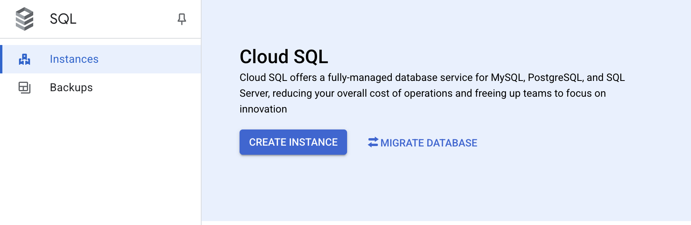
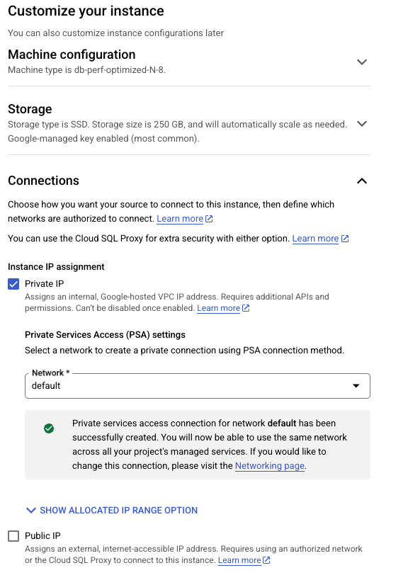
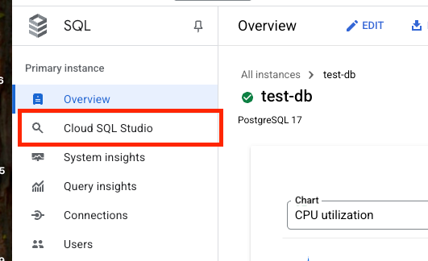
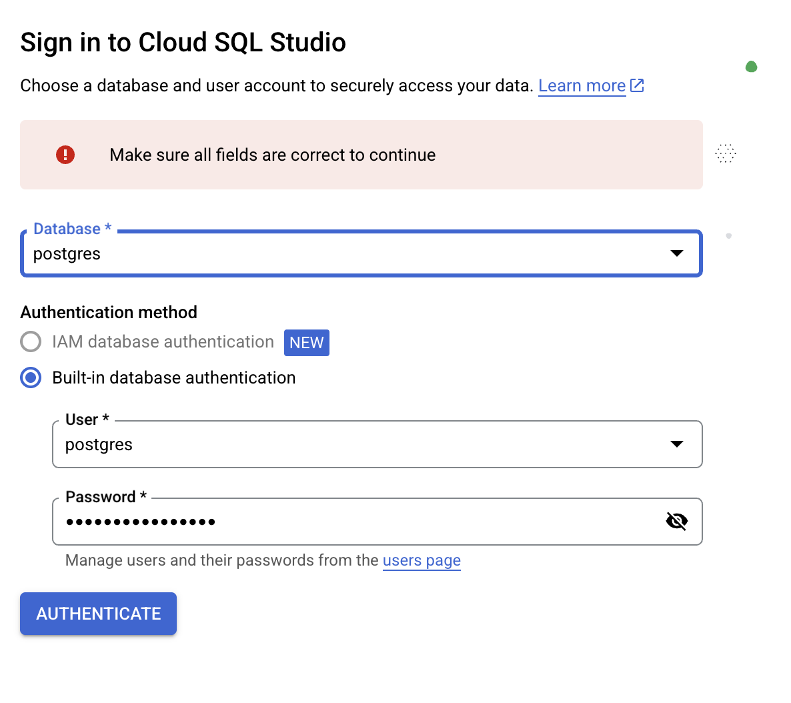
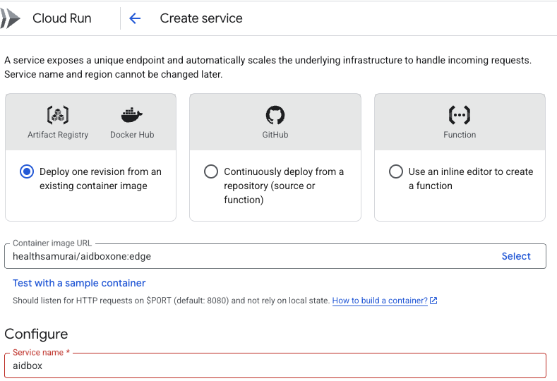
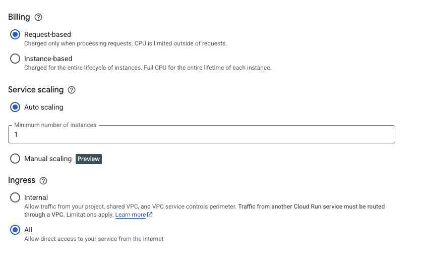
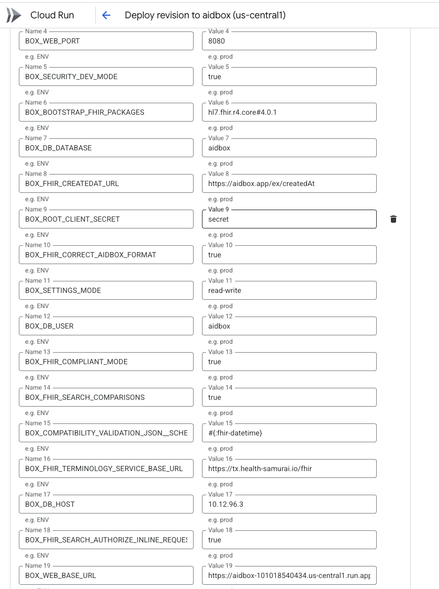
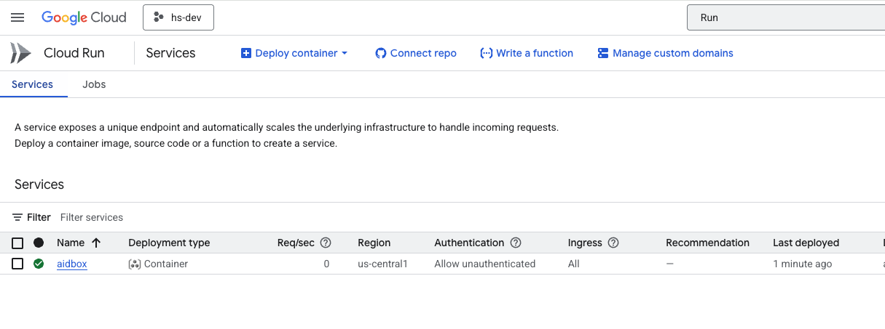

# How to run Aidbox in GCP Cloud Run

## Objectives <a href="#objectives" id="objectives"></a>

* Run the Aidbox container in the GCP [Cloud Run](https://cloud.google.com/run?hl=en) environment using [Cloud SQL ](https://cloud.google.com/sql?hl=en)as a database.

## Before you begin <a href="#before-you-begin" id="before-you-begin"></a>

* You must have an active Google Cloud account. More information [here](https://cloud.google.com/docs/get-started).

## Create a Managed PostgreSQL Database

1.  Log in to Google Cloud Console, go to SQL Service, and create a new Cloud SQL instance.\


    <figure><figcaption></figcaption></figure>
2.  Choose PostgreSQL for the database engine\


    <figure><figcaption></figcaption></figure>
3.  Choose Enterprise Cloud SQL Edition and **"Sandbox"** edition preset\


    <figure><figcaption></figcaption></figure>
4.  Enter the required parameters.\


    <figure><figcaption></figcaption></figure>

    \
    5\. Configure the private IP access to the database instance. \



Restricting database access at the network level is a recommended security best practice. In this tutorial, we take a simple approach by allowing access from the **default** VPC network and configuring Cloud Run to use the same network for outbound connections. For production environments, we strongly encourage implementing more granular and restrictive network policies tailored to your security needs.


In **the "Customize your Instance -> Connections"** section, enable the "**Private IP"** option and disable the **"Public IP"** option.

<figure><figcaption></figcaption></figure>

\
6\. Click the **"Create Instance"** button and wait until the instance is created.\


<figure><figcaption></figcaption></figure>

## Create a database and a user for the Aidbox service

1.  Open **Cloud SQL Studio**.\


    <figure><figcaption></figcaption></figure>
2.  Connect to the **postgres** database with the username **postgres** and the password you've chosen when you created the database.\


    <figure><figcaption></figcaption></figure>
3.  Create the database and user for the Aidbox.\
    \
    Run the following statements one by one in Cloud SQL Studio Editor\


    ```sql
    -- 1. Create the user (and a role) for Aidbox
    CREATE USER aidbox WITH PASSWORD '<your password for aidbox user>';
    -- 2. Grant the role aidbox to postgres, because postgres is not a superuser
    -- in Google Cloud SQL. 
    -- It's required to execute the following ALTER DATABASE statement
    GRANT aidbox TO postgres;
    -- 3. Create the database for Aidbox owned by the aidbox user
    CREATE DATABASE aidbox OWNER aidbox;
    ```

&#x20;     &#x20;


During initialization, Aidbox creates certain database extensions. You can find more details [here](../../database/postgresql-extensions.md). If you prefer not to grant the Aidbox user the permissions required for this, you can pre-create the necessary extensions using a privileged user and disable automatic extension creation via [settings](../../reference/settings/database.md#db.install-pg-extensions).  This is the approach we follow in the current tutorial.


4. Connect to the database `aidbox` , that you've created using user **postgres**, and create the extension.\


```sql
CREATE EXTENSION pg_stat_statements;
```

## Create the service for Aidbox in Cloud Run

1.  Navigate to the **"Cloud Run"** section in the Google Cloud Console and create a new service from the container .\


    <figure><figcaption></figcaption></figure>
2.  Enter `healthsamurai/aidboxone:edge` as a container image URL and add a service name.\


    <figure><figcaption></figcaption></figure>
3.  Disable authentication.\


    <figure><figcaption></figcaption></figure>
4.  Set Auto scaling to 1 and leave other properties by default.\


    <figure><figcaption></figcaption></figure>
5.  Configure Memory and CPU Limits\


    <figure><figcaption></figcaption></figure>
6.  Enable **"Second generation"** execution environment for better performance\


    <figure><figcaption></figcaption></figure>
7.  In the container properties, add environment variables.\


    <figure><figcaption></figcaption></figure>

    Add the following environment variables:\
    \


    ```yaml
    - name: BOX_SECURITY_AUDIT_LOG_ENABLED
      value: true
    - name: BOX_FHIR_SCHEMA_VALIDATION
      value: true
    - name: BOX_DB_PORT
      value: 5432
    - name: BOX_WEB_PORT
      value: 8080
    - name: BOX_SECURITY_DEV_MODE
      value: true
    - name: BOX_BOOTSTRAP_FHIR_PACKAGES
      value: hl7.fhir.r4.core#4.0.1
    - name: BOX_DB_DATABASE
      value: aidbox
    - name: BOX_FHIR_CREATEDAT_URL
      value: https://aidbox.app/ex/createdAt
    - name: BOX_ROOT_CLIENT_SECRET
      value: <put the default API client secret here>
    - name: BOX_FHIR_CORRECT_AIDBOX_FORMAT
      value: true
    - name: BOX_SETTINGS_MODE
      value: read-write
    - name: BOX_DB_USER
      value: aidbox
    - name: BOX_FHIR_COMPLIANT_MODE
      value: true
    - name: BOX_FHIR_SEARCH_COMPARISONS
      value: true
    - name: BOX_COMPATIBILITY_VALIDATION_JSON__SCHEMA_REGEX
      value: #{:fhir-datetime}
    - name: BOX_FHIR_TERMINOLOGY_SERVICE_BASE_URL
      value: https://tx.health-samurai.io/fhir
    - name: BOX_DB_HOST
      value: <put your PostgreSQL internal IP here>
    - name: BOX_FHIR_SEARCH_AUTHORIZE_INLINE_REQUESTS
      value: true
    # See https://cloud.google.com/run/docs/triggering/https-request#deterministic  
    # for more info about deterministic URLs
    - name: BOX_WEB_BASE_URL
      value: <put your deterministic URL here>
    - name: BOX_DB_PASSWORD
      value: <put the password of aidbox database user here>
    - name: BOX_ADMIN_PASSWORD
      value: <put the password of aidbox built-in admin user here>
    - name: BOX_SEARCH_INCLUDE_CONFORMANT
      value: true
    - name: BOX_DB_INSTALL_PG_EXTENSIONS
      value: false
    - name: BOX_DB_MAINTENANCE_DATABASE
      value: aidbox
    - name: JAVA_OPTS
      value: -XX:MaxRAMPercentage=75 -XshowSettings:vm  
    ```

    \
    See more about recommended Aidbox environment variables [here](../../configuration/configure-aidbox-and-multibox.md).

    <figure><figcaption></figcaption></figure>
8.  At the Networking tab, configure the outbound traffic to go to the **default** subnet.\
    \


    <figure><figcaption></figcaption></figure>
9. Click the "**Create**" button and wait for the service to deploy successfully.\


<figure><figcaption></figcaption></figure>

8. Access the service via the URL.\


<figure><figcaption></figcaption></figure>

9. [Activate](../../getting-started/run-aidbox-locally.md#id-4.-activate-your-aidbox-instance) the Aidbox instance.

## What's next

See more about different options for running Aidbox:

* [Deploy Aidbox with Helm charts](../../deployment-and-maintenance/deploy-aidbox/run-aidbox-in-kubernetes/deploy-aidbox-with-helm-charts.md)
* [Run Aidbox locally](../../getting-started/run-aidbox-locally.md)
