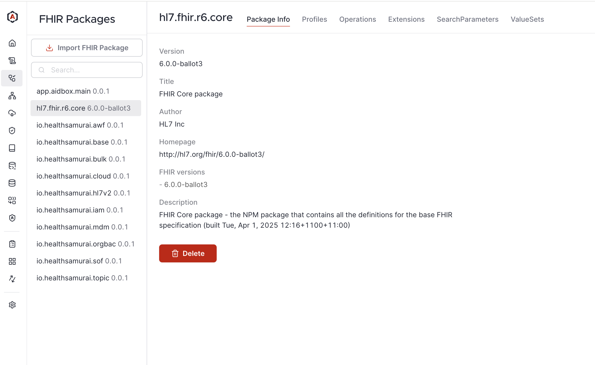

# Run Aidbox with FHIR R6

FHIR 6.0.0-ballot3 was published on **April 3, 2025**, introducing new resources, complex data types, and updated profiles.

## Run in Sandbox

1. Sign up or log in at [aidbox.app](https://aidbox.app)
2. Go to your project&#x20;
3. Click "New Aidbox" to create a new instance
4. Enter a name in the "License name" field
5. Set hosting type to "Sandbox"
6. Choose "Edge" as the Aidbox version
7. Enter Instance URL.
8. Set FHIR Version to "6.0.0-ballot3"

## Run locally




Please **make sure** that both [Docker & Docker Compose](https://docs.docker.com/engine/install/) are installed.


1. Create a working directory:

```bash
mkdir aidbox && cd aidbox
```

2. Download the Aidbox setup script:

```bash
curl -JO https://aidbox.app/runme/r6
```

3. Start Aidbox:

```bash
docker compose up
```

## Explore canonicals

All imported canonical resources are available in the FHIR Packages tab

<figure><figcaption></figcaption></figure>
